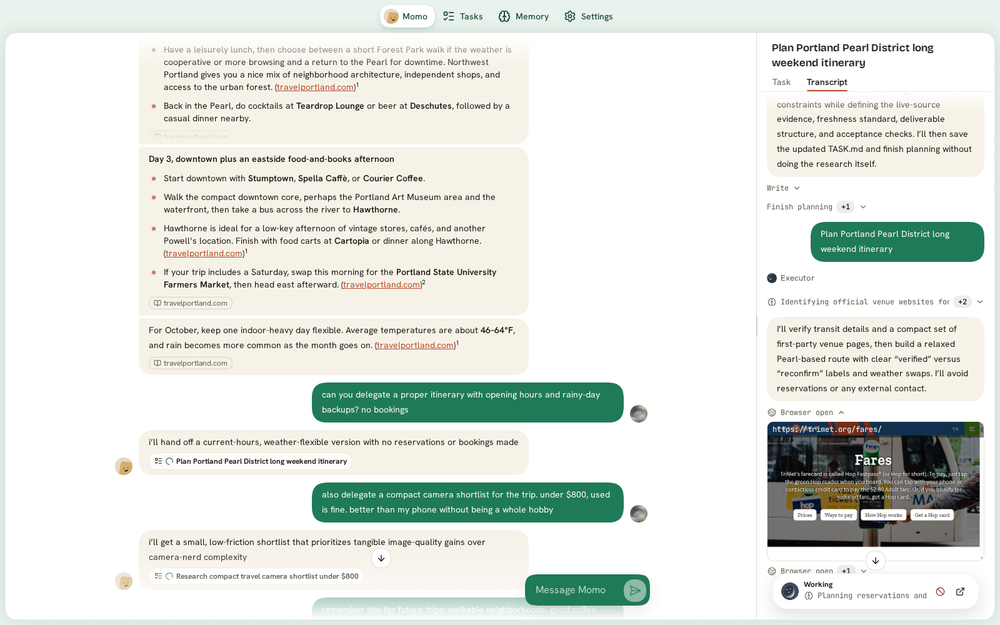
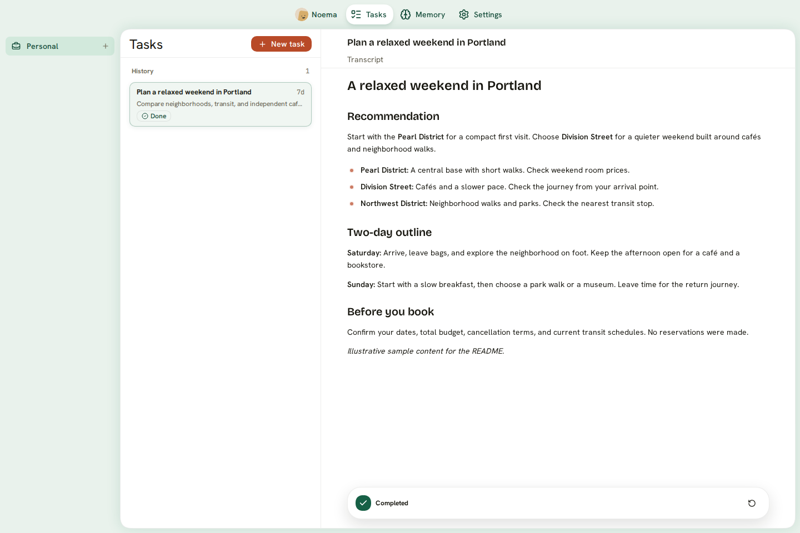
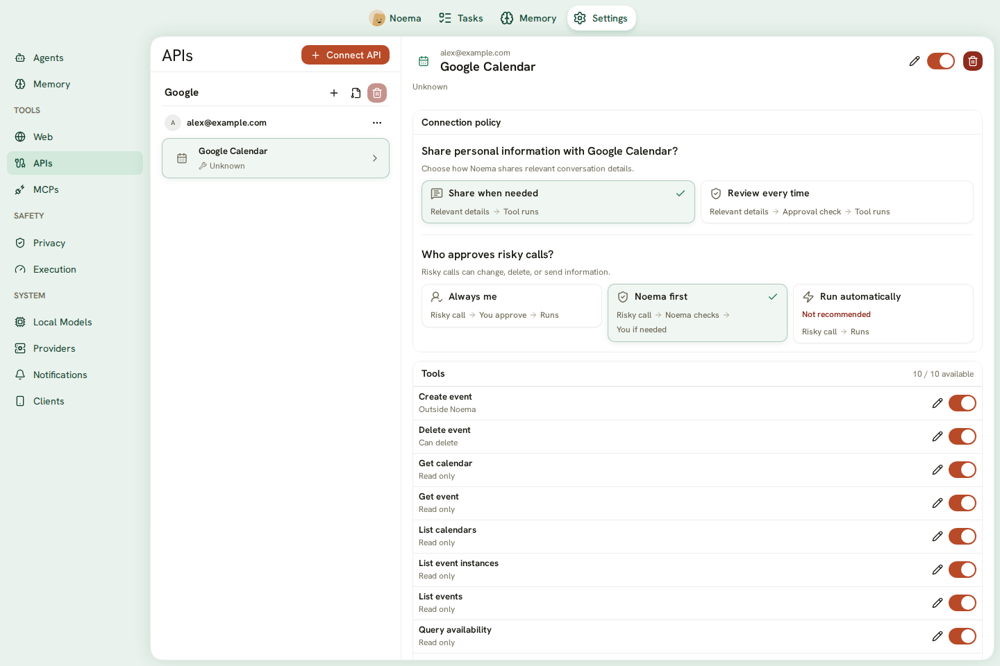
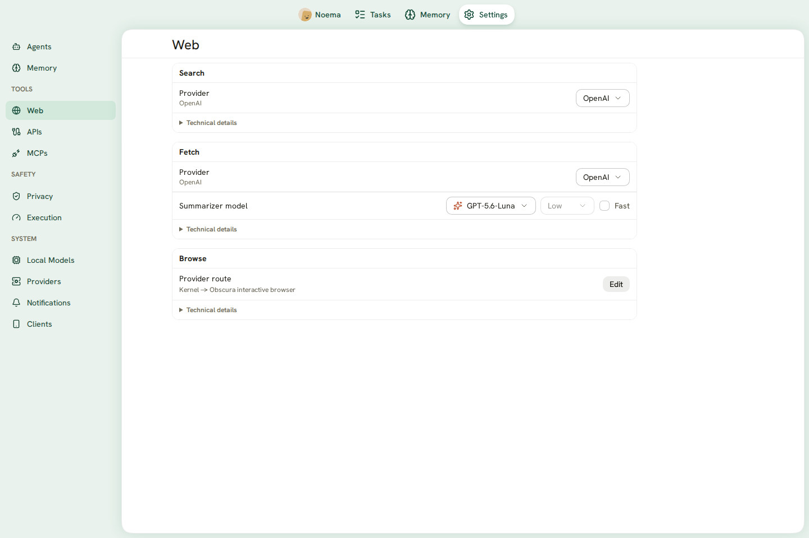
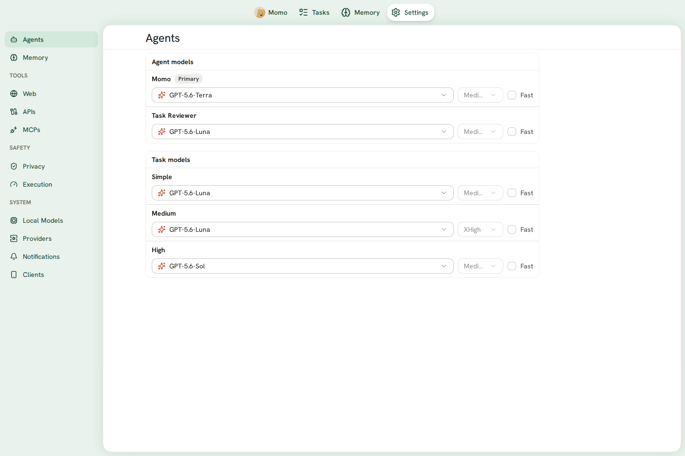
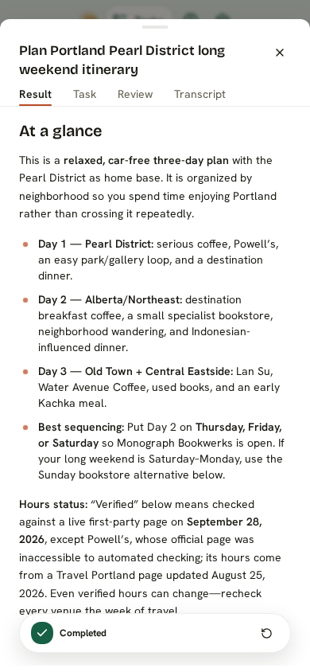
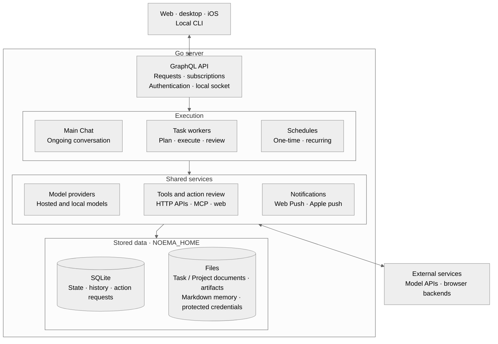

# Noema

**One main chat. Complex work delegated. Security built in.**

Noema is an opinionated, self-hosted personal assistant.
Its central bet: one ongoing conversation is a better home for a personal assistant than a collection of separate chats.
Bring your questions, plans, and follow-ups to the same assistant.
When work becomes complex, Noema delegates it to Tasks with separate planning, execution, and review.

Noema comes with a strong security model built around deterministic checks enforced by the server.
Models help assess intent and risk; code checks tool inputs, enforces action states, and consumes approvals for exact calls.

[Why Noema](#why-noema) · [Get started](#get-started) · [Feature tour](#feature-tour) · [Architecture](#architecture) · [Development](docs/development/setup.md) · [MIT license](LICENSE)



*Screenshots show a fresh session with real messages, tool calls, delegated Tasks, and current settings.
No bookings or purchases were made.*

## Why Noema

### One main chat for your life

Personal assistance is continuous. A calendar question can become a travel plan, a research task, or a reminder for next week.
Noema gives you one main conversation for that relationship.
You should not need to choose a thread or assemble a team of agents before asking for help.
Durable memory carries useful personal context beyond an individual exchange.

### Delegate complexity, keep the conversation

The main assistant remains your point of contact.
Complex work moves into Tasks, where agents can plan, use tools, produce results, and review each other's work.
You can keep talking while those Tasks run, then inspect their results or answer questions when needed.
Projects and recurring Tasks give longer work a place without making you manage more chat threads.

### Security is part of the system

Noema includes security controls out of the box.
The model's judgment operates within rules that the server enforces:

- **Checked tool inputs.** Calls must satisfy their tool's input contract before execution.
- **Exact approvals.** A human approval applies to one saved action request and is consumed when execution starts.
- **Connection policies.** Connection settings select the review route for calls, including risky actions.
- **Protected credentials.** Credential stores supply secrets to services without placing them in model context or ordinary conversation history.
- **Recorded outcomes.** Action requests retain their inputs, review, decision, execution state, and result.

This makes much of action enforcement deterministic: the same stored state must satisfy the same code checks.
Intent and risk assessment still use model judgment.
Some actions run without human review under the configured connection policy.
Noema does not provide general per-scope data grants or universal information-flow tracking.

[Security model](docs/harness/security.md) · [Authentication and server access](docs/server-security.md)

### Your server, your records

Noema keeps conversations, task history, documents, and memory on your server.
Hosted models and connected services receive data when you use them.

## Try it with your own work

- **Prepare for the day.** Ask Noema to read your connected calendar and summarize what needs attention.
- **Research a decision.** Delegate a comparison, inspect its progress, and review the saved result.
- **Repeat useful work.** Create a recurring Task for a brief, planning session, or regular review.

Available actions depend on your models, connected accounts, and connection policies.

## Feature tour

### One conversation, with work happening alongside it

Chat supports streamed replies, follow-up questions, tool activity, and human decisions.
Ask the main assistant to use connected services, search the web, or delegate longer work to a Task.
Stay in the same conversation while the server continues Task execution.

### Tasks with plans, execution, and review

Tasks move through Planner, Executor, and Reviewer runs.
The Reviewer can accept a result, request corrections, or ask for human input.
Open the Task to read its request, result, review, and execution transcript.



Group related Tasks into Projects with shared context.
Use schedules and recurrence templates for work that must run later or repeat.
Task documents remain editable, and saved history records the work performed.

[Read about Tasks](docs/tasks.md).

### Connect services and control their actions

Connect services through HTTP APIs or the Model Context Protocol (MCP).
Noema supports account authentication, operation discovery, and individual tool controls.
Connection settings determine how relevant information is shared and how risky calls are reviewed.



When policy requires your approval, you can approve or decline that request.
Inspect the saved action to see what was requested and what happened.

[Read the action and information-handling contract](docs/harness/security.md).

### Search, read, and interact with the web

Use web search and page reading for research.
Use browser tools when a task requires navigation, page interaction, or a form.
Configure the browser provider order and the search and fetch services in Settings.



Noema includes Obscura and Kernel browser support.
File upload through browser tools currently requires Kernel.
Provider access and credentials depend on the selected service.

### Memory you can inspect

Noema keeps durable human memory as Markdown pages.
Open Memory to read what it knows, follow its organization, and inspect supporting evidence when available.
Memory search rebuilds its index from those pages.

[Read about memory](docs/memory.md).

### Files and saved results

Upload files to Tasks, download public resources, and keep generated artifacts with their owning work.
Artifact previews support PDF, spreadsheets, email, raster images, and isolated HTML.
Results can cite an artifact and a precise location within it.

Agents can also run bounded Lua calculations over supplied data.
That Lua environment does not provide file, network, process, or environment access.

### Choose the models for the work

Use OpenAI, Codex, OpenRouter, or supported local GGUF models.
Choose models for the primary agent, Task review, and Task complexity levels.
Supported providers expose reasoning and speed settings.



Local models run on the server host. Hardware and model capabilities affect the available experience.
Hosted provider charges remain separate from Noema.

### Use the same server across devices

The responsive web app works on desktop and phone.
The Tauri desktop app can use its bundled Go server or connect to a remote server.
The native SwiftUI app connects iPhone and iPad to your server.



*Phone web interface. This is not a native iOS screenshot.*

Web Push, Apple push notifications, and Tasks Live Activities provide updates outside the app.
Apple notifications and Live Activities require the relevant signing, entitlements, and server configuration.

[Desktop setup](docs/development/setup.md#connect-the-desktop-app-to-a-server) · [iPhone and iPad setup](apps/ios/README.md)

## Get started

Noema is under active development. Start with a local web build on Linux or macOS.
You need **Go 1.26.6**, **Bun**, and access to a supported model provider.
Rust is required only for the desktop shell.

```sh
git clone https://github.com/kpsuperplane/Noema.git
cd Noema
cd apps/web
bun install --frozen-lockfile
cd ../..
NOEMA_HOME="$PWD/.noema-dev" go run ./cmd/noema-dev
```

Open the address printed by the server, normally `http://localhost:3737`.
Complete address setup and initial passkey registration, then configure a model provider.
The development supervisor runs the Go server and frontend asset watchers.
It downloads its pinned Air dependency when needed.

For OpenAI environment setup, supply `NOEMA_OPENAI__API_KEY` through your environment manager before startup.
Do not put credentials in source files.
For local models, use the model installation and agent settings screens.

The root development environment in this repository uses `./attach` instead.
See [development access](AGENTS.md#noema-development-access) for its inspection socket and read-only home view.

[Complete setup and configuration](docs/development/setup.md) · [Server deployment and authentication](docs/server-security.md) · [Local CLI](docs/cli.md)

## Architecture

One Go server composes the API, Chat runtime, Task workers, providers, and integration services.
Chat and Tasks have separate execution loops and share storage and service dependencies.
The diagram follows the [server startup code](cmd/noema/main.go), rather than the product roadmap.



Arrows show the main dependency groups, not every call or event.
Chat can delegate to Tasks while the conversation continues.
Stored changes and live runtime events drive subscriptions and notifications.

The default data directory is `~/.noema`; `NOEMA_HOME` selects another location.
SQLite stores structured state. Files hold Task and Project documents, memory, artifacts, and protected credentials.
For a backup, stop Noema and copy the complete data directory.

| Location | Responsibility |
| --- | --- |
| `cmd/noema/` | Server startup and shutdown |
| `internal/runtime/` | Chat, Task execution, and action handling |
| `internal/store/` | SQLite state and transactions |
| `internal/provider/`, `internal/localmodel/` | Hosted and local model execution |
| `internal/adapter/`, `internal/mcp/`, `internal/webtool/` | Service and web integrations |
| `apps/web/` | React interface |
| `apps/ios/` | Native SwiftUI client |
| `crates/noema-desktop/` | Tauri desktop shell |

## Status and contributing

The current product serves one local owner. Shared workspaces and multiple human accounts are not available.
Desktop signing, notarization, updates, and distribution validation remain release work.
Native iOS builds require macOS and Xcode.
Controlled acceptance checks do not prove that every external provider or real-world action works.

For development, read [AGENTS.md](AGENTS.md) and the [setup guide](docs/development/setup.md).
Keep changes focused and run the checks for the affected code.
The [current context](docs/context/current.md) records active constraints and open work.

Screenshot sources and capture limits are recorded in [the screenshot notes](docs/images/README.md).
Noema is available under the [MIT license](LICENSE).
