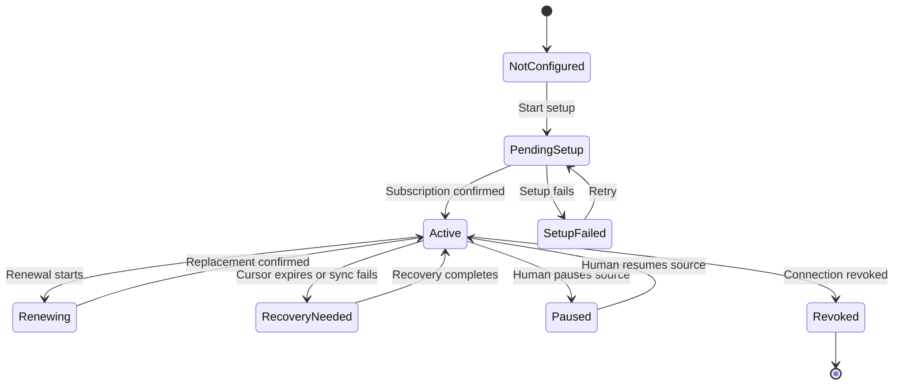
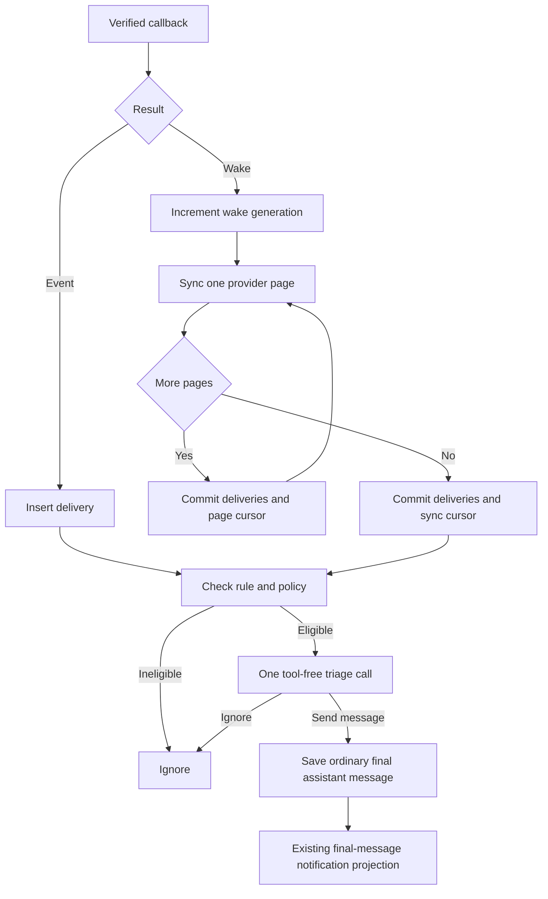

# Proactive Event Sources Plan

- **Status:** Proposed for execution
- **Mode:** Implement in ordered units
- **Date:** 2026-08-15
- **Initial scope:** Native HTTP adapters, primary agent, Web settings, and existing client notifications
- **Production proofs:** Gmail, Slack, and Dropbox
- **Compatibility target:** Eleven common HTTP services
- **Deferred transport:** Salesforce Pub/Sub

## 1. Outcome

Noema will receive external events and send configurable proactive messages.

A human can connect a reviewed event source and give one triage instruction.
The primary agent can ignore the event or send one ordinary assistant message.

The release must provide these outcomes:

1. Receive Gmail changes without mailbox polling.
2. Reconcile every Gmail change from an API-issued checkpoint.
3. Receive signed direct events through the same HTTP ingress.
4. Support one callback endpoint for several connected accounts.
5. Configure rules by source, account, event type, instruction, and enabled state.
6. Save the agent message before any client notification.
7. Explain source health, gaps, and rule history in settings and audit views.
8. Let reviewed custom adapter definitions declare HTTP event behavior.

This work makes proactive event handling a production path.
It does not add a third general integration substrate.

## 2. Non-goals

- No event can run tools or external actions.
- Do not infer behavior from OpenAPI `webhooks` objects.
- Do not add a general event workflow or transport framework.
- Do not give Luau network, filesystem, storage, or secret access.
- Do not compare provider checkpoints or require event ordering.
- Do not add universal automatic hydration.
- Do not implement Graph rich notifications, Pub/Sub OIDC, or Salesforce streaming.
- Do not add iOS management in this release.
- Do not add proactive labels, markers, or special styling to chat messages.
- Do not model chat messages and client notifications as separate rule outcomes.
- Do not retire the dormant adapter scheduler without a separate decision.

## 3. Core Decisions

### 3.1 HTTP first

The first release supports public HTTPS callbacks.
Gmail uses Pub/Sub before its callback reaches Noema.

Use one concrete HTTP ingress.
A future Salesforce driver can submit events through the same stored delivery boundary.

### 3.2 Two accepted results

| Result | Meaning |
| --- | --- |
| `event` | The callback contains a useful event payload. |
| `wake` | The callback reports possible changes. A reviewed sync operation retrieves them. |

An `event` has a stable key, type, time, bounded payload, and optional resource references.

A `wake` identifies event bindings and can include a diagnostic hint.
The hint never becomes stored cursor authority.

Only an API response can advance an opaque sync cursor.
Store page progress separately and commit the sync cursor after the final page.

Increment one local wake generation for each accepted wake.
Run another sync pass when that generation changes during processing.

### 3.3 One governed model call

Run deterministic eligibility checks before inference.
Use one structured triage request without tools.

The model can return only `ignore` or `send_message`.
`send_message` saves one ordinary final assistant message in the primary chat.

The existing final-message notification projection then runs unchanged.
Do not add another notification decision, delivery state, or model call.

## 4. Compatibility Contract

| Service | Event form | Required behavior | Position |
| --- | --- | --- | --- |
| [Gmail](https://developers.google.com/workspace/gmail/api/guides/push) | Pub/Sub wake | Renewal, early callback, and history sync | First proof |
| [Microsoft Graph](https://learn.microsoft.com/en-us/graph/change-notifications-delivery-webhooks) | Webhook wake | Query challenge, `clientState`, lifecycle, and delta links | HTTP compatible |
| [Google Calendar](https://developers.google.com/workspace/calendar/api/guides/push) | Empty wake | Channel token, renewal overlap, and sync tokens | HTTP compatible |
| [Slack](https://api.slack.com/events-api) | Direct event | Application endpoint, signed challenge, and HMAC | Second proof |
| [GitHub](https://docs.github.com/en/webhooks/using-webhooks/best-practices-for-using-webhooks) | Direct event | HMAC, delivery key, and no automatic retry | HTTP compatible |
| [Stripe](https://docs.stripe.com/webhooks) | Direct event | Timestamped HMAC, duplicates, and no ordering | Snapshot compatible |
| [Notion](https://developers.notion.com/reference/webhooks-events-delivery) | Metadata event | Protected token capture and later HMAC | HTTP compatible |
| [Dropbox](https://www.dropbox.com/developers/reference/webhooks) | Application wake | GET challenge, HMAC, fan-out, and cursor | Third proof |
| [HubSpot](https://developers.hubspot.com/docs/api-reference/latest/webhooks/guide) | Event batch | Application endpoint, canonical HMAC, and batch split | HTTP compatible |
| [Jira](https://developer.atlassian.com/cloud/jira/software/webhooks/) | Direct event | HMAC, renewal, retry key, and failure status | HTTP compatible |
| [Linear](https://linear.app/developers/webhooks) | Direct event | HMAC, replay time, delivery key, and HTTP 200 | HTTP compatible |
| [Salesforce](https://developer.salesforce.com/docs/platform/pub-sub-api/references/methods/subscribe-rpc.html) | gRPC stream | OAuth metadata, Avro, flow control, and replay | Deferred driver |

Compatibility means that the reviewed contract can express the service.
This roadmap does not bundle every compatible definition.

## 5. Stored Authorities

Use four SQLite authorities.

| Authority | Owned state |
| --- | --- |
| Event endpoint | Public route, application or connection scope, setup status, verifier references, and safe health data |
| Event binding | Connection, provider routing key, subscription, expiry, opaque cursors, wake generation, and worker claim |
| Proactive rule | Human, primary agent, governable scope, source selection, event types, instruction, and enabled state |
| Proactive delivery | Event identity and payload, rule revision, processing state, decision, and saved conversation item |

One application endpoint can serve several bindings.
Provider display labels never route callbacks.

The first schema must reject non-primary agents.
A rule cannot raise any applicable proactivity limit.
Existing policy must allow the agent to create a proactive message.

Use one delivery uniqueness key across retries and replacement subscriptions.

## 6. Adapter and Luau Contract

Advance the strict adapter manifest version with the first complete vertical path.
Do not publish an event field before its runtime behavior exists.

One reviewed event source declares:

- Stable source identity
- Application or connection endpoint scope
- Manual or managed setup
- Optional runtime-only subscribe, renew, and stop operations
- Exact lifecycle and sync scope requirements
- Fixed success status and optional handshake transform
- Required receive transform
- Direct-event or wake-and-sync behavior
- Sync operation, cursor arguments, and recovery behavior

Keep lifecycle and sync operations outside the model catalog.
Keep OpenAPI webhook import rejected.

The compiler rejects missing operations, wrong definitions, unsupported scopes, or incomplete verification.
It rejects wake sources without sync and direct sources without stable event keys.

Add one bounded `InboundEvent` Luau profile.
Give it immutable method, headers, query values, callback URL, raw body, content type, and receipt time.

Expose only:

- `auth.matches(candidate)`
- `auth.verify_hmac_sha256(message, candidate, encoding)`
- Existing bounded JSON and text helpers

Secret helpers check current source-bound generations and return only Boolean values.
The host records successful verification.

Luau can return `challenge`, `capture_setup_secret`, `accept`, or `reject`.
Unsigned challenges can run only during one current pending setup attempt.

Never expose secret bytes, HMAC output, general signing, network, files, randomness, or persistent state.

## 7. Runtime Contract

### 7.1 Callback

1. Resolve the endpoint from an unguessable route identity.
2. Apply method and body limits.
3. Run the exact reviewed Luau transform.
4. Require the declared verification effect.
5. Resolve application-scoped account keys exactly.
6. Insert deliveries or increment wake generations.
7. Commit the transaction.
8. Return the fixed success response.

Do not acknowledge an ordinary delivery before durable insertion.
Keep the path within the shortest supported provider deadline.

### 7.2 Wake sync

1. Claim one binding revision with a bounded lease.
2. Read its committed cursor and page progress.
3. Invoke one exact runtime-only sync operation.
4. Run the existing source input check.
5. Normalize its response through reviewed Luau.
6. Commit deliveries and next-page progress atomically.
7. Commit the sync cursor only after the final page.
8. Release the claim or process the next wake generation.

One claim processes one provider page.
Provider continuation URLs must pass same-origin and path checks.

### 7.3 Lifecycle

Create the endpoint before the provider subscription.
This order closes immediate-callback races.

Renew from provider expiry data.
Do not apply Gmail's daily recommendation to every provider.

Create replacement subscriptions before retiring old subscriptions.
Keep the committed cursor and deduplicate across the overlap.

Apply only the declared recovery behavior after cursor expiry.
Show the human when recovery can lose events.

### 7.4 State diagrams

The event source lifecycle uses explicit health and recovery states.



One ordinary saved message is the only delivery decision.



## 8. Governance and Product Surface

Signing secrets, callback tokens, and captured verification tokens are secrets.
Store them only in protected adapter generations.

Treat private event bodies as private information.
Keep authorized payloads intact in governed delivery records.

Provider identifiers, URLs, and cursors are not secrets by name.
Treat all external payload text as untrusted content.

Before inference, require an active grant, binding, current rule, exact scope, and sufficient proactivity level.
Existing client notification settings decide whether the saved final message produces an alert.
Do not log raw bodies, signatures, setup secrets, or model payloads.

Use the existing Adapter Settings hierarchy.
Show event sources, setup state, last callback, last sync, expiry, recovery, gaps, and rules.

Create or edit one rule in a dialog.
Include source, account, event types, instruction, and enabled state.

Reuse existing Web Push and APNs settings.
Reuse the existing final-message notification projection without event-source branches.

Keep source, rule, and delivery links in governed records.
Render the saved item as an ordinary assistant message without visible provenance markers.

## 9. Execution Units

Complete each unit with one commit.
Use one read-only adversarial review and one correction pass for each server unit.

### Unit 1: Gmail wake-and-sync vertical

**Outcome:** A Gmail connection can produce one governed proactive message.

**Areas:** Adapter compiler and Luau, store migration, ingress, worker, Gmail definition, and focused GraphQL setup.

**Budget:** 1,200–1,800 Rust production lines and 400–700 test lines.
Add no more than ten Rust tests.

**Proofs:** Invalid token, durable acknowledgement, setup race, restart pagination, final cursor commit, wake coalescing, renewal overlap, scopes, revocation, and ordinary final-message projection.

**Stop:** Stop if this unit needs a general workflow engine or another substrate.

### Unit 2: Web configuration

**Outcome:** A human can set up Gmail events and manage one rule.

**Budget:** 250–500 TypeScript production lines. Add no UI tests unless requested.

Use `noema-product-ui` before design work.
Request browser-inspection permission before visual validation.

Prove empty, pending, active, failed, and revoked states.
Run static validation and an authorized browser check.

### Unit 3: Slack direct-event proof

**Outcome:** One application endpoint verifies and triages signed Slack events.

**Budget:** 250–500 Rust production lines and 120–260 test lines.
Add four to six focused tests.

Prove raw-body HMAC, replay time, application routing, signed challenge, and retry deduplication.
Stop if this unit needs automatic hydration or a model tool loop.

### Unit 4: Dropbox shared-wake proof

**Outcome:** One application endpoint advances each Dropbox account independently.

**Budget:** 250–450 Rust production lines and 120–240 test lines.
Add four to six focused tests.

Prove pending GET challenge, account batches, duplicate wakes, cursor expiry, and exact HTTP 200.
Stop if account fan-out introduces another connection authority.

### Unit 5: Compatibility closure

Add only table-driven compiler or sandbox cases for proven protocol variations.
Do not add simulated clients for unbundled services.

Document direct-delivery gaps, the global body limit, deferred native verification, and Salesforce transport limits.
Decide the dormant adapter scheduler separately after this path is stable.

## 10. Risk and Proof Matrix

| Risk | Authority and proof |
| --- | --- |
| Forged callback creates output | Verifier; invalid-token and invalid-HMAC tests |
| Early acknowledgement loses data | Callback transaction; restart after receipt |
| Page crash skips changes | Binding checkpoint; mid-page restart |
| Renewal loses position | Binding lifecycle; overlap test |
| Retry repeats a message | Delivery unique key; provider retry test |
| Shared endpoint misroutes data | Provider account key; mixed batch test |
| External text expands authority | Triage runtime; no-tool policy test |
| Revoked state still runs | Binding and rule revisions; race test |
| Secret reaches an ordinary sink | Protected generations; exclusion and preservation test |
| Private payload is removed | Delivery record; private-data preservation test |
| Cursor is changed or compared | Sync boundary; opaque cursor fixture |
| Existing notification text differs from the saved message | Conversation item; projection identity test |

Test each risk at its first authoritative boundary.
Do not repeat the same behavior through every layer.

## 11. Validation and Commit Gates

At each milestone, run the size report with the unit's production, test, and test-count budgets.
Stop when growth exceeds its estimate by 50 percent or 500 lines.

Before each server commit, run:

```text
cargo fmt --all --check
cargo check-workspace
cargo gate-lint
cargo gate-test
git diff --check
```

Use `cargo validate` for focused unit tests.
Do not run smoke or fixture tests without explicit approval.

For Web work, run `bun run lint` and `bun run build` from `apps/web`.

Before every commit, inspect status, staged names, and staged statistics.
Preserve unrelated worktree changes.

Update `docs/context/current.md` only after a major phase changes active direction.
Stop when a new public abstraction or product decision becomes necessary.

## 12. Release Acceptance

The release is complete when:

1. A real Gmail message produces one proactive message.
2. A restart during Gmail pagination loses no event and repeats no message.
3. Slack proves signed direct events through an application endpoint.
4. Dropbox proves GET setup and account-specific opaque cursors.
5. Disabling a rule stops later model use immediately.
6. Revoking a connection blocks delayed callbacks.
7. Saved chat text exactly matches notification text.
8. Chat renders the item as an ordinary assistant message.
9. Rules do not select chat or notification delivery.
10. Settings explains renewal, sync, recovery, and gaps.
11. Secrets stay in protected generations.
12. Authorized private event data stays intact.
13. Required Rust and Web gates pass, except for documented baseline failures.

Live acceptance needs isolated test accounts and human provider access.
Do not claim live compatibility from fixtures alone.

## 13. Deferred Work

Add one provider definition only when a human requests it.
Do not add provider branches to the shared HTTP runtime.

Add exact hydration only after one direct source proves that metadata is insufficient.

Implement Graph rich notifications and Pub/Sub OIDC as closed native verification profiles.

Implement Salesforce only after an explicit product decision.
Use one native `salesforce_pubsub` driver and feed its events into proactive deliveries.
