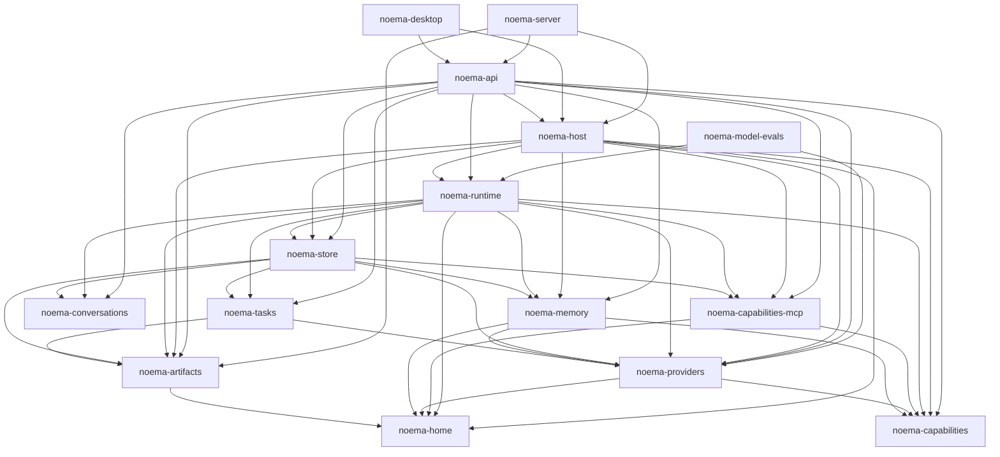

# Noema Core Crate Decomposition Execution Plan

> **Mode:** plan only. This document defines the implementation sequence; it
> does not authorize implementation, staging, or pushing. It does explicitly
> include one future pre-v1 bootstrap-schema rewrite in Phase 10; that rewrite
> is planned here but is not performed by this document-only task.

## Goal

Retire `noema-core` by moving its responsibilities into cohesive crates with an
acyclic dependency graph, explicit ownership, independent validation, and no
generic replacement such as `noema-common`, `noema-domain`, `noema-objects`, or
`noema-ids`.

The extraction must preserve the current product contract:

- SQLite remains the canonical structured store and only the local Noema host
  opens it.
- Mnemosyne remains the durable memory service and private sidecar.
- GraphQL remains the sole first-party client API for web, desktop, and future
  clients.
- Web HTTP/session/asset transport remains in `noema-server`.
- Foreground conversation work and background task work continue through one
  shared execution runtime.
- MCP tools continue through the capability gateway and retain their existing
  fail-closed write/export behavior.
- Provider accounts continue to represent broad capabilities such as model
  generation, web search, and web fetch.
- No pre-V1 compatibility facade, schema migration, or duplicate record model
  is introduced to make the move easier.

## Why This Supersedes The Earlier Store Attempt

The July 10 remediation program correctly rejected the first `noema-store`
extraction. At that point the store imported conversation, provider, MCP,
artifact, local-model, path, and diagnostic vocabulary from `noema-core`, while
those same systems called `NoemaStore` directly. Moving the directory would
have created either a reverse dependency or a new catch-all domain crate.

This plan resolves those edges before moving the store:

1. Domain types move to the subsystem that owns their semantics.
2. SQLite row types and parsers remain private to the store.
3. Filesystem paths and diagnostics move out of `NoemaStore`.
4. Subsystems that must coordinate file writes with metadata persistence expose
   narrow subsystem-specific persistence ports.
5. `noema-store` is extracted only after it no longer imports the runtime,
   GraphQL, host configuration, or concrete provider transports.

## Settled Architecture Decisions

### No Generic Foundation Crate

There will be no `common`, `domain`, `objects`, `types`, or shared-ID crate.
Types go to their semantic owner:

- Conversation authorship and ownership references belong to conversations.
- Artifact owners, sources, versions, and storage kinds belong to artifacts.
- Task status, run, submission, review, event, and execution-policy types belong
  to tasks.
- Provider accounts, model profiles, capability bindings, and provider-facing
  local-model types belong to providers.
- MCP server, tool, calibration, transport, and setup types belong to the MCP
  capability crate.
- Memory settings, requests, results, and service status belong to memory.
- SQLite-only identifiers, row structs, schema labels, table names, and column
  names remain private to the store.

Cross-subsystem references remain explicit owner-specific structs or validated
opaque IDs. A shared leaf crate may be proposed later only when multiple
independent crates require the same semantics and none is the natural owner.

### MCP Is A Child Crate; Local Models Are A Provider Module

MCP is an independent protocol adapter and control plane, so it remains a
nested Cargo package beneath the generic capability contracts:

```text
crates/noema-capabilities/                  # package: noema-capabilities
  mcp/                                      # package: noema-capabilities-mcp
```

Local LLM support is one concrete provider implementation, not another
architectural layer. It remains inside the `noema-providers` package:

```text
crates/noema-providers/
  src/local_model.rs                        # public records, commands, and ports
  src/local_models.rs                       # private implementation root
  src/local_models/                         # catalog/install/runtime internals
  resources/local-models/                   # catalog and runtime manifests
```

The dependency and visibility rules are:

- `noema-capabilities-mcp` depends on `noema-capabilities`.
- `noema-capabilities` never depends on its MCP child.
- Provider-facing local-model records, commands, events, persistence ports, and
  the `LocalModelManager` handle are public from `noema-providers`; their
  implementation stays in the private `local_models` module.
- `noema-providers::local_models` implements the same typed `ModelProvider`
  contract as hosted providers.
- `ModelProvider` may remain a typed, non-object-safe adapter contract. The
  provider package also owns one object-safe `ProviderHandle` erasure boundary
  and a clonable `ProviderRegistryHandle` containing ready provider instances.
  Workload selections are not cached in the registry: SQLite remains canonical
  for default, agent, task, memory, audit, and web-summary provider/model/
  reasoning choices. Phase 5 establishes the selection, registry, lease, and
  resolver contracts, but production repository adapters do not claim an exact
  persisted local-instance identity until the Phase 10 schema checkpoint makes
  that identity representable. After that checkpoint, the owner of an
  independent execution chain reads one exact `ProviderSelectionSnapshot` from
  its repository, then leases the corresponding immutable provider instance
  from the registry. The combined `ProviderRouteLease` pins selection plus
  process lifetime through the whole continuation chain. A provider-owned
  `resolve_route` helper closes the gap between those two operations: on
  `Retiring` or `Missing`, it re-reads the repository and retries only if the
  canonical snapshot changed. An unchanged durable snapshot that names a
  retiring instance is an invariant failure, not permission to fall back; an
  unchanged unavailable instance produces a typed availability error. The next
  chain resolves canonical selection again. There is no runtime-owned duplicate
  provider trait or in-memory mirror of persisted workload preferences.
- One foreground user turn is one independent execution chain. It resolves the
  primary-agent selection afresh before provider metadata lookup or compaction
  and holds one route lease through generation, every tool continuation,
  replay, and finalization attempt. Foreground turns are not recoverable provider
  continuations across host restart: an interrupted turn is terminal, no old
  `previous_response_id` is resumed, and the next user input starts a new turn
  with a fresh canonical selection. Consequently foreground transcript history
  does not pin a provider instance; only live turn leases and explicitly
  future-lease-eligible task/run snapshots do.
- The implementation module stays private or crate-private. Provider-facing
  configuration, installation/status records, and management operations are
  exposed through deliberate `noema-providers` APIs.
- `noema-providers` exposes the registry/factory used to construct hosted and
  local providers. Host and runtime code never import the internal module.
- Store-backed provider state is supplied through provider-owned persistence
  ports implemented by `noema-store`; `noema-providers` never depends on the
  store.
- There is no `noema-provider-local-models`, `noema-llama-cpp`, or `noema-llm`
  package in this decomposition.

The roughly 3,600 lines of local-model code are substantial enough to require
a clean internal module tree, but they do not yet justify a separate package or
a second model-call abstraction. Reconsider a crate only if native build cost,
multiple local backends, or independent reuse becomes measurable.

### Runtime And Host Have Different Jobs

`noema-runtime` owns governed execution: actors, run workers, prompts, context,
provider continuation, tools, transcript persistence, task execution roles,
progress audits, cancellation, and delivery semantics.

`noema-host` owns application composition: configuration, Noema home startup,
opening the store, asking `noema-providers` to build the configured provider
registry, starting sidecars, building the runtime, coordinating shutdown, and
exposing the assembled services to API surfaces.

There is no separate `noema-daemon` crate. The old daemon module is divided
between the execution runtime and the application host rather than preserved as
a third overlapping orchestration layer.

### GraphQL And Web Transport Stay Separate

`noema-api` owns async-graphql schema behavior. `noema-server` continues to own
Axum, HTTP/WebSocket transport, Host and Origin enforcement, sessions, OAuth
callback transport, artifact download responses, and static assets. The Tauri
desktop continues to execute the same GraphQL schema over IPC without pulling
in the web server.

The React application moves to `apps/web`; it is not part of a Rust API crate.

## Target Workspace

```text
apps/
  web/                                      # React application

crates/
  noema-home/                               # ~/.noema layout and diagnostics
  noema-conversations/                      # conversation and transcript domain
  noema-artifacts/                          # governed artifact domain/filesystem
  noema-tasks/                              # task/run/submission/review domain

  noema-capabilities/                       # canonical tool/capability contracts
    mcp/                                    # MCP adapter and control plane

  noema-providers/                          # provider contracts and adapters
    src/local_model.rs                      # public local-model control plane
    src/local_models/                       # private GGUF/llama.cpp implementation
    apple-foundation-bridge/                # Swift package, not a Cargo member
    resources/local-models/                 # GGUF/llama.cpp manifests

  noema-memory/                             # memory service and Mnemosyne client
    mnemosyne-sidecar/                      # Python package, not a Cargo member

  noema-store/                              # SQLite implementation
  noema-runtime/                            # governed agent execution runtime
  noema-host/                               # application composition and lifecycle
  noema-api/                                # GraphQL schema and API adapters

  noema-server/                             # existing Axum/web surface
  noema-desktop/                            # existing Tauri surface
  noema-model-evals/                        # existing local-model evaluation runner
```

Workspace members must be listed explicitly. Do not use a recursive glob that
could accidentally treat the Swift or Python projects as Cargo packages.

## Target Dependency Direction



The diagram uses arrows in the Cargo dependency direction. `noema-home` is a
small infrastructure leaf used wherever a subsystem needs the resolved Noema
root, safe path construction, or the developer diagnostic sink; it does not
import any higher-level Noema crate.

The following table is the exhaustive allow-list of direct internal Cargo
dependencies. An implementation may use fewer edges, but adding an edge not in
this table requires revising and reviewing the architecture plan first.

| Package | Allowed direct Noema dependencies |
| --- | --- |
| `noema-home` | none |
| `noema-conversations` | none |
| `noema-artifacts` | `noema-home` |
| `noema-capabilities` | none |
| `noema-providers` | `noema-capabilities`, `noema-home` |
| `noema-tasks` | `noema-artifacts`, `noema-providers` |
| `noema-capabilities-mcp` | `noema-capabilities`, `noema-home` |
| `noema-memory` | `noema-capabilities`, `noema-providers`, `noema-home` |
| `noema-store` | `noema-conversations`, `noema-artifacts`, `noema-tasks`, `noema-providers`, `noema-capabilities-mcp`, `noema-memory` |
| `noema-runtime` | `noema-home`, `noema-conversations`, `noema-artifacts`, `noema-tasks`, `noema-capabilities`, `noema-capabilities-mcp`, `noema-providers`, `noema-memory`, `noema-store` |
| `noema-host` | `noema-home`, `noema-artifacts`, `noema-capabilities`, `noema-capabilities-mcp`, `noema-providers`, `noema-memory`, `noema-store`, `noema-runtime` |
| `noema-api` | `noema-conversations`, `noema-artifacts`, `noema-tasks`, `noema-capabilities`, `noema-capabilities-mcp`, `noema-providers`, `noema-memory`, `noema-store`, `noema-runtime`, `noema-host` |
| `noema-server` | `noema-artifacts`, `noema-api`, `noema-host` |
| `noema-desktop` | `noema-api`, `noema-host` |
| `noema-model-evals` | `noema-providers`, `noema-runtime` with `eval-support` |

`noema-store` must consume only the always-available contract/model portion of
the subsystem packages. Concrete implementation modules are feature-gated in
the same package, with empty default features and no alternate production
paths:

- `noema-artifacts/filesystem` enables governed file operations;
- `noema-providers/adapters` and `noema-providers/local-models` enable concrete
  non-GGUF and GGUF provider construction, respectively;
- `noema-capabilities-mcp/transport` enables OAuth, protocol clients, setup,
  and invocation;
- `noema-memory/service` enables the Mnemosyne client, lifecycle, and proxy.

`noema-store/test-support` is the only non-product feature: it is dev-only,
enables the ephemeral store builder described in Phase 9, and is rejected from
normal dependencies by the boundary-policy script.

`noema-providers/local-model-evals` implies `local-models` and adds only the
narrow isolated evaluation session plus verified evaluation-materialization
operation described in Phase 10D. It does not expose production installation,
activation, store, supervisor, or endpoint internals.

`noema-model-evals` is the one permanent non-host exception to concrete-feature
ownership: beginning in Phase 10D it directly enables
`noema-providers/local-model-evals`, and beginning in Phase 11 it directly
enables `noema-runtime/eval-support`. Both are evaluation-only constructor and
harness surfaces, never production composition features. The boundary-policy
fixtures allow exactly these two edges from this one package and reject either
feature from store, API, server, desktop, or any other consumer.

`noema-host` also has an empty default. Its always-compiled surface contains
only host/service handles and contracts needed by API. A single
`noema-host/composition` feature forwards the five concrete subsystem features
and gates configuration loading, root-bound construction, startup, and shutdown.
Only `noema-server` and `noema-desktop` enable it; `noema-api` depends on host
with `default-features = false`, so a focused API build cannot compile concrete
providers, MCP transport, artifact filesystem, or the Mnemosyne service.

Every cross-crate consumer interface remains in the always-compiled portion:
object-safe service traits, clonable handle aliases, commands, events,
request/results, and public operation errors. Features gate only root-bound
constructors and concrete filesystem, transport, process, or sidecar backends.
In particular, runtime consumes `ArtifactOperationsHandle` and
`MemoryOperationsHandle` with fake implementations in focused tests; it never
names `LocalArtifactService`, `MnemosyneClient`, or another feature-gated
backend.

Store declares these dependencies with `default-features = false`; host's
`composition` feature forwards the artifact filesystem, provider, MCP, and
memory implementations it assembles and injects their handles into runtime/API.
The two executable shells enable that feature directly. A focused
`cargo check -p noema-store` must not compile `rmcp`, provider HTTP transports,
llama.cpp supervision, Mnemosyne HTTP/lifecycle code, or artifact filesystem
writers. Heavy third-party dependencies are optional and owned by the feature
that exposes their only implementation module. These features exclude
implementation modules rather than select different behavior, so they do not
create two production code paths.

Until `noema-host` exists, `noema-core` remains the temporary composition root
and must directly enable each concrete implementation feature as its owner is
extracted: `noema-artifacts/filesystem`, `noema-providers/adapters`,
`noema-capabilities-mcp/transport`, `noema-memory/service`, and eventually
`noema-providers/local-models`. Phase 12 transfers all five selections into the
`noema-host/composition` forwarding feature, makes server and desktop enable
that feature directly, and removes them from core in the same commit. Runtime,
store, API, and eval manifests must never rely on workspace feature unification
to obtain a concrete implementation. Focused no-default host and API checks make
that rule executable even though a full shell build unifies host features.

## Dependency Rules That Must Remain Machine-Checkable

- `noema-home`, `noema-conversations`, and `noema-artifacts` never depend on
  store, runtime, host, API, server, or desktop.
- `noema-capabilities` never depends on MCP, providers, store, runtime, or API.
- `noema-capabilities-mcp` never depends on runtime, host, API, server, or
  desktop.
- `noema-providers` never depends on store, runtime, host, API, server, or
  desktop. Its private local-model implementation receives persistence through
  provider-owned ports.
- `noema-memory` never depends on store, runtime, host, API, server, or desktop.
- `noema-store` never depends on runtime, host, API, server, desktop, or
  GraphQL. Store source may depend on provider domain and persistence-port
  modules, but never imports the private local-model implementation.
- `noema-runtime` never depends on GraphQL, Axum, Tauri, server, desktop, or the
  React application.
- `noema-host` never depends on async-graphql, Axum, Tauri, server, desktop, or
  frontend code.
- `noema-api` never depends on Axum, tower-sessions, Tauri, or static assets.
- Only `noema-server` declares direct Axum and tower session/HTTP transport
  dependencies.
- Only `noema-desktop` declares a direct Tauri dependency.

Phase 0 adds `scripts/check-crate-boundaries.ts`, which parses
`cargo metadata --format-version 1` and enforces the direct-edge allow-list,
the one-way MCP relationship, and the transport/framework bans above. Run it
at every completed phase along with focused `cargo tree` checks. Cargo features
may partition contract-only and implementation modules exactly as specified
above; they may not conceal an otherwise forbidden edge.

The same policy script and deterministic metadata fixtures also enforce feature
ownership: subsystem contract packages have empty defaults; `noema-store` and
`noema-runtime` name subsystem dependencies with `default-features = false`;
only the temporary `noema-core` composition root may enable concrete features
before Phase 12; afterward only `noema-host/composition` may forward them and
only server/desktop may enable that host feature; normal dependencies may never
enable `noema-store/test-support`. The only concrete
feature exception is the named `noema-model-evals` evaluation pair above,
starting at its owning checkpoints. These assertions run in CI on every
supported platform and fail on an unknown internal feature or a concrete
feature enabled by the wrong package.

Two named extraction-only edges are allowed while `noema-core` still exists:
`noema-server -> noema-home` expires as soon as `noema-host` is present, and
`noema-model-evals -> noema-home` expires as soon as `noema-runtime` is
present. The policy fixtures must prove both the temporary allowance and its
package-presence-triggered expiration. These are sequencing exceptions, not
additions to the final dependency allow-list.

## Current Ownership Map

Current sizes below are approximate Rust source lines including tests. They are
navigation evidence, not LOC targets.

| Current area | Approximate size | Destination |
| --- | ---: | --- |
| `home.rs`, `paths.rs`, `system_errors.rs` | 966 | `noema-home` |
| `conversation.rs` and subtree | 478 | `noema-conversations` |
| `ids.rs`, `objects.rs` | 387 | Delete or distribute; no crate |
| `artifacts.rs` and subtree | 784 | `noema-artifacts` |
| `task.rs` and subtree | 1,089 | `noema-tasks` |
| `agent_execution.rs` | 189 | `noema-runtime`, with capability contracts moved as needed |
| `provider/tools.rs` | Part of provider total | `noema-capabilities` |
| `capability.rs` and gateway | 743 | Generic gateway in capabilities; MCP invoker in MCP child |
| `mcp.rs` and subtree | 3,813 | `noema-capabilities/mcp` |
| `search.rs`, `web_fetch/**` | 2,638 | Contracts in capabilities; backends in providers; orchestration in runtime |
| `provider.rs` and subtree | 13,803 | `noema-providers` |
| `local_models.rs` and subtree | 3,634 | Internal `noema-providers::local_models` module tree |
| `memory.rs`, `mnemosyne/**`, model proxy | 2,101 | `noema-memory` |
| `store.rs` and subtree | 14,470 | Domain models distributed first, then `noema-store` |
| `daemon.rs` and subtree | 26,995 | Primarily runtime; startup/composition to host; eval support to eval runner |
| `config.rs`, `onboarding.rs`, `runtime_host.rs` | 2,563 | `noema-host` |
| `graphql.rs` and subtree | 16,525 | `noema-api` |
| `web/` | Frontend application | `apps/web` |
| `apple-foundation-bridge/` | Swift package | `noema-providers/apple-foundation-bridge` |
| `mnemosyne-sidecar/` | Python package | `noema-memory/mnemosyne-sidecar` |
| `resources/local-models/` | Catalog/runtime manifests | `noema-providers/resources/local-models` |

### Store Model Ownership

The store currently mixes public records with SQL. Before its extraction, move
only semantic models while leaving queries and row conversion in place:

| Current store modules | Semantic model owner | What remains in store |
| --- | --- | --- |
| `conversations`, `context_summaries` | `noema-conversations` | SQL, row parsing, pagination queries |
| `artifacts` | `noema-artifacts` | SQL, transactional version allocation, row parsing |
| `tasks`, `agent_runs`, `run_items`, `task_events`, `task_controls`, `task_execution_policy`, `task_model_pools`, `task_reads` | `noema-tasks` | SQL, leasing transactions, row parsing, projections |
| `provider_accounts`, `provider_capability_bindings` | `noema-providers` | SQL, account/binding queries and writes |
| `mcp/**` | `noema-capabilities-mcp` | SQL and row parsing behind the MCP persistence port |
| `memory_service` | `noema-memory` | SQL for memory settings/cache rows |
| `local_models`, `local_model_activation`, `local_model_rows` | Provider-facing types and persistence ports in `noema-providers`; implementation-only types in its private local-model module | SQL, activation/install transactions, row parsing behind provider-owned ports |
| `agents`, agent and auxiliary preferences | Store read models until an actual agent domain crate is justified | SQL and records remain together |
| `runtime`, `sqlite`, `schema`, `error`, `ids` | `noema-store` | Entire modules |
| `schema_upgrade` | `noema-store` through Phase 9 | Deleted at Checkpoint 10A when strict pre-v1 schema rejection replaces compatibility repair |

Agent and human persistence records remain in `noema-store` during this program.
There is not enough independent agent-domain behavior today to justify another
small crate. Revisit that boundary when agents acquire lifecycle, policy, or
relationship semantics outside persistence.

## Execution Protocol

### Working Mode

- Implement directly on `main`, following the repository policy.
- Begin every unit with `git status --short --branch` and preserve unrelated
  worktree changes.
- Treat each phase as an integration window. Individual file moves and named
  checkpoints inside that window may temporarily fail to compile; do not add
  compatibility facades merely to keep those transient states green.
- Close each integration window with direct downstream imports, no duplicate
  model definitions, and the declared phase gate green before committing. If a
  phase is too large for one reviewable commit, split it only at a boundary
  that restores the applicable package tests.
- Update `docs/context/current.md` after each major phase, not after every file
  move.
- Push only when explicitly requested.
- Use implementation subagents only for disjoint crate ownership areas. The
  main agent owns dependency decisions, integration, validation, and commits.
- Do not run overlapping full Cargo builds from multiple agents. Preserve
  `sccache` and `CARGO_BUILD_RUSTC_WRAPPER` without modification.

### Path-Move Closure Rule

Any physical move of a non-Rust project or resource closes all known path
consumers in the same integration window. Search active source, manifests,
scripts, CI, ignore files, tests, and docs for the old path before committing.
The required atomic groups are:

- Swift bridge move plus `noema_dev` watcher/source-path tests;
- Mnemosyne sidecar move plus venv/install paths, CI, ignores, and dev tests;
- local-model resource move plus desktop runtime preparation and manifest tests;
- GraphQL exporter move plus the current web package's `gen:schema` command;
- web application move plus Vite output, Tauri `frontendDist`, desktop scripts,
  CI working directories, generated checks, and dev watcher tests.

No checked-in wrapper or old-path symlink is permitted. An uncommitted
integration window can be broken while both sides are moving; the phase exit
cannot be.

### Behavior-Preservation Baselines

After the Phase 0A tooling-only commit but before the first product edit, capture
bulky baseline artifacts under `target/` and commit the small canonical hash and
test-ownership manifests under `docs/superpowers/baselines/`:

- `cargo metadata --no-deps --format-version 1`
- `cargo tree --workspace -e normal`
- GraphQL SDL, generated TypeScript, and route tree produced by the current web
  generators
- SHA-256 of `crates/noema-core/resources/local-models/catalog.toml`
- SHA-256 of `crates/noema-core/resources/local-models/runtime-assets.json`
- SHA-256 of the effective SQLite bootstrap SQL text and, separately, a
  normalized SQLite schema-shape snapshot/hash produced by executing that SQL
  against an empty in-memory database
- current Rust unit-test counts by package
- a test-ownership inventory from `cargo test --workspace -- --list`, grouped
  by store, provider, MCP, memory, runtime, API, server, desktop, and eval
  behavior so moved tests cannot silently disappear
- a clean workspace build timing and focused warm checks for core, store-heavy,
  provider-heavy, GraphQL-heavy, server, and desktop edits

Capture the portable baseline inputs from the workspace root with these exact
commands. The schema-shape artifact deliberately excludes SQLite's internal
objects and runtime row contents, while the bootstrap hash detects changes to
the initialization algorithm itself:

```bash
baseline=target/noema-core-decomposition-baseline
artifacts="$baseline/artifacts"
manifest_root=docs/superpowers/baselines
mkdir -p "$artifacts"
cargo metadata --no-deps --format-version 1 > "$baseline/cargo-metadata.json"
cargo tree --workspace -e normal > "$baseline/cargo-tree-normal.txt"
cargo run -p noema-core --bin export_frontend_types
cp crates/noema-core/web/src/generated/schema.graphql "$artifacts/schema.graphql"
cp crates/noema-core/web/src/generated/graphql.ts "$artifacts/graphql.ts"
cp crates/noema-core/web/src/routeTree.gen.ts "$artifacts/routeTree.gen.ts"
cp crates/noema-core/resources/local-models/catalog.toml "$artifacts/catalog.toml"
cp crates/noema-core/resources/local-models/runtime-assets.json "$artifacts/runtime-assets.json"
bun run scripts/export-sqlite-schema-shape.ts \
  --sql-output "$artifacts/sqlite-bootstrap.sql" \
  --output "$artifacts/sqlite-schema-shape.jsonl"
bun run scripts/verify-decomposition-baselines.ts capture \
  --baseline-root "$manifest_root" \
  --graphql-sdl "$artifacts/schema.graphql" \
  --graphql-types "$artifacts/graphql.ts" \
  --route-tree "$artifacts/routeTree.gen.ts" \
  --local-model-catalog "$artifacts/catalog.toml" \
  --runtime-assets "$artifacts/runtime-assets.json" \
  --sqlite-bootstrap "$artifacts/sqlite-bootstrap.sql" \
  --sqlite-schema-shape "$artifacts/sqlite-schema-shape.jsonl"
cargo test --workspace -- --list > "$baseline/rust-tests.txt"
bun run scripts/verify-rust-test-inventory.ts capture \
  --input "$baseline/rust-tests.txt" \
  --manifest "$manifest_root/rust-unit-test-inventory.json"
```

The final GraphQL SDL, generated TypeScript, route tree, and local-model resource
hashes must match. The SQLite
schema shape and bootstrap text must both match through Phase 9. Phase 10A
preserves the shape but intentionally changes the bootstrap implementation;
record its new bootstrap-text hash while retaining the Phase 9 shape hash.
Phase 10C's exact-provider-instance identity and retirement-claim rewrite is
the sole approved shape delta; capture both post-10C hashes as the new baseline
for every later phase and the final comparison.

### Validation Tiers

During an active integration window, run the narrowest command that gives
useful feedback; a temporary compile failure is allowed and is not a reason to
introduce re-exports. Before the phase commit, run:

```bash
cargo fmt --all --check
cargo check -p <new-package>
cargo test -p <new-package> --no-fail-fast
bun test scripts/*.test.ts
bun run scripts/check-crate-boundaries.ts
bun run scripts/check-focused-dependency-trees.ts
mkdir -p target/noema-core-decomposition-current
bun run scripts/export-sqlite-schema-shape.ts \
  --sql-output target/noema-core-decomposition-current/sqlite-bootstrap.sql \
  --output target/noema-core-decomposition-current/sqlite-schema-shape.jsonl
bun run scripts/verify-decomposition-baselines.ts verify \
  --baseline-root docs/superpowers/baselines \
  --sqlite-bootstrap target/noema-core-decomposition-current/sqlite-bootstrap.sql \
  --sqlite-schema-shape target/noema-core-decomposition-current/sqlite-schema-shape.jsonl
bun run scripts/verify-rust-test-inventory.ts
git diff --check
```

Until Phase 14 retires it, also run `cargo test -p noema-core --no-fail-fast`,
because a check-only gate misses the cross-module tests that currently consume
store fixtures. Run focused server, desktop, or eval package tests whenever the
phase changes their imports, paths, features, or construction contracts.

Every major phase runs:

```bash
cargo fmt --all --check
cargo check --workspace
cargo clippy --workspace --all-targets -- -D warnings
cargo test --workspace --no-fail-fast
git diff --check
```

When GraphQL or frontend paths change, also run from `apps/web` after the move,
or from the current frontend directory before it:

```bash
bun run gen:types
bun run check:generated
bun run test
bun run lint
bun run build
bun run build:tauri
```

When Mnemosyne paths or code change, run only the existing Python unit tests;
do not add smoke or external-service fixtures.

### Source-File Split Gate

Extraction must improve module boundaries instead of moving oversized files
unchanged. Phase 0 records every production Rust file above 750 lines. The
owning extraction phase splits each listed hotspot by behavior, except where a
short written exception explains why one cohesive file should remain. At
minimum the plan must address:

| Phase | Current hotspots to split while moving |
| --- | --- |
| Providers | `provider/contract.rs`, `provider/adapters/responses.rs`, `foundation_local.rs`, `codex_oauth.rs`, `codex_responses.rs`, `foundation_bridge_process.rs`, the local-model adapter |
| Tasks | `task.rs` |
| MCP | `mcp/setup.rs` and its test concentration |
| Memory | `memory_model_proxy.rs` |
| Store | `store/conversations.rs`, `store/tasks.rs`, `store/artifacts.rs`, `store/tests.rs`, `store/tests/mcp.rs`, `store/agent_runs.rs`, `store/task_model_pools.rs` |
| Local models | `local_models/download.rs` and the local-model adapter/control plane |
| Runtime | `daemon/tests.rs`, `runtime/turn.rs`, `transcript_persistence.rs`, `local_tools.rs`, `background_task.rs`, `handle.rs`, `model_tools.rs`, and `daemon/task_tool.rs` |
| Host | the current configuration test concentration |
| API | `graphql/schema.rs`, `tasks.rs`, `chat.rs`, `memory.rs`, `mcp.rs`, and `local_models.rs` |

Each phase exit reruns the line-count inventory and records any remaining
exception in `docs/context/current.md`. Test files should be split for
navigability too, even though the 750-line rule is primarily about production
source.

## Phase 0 — Baseline And Dependency Contract

**Risk:** low. **Commits:** split the tooling-only 0A checkpoint from the 0B
baseline capture so a clean checkout can reproduce the artifacts before any
product source moves.

The recorded pre-decomposition product revision is
`9f31a4e0e0686840b0cee6b6ab1e5d43d84ef654`. Phase 0A may add verification
tooling after that point; the committed 0B manifests preserve the product
artifacts generated from this revision.

- [ ] Confirm the worktree and record the starting commit.
- [ ] Run the full Rust gate before restructuring.
- [ ] Add a scoped frontend `test` script (`bun test src`) for the existing
  first-party `src/**/*.test.{ts,tsx}` files, run it in CI, and include it with
  frontend generation, lint, and both builds.
- [ ] Run the existing Mnemosyne sidecar unit tests.
- [ ] In 0A, add and validate all boundary, focused-tree, artifact-baseline,
  SQLite-shape, generated-file cleanliness, and Rust test-inventory tooling.
  Commit 0A without moving or changing product behavior.
- [ ] In 0B, capture the behavior-preservation artifacts above and commit only
  their small hash/test-ownership manifests. Keep raw metadata, trees, timings,
  and generated copies ignored under `target/`.
- [ ] Add `scripts/check-crate-boundaries.ts` with the exhaustive direct-edge
  allow-list and banned dependency assertions from this plan; run it in CI.
  The script may treat the existing `noema-core` package as an explicit
  transitional exception until Phase 14, but it must reject an unknown new
  package/edge immediately and must require the complete target package set
  once core is removed. Add deterministic metadata fixtures or a self-test that
  proves allowed, forbidden, unknown, and expired-core cases.
- [ ] Add `scripts/check-focused-dependency-trees.ts` to run each extracted
  contract package in an isolated `--no-default-features --target all` Cargo
  tree, reject the concrete backend packages/features named above, and require
  the complete target package set once core disappears. CI runs `cargo fetch
  --locked` first so the policy can remain offline and deterministic on a clean
  runner. Run its fixtures and live check in CI.
- [ ] Add `scripts/export-sqlite-schema-shape.ts` and
  `scripts/verify-decomposition-baselines.ts`. The exporter emits both exact
  bootstrap SQL and normalized effective SQLite shape; the verifier hashes those
  independently with GraphQL SDL, generated TypeScript, route tree, and both
  local-model manifests. Its fixtures must prove CI and final verification use
  the committed manifest, a missing explicitly required manifest fails, 10A can
  update bootstrap only, and 10C can update bootstrap plus shape only while all
  other artifacts remain fixed.
- [ ] Add `scripts/verify-rust-test-inventory.ts`. It normalizes executable Rust
  unit/integration tests by stable leaf name, commits minimum owned counts, and
  rejects disappearance. Crate/module moves require no baseline rewrite;
  intentional renames or splits add reviewed aliases to the existing stable
  requirement rather than deleting it. Doctests remain covered by the ordinary
  workspace gate because their source paths/line numbers are not stable IDs.
- [ ] Make the policy script assert empty subsystem default features,
  `default-features = false` on store/runtime contract dependencies, the
  Phase 0-to-11 concrete-feature ownership exception for `noema-core`, its
  package-presence-triggered transfer to `noema-host` in Phase 12, and the
  dev-only status of `noema-store/test-support`. Add checkpoint-aware fixtures
  for the sole permanent exception:
  `noema-model-evals -> noema-providers/local-model-evals` from Phase 10D and
  `noema-model-evals -> noema-runtime/eval-support` from Phase 11. Commit the
  fixtures and run them in CI so feature ownership remains durable rather than
  a review note.
- [ ] Record the above-750-line source inventory and assign every hotspot to an
  owning phase or a written exception.
- [ ] Record current package invalidation and warm-check timings.
- [ ] Save the intended dependency graph in the implementation session notes.
- [ ] Confirm that no active work requires preserving `noema-core` as a public
  compatibility facade.

**Exit gate:** all current validation is green, baseline artifacts are available
outside the committed tree, and every implementer is using the same package
names and dependency rules.

**Suggested commits:**

1. `chore(architecture): add decomposition verification tooling`
2. `chore(architecture): record decomposition preservation baselines`

## Phase 1 — Extract `noema-home`

**Goal:** remove filesystem layout and diagnostic logging from the eventual
store/runtime/host cycle.

**Create:**

- `crates/noema-home/Cargo.toml`
- `crates/noema-home/src/lib.rs`
- focused modules for initialization, paths, safe path components, and system
  diagnostics

**Move:**

- `crates/noema-core/src/home.rs`
- `crates/noema-core/src/paths.rs`
- `crates/noema-core/src/system_errors.rs`

**Steps:**

- [ ] Move `NoemaPaths`, home initialization, filename/path validation, and the
  `errors.log` writer without semantic changes.
- [ ] Keep the product's default YAML template out of `noema-home`. Change home
  initialization to accept optional initial configuration bytes/content from
  its caller; during this transition `noema-core` supplies the existing
  byte-identical template, and Phase 12 moves that template and its semantic
  tests into host. `noema-home` owns only safe creation and never imports or
  interprets provider/application configuration.
- [ ] Keep subsystem-specific path construction temporarily available through
  `noema-home`; later phases move provider, MCP, memory, model, and artifact path
  decisions to their owners.
- [ ] Make diagnostics categories remain owned by the subsystem emitting them,
  while the logger and generic event serialization stay in `noema-home`.
- [ ] Replace `crate::` imports in core with explicit `noema_home` imports.
- [ ] Add `noema-home` to the workspace and to `noema-core` dependencies.
- [ ] Move tests; do not duplicate them behind core re-exports.
- [ ] Do not strand `#[cfg(test)]` diagnostic readers in a dependency where
  core/provider/runtime tests cannot see them. Keep the JSONL reader private to
  `noema-home` tests and replace each cross-module use with a test-local parser
  (or an always-validating public parse operation only if production needs it);
  do not add a diagnostic `test-support` feature or expose filesystem test
  internals in the product API.
- [ ] Add direct downstream dependencies and migrate imports in the same
  integration window; do not re-export the crate through `noema-core`.
- [ ] Add the two explicit transitional direct dependencies required by current
  binaries: server and model-evals depend on `noema-home` only until their
  expiring Phase 12/11 policy conditions fire.

**Acceptance:**

- `cargo test -p noema-home` covers path traversal, safe artifact filenames,
  home initialization with injected content, and diagnostic serialization.
- `noema-home` has no dependency on another Noema crate.
- No `DEFAULT_NOEMA_CONFIG_YAML` or provider/application default is declared by
  `noema-home`; the transitional core caller still creates byte-equivalent
  first-run configuration.
- No path or diagnostic behavior changes.

**Suggested commit:** `refactor(home): extract noema home filesystem crate`

## Phase 2 — Remove Generic IDs And Extract Conversations

**Goal:** eliminate the proposed shared-object layer and establish the first
real semantic leaf.

**Create:**

- `crates/noema-conversations/Cargo.toml`
- `crates/noema-conversations/src/lib.rs`
- `records.rs`, `status.rs`, `context_summary.rs`, and focused error modules

**Move or rewrite:**

- `crates/noema-core/src/conversation.rs`
- `crates/noema-core/src/conversation/**`
- conversation-context-summary models currently declared under store
- the materially used authorship/ownership pieces of `ids.rs` and `objects.rs`

**Steps:**

- [ ] Delete the typed persistence IDs that are only declared and re-exported.
- [ ] Move `ActorKind` and `ActorRef` into conversations because conversation
  item authorship is their only current production domain use.
- [ ] Replace the generic `ObjectRef` conversation owner with a
  conversation-owned reference type that preserves the current stored wire
  fields without claiming authority over every future object.
- [ ] Delete `ObjectType`, `table_name`, and `id_column` if they remain unused;
  move any genuinely SQLite-only mapping into `noema-store` later.
- [ ] Replace the dependency on `MemoryPersistenceError` with a conversation
  error containing only conversation validation failures.
- [ ] Move context-summary status/record types out of store code while leaving
  summary SQL and row parsing in the current store module.
- [ ] Update store, runtime, GraphQL, and tests to import conversation types from
  `noema-conversations`.
- [ ] Update every consumer to import the conversation crate directly before
  the phase commit; do not leave a core re-export.

**Acceptance:**

- `crates/noema-core/src/ids.rs` and `objects.rs` are deleted.
- No `common`, `domain`, `objects`, `types`, or `ids` package is created.
- Conversation parsing and transition tests pass in `noema-conversations`.
- Store conversation tests still pass against the moved models.

**Suggested commit:** `refactor(conversations): extract conversation domain crate`

## Phase 3 — Extract Artifacts

**Goal:** give governed artifact semantics and safe filesystem operations one
owner without making artifacts depend on SQLite.

**Create:**

- `crates/noema-artifacts/Cargo.toml`
- `crates/noema-artifacts/src/lib.rs`
- domain, local filesystem, conversation-owned, task-owned, and error modules

**Move:**

- `crates/noema-core/src/artifacts.rs`
- `crates/noema-core/src/artifacts/**`
- artifact model structs/enums and URL validation from
  `crates/noema-core/src/store/artifacts.rs`
- artifact-specific path construction currently in `paths.rs`

**Steps:**

- [x] Move `ArtifactOwnerRef`, `ArtifactStorageKind`,
  `ArtifactVersionStorage`, `ArtifactSource`, new-record inputs, persisted read
  models, and external URL validation into `noema-artifacts`.
- [x] Give artifact enum parsing an artifact-domain error; SQLite adapters map
  that error to `StoreError` at the store boundary.
- [x] Define a narrow `ArtifactMetadataStore` port containing only the atomic
  metadata operations needed by filesystem writers. Its append operation takes
  the caller's `expected_next_version_index`; the SQLite implementation rechecks
  that index in the same transaction as the insert and returns a typed append
  conflict without writing metadata when another appender won.
- [x] Implement that port for the current `NoemaStore` without moving SQL.
- [x] Keep an object-safe `ArtifactOperations` contract, clonable
  `ArtifactOperationsHandle`, requests/results, and errors always compiled.
  Behind `filesystem`, expose a root-bound `LocalArtifactService` implementation
  that owns safe path resolution, reads/writes, rollback, and verification
  through the metadata port. Runtime/API receive artifact filesystem authority
  only through the operations handle, never a Noema root or concrete writer;
  API diagnostics use a separately injected narrow reporter rather than giving
  resolvers a root or logger.
- [x] Remove `StoreError` and `NoemaStore` from public artifact signatures.
- [x] Preserve write-bytes-before-metadata visibility while making publication
  race-safe. Each append allocates an unguessable operation ID, writes with
  create-new semantics to an operation-private staging path, verifies the
  bytes, and atomically publishes with no-clobber semantics to an
  operation-unique physical object name beneath the expected version directory.
  The portable implementation uses a same-filesystem hard link from the staged
  file to the published path, which fails if the destination exists, verifies
  the published link/inode, and only then unlinks the staging name; a plain
  `cap_std::fs::Dir::rename` is insufficient because it may replace an existing
  destination. The caller's logical filename stays in metadata; it is never the
  sole physical path component, so two appends of the same logical filename
  cannot overwrite or unlink one another.
- [x] After publishing its unique object, call the expected-index metadata
  operation. On conflict, remove only that operation's published object and
  private object directory. On any pre-publish failure, remove only its private
  staging directory. Shared `.artifact-staging`, version, and `objects`
  directories remain as permanent coordination scaffolding because another
  service may already hold a verified handle to them. Never rename over an
  existing target, and never delete the winning appender's file or metadata,
  even when both callers began from the same last version with the same logical
  filename. Add bounded stale-staging cleanup that recognizes only abandoned
  operation directories and cannot traverse symlinks or touch published
  objects.
- [x] Move artifact directory construction to `noema-artifacts`, accepting the
  resolved Noema root rather than the entire host configuration.
- [x] Keep domain records, persistence ports, and the consumer operations
  handle always compiled; gate only governed local filesystem construction and
  implementation behind `filesystem` so store/runtime can compile their
  contracts without file I/O implementation.
- [x] Move filesystem, symlink, rollback, URL, and owner-validation tests with
  the artifact crate.

**Acceptance:**

- `noema-artifacts` does not depend on store, runtime, host, API, or server.
- `cargo test -p noema-artifacts --features filesystem --no-fail-fast` covers
  the production writer rather than only the contract-only default build.
- Conversation-owned and task-owned artifact creation remain transactionally
  equivalent to the current implementation.
- Two separate barrier-controlled race tests target one existing artifact:
  one runs two conversation appenders and one runs two task appenders. In each
  test both appends use the same logical filename, distinct byte content, and
  observe the same next index before publication. Exactly one metadata row
  commits, `current_version_id` names that winning row, the winner's unique
  object remains readable and hash-valid, the loser receives the typed
  conflict, and no loser metadata, staged file, published object, or empty
  operation directory remains. Filesystem tests must prove that publication
  fails closed when the unique destination path already exists and leaves that
  existing object byte-for-byte unchanged.
- Server adds a direct `noema-artifacts` dependency and its download helpers
  consume artifact types without a core forwarding export.

**Suggested commit:** `refactor(artifacts): extract governed artifact crate`

## Phase 4 — Extract Provider-Neutral Capabilities

**Goal:** establish the contract that providers, runtime, built-in tools, and
MCP all share, without pulling MCP or persistence into the parent crate.

**Create:**

- `crates/noema-capabilities/Cargo.toml`
- provider-visible tool specification/schema, server-only binding, invocation,
  result, neutral effect/scope, persistence, and router interface modules

**Move:**

- provider-neutral portions of `crates/noema-core/src/provider/tools.rs`
- neutral effect/scope types adapted from `agent_execution.rs`; role and
  terminal classifications stay in runtime
- `CapabilityId`, `ReliabilityContract`, `DataFlowClass`,
  `ResultPersistencePolicy`, and neutral feature metadata from provider
  capability declarations
- search/fetch request, result, schema, redaction, and pure URL-policy types
  that define stable Noema-visible operations
- only generic pieces of `capability.rs`; leave MCP execution in core until
  Phase 7

**Steps:**

- [x] Split the current `NoemaToolSpec` before moving it. The serializable,
  provider-visible `ToolSpec` contains only name, description, input schema, and
  optional output schema. Remove `NoemaToolExecution` wholesale. Keep opaque,
  non-serializable `InvokerKey` and `OperationToken` in a server-only
  `CapabilityTarget`, and combine target, spec, neutral access, and persistence
  metadata in `CapabilityBinding`.
- [x] Delete the unused provider-correlated `NoemaToolCall` and
  `NoemaToolResult`; define fresh `CapabilityInvocation` and
  `CapabilityOutput` without provider call IDs. Provider correlation and
  continuation stay in providers/runtime.
- [x] Define object-safe `CapabilityInvoker` and router contracts using boxed
  futures, with clonable `Arc<dyn ...>` handles. Typed, sanitized errors cover
  unknown invoker, unknown operation, invalid arguments, denied, unavailable,
  and failed; raw MCP/store/provider errors and diagnostic strings stay inside
  adapters. Tool-declared failure is a failed `CapabilityOutput`, while
  transport/control-plane failure is `Err`.
- [x] Define an object-safe boxed-future `CapabilityBindingSource` plus clonable
  handle. A source returns one immutable catalog snapshot of bindings and safe
  availability notices for a provider request; runtime can compose built-in and
  adapter sources without importing MCP. Source errors are typed/sanitized and
  never expose repository or transport errors.
- [x] Route only through the immutable binding catalog advertised for that
  provider request: map a provider-safe name back to its canonical name, look
  up the binding, apply runtime role policy, and dispatch the stored target.
  Never parse authority from a provider-returned name or deserialize invoker or
  operation tokens from model arguments. Reject duplicate canonical names and
  duplicate invoker registration. This applies equally to primary-conversation
  and task/background calls: remove the current foreground fallback that allows
  an unlisted name, and reject provider-returned names that do not resolve in
  the advertised snapshot.
- [x] Replace `ModelTools`' spec-only catalog with the immutable binding
  snapshot and derive provider-visible specs from it. Carry that exact snapshot
  through provider continuations which reuse the original advertised tools;
  never reconstruct execution authority from a later name lookup.
- [x] Keep `ExecutionRole`, terminal-contract classification, allowlists,
  provider-loop continuation flags, and `ToolPolicy` in runtime. Move only
  neutral effect/scope metadata such as read-only versus mutating/internal and
  execution-owned versus conversation-owned versus global.
- [x] Give each binding a synchronous object-safe payload sanitizer (or an
  equivalent binding-owned policy) that produces explicit persisted argument
  and output views. Carry those views with the dispatch result so generic task
  persistence never branches on tool names or prefixes. Preserve recursive
  secret redaction, web-fetch URL redaction, artifact-content omission, and
  whole-MCP-payload omission; prove that both arguments and outputs remain
  omitted when an MCP capability is exposed under a renamed provider-safe name.
- [x] Do not add a generic runtime-context property bag to
  `CapabilityInvocation`. Built-in operations which require turn,
  conversation, task, identity, or provider context are exposed through a
  runtime-owned invoker captured/registered for that execution; the capability
  crate sees only the opaque target/token, canonical operation name, and JSON
  arguments. The temporary MCP invoker similarly owns its MCP/store context.
- [x] Move canonical capability IDs/data-flow/persistence/reliability vocabulary
  and stable `web.search`/`web.fetch` request/result/schema contracts here.
- [x] Split URL safety at the implementation boundary: capabilities owns pure
  URL parsing, scheme/credential/fragment/hostname/IP-literal policy and public
  IP classification; provider direct HTTP owns DNS resolution, checked socket
  addresses, connection pinning, and redirect enforcement while consuming the
  same pure policy. Security decisions must not be duplicated per adapter.
- [x] Leave DuckDuckGo, Exa, direct HTTP, readability extraction, and model
  summarization implementations outside this crate.
- [x] Leave provider request lowering, provider-safe function-name mapping,
  JSON-schema dialect conversion, and provider continuation payloads in
  `noema-providers`; these are transport dialects rather than capability
  semantics.
- [x] Adapt the current core MCP gateway through the generic invoker interface
  as a temporary implementation.
- [x] Before replacing the current builders, add exact serialized `ToolSpec`
  snapshots for `web.search` and `web.fetch` plus exact provider-lowered request
  fixtures, including provider-safe MCP naming. Fragment-only schema assertions
  are insufficient evidence that canonical schemas stayed unchanged.
- [x] Move contract/schema/parser/redaction/pure-URL-policy tests. Add router
  tests for object-safe dispatch, duplicate registration, unknown target,
  exact payload forwarding, sanitized error mapping, forged target fields,
  catalog-name resolution, persistence redaction, and forged/unknown foreground
  calls. Run the same strict-resolution cases for background calls and across a
  provider continuation using the original snapshot.
- [x] Assert that `noema-capabilities` has no dependency on
  `noema-capabilities-mcp`; `noema-core` necessarily retains `rmcp` until Phase
  7 and is not the parent named by this dependency rule.

**Acceptance:**

- Provider tool serialization tests consume `noema-capabilities` types.
- `GenerateRequest.tools` contains only provider-visible `ToolSpec` values;
  runtime retains the matching immutable `CapabilityBinding` catalog and no
  serialized tool spec contains execution authority.
- The canonical tool names and JSON schemas are unchanged.
- `task_transcript_does_not_persist_mcp_payloads` passes through neutral binding
  sanitization, with no MCP prefix inspection in generic runtime code; renamed
  MCP bindings omit both persisted arguments and outputs.
- Foreground and background providers cannot invoke an unadvertised name, forge
  an operation token through arguments, or gain authority after a continuation
  catalog change.
- `cargo tree -p noema-capabilities` contains no `rmcp`, `rusqlite`, `reqwest`,
  `tokio`, `readabilityrs`, provider, runtime, GraphQL, Axum, or Tauri
  dependencies; the boundary checker enforces the direct transport/parser
  exclusions.

**Suggested commit:** `refactor(capabilities): extract provider-neutral capability contracts`

## Phase 5 — Extract Provider Contracts And Hosted Adapters

**Goal:** make providers an independent capability-supply subsystem before
tasks, memory, store, and runtime depend on it.

**Create:**

- `crates/noema-providers/Cargo.toml`
- contract, accounts, authentication, capability binding, model catalog,
  provider tools/adaptation, and concrete adapter modules

**Move:**

- `crates/noema-core/src/provider.rs`
- `crates/noema-core/src/provider/**`, except the local-model adapter during the
  transitional step
- `ProviderKind`, resolved provider construction records,
  `FoundationLocalProviderConfig`, and `LocalModelsProviderConfig` from
  `config/provider.rs`
- provider account/auth/capability-binding semantic models currently in store
- provider-facing local-model backend, installation, status, source, event,
  port, and activation vocabulary currently under `local_models/installation`
  and store local-model modules
- DuckDuckGo and Exa search backends
- Exa/direct-HTTP/readability web-fetch backends
- `apple-foundation-bridge/` beneath `crates/noema-providers/`

### Checkpoint 5A — Provider Vocabulary, Configuration, And Persistence Ports

**Steps:**

- [x] Move provider contracts, request/response vocabulary, usage, reasoning
  effort, account/auth models, model catalogs, and capability bindings.
- [x] Replace the task-owned `ModelSelectionMode`, `ModelConfigSnapshot`, and
  `ModelConfigError` with the single provider-owned durable selection snapshot
  vocabulary used by the registry/resolver. Preserve explicit versus
  provider-default wire semantics and move their stable leaf test to providers;
  Phase 6 must not introduce a competing task snapshot type. Until Phase 10C
  adds exact instance identity to persisted owner records, represent
  `provider_instance_key` as optional. Generic registry resolution requires an
  exact `Some(key)`; the temporary core resolver may attach the currently active
  key only to the returned in-memory route and must neither persist it nor claim
  restart durability.
- [x] Keep raw Figment/YAML/environment loading in the current config module
  until Phase 12, but move all resolved provider construction inputs and
  defaults now. Raw config resolves into provider-owned types; adapters never
  import host configuration.
- [x] Put `ProviderConfig`, `ProviderKind`, and every hosted/local adapter
  configuration record and default in the always-compiled provider
  contract/config modules, including OpenAI, Codex, and OAuth endpoint records.
  Feature-gated adapter implementations consume those records; the records must
  not import a feature-gated implementation module.
- [x] Make the always-compiled provider error surface transport-neutral.
  `ProviderError` must not embed `reqwest::Error` or another concrete adapter
  error; hosted adapters translate transport failures into provider-owned
  structured kind/message/context fields at the boundary.
- [x] Give every secret-bearing provider configuration, token, client, account
  service, and erased operations handle a custom redacted `Debug`
  implementation. `OpenAiProviderConfig`, containing provider config enums,
  Codex OAuth tokens, and Exa client values must never print credentials; add
  explicit tests which format each public/debug-reachable value and assert that
  secret bytes are absent.
- [x] Make provider adapters depend on canonical tool contracts from
  `noema-capabilities`.
- [x] Move provider account status/auth/read models out of store code while
  leaving persistence SQL in place.
- [x] Introduce a typed `ProviderModelProfile` for model-catalog metadata and
  GraphQL consumers. Its serde representation must preserve the current account
  metadata JSON shape byte-for-byte so this ownership move does not create a
  schema or wire-format change.
- [x] Rename the durable store concept currently called
  `ProviderCapabilityBindingRecord` to `ProviderCapabilityAssignment` (or an
  equally explicit provider-account assignment name). It is configuration
  which selects capabilities for a provider account, not the Phase-4
  non-serializable `CapabilityBinding` that carries execution authority.
- [x] Define provider-owned persistence ports for accounts, capability
  bindings, model profiles, and local-model installation/activation state.
  Keep every SQL implementation in the store. Every port used behind `dyn`
  uses the repository's boxed-future convention, has a clonable `Arc<dyn ...>`
  handle, and returns a provider-persistence error rather than either
  `StoreError` or the model-call `ProviderError`.
- [x] Make model-catalog refresh one coarse atomic port operation which stores
  the refreshed profiles/metadata and resulting account status together. The
  current two-write sequence must not permit a new catalog with a stale status
  (or the reverse) after a failure.
- [x] Promote the local-model status/backend/source/event storage codecs and
  transition checks needed by store row adapters to deliberate public
  `Display`/`FromStr`/transition APIs; store must not reach into `pub(crate)`
  provider internals.
- [x] Implement those ports for the still-core-owned `NoemaStore` in this
  integration window and convert model-catalog/account call sites before moved
  provider code loses access to core. Phase 9 moves the implementations with
  the store; it does not introduce them for the first time.

**Checkpoint exit:** provider contracts and semantic records compile in their
new owner, current store port implementations and core consumers are green, and
no concrete adapter or runtime erasure boundary has moved in this commit.

### Checkpoint 5B — Provider Handle, Registry, And Resolver Contracts

- [x] Define the provider-owned object-safe `ProviderOperations` trait,
  `ProviderHandle = Arc<dyn ProviderOperations>`, and one
  `erase_model_provider<T: ModelProvider + Debug + 'static>` adapter. Preserve
  generation, streaming callback/lifetimes, token counting, context metadata,
  continuations, tool capabilities, and default classification-model behavior.
  Cancellation remains caller-owned by dropping/selecting the returned future,
  and availability remains registry/account construction state unless a new
  operation with explicit semantics is deliberately added. Test fakes implement
  this contract without enabling concrete adapters.
- [x] Define `ProviderRegistryHandle` as the stable shared indirection used by
  runtime and memory. It registers ready provider instances under immutable
  `ProviderInstanceKey`s, returns a `ProviderInstanceLease` with a retirement
  guard, marks an instance retiring, and removes it after leases drain.
  Registration under an existing stable key atomically replaces the current
  entry with a new generation; retirement and final removal carry that entry's
  generation/token and may remove only the same generation, never a replacement
  registered under that key. It does not store
  default/agent/task/memory/audit/web-summary selections. A
  `ProviderRouteLease` combines the repository-read
  `ProviderSelectionSnapshot` with the matching instance lease.
- [x] Keep `ProviderSelectionSnapshot`, `ProviderInstanceKey`, and
  `ProviderRouteLease` in the provider contract surface, capable of carrying an
  exact immutable key. Hosted keys are stable per provider account and final
  local keys include `installation_id`. Do not yet claim that current
  owner-specific records contain that key: the snapshot field remains optional
  until Phase 10C adds it to SQLite and then adopts exact repository adapters
  atomically. No Phase-5 code may synthesize a durable local identity from a
  provider kind, profile, or whichever process happens to be active.
- [x] Define an always-compiled, object-safe `ProviderRouteResolver` with
  `fn resolve_route(&self) -> BoxFuture<'_, Result<ProviderRouteLease,
  ProviderRouteError>>` and the clonable
  `ProviderRouteResolverHandle = Arc<dyn ProviderRouteResolver>`. Use the
  repository's existing boxed-future dyn-safe convention; do not write a native
  `async fn` trait method and then claim the trait is object-safe without an
  explicit erasure mechanism.
  A handle is bound at construction to one injected async
  `ProviderSelectionSnapshot` loader plus a `ProviderRegistryHandle`; consumers
  needing different canonical selections receive distinct bound handles. This
  keeps repository identity and IDs out of providers while giving runtime and
  memory one concrete injectable contract rather than an unnamed helper or a
  runtime-owned callback type.
- [x] Implement the provider-owned resolver handle so each call reads a fresh
  snapshot, attempts the lease before any provider-sensitive work, and on
  `Retiring` or `Missing` re-reads and retries when the snapshot changed. Bound
  retries under continuous mutation; never substitute a default. If an
  unchanged durable snapshot names a retiring instance, surface an invariant
  error because retirement violated the persistence reference contract. If an
  unchanged instance is missing or unready, return the typed availability
  error. Provide a constructor that accepts only the loader and registry, so
  owner crates can bind repository methods without implementing provider
  internals.
- [x] Delete `RuntimeModelProvider` and convert runtime/memory call mechanics and
  test doubles to `ProviderHandle`, but keep current selection semantics behind
  an explicitly temporary core-owned legacy route adapter until Phase 10C. That
  adapter may select the single currently active local process exactly as the
  product does today; it must not expose itself outside core, start instance
  retirement, claim restart durability, or be mistaken for an exact persisted
  snapshot. It implements `ProviderRouteResolver`, so Phase 8 can inject the
  stable handle unchanged; Phase 10C deletes the legacy implementation when
  production consumers adopt exact SQLite-backed resolver handles.
- [x] Run a no-residual-symbol scan for `RuntimeModelProvider` and a focused
  `noema-core` test build after conversion; memory proxy, web-fetch
  summarization, runtime turn/compaction/audit/task paths, eval support, and
  daemon fakes all currently consume that symbol.

**Checkpoint exit:** handle/registry/resolver contract tests are green, current
runtime behavior uses the provider-owned call surface, and schema/hash output is
unchanged. Exact durable-key and local-retirement acceptance is deliberately
deferred to Phase 10C.

### Checkpoint 5C — Hosted Adapters, Account Service, And Swift Bridge

- [ ] Keep an always-compiled object-safe `ProviderAccountOperations` contract
  and clonable handle. Behind `adapters`, expose the root-bound
  `ProviderAccountService` implementation that owns provider account homes,
  secret deletion, authentication files, catalog refresh/cache, and provider
  diagnostics through the provider ports. Replace current core GraphQL's
  account/auth filesystem and multi-write orchestration with this handle in
  Phase 5C, even though the GraphQL source moves in Phase 13; GraphQL receives
  no `NoemaPaths`, `SystemErrorLogger`, or concrete provider service. Public
  requests are pathless and credential-bearing inputs have redacted `Debug`.
  OAuth completion is owned by this service: it publishes token files and the
  terminal durable account status as one compensation-safe operation instead
  of relying on a detached GraphQL watcher.
- [ ] Make cross-resource account changes compensation-safe. Delete renames the
  account home atomically into a quarantine path, deletes the durable row, and
  restores the directory if persistence fails before cleaning quarantine after
  success. Create/save/clear operations restore the previous secret or remove a
  newly written secret when the durable update fails; failed create also deletes
  the newly created durable row. OAuth completion restores the previous token
  file, or removes a newly published one, when the terminal status commit fails.
  Catalog metadata plus account status commits through one atomic repository
  operation. Serialize credential reads and account mutations through a shared
  per-account gate so runtime provider calls cannot observe the transient side
  of a compensated change; do not hold that gate during remote polling or
  catalog HTTP.
- [ ] Move diagnostic categories with providers and use the logger from
  `noema-home`.
- [ ] Move OpenAI, Codex, Responses-dialect, Foundation Local, and secret-input
  adapters.
- [x] Before moving the hosted Responses modules, extract a narrow
  provider-owned shared response-support surface for the structured response
  schema, stream decoder, and diagnostic context used by both hosted adapters
  and the transitional core-owned local-model adapter. Relocate that local
  adapter beneath core's local-model tree for the transition; do not copy the
  helpers or expose all hosted internals. The support compiles under either
  `adapters` or `local-models`, and `local-models` must not imply all hosted
  adapters. During Phase 5, `local-models` is only a transitional shared
  response-support feature for the core-owned local adapter; it does not claim
  that `noema-providers` already owns the concrete llama.cpp implementation.
- [ ] Move provider-backed web search/fetch implementations while leaving the
  stable model-visible operations in capabilities. Keep concrete
  adapters, summarizer runtime context, DNS resolution, checked socket
  addresses, and direct-HTTP policy enforcement with provider adapters; pure
  request/decision/limit contracts, including fetch summary thresholds and the
  summary-strategy decision, belong in `noema-capabilities`. Replace the closed
  `SearchRuntimeProvider` and `WebFetchRuntimeProvider` enums with always-compiled
  object-safe backend handles so core tests can supply local fakes without a
  product `test-support` feature. Direct HTTP alone performs local DNS
  resolution, address pinning, and redirect revalidation; Exa applies the pure
  public-URL policy because the remote service performs its own resolution.
- [x] Keep the existing local-model provider implementation temporarily beside
  the current local-model subsystem in core, implementing the external
  `noema-providers` contract.
- [ ] Define the provider registry/factory API now, but keep its transitional
  local-model construction adapter in core until Phase 10.
- [ ] Move provider tests without copying shared fakes back into core. Rewrite
  model-catalog tests that currently instantiate `NoemaStore` against a fake
  provider persistence port, while retaining separate store adapter tests.
  Replace dependency-local `#[cfg(test)]` static search/fetch enum variants
  with always-compiled object-safe backend handles or Phase-4 capability
  invoker fakes; test-only variants in a dependency are not available to core's
  tests, and a product `test-support` feature is not an acceptable workaround.
- [ ] Update current config, store, runtime, and API modules to import provider
  types directly.
- [ ] Move `apple-foundation-bridge/` and update the `noema_dev` Swift watcher,
  source builder, hard-coded path tests, CI paths, and ignores in this same
  integration window.
- [ ] Treat packaged Foundation Local availability as a separate distribution
  claim: either bundle and validate the bridge from the macOS app layout in this
  checkpoint, or record the existing packaging gap as deferred and limit 5C's
  claim to source-tree development discovery plus Swift package compilation.
- [ ] On macOS, run
  `swift build --package-path crates/noema-providers/apple-foundation-bridge`;
  add the command to the macOS CI lane so the real moved `Package.swift` and
  `Sources` tree compile rather than relying on fake-process Rust tests.
- [ ] Split the provider contract, Responses dialect, Foundation adapter, and
  OAuth modules according to the source-file split gate: contract request/input
  and response/output/parser surfaces; Responses request/tool lowering,
  response parsing, and streaming transport; OAuth config/token store/client
  and device auth; Foundation lowering/adapter and bridge availability; bridge
  build/discovery/process I/O. Record the current local-model adapter as an
  explicit Phase-5 size exception and perform its final split in Phase 10B.

**Acceptance:**

- `noema-providers` does not depend on store, runtime, host, API, server, or
  desktop.
- `cargo test -p noema-providers --features adapters --no-fail-fast`
  exercises the concrete adapters;
  `cargo test -p noema-providers --no-default-features`,
  `cargo check -p noema-providers --no-default-features --features adapters
  --all-targets`, and `cargo check -p noema-providers --no-default-features
  --features local-models --all-targets` prove the contract and feature slices
  compile independently.
- Provider persistence ports are narrow enough for `NoemaStore` to implement
  without exposing a raw SQLite connection.
- Provider model profiles are typed in provider code while preserving the exact
  existing metadata JSON representation, and debug formatting of every
  credential-reachable provider value is proven redacted.
- `RuntimeModelProvider` is deleted; provider registry, runtime, memory proxy,
  and provider test doubles all use the provider-owned handle.
- Registry tests prove generation-safe instance registration, lease retention
  during retirement, rejection of new leases after retirement begins, and process
  cleanup after the final lease drains. A paused old-generation retirement
  racing a replacement registration proves the old guard cannot remove the new
  entry. A selected missing or unready instance produces a typed availability
  error instead of silently falling back.
  Selection freshness is tested at each repository-owning consumer rather than
  in the registry.
- Resolver tests pause after a repository read, retire that instance, change
  the repository snapshot, and prove resolution retries onto the new instance.
  An unchanged durable snapshot aimed at `Retiring` fails as an invariant, and
  repeated selection churn ends with a typed retryable conflict. These are
  provider contract/fake-repository tests in Phase 5; exact production
  repository adoption is a Phase 10C acceptance gate.
- Store local-model row adapters can compile against provider-owned semantic
  types before the local-model implementation moves in Phase 10.
- OpenAI/Codex request shapes, structured response parsing, tool lowering,
  streaming behavior, and catalog tests remain green. Exact Phase-4
  `ToolSpec`-to-OpenAI/Codex lowering snapshots remain byte-equivalent, and an
  unknown provider-safe returned name is rejected instead of falling back to
  provider-returned authority.
- Provider-account service tests cover secret permissions and compensation when
  filesystem and durable-account updates fail on opposite sides of the
  cross-resource operation, including quarantine restore on delete and prior
  secret restoration/removal on create, save, and clear failures.
- Foundation Local still compiles on non-macOS targets without requiring Swift.
- The contract-only provider graph contains no `reqwest`; `local-models` does
  not enable hosted `adapters`, and each feature combination compiles in the
  focused dependency-tree gate. The Phase-5 `local-models` slice exposes only
  the response support needed by the still-core-owned local adapter; concrete
  local inference moves in Phase 10.

**Suggested commits:**

1. `refactor(providers): extract provider vocabulary and ports`
2. `refactor(providers): establish provider handle and registry contracts`
3. `refactor(providers): move hosted adapters and swift bridge`

## Phase 6 — Extract Tasks

**Goal:** isolate durable task semantics while retaining one shared execution
runtime for foreground and background work.

**Create:**

- `crates/noema-tasks/Cargo.toml`
- state, policy, run, transcript, submission, review, event, model-pool, and
  error modules

**Move:**

- `crates/noema-core/src/task.rs`
- `crates/noema-core/src/task/**`
- semantic structs/enums/inputs from task-related store modules

**Steps:**

- [ ] Move task status and transition validation, complexity, execution policy,
  run kind/status, run-item vocabulary, submissions, reviews, criteria,
  continuation lineage, task events, controls, and model-pool records.
- [ ] Add a closed `AgentRunItemKind` matching the SQLite vocabulary. Keep task
  event kinds as validated nonempty extension strings because the durable stream
  intentionally mixes task and run event families.
- [ ] Keep every repository method, leasing/event-sequence SQL, row adapter,
  transition transaction, idempotency fence, delivery projection, provider
  validation, and recovery transaction in store modules. Do not introduce a
  broad task persistence port in this phase: the current workflows are
  multi-table atomic commands, and a CRUD-shaped trait would weaken that
  boundary. If a later consumer needs a port, it must expose coarse atomic
  boxed-future operations with task-owned errors.
- [ ] Keep executor/reviewer prompts, provider loops, progress auditing, tool
  dispatch, and delivery execution in runtime.
- [ ] Depend on `noema-providers` for model/reasoning snapshots rather than
  duplicating provider enums. The mapping from `TaskComplexity` to a default
  model tier remains task policy and consumes provider-owned kinds/constants;
  providers must never depend back on tasks.
- [ ] Depend on `noema-artifacts` only for artifact references that are actual
  task-domain semantics.
- [ ] Do not add a conversations dependency merely for `TaskSource` string IDs.
  Conversation delivery and transcript-item creation remain runtime behavior;
  add the edge only if a concrete conversation-domain type is introduced.
- [ ] Extract pure normalization and operation-specific planners for submission,
  review, manual continuation, and automatic recovery. Store rechecks and
  applies each plan inside its existing transaction. `TaskStatus::can_transition_to`
  is not universal authority: reviewer continuation permits
  `waiting_for_human -> reviewing`, recovery may plan `reviewing -> reviewing`,
  and `failed` is delivery-terminal but deliberately resumable to queued or
  reviewing. Completed and cancelled remain permanently closed.
- [ ] Move pure state/planner/validation tests to `noema-tasks`; retain lease,
  cancellation, recovery, submission/review, event cursor/outbox, model-pool,
  and durable lifecycle transaction tests with store.
- [ ] Update runtime and GraphQL imports directly.
- [ ] Split the current task monolith into state, policy, run, transcript,
  criteria, submission, review, event, model-pool/defaults, lineage, and error
  modules. Store's transactional `tasks.rs` split remains Phase 9 work rather
  than moving SQL prematurely.

**Acceptance:**

- `noema-tasks` depends only on contract-only `noema-artifacts` and
  `noema-providers`; it has no conversations, capabilities, MCP, store, runtime,
  host, GraphQL, Tokio, or rusqlite dependency.
- Task/run wire parsing, policy bounds, normalization, exact criterion sets,
  artifact limits/uniqueness, review consistency, continuation/recovery, and
  failed-task resumability tests pass.
- SQLite/schema artifacts and stable wire strings are unchanged, no core
  forwarding export remains, and no duplicate provider selection snapshot
  exists.
- No second model/tool execution loop appears in tasks.

**Suggested commit:** `refactor(tasks): extract task domain crate`

## Phase 7 — Extract MCP As A Capability Child

**Goal:** move MCP transport and control-plane behavior behind the generic
capability interface while keeping persistence and diagnostics injectable.

**Create:**

- `crates/noema-capabilities/mcp/Cargo.toml`
- model, repository port, always-compiled operations/catalog handles,
  eligibility, autofill, client, transport, OAuth, secrets, setup, and
  capability-invoker modules

**Move:**

- `crates/noema-core/src/mcp.rs`
- `crates/noema-core/src/mcp/**`
- MCP semantic models from `store/mcp/model.rs`
- MCP-specific logic from `capability/gateway.rs`

**Steps:**

- [ ] Move server, tool, calibration, transport, auth, setup-attempt, and
  discovered-tool models into the MCP child.
- [ ] Define an object-safe boxed-future `McpRepository` port with task-oriented
  atomic operations rather than a mirror of store CRUD. It provides joined
  catalog and invocation snapshots, control-plane views, atomic ID allocation
  plus initial insertion, atomic discovery reconciliation and calibration
  invalidation, transactional batch calibration, fail-closed disable/delete,
  and typed failure-status recording. It returns `McpRepositoryError`, never
  `StoreError`.
- [ ] Implement the port for the current core-owned `NoemaStore`; move that impl
  with the store in Phase 9.
- [ ] Move MCP secret-directory construction from `NoemaStore` into the MCP
  crate, rooted by `noema-home`.
- [ ] Keep an always-compiled object-safe `McpOperations` contract,
  `McpControlPlaneHandle = Arc<dyn McpOperations>`, command/result/view types,
  public safe errors, repository port, pure autofill, and eligibility logic.
  Behind `transport`, construct one root-bound `LocalMcpService` that owns setup
  attempts, OAuth/secret paths, discovery, reauthentication, calibration,
  health/auth transitions, and sanitized diagnostics. Its control-plane handle,
  capability binding source, and invoker share one inner state, per-server
  serialization, OAuth registry, transport factory, repository, secret store,
  diagnostics, cancellation, and shutdown lifecycle.
- [ ] Replace current core GraphQL MCP manager/path/transport construction with
  the control-plane handle in this phase, even though the GraphQL source files
  do not move until Phase 13. Server/desktop retain callback listener/HTTP
  ownership, but callback completion is a control-plane operation.
- [ ] Implement the parent `CapabilityBindingSource` contract as an MCP catalog
  snapshot source. Each binding carries an opaque child-owned operation token
  that fixes server, tool, and the reviewed metadata fingerprint advertised for
  that provider request; runtime never joins MCP records or parses `mcp.*`.
  Invocation re-reads one joined snapshot and revalidates enabled, health, auth,
  current fingerprint, calibration, and read-only policy before remote work.
- [ ] Implement the parent crate's `CapabilityInvoker` interface as
  `McpCapabilityInvoker`.
- [ ] Make the parent gateway route generically; it must not parse `mcp.*` names
  or import the child crate.
- [ ] Preserve runtime health/auth transitions, OAuth refresh persistence,
  metadata fingerprint checks, calibration readiness, and fail-closed
  write/export behavior.
- [ ] Make transport preparation return typed refreshed credentials and persist
  them atomically before discovery or `tools/call`; a persistence failure must
  occur before any remote side effect. Tool-declared `isError` becomes a failed
  `CapabilityOutput`, while auth-required/unavailable/malformed/cancelled/
  timeout/protocol failures are typed internal transport errors mapped to safe
  operation/invocation errors and raw diagnostics.
- [ ] Stage secret-file replacement atomically with private permissions and
  redacted `Debug`. Serialize setup/reauth/delete/invoke per server, compensate
  cross-resource failures, clean abandoned staging on startup, and make delete
  first render the server uncallable before best-effort secret cleanup. Reuse
  `NoemaPaths::mcp_server_home`; do not duplicate path sanitization.
- [ ] Use collision-resistant server/tool IDs and SHA-256 over a versioned
  canonical metadata representation for reviewed authorization fingerprints;
  lossy names and non-cryptographic hashes cannot authorize a call.
- [ ] Give OAuth attempts a TTL/capacity and one atomic state machine. Put
  deadlines and cancellation on transport work, guarantee stdio child
  termination, and expose `begin_shutdown` plus drain/abort semantics that
  reject new catalog/control/invocation work.
- [ ] Make transport/session/factory test seams object-safe through boxed
  futures so fakes do not require test-only GraphQL enums.
- [ ] If calibration autofill invokes a model, inject a narrow object-safe
  completion port from core/host; MCP owns prompt construction, validation, and
  persistence but never depends on providers.
- [ ] Move setup, discovery, OAuth, transport, autofill, eligibility, and gateway
  tests.
- [ ] Put models, repository ports, eligibility inputs, and persisted status
  vocabulary, operations/catalog/invoker-facing contracts, and pure autofill in
  the always-compiled portion. Gate the concrete local service, filesystem
  secret store, OAuth implementation, `rmcp` clients, setup execution,
  discovery, and invocation behind the single `transport` feature described in
  the target graph.
- [ ] Split `mcp/setup.rs` into setup state transitions, discovery/auth
  orchestration, and transport-independent validation while moving it. Also
  split control-plane setup/discovery/calibration/delete, OAuth attempts and
  credentials, secret model/filesystem, client model/rmcp, stdio/HTTP transport,
  catalog, and invoker modules so no moved production file remains above 750
  lines.

**Acceptance:**

- `noema-capabilities-mcp` depends on `noema-capabilities`; the reverse edge is
  absent.
- `cargo tree -p noema-capabilities-mcp --no-default-features -e normal`
  contains no `rmcp`, `reqwest`, or `rusqlite`; normal MCP source contains no
  `NoemaStore`, `StoreError`, raw SQL, or `rusqlite` imports.
- `cargo check -p noema-capabilities-mcp --no-default-features` and
  both `cargo test -p noema-capabilities-mcp --no-default-features` and
  `cargo test -p noema-capabilities-mcp --features transport --no-fail-fast`
  pass; the focused store consumer check becomes mandatory in Phase 9.
- MCP setup and tool calls still use stdio and Streamable HTTP only.
- Calibrated read-only tools remain callable; write/export tools remain hidden
  and fail closed.
- Raw diagnostics remain in `errors.log` and model-visible errors stay
  sanitized.
- Tests cover stale/forged operation tokens, state changes between catalog and
  invocation, atomic discovery rollback/reconciliation, concurrent ID
  allocation, secret/database failure compensation, delete-versus-invoke,
  credential-rotation ordering, OAuth expiry/capacity, shutdown cancellation,
  stdio child cleanup, redacted secret debug output, collision-resistant
  identities, and raw-diagnostic versus model-visible separation.

**Suggested commit:** `refactor(mcp): extract mcp capability adapter`

## Phase 8 — Extract Memory And Mnemosyne

**Goal:** give memory service behavior one owner while keeping runtime context
assembly and host lifecycle composition separate.

**Create:**

- `crates/noema-memory/Cargo.toml`
- settings, client, lifecycle, endpoint, search tool, model proxy, and error
  modules
- `crates/noema-memory/mnemosyne-sidecar/`

**Move:**

- `crates/noema-core/src/mnemosyne/`
- `crates/noema-core/src/memory_model_proxy.rs`
- memory service/cache semantic models from store
- stable memory search operation from `daemon/memory/tool.rs`
- Python sidecar package and tests

The former generic `memory.rs`/`memory/error.rs` facade was deleted in Phase 2;
do not recreate it or introduce a second generic memory error layer.

**Steps:**

- [ ] Move Mnemosyne request/response, connection, lifecycle, and readiness
  types.
- [ ] Move memory service mode/settings/cache records out of store SQL modules.
- [ ] Define the memory repository port for settings/article-cache operations,
  implement it for the current core-owned `NoemaStore`, and convert moved
  memory behavior to the port in this integration window. Phase 9 later moves
  the impl with store. The port is object-safe through boxed futures, has a
  clonable handle, and returns memory-owned errors rather than `StoreError`.
- [ ] Make lifecycle construction accept resolved roots, settings, and provider
  access explicitly; memory must not import `NoemaStore` or host configuration.
- [ ] Move the private model proxy and retain the provider-owned
  route-resolver handle plus the injected memory-settings repository. For each
  independent model-list or generation request, ask that resolver for a fresh
  `ProviderRouteLease` and hold it through the request. Until Phase 10C, core
  injects the explicitly temporary legacy resolver from Phase 5B; Phase 10C
  replaces it with the exact SQLite-backed `resolve_route` implementation
  without rebuilding the proxy. Memory must not define/import a runtime-owned
  provider trait or retain a permanent effective selection.
- [ ] Move the `search_memory` tool specification and operation implementation;
  runtime retains tool selection, continuation, transcript, and audit behavior.
- [ ] Keep conversation observation timing/context assembly in runtime because
  it is execution policy, not memory truth.
- [ ] Move Mnemosyne directory construction from `NoemaPaths` into memory.
- [ ] Put settings/records/repository ports plus an object-safe
  `MemoryOperations` contract, clonable handle, requests/results, events, and
  operation errors in the always-compiled portion. Gate only concrete
  `MnemosyneClient`, lifecycle, sidecar, endpoint, and proxy construction with
  `service`; runtime receives the operations handle and uses fakes in focused
  tests.
- [ ] Update the dev supervisor, CI, ignored venv paths, install stamp paths,
  and their unit tests when the filesystem move lands in this integration
  window.
- [ ] Split the current 1,000-plus-line model proxy while moving it into
  request handling, provider translation, service lifecycle, and focused test
  support; no moved production Rust file may retain the Phase-0 size exception.
- [ ] Run Rust memory tests and existing Python unit tests.

**Acceptance:**

- `noema-memory` does not depend on store, runtime, host, GraphQL, server, or
  desktop.
- Both `cargo check -p noema-memory --no-default-features` and
  `cargo test -p noema-memory --features service --no-fail-fast` pass.
- Mnemosyne ingest remains best-effort and never blocks provider generation.
- Search scope filtering, model proxy routing, lifecycle shutdown, and memory
  article generation contracts remain unchanged.
- A memory proxy test updates the fake repository's persisted memory selection
  while one request is active. The active request completes on its old lease;
  the next model-list and generation request re-read settings and use the new
  provider/model/profile without rebuilding the proxy or restarting Mnemosyne.
  In Phase 8 this uses a fake resolver; Phase 10C repeats it against exact store
  snapshots and the real registry.

**Suggested commit:** `refactor(memory): extract mnemosyne memory subsystem`

## Phase 9 — Extract `noema-store`

**Goal:** move a persistence-only SQLite crate after every reverse dependency
has been removed.

### Mandatory Preflight

- [ ] `StoreConfig::from_paths` is gone; store construction accepts only an
  explicit SQLite database-file path or a store-owned database configuration.
  `NoemaStore` retains no Noema root directory.
- [ ] `NoemaStore::mcp_server_home`, `provider_account_home`, `noema_paths`, and
  `system_error_logger` are gone.
- [ ] Provider capability derivation happens outside repository code.
- [ ] `StoreError` has no conversion from host config, provider transport,
  GraphQL, or system-diagnostic errors.
- [ ] Store code has no `noema-home`, `SystemErrorEvent`, or logger dependency.
  Repository errors expose typed invariant/context data; the consuming service
  boundary decides whether and how to write a diagnostic event.
- [ ] External tests do not access the raw SQLite connection.
- [ ] Every current non-store test that imports `store::tests` is assigned a
  replacement fixture before the module moves. Record the inventory and do not
  rely on a dependency's `#[cfg(test)]` module being visible to consumers.
- [ ] Public semantic records have moved according to the ownership table.
- [ ] No store source imports `graphql`, `daemon`, `runtime_host`, host config,
  provider transports, or the private `noema_providers::local_models`
  implementation.
- [ ] The SQLite bootstrap schema baseline has been captured.

**Create:**

- `crates/noema-store/Cargo.toml`
- `crates/noema-store/src/lib.rs`
- the moved store module tree and tests

**Steps:**

- [ ] Move `store.rs` and `store/**` without changing SQL or transaction
  boundaries.
- [ ] Keep row structs, enum-string parsing adapters, schema labels, allocation
  helpers, and query implementation private wherever possible.
- [ ] Move the already-established artifact, MCP, provider, and memory
  persistence-port impl blocks with `NoemaStore` and update their crate paths;
  do not defer first implementation of any subsystem port to this phase.
- [ ] Import conversation, artifact, task, provider, MCP, and memory semantic
  types from their owner crates.
- [ ] Keep agent and auxiliary-preference read models in store until independent
  behavior justifies another crate.
- [ ] Add `#[cfg(any(test, feature = "test-support"))]` store test support that
  exposes only an ephemeral initialized store and public repository-level
  helpers. Consumer dev-dependencies may enable `test-support`; production
  dependencies may not.
- [ ] Move task/runtime/API semantic seed builders to their consuming package's
  test-support module, implemented through public store operations. Keep raw
  SQL setup and SQL-shape assertions private to `noema-store` tests.
- [ ] Split store tests by repository area while moving them; preserve test
  names/counts from the Phase 0 ownership inventory and do not duplicate
  fixtures or reduce transactional coverage.
- [ ] Update core and every extracted consumer to depend on `noema-store`
  directly; do not re-export it through core.
- [ ] Compare SQLite schema output/hash with the Phase 0 baseline.
- [ ] Measure focused store checks and package invalidation against the rejected
  July 10 attempt.
- [ ] Assert store's provider, MCP, memory, and artifact dependencies use
  `default-features = false`; inspect `cargo tree -p noema-store -e normal` for
  the heavy implementations named in the target-graph feature policy.

**Acceptance:**

- `cargo test -p noema-store --no-fail-fast` runs without compiling runtime,
  GraphQL, server, or desktop code.
- Store source imports only the provider domain/port surface; it never names
  the internal local-model module or its runtime types.
- The SQLite bootstrap schema still matches the Phase 0 baseline when Phase 9
  closes; the approved exact-instance rewrite does not occur until Phase 10.
- Store tests retain current counts and transactional coverage.
- `cargo test -p noema-core --no-fail-fast` passes after the move, proving
  cross-module tests no longer reach a vanished `store::tests` module.
- Runtime and API tests use their own semantic fixtures; only store tests can
  execute raw SQL or access a raw connection.
- No duplicate domain model or reverse dependency exists.

**Stop condition:** if extraction requires store to depend on runtime/host/API,
or requires a generic shared-model crate, stop and fix the owning subsystem
instead of committing the store move.

**Suggested commit:** `refactor(store): extract sqlite persistence crate`

## Phase 10 — Move Local Models Into `noema-providers`

**Goal:** make llama.cpp a well-contained internal provider implementation
without creating another Cargo package or model-call facade.

**Create inside the existing provider package:**

- `crates/noema-providers/src/local_model.rs` for already-moved public control
  plane contracts and root re-exports
- `crates/noema-providers/src/local_models.rs` as a private implementation root
- catalog, installation, download, hardware, runtime, assets, and provider
  adapter submodules under `src/local_models/`
- `crates/noema-providers/resources/local-models/`

**Move:**

- `crates/noema-core/src/local_models.rs`
- `crates/noema-core/src/local_models/**`
- the transitional local-model provider adapter
- `crates/noema-core/resources/local-models/**`

### Checkpoint 10A — Harden The Current Schema Boundary Before Rewriting It

- [ ] Against the unchanged Phase 9 schema, replace the unconditional
  `CREATE TABLE IF NOT EXISTS` plus `schema_state` upsert with a strict schema
  handshake that runs before bootstrap SQL. An empty database creates the
  complete Phase 9 schema transactionally and records its version only after
  success; an exact Phase 9 database opens idempotently. Older, future, unknown,
  or partially matching schemas return typed `IncompatibleSchema` without
  altering tables, marker state, or file contents.
- [ ] Delete `schema_upgrade.rs`, remove its startup invocation, and delete its
  compatibility-rebuild tests. This project does not retain an implicit
  migration path: fixtures that previously triggered task/runtime table repair
  now fail the handshake non-mutatingly and require an explicit fresh path or
  separately confirmed destructive reset.
- [ ] Separate connection-local/runtime pragmas from transactional schema DDL so
  the empty-database bootstrap is actually atomic. Test empty/current/old/
  partial/future fixtures and byte-level non-mutation on rejection.

**Checkpoint and rollback rule:** commit 10A with the normalized Phase 9 schema
shape unchanged and with a deliberately new bootstrap-text hash. Record both
facts: the handshake/pragmas rewrite must change initialization code, so an
unchanged bootstrap hash would mean the checkpoint did not land. Phase 10B
retains that same schema shape while moving local lifecycle ownership. Phase
10C may then change the expected schema version and shape. Once a database has
been opened by 10C, rollback is only to the 10A or 10B binary, both of which
must reject it without mutation; no pre-10A binary may open it. Returning
farther back requires restoring a backup or explicitly resetting the pre-v1
database, never a binary-only revert.

Generate the current bootstrap/shape pair and use
`verify-decomposition-baselines.ts update-bootstrap` at 10A. The command must
refuse the update unless GraphQL SDL, both local-model manifests, and the Phase 9
shape still match. At 10C use `update-sqlite`; it updates exactly the bootstrap
and shape hashes and refuses to bless drift in the other five artifacts. Both
commands take `--baseline-root docs/superpowers/baselines` and the current
`--sqlite-bootstrap`/`--sqlite-schema-shape` outputs from
`export-sqlite-schema-shape.ts`; the manifest diff is committed with its owning
checkpoint. Both commands reject a no-op update, so 10A must change bootstrap
text and 10C must change both bootstrap text and effective shape.

### Checkpoint 10B — Move Local Models And Establish Multi-Instance Lifecycle

This checkpoint must land before any durable exact-key routing. It deliberately
retains the Phase 9 schema and the temporary legacy selection adapter, so no
committed row can name an instance that the process manager cannot retain or
reconstruct.

- [ ] Move catalog, hardware recommendation, verified download/import,
  installation, runtime assets, and llama-server supervision.
- [ ] Move the local provider adapter and implement the package's existing
  `ModelProvider` contract without a second abstraction.
- [ ] Keep provider-facing installation status, backend, model-selection, and
  management types on a deliberate public provider surface. Keep process,
  download, hardware-probe, and llama-server types private or crate-private.
- [ ] Consume the provider-owned persistence ports implemented by
  `noema-store`; do not add a provider-to-store dependency.
- [ ] Move installation worker ownership, serialization, cancellation,
  verification, retry, activation, event merging, runtime health, and
  supervisor replacement out of GraphQL/runtime code into a clonable public
  `LocalModelManager` handle. The manager receives persistence ports, resolved
  paths, and diagnostics at construction and publishes provider-owned status
  and event records.
- [ ] Give each ready local installation an immutable `ProviderInstanceKey`
  derived from provider account plus concrete installation/model identity.
  Activation starts and health-checks the new instance, registers it beside
  existing keys instead of replacing or stopping them, and only then commits
  the existing Phase 9 active-installation state. Current chains retain their
  old leases; the legacy resolver sends new chains to the newly active key.
- [ ] Keep retirement and explicit deletion conservative in this checkpoint.
  An instance made inactive during this running process remains registered and
  alive until manager shutdown; no reaper may infer zero durable references
  from the Phase 9 schema. On restart, only the Phase 9 active installation is
  required to reconstruct because no committed schema can yet persist an exact
  inactive key. Phase 10C adds exact references, restart reconstruction, and
  safe retirement together.
- [ ] Preserve a safe transitional remove operation in 10B. Removing the active
  installation remains rejected. Removing an inactive installation first marks
  its in-process registry key retiring, rejects new leases, drains existing
  leases, stops the supervised process, and only then performs the current row
  and blob deletion. A failure to drain/stop leaves the row/blob intact. This
  ephemeral ordering prevents deleting an executable or mapped model beneath a
  retained process, including on Windows; 10C replaces it with the persisted
  retirement-claim protocol.
- [ ] If activation persistence fails after registration, unregister and stop
  only the new unreferenced instance; never replace or stop the old instance
  before the active-installation transaction commits.
- [ ] Depend on `noema-home` for model paths and diagnostics without rebuilding
  Noema root logic, and move local-provider construction behind the public
  provider registry/factory. Host, runtime, API, and store cannot import the
  private implementation module.
- [ ] Update desktop runtime preparation, resource-manifest paths, unit tests,
  CI, and packaged resource expectations in the same physical-move window.
- [ ] Make the pure runtime-asset resolver accept an injected target platform.
  Add a no-network table test over every manifest target/backend/asset-role
  combination, including Windows CUDA's adjacent runtime libraries.
- [ ] Wire one shared `LocalModelManager` and registry into the current
  `NoemaRuntimeHost`, GraphQL state, and runtime. Core directly enables
  `noema-providers/local-models` until Phase 12 transfers that feature to host.
- [ ] Give the manager two-phase shutdown semantics. `begin_shutdown` rejects
  new work and cancels/drains installation/import workers; after runtime and
  memory users stop, `shutdown` drains route leases, terminates every registered
  inference process, and drains manager events.
- [ ] Split download, adapter, and manager modules according to the source-file
  gate; compare resource hashes and run local-model unit tests only.

**Checkpoint exit:** the schema-shape hash still matches Phase 9; activation
retains two same-model installation processes under distinct immutable keys;
an old in-flight lease remains usable after the new activation commits; a
failed activation leaves the old process and active row untouched; final
shutdown leaves no supervised process. Exact-key columns, retirement claims,
and production SQLite-backed resolvers do not exist yet.

### Checkpoint 10C — Persist Exact Identity, Adopt Routing, And Enable Retirement

- [ ] Apply the one explicitly approved pre-v1 bootstrap-schema rewrite, with no
  migration or compatibility layer. Persist a unique opaque
  `provider_instance_key` on `local_model_installations`,
  `default_model_preference`, `agent_runtime_preferences`,
  `auxiliary_model_preferences`, `memory_service_settings`,
  `task_model_pool_entries`, and `agent_runs`; add separate
  `executor_provider_instance_key` and `reviewer_provider_instance_key` columns
  to `tasks`. Add a retirement-claim field to `local_model_installations`.
  Hosted keys are stable per account; local keys encode the exact
  `installation_id`, never `model_id` alone. Update semantic records, row
  adapters, fixtures, bootstrap version, bootstrap-text hash, schema-shape
  hash, and schema tests as one store-owned unit.
- [ ] Add one store-owned `initialize_missing_provider_selections` writer
  transaction, invoked after resolved provider configuration and ready hosted/
  reconstructed local instances are known. It preserves every existing row but
  fills absent default, built-in-agent, task-pool/reviewer, memory, audit, and
  web-summary selections from the resolved configured default, revalidating the
  account/profile and writing its exact instance key. A fresh database cannot
  fall back to an in-memory `default_provider_kind`; an unresolvable configured
  default fails initialization with a typed configuration error. An existing
  exact selection whose provider is temporarily unavailable remains persisted
  and produces typed availability errors at use time, so recoverable local
  startup failure does not silently change routing.
- [ ] Make SQLite authoritative for every route-affecting write. Default,
  agent, task-pool, memory, auxiliary, and local-activation persistence methods
  revalidate provider account/profile availability and active-local-model
  eligibility inside the same SQLite transaction that writes the selection;
  GraphQL prevalidation is only user feedback. Concurrent ordinary saves and
  activation serialize by transaction commit order. Every persisted selection
  writes and later returns its exact key; no read path re-derives a local
  instance by choosing the active or newest row for a non-unique `model_id`.
- [ ] Move selection capture for queued task runs, retries, and reviewer runs
  into the same SQLite writer transaction that inserts their durable execution
  snapshot. Begin the writer transaction before reading the applicable
  preference, revalidate local-instance eligibility there, and on `BUSY` or a
  lost write race restart the whole transaction rather than committing a
  pre-transaction snapshot. A retry that deliberately preserves an earlier
  route establishes and validates that future lease reference in this
  transaction, rejecting an already-claimed instance.
- [ ] Before switching any production consumer, use the Phase 10B manager to
  inspect every unclaimed instance named by a canonical selection or
  future-lease-eligible durable snapshot. Missing installation metadata, an
  identity/key mismatch, or a persistently claimed key is a typed fatal
  initialization error. A structurally valid existing instance that cannot
  start or become ready for a transient process/backend reason remains persisted
  and is recorded as degraded/unavailable; use returns the typed availability
  error and startup may continue. A newly written or changed selection still
  requires a ready registered instance before its transaction commits.
- [ ] Replace and delete Phase 5B's temporary legacy resolver implementation.
  Runtime, memory, task, audit, and web-summary consumers now receive bound
  `ProviderRouteResolverHandle`s backed by exact owner-repository snapshot
  loaders and the shared registry. The read-to-lease retry protocol lands in
  production only after the preceding reconstruction gate passes.
- [ ] Treat each foreground user turn as a fresh canonical route. Remove
  provider/model selection from long-lived active-conversation state; resolve
  and lease immediately before provider metadata lookup/compaction, then hold
  the lease through generation, tools, replay, and finalization. Foreground
  provider continuation is deliberately not crash-recoverable: restart marks an
  interrupted turn terminal and never resumes its `previous_response_id`; the
  next input resolves a new selection. No foreground history row is counted as
  a future provider reference.
- [ ] Pin the same exact route for each background run, while a distinct
  auxiliary audit/summary, next turn, task run, memory request, or web-summary
  request resolves its own fresh lease.
- [ ] Treat `ProviderInstanceLease` as the provider-process retirement boundary.
  The persistence port classifies every canonical selection and durable state
  that can lawfully start, resume, or retry in the future; terminal history does
  not pin an instance because retry creation atomically establishes a new
  reference. Only an unreferenced instance enters retirement, and its process
  remains alive until current leases drain.
- [ ] Give the provider persistence port one atomic
  `claim_unreferenced_instance_for_retirement` operation. In a SQLite writer
  transaction it compare-and-sets the inactive installation's persisted claim
  only after proving no canonical selection or future-lease-eligible snapshot
  names the exact key. Every preference and durable-snapshot writer rejects a
  claimed key in its own writer transaction; registry retirement begins only
  after the durable claim commits.
- [ ] Run a bounded `LocalModelManager` retirement reaper at startup, after
  activation, and periodically through an injected clock. It invokes the CAS,
  mirrors committed claims into registry retirement, and removes/stops instances
  after leases drain. A crash after the claim is reconciled from SQLite on
  startup without making the claimed key leaseable.
- [ ] Put explicit removal through the same retirement-claim protocol. Removal
  fails with a typed reference conflict while any canonical selection or
  future-lease-eligible snapshot names the installation; after a successful
  claim it waits for leases to drain before deleting blob and row. Claimed keys
  cannot be activated or resurrected.
- [ ] Upgrade Phase 10B activation to commit the all-selection SQLite
  transaction after the new instance is ready and registered. New chains read
  the committed selections and lease the new key; chains that already captured
  old selections keep the old lease. If persistence fails, unregister and stop
  only the new instance. On startup, reconstruct every referenced unclaimed
  instance while completing cleanup for persistently claimed instances.

**Checkpoint exit:** exact schema/store tests, initialization and reconstruction
tests, multi-instance retirement tests, focused runtime and memory routing
tests, and the full core gate pass. No production exact key can commit before
the manager can register it, retain it across activation, and reconstruct it
after restart.

### Checkpoint 10D — Close The Evaluation Surface Without Store Or Home Leakage

- [ ] Expose an opaque `LocalModelEvalSession` under
  `noema-providers/local-model-evals`. `start` accepts an explicit verified model
  path/runtime root and reaches readiness; the session exposes only the erased
  provider handle, selected backend, sampling PID, and explicit async shutdown.
- [ ] Under the same feature, expose a narrow
  `materialize_verified_eval_model` operation accepting candidate provenance,
  expected byte count/digest, an explicit cache root, and cancellation. It
  reuses the private verified downloader and content-addressed blob logic,
  downloads through a temporary file plus atomic rename, and returns a verified
  path. It never opens `NoemaStore`, constructs `NoemaPaths`, creates production
  installation/event rows, activates a provider, or exposes downloader/runtime
  internals.
- [ ] Rewrite `noema-model-evals::download` to use standard explicit paths plus
  that materialization operation. Preserve eval-owned candidate selection and
  cache policy while removing its `noema-home`, `noema-store`, and core installer
  dependencies. Tests cover cache hit, digest mismatch cleanup, cancellation,
  and successful atomic materialization without a SQLite file.
- [ ] In this checkpoint, add the eval crate's direct
  `noema-providers = { default-features = false, features = ["local-model-evals"] }`
  dependency. This is the permanent evaluation-only feature exception declared
  in the dependency policy; do not rely on core or host feature unification.
- [ ] Rewrite the still-core-owned eval runner to use `LocalModelEvalSession`,
  and change core's `local-model-evals` feature to enable the provider eval
  feature only for its transitional runtime harness. Run
  `cargo test -p noema-model-evals`; Phase 11 later moves that harness, adds the
  direct runtime dependency, and removes the final core dependency.

**Suggested commits:**

1. `refactor(store): harden pre-v1 schema handshake`
2. `refactor(providers): establish multi-instance local model lifecycle`
3. `refactor(store): adopt exact provider routing and retirement`
4. `refactor(evals): isolate local model materialization and sessions`

**Acceptance:**

- No `noema-provider-local-models`, `noema-llama-cpp`, or `noema-llm` package
  exists in workspace metadata.
- `cargo tree -p noema-providers` contains no store, runtime, host, API, server,
  or desktop edge.
- `cargo test -p noema-providers --features local-models --no-fail-fast`
  covers catalog, hardware, download, installation, provider calls, and
  runtime supervision units.
- The store bootstrap-schema test accepts exactly the named provider-instance
  key columns and local retirement claim, records the new Phase 10C schema
  version plus bootstrap-text and shape hashes, and rejects any additional
  Phase 0-to-Phase 10 drift. A separate 10A assertion proves its shape equals
  Phase 9 while its bootstrap-text hash changed.
- Store-open tests prove an empty database receives the complete new bootstrap,
  reopening it is idempotent, and a Phase 0 or partially initialized fixture
  returns `IncompatibleSchema` without changing its tables, `schema_state`, or
  file. An explicit fresh-path/reset test then opens successfully; ordinary
  startup never performs the destructive reset itself.
- Catalog and runtime-asset manifests are byte-equivalent to the baseline.
- The injected-target runtime-asset table test passes on macOS, Windows, and
  Linux CI lanes and validates every manifest entry rather than only the host's
  selected backend.
- Hosted and local providers satisfy the same call contract, and neither the
  runtime nor host branches on concrete provider types.
- Provider tests own install/cancel/retry/activation/supervisor semantics;
  runtime tests cover canonical selection refresh and lease pinning, while
  memory tests cover per-request settings refresh through the shared registry.
  GraphQL tests only verify command/event adaptation through
  `LocalModelManager`.
- A concurrent mutation test races activation with ordinary default, agent,
  task-pool, and memory saves. It proves SQLite commit order determines the
  final selection, activation's multi-row update is transactional, stale
  local-model selections are rejected inside the write transaction, and the
  next execution chain uses exactly the persisted result without registry
  synchronization.
- A read-before-lease race test pauses an ordinary consumer after it reads the
  old selection, commits activation and begins old-instance retirement, then
  proves `resolve_route` re-reads SQLite and leases the new instance before any
  metadata or model call. The same boundary with an unchanged durable snapshot
  must report an invariant violation instead of falling back.
- A durable-snapshot creation race pauses task, retry, and reviewer-run creation
  against activation on both sides of the SQLite writer lock. Each ordering
  proves that the committed snapshot either pins the old instance visibly to
  activation or captures the new selection; no old reference can appear after
  the old instance begins retirement.
- A retirement-CAS race pauses the reaper after its zero-reference query while
  a preserved-route retry tries to insert. The SQLite writer ordering proves
  either the retry commits first and prevents the claim, or the claim commits
  first and the retry receives a typed retired-route conflict; a durable
  reference can never appear after a successful claim.
- An activation-during-continuation test blocks after the first provider
  response, commits the new selection, completes the old continuation chain
  against the old provider/process, resolves the next independent turn against
  the new instance, then proves an unreferenced retired process exits after its
  final lease drains. A separate durable-task-snapshot test proves an old
  instance is not retired while a persisted run may still lease it. With an
  injected clock, another test makes the last old run terminal without ever
  leasing, advances the reaper, and proves the old process eventually exits.
- An exact-identity restart test installs two artifacts with the same
  `model_id`, queues work against the first key, activates the second, restarts
  the host, and proves the queued run reconstructs and leases the first
  installation while new work leases the second. Removal is rejected while the
  first key is referenced; after its final reference and lease disappear, the
  CAS/drain/delete sequence succeeds. A crash after the claim resumes cleanup
  without making the claimed key leaseable.
- Eval tests prove session readiness, metadata/PID access through the opaque
  API, and explicit shutdown without reaching private local-model modules.
- Host tests prove the manager is shared by GraphQL/runtime, refuses new work
  after shutdown begins, drains an active install, and leaves no supervised
  inference process after final shutdown.

## Phase 11 — Extract The Governed Runtime

**Risk:** highest. Split into multiple validated commits even though the crate
boundary lands in the final commit of the phase.

**Goal:** move all model/tool/run execution behind a transport-neutral runtime
that has no GraphQL dependency.

### Checkpoint 11A — Remove GraphQL From Runtime Events

- [ ] Identify every `daemon` import of `graphql` and replace it with runtime
  event types and a neutral event sink/registry.
- [ ] Let GraphQL subscriptions adapt runtime events rather than own them.
- [ ] Preserve cursor IDs, event ordering, reconnect backfill, and task/run live
  event behavior.
- [ ] Commit this decoupling before moving files.

### Checkpoint 11B — Establish Runtime Ownership

`noema-runtime` owns:

- execution roles and tool policy;
- prompts and provider-visible context;
- model context ledger, compaction, continuation, and token budgeting;
- provider generation and response continuation;
- capability/tool lifecycle and local built-in tool dispatch;
- foreground conversation actors/handles;
- background task workers, leasing, executor/reviewer behavior, progress
  audits, task delivery, and continuation;
- transcript persistence and runtime event emission;
- cancellation, shutdown, and recovery semantics.

`noema-runtime` does not own:

- provider implementations;
- SQLite implementation;
- Mnemosyne truth or lifecycle configuration;
- GraphQL schema/resolvers;
- process/application startup configuration;
- Axum, sessions, Tauri, or frontend code.

### Checkpoint 11C — Move The Crate

**Create:**

- `crates/noema-runtime/Cargo.toml`
- runtime, prompts, context, tools, conversations, tasks, events, and error
  module trees

**Move:**

- `agent_execution.rs`
- `daemon/runtime.rs` and runtime subtree
- daemon prompts/protocol and execution-owned local tool modules
- task runtime, delivery, run-context, and task tool execution
- execution-owned artifact and memory tool adapters
- relevant portions of `daemon/tests.rs`

**Steps:**

- [ ] Move the actor/handle and task worker kernel with runtime; the host starts
  and stops them but does not implement their state machines.
- [ ] Rename provider-era runtime names such as `CodexRuntimeHandle` and
  `CodexRuntimeActor` to provider-neutral runtime names while moving them; no
  public runtime type should imply one concrete provider.
- [ ] Consume `noema_providers::ProviderHandle` everywhere and delete the old
  runtime erasure trait, blanket implementation, and provider-map aliases that
  encode a second model-call boundary.
- [ ] Move tests by behavior area and split the monolithic daemon test file.
- [ ] Move runtime-sensitive eval cases, fixture constructors, prompt/context
  graders, progress-audit grading, and compaction harnesses to a feature-gated
  `noema_runtime::eval_support` module. This module may use runtime internals and
  is compiled only for `noema-model-evals`.
- [ ] Keep candidate orchestration, process isolation, cache/download policy,
  resource probing, report models/rendering, and CLI behavior in
  `noema-model-evals`. It calls the provider evaluation constructor from Phase
  10 and the runtime eval harness; it does not reach either crate's private
  modules.
- [ ] Move the runtime-sensitive portion of core's transitional
  `local-model-evals` feature to `noema-runtime/eval-support`; update the eval
  manifest to depend directly on runtime and the Phase 10 provider eval
  feature, then delete the core feature and dependency in this phase.
- [ ] Update core and every consumer to import runtime handles directly; do not
  re-export the runtime through core.
- [ ] Split turn execution, transcript persistence, local tools, runtime
  handles, background tasks, model tools, task tools, and the daemon test
  concentration according to the source-file split gate.
- [ ] Run focused cancellation, compaction, provider continuation, tool,
  transcript, and background task tests before the full gate.

**Acceptance:**

- `cargo tree -p noema-runtime -e normal` contains no async-graphql, Axum,
  tower-sessions, Tauri, server, desktop, or frontend dependency.
- `cargo check -p noema-runtime` and
  `cargo test -p noema-runtime --no-fail-fast` pass without host feature
  unification; `cargo tree -p noema-runtime -e features` contains neither
  `noema-artifacts/filesystem` nor `noema-memory/service`, and fake operation
  handles cover its tool adapters.
- Foreground and background work still use one continuation/tool/context
  implementation.
- Runtime cancellation, lease recovery, completion delivery, compaction,
  transcript redaction, and provider replay tests remain green.
- `cargo test -p noema-model-evals` compiles and runs its unit tests without a
  `noema-core` dependency or access to private provider/runtime modules; no
  fixture/model evaluation is run.

**Suggested commits:**

1. `refactor(runtime): decouple execution events from graphql`
2. `refactor(runtime): extract governed execution crate`

## Phase 12 — Extract The Application Host

**Goal:** replace `noema-core` as the composition root without absorbing runtime
or API behavior.

**Create:**

- `crates/noema-host/Cargo.toml`
- config, onboarding, service assembly, runtime host, startup, and shutdown
  modules

**Move:**

- `config.rs` and subtree
- the byte-identical `DEFAULT_NOEMA_CONFIG_YAML` template and its semantic
  ownership tests from the transitional core caller
- `onboarding.rs`
- `runtime_host.rs`
- remaining daemon startup/composition code not owned by runtime

**Steps:**

- [ ] Move raw Figment/YAML/environment loading, precedence, validation, and
  conversion into host. Its conversion targets remain the provider-owned
  resolved construction types from Phase 5; do not recreate those types in
  host.
- [ ] Move the product default YAML template into host and pass its bytes to
  `noema-home` initialization. Preserve the exact Phase 0 bytes on first run;
  `noema-home` remains unaware of configuration semantics.
- [ ] Move `NoemaRuntimeHost` and its startup/shutdown error types.
- [ ] Declare `noema-host` with `default = []` and a single `composition`
  feature that forwards the five concrete subsystem features and gates raw
  config/root-bound constructors, startup, and shutdown. Keep host handles,
  onboarding operations, and assembled-service accessors always compiled so API
  can consume them without enabling composition.
- [ ] Expose host-owned `start_from_loaded_config(HostConfig)` and
  `start_from_process_env()` entrypoints that perform home initialization,
  loading/resolution, assembly, and startup. Server and desktop pass only their
  transport/window options and receive a host handle; neither shell imports or
  constructs `ProviderConfig`, local-model config, store config, or concrete
  subsystem builders.
- [ ] Construct the store, ask `noema-providers` to build the hosted/local
  provider registry, then construct the MCP invoker, memory lifecycle/proxy,
  capability gateway, concrete `LocalArtifactService`, concrete Mnemosyne
  operations, `ProviderAccountService`, `McpControlPlane`,
  `LocalModelManager`, and runtime. Inject the generic capability binding source
  and gateway, bound provider route resolvers, and artifact/memory operation
  handles into runtime. Inject provider-account, MCP control-plane,
  local-model-manager, artifact, memory, and store-backed query handles into API;
  neither consumer receives concrete roots, transports, loggers, or service
  constructors.
- [ ] Do not import `noema_providers::local_models`; pass resolved config, the
  provider persistence-port implementation, Noema home paths, and diagnostics
  through the public provider factory.
- [ ] Keep sidecar and worker startup order explicit and preserve the current
  dependency-ordered shutdown, including Phase 10 manager
  `begin_shutdown` before runtime/memory drain and final inference-process
  shutdown afterward. MCP shutdown first retires its catalog/invoker, rejects
  new control and invocation work, cancels OAuth attempts and transports, drains
  or aborts bounded work, and terminates stdio children before store/home
  teardown.
- [ ] Expose the assembled store/runtime/provider/memory services needed to
  build an API state without importing async-graphql.
- [ ] Expose a host-owned `OnboardingService` for the cross-subsystem onboarding
  read/auth workflow. It coordinates store state with provider/local-model
  services; it does not expose Noema paths or diagnostics to API.
- [ ] Expose the root-bound artifact/provider/MCP/local-model service handles
  needed by API. Host is the only layer that supplies Noema roots and generic
  diagnostic sinks to those constructors.
- [ ] Update server and desktop startup to depend on `noema-host` directly;
  their GraphQL imports may remain in core until Phase 13, but host types must
  not be re-exported through it.
- [ ] Make server and desktop enable `noema-host/composition` directly. Make the
  later API dependency use `default-features = false`; add boundary fixtures
  rejecting composition from API/runtime/store/evals and rejecting direct child
  concrete-feature selection in host outside its forwarding feature.
- [ ] Move host lifecycle tests.
- [ ] Split the configuration test concentration while preserving precedence
  and platform-default coverage.
- [ ] Add first-run tests around both startup entrypoints. An empty temporary
  home receives byte-for-byte `DEFAULT_NOEMA_CONFIG_YAML`, loading it produces
  the same resolved provider/web defaults as before extraction, an existing
  config is never overwritten without the explicit force option, and
  environment precedence remains unchanged.

**Acceptance:**

- `noema-host` has no async-graphql, Axum, tower-sessions, Tauri, or frontend
  dependency.
- `cargo tree -p noema-host -e features` shows host directly enabling
  an empty-default host whose `composition` feature forwards
  `noema-artifacts/filesystem`, `noema-providers/adapters`,
  `noema-providers/local-models`, `noema-capabilities-mcp/transport`, and
  `noema-memory/service`; it does not rely on runtime to expose a feature on
  host's own direct dependency. `cargo check -p noema-host
  --no-default-features` excludes every one of those implementations.
- `noema-server` and `noema-desktop` directly enable
  `noema-host/composition`; `noema-api` declares host with
  `default-features = false`. `cargo check -p noema-api --no-default-features`
  and its feature tree exclude the five concrete implementations.
- Server and desktop each start one host through a host-owned entrypoint and
  construct one GraphQL schema per returned host without naming provider types.
- Local-model process startup failure is recoverable only for an existing
  database whose exact selections are already initialized: host starts in a
  recorded degraded state and those routes return typed availability errors,
  without changing the persisted keys. A fresh database whose configured
  default cannot be resolved to a ready instance fails
  `start_from_loaded_config` with the Phase 10C typed initialization error; it
  never silently selects another provider. Schema, configuration, and
  selection-initialization failures remain fatal in both entrypoints.
- Host depends directly on `noema-capabilities` because it constructs the
  gateway, and on the MCP child because it registers the MCP invoker; neither
  dependency is hidden behind runtime.

**Suggested commit:** `refactor(host): extract application composition crate`

## Phase 13 — Extract GraphQL API And Relocate The Web App

### Checkpoint 13A — Extract `noema-api`

**Create:**

- `crates/noema-api/Cargo.toml`
- GraphQL schema, resolver, subscription, replay, authorization, and API model
  modules
- schema export binary or equivalent package-owned exporter

**Move:**

- `graphql.rs` and subtree
- `src/bin/export_frontend_types.rs`

**Steps:**

- [ ] Move `RequestPrincipal`, schema/state construction, queries, mutations,
  subscriptions, replay, settings surfaces, and artifact authorization.
- [ ] Remove `NoemaPaths`, `SystemErrorLogger`, and `GraphqlState::paths` from
  GraphQL state before moving it. Provider secret/account/catalog operations
  use `ProviderAccountService`; MCP setup/secrets/transports use
  `McpControlPlane`; artifact read/diagnostic operations use
  `ArtifactOperationsHandle`; onboarding/auth uses host's
  `OnboardingService`; local models use `LocalModelManager`.
- [ ] Keep resolvers thin: they may use store read models, runtime commands,
  provider/auth services, and host state, but never raw SQLite connections.
- [ ] Route-affecting settings mutations call the dedicated transactional store
  APIs hardened in Phase 10 and do not mutate `ProviderRegistryHandle`.
  Resolvers return the committed record; runtime/memory/task/audit/web consumers
  re-read that canonical selection when their next independent chain begins.
- [ ] Keep HTTP session, Host/Origin, and download response construction in
  `noema-server`.
- [ ] Expose a transport-neutral authorized artifact-download descriptor from
  API/host services so server can build the HTTP response without a direct
  store dependency.
- [ ] Update server and desktop to import `noema-api` directly.
- [ ] Update desktop IPC to inject `noema_api::RequestPrincipal`.
- [ ] Move API tests and preserve their test-only host/state constructors.
- [ ] Move local-model resolvers as thin adapters over
  `LocalModelManager`; no installation worker, cancellation token, supervisor,
  activation transaction, retry loop, or event merge state remains in API.
- [ ] Split the schema and domain resolver hotspots according to the
  source-file split gate.
- [ ] Make the exporter require `--output <path>` (resolved from the caller's
  working directory) or emit SDL on stdout; it must never derive a frontend
  destination from `CARGO_MANIFEST_DIR`. Add a temp-directory test for the
  explicit output contract and reject a missing destination when not using
  stdout.
- [ ] Generate SDL and compare it byte-for-byte with the Phase 0 baseline.
- [ ] Update the still-current `crates/noema-core/web/package.json`
  `gen:schema` command to invoke the new `noema-api` exporter with
  `--output src/generated/schema.graphql` in this same integration window. From
  that directory the manifest path is `../../noema-api/Cargo.toml`. Make
  `noema_dev` invoke this same package command or identical explicit-output
  contract. Checkpoint 13A is not complete while frontend generation points at
  the removed core binary or writes beneath `crates/noema-api`.

**Acceptance:**

- `noema-api` has no Axum, tower-sessions, Tauri, or static-asset dependency.
- `noema-api` has no direct `noema-home` dependency and source contains no
  `NoemaPaths`, `SystemErrorLogger`, provider/MCP secret-store constructor, or
  subsystem filesystem-root construction.
- Server HTTP GraphQL and desktop IPC GraphQL use the same schema crate.
- GraphQL SDL is unchanged.

**Suggested commit:** `refactor(api): extract graphql api crate`

### Checkpoint 13B — Move `apps/web` And Update Product Surfaces

- [ ] Move `crates/noema-core/web` to `apps/web` without changing frontend
  source structure or design.
- [ ] Rename the package identity from `@noema/core-web` to `@noema/web` and
  update the lockfile; no active package name should imply core ownership.
- [ ] Preserve the already-updated `noema-api` schema-generation command after
  the directory move, changing its manifest path to
  `../../crates/noema-api/Cargo.toml` while retaining
  `--output src/generated/schema.graphql`.
- [ ] Change `apps/web/vite.config.ts` production output to
  `../../crates/noema-server/target/web-assets`. Inspect
  `noema-server/build.rs`; its package-relative `target/web-assets` input is
  expected to remain unchanged unless inspection proves otherwise.
- [ ] Update `noema_dev` web watcher and GraphQL schema output paths and their
  unit-test expectations; verify the already-relocated Mnemosyne and Swift
  paths remain correct.
- [ ] Update Tauri `frontendDist` to `../../apps/web/dist-tauri`, desktop
  scripts, and resource-preparation paths.
- [ ] Update CI working directories and generated-file checks.
- [ ] Add `bun run test` to the frontend package/CI gate. Make
  `check:generated` first assert that `src/generated/schema.graphql` exists and
  was produced by the explicit-output command, then fail on modified, deleted,
  or untracked output anywhere under `src/generated` or for
  `src/routeTree.gen.ts`; assert no stray
  `crates/noema-api/web` output directory exists.
- [ ] Update active frontend docs and `docs/context/current.md`; do not rewrite
  historical completed plans solely to replace old paths.
- [ ] Run frontend generation, `check:generated`, scoped unit tests, lint,
  normal build, and Tauri frontend build plus server/desktop unit tests.
- [ ] Build release server assets with `cargo build -p noema-server --release`;
  this verifies the Vite manifest is found and embedded from the real output.
- [ ] Refactor the desktop preparation mapper to accept an injected target and
  add no-network tests over every manifest target/backend/asset-role
  combination beneath synthetic packaged roots, especially Windows CUDA plus
  `cudart`. Run the provider and desktop mapper tests in the macOS, Windows, and
  Linux CI matrix; keep host detection as a thin production wrapper.
- [ ] Establish one reproducible Tauri v2 CLI invocation for the repository,
  then run its host-platform `build --no-bundle` command from
  `crates/noema-desktop`. Let Tauri execute the configured
  `beforeBuildCommand`, which already performs runtime preparation and the
  desktop frontend build; this exercises `frontendDist` and resource inclusion
  without making signing or distributable-bundle claims.

**Suggested commit:** `refactor(web): relocate frontend after api extraction`

## Phase 14 — Retire `noema-core`

**Goal:** remove the residual core package and prove every active owner is
explicit.

- [ ] Inventory every tracked file still under `crates/noema-core` and move it
  to an approved owner; do not leave an umbrella library with re-exports.
- [ ] Delete the remaining `noema-core` modules and any accidental forwarding
  exports found during the inventory.
- [ ] Remove `crates/noema-core` from workspace members and dependencies.
- [ ] Remove ignored/generated remnants beneath the old directory, including
  core-local `target` trees, sidecar virtual environments/caches, and obsolete
  supermemory binaries. Update `.gitignore` by deleting stale
  `/crates/noema-core/...` rules or relocating still-required patterns to their
  new owner paths; do not use an old-path keepalive directory or symlink.
- [ ] Set `noema-server` as the default workspace member and set its default
  runnable binary to `noema_web`; `noema-host` is the composition library, not
  a process entrypoint.
- [ ] Update `noema-server`, `noema-desktop`, and `noema-model-evals` manifests
  to direct dependencies.
- [ ] Verify active source/config contains no `noema_core` imports and no
  `crates/noema-core` paths. Update active architecture/project context,
  contributor instructions, CI, scripts, root manifests, and README material;
  historical superseded plans may retain path references.
- [ ] Confirm `noema-capabilities-mcp` points toward `noema-capabilities` and
  the parent never imports the MCP child.
- [ ] Compare final GraphQL SDL, generated TypeScript, route tree, and local-model
  resource hashes to the Phase 0 baseline, compare SQLite schema to the approved
  post-Phase-10 exact-key baseline, and verify the normalized Rust test inventory.
- [ ] Record focused and clean build timings and package invalidation changes.
- [ ] Update `docs/context/current.md` with the final crate map and any honest
  deferred cleanup.

**Acceptance:**

- `crates/noema-core` no longer exists as a tracked package or facade.
- `test ! -e crates/noema-core` succeeds, proving ignored physical remnants did
  not survive package removal.
- The complete workspace dependency graph is acyclic and follows the target
  rules.
- No duplicate semantic record models remain.
- Every package has focused unit tests and can be checked independently.

**Suggested commit:** `refactor(workspace): retire noema core facade`

## Adversarial Review Closure Matrix

The implementation review is not allowed to rediscover these plan-level gaps.
Each item has a concrete closure point and evidence:

| Prior finding | Plan resolution | Required evidence |
| --- | --- | --- |
| Exact durable local keys could land before the single-supervisor lifecycle could retain or reconstruct them | Phase 10B first moves the manager and proves distinct-key coexistence while retaining the old schema; Phase 10C gates new exact-key writes and resolver adoption on manager validation | The 10B commit has no exact-key columns and retains both processes across activation; 10C restart registers every structurally valid ready referenced key, records transient failures as degraded without rewriting selections, and rejects structural identity/claim corruption |
| Artifact append rollback could unlink a winner when two writers used the same version path and filename | Phase 3 stages privately and publishes to operation-unique physical names before the expected-index metadata CAS | Same-artifact/same-filename conversation and task races leave one current row, one hash-valid winner object, and no loser file or metadata |
| Store moved before its local-model types had an owner | Provider-facing local-model vocabulary and persistence ports move in Phase 5; only implementation moves in Phase 10 | Store imports provider root contracts and never private `local_models` implementation |
| Runtime and memory depended on a runtime-owned trait, stale snapshots, and unsafe mid-continuation replacement | SQLite remains selection authority; `resolve_route` closes the read-to-lease race, and each chain holds an immutable instance lease for its full continuation lifetime | No `RuntimeModelProvider`; paused read retries after activation; blocked old continuation completes before retirement; next chain reads the committed selection |
| Activation could retire an instance while a stale durable run snapshot was being inserted, or retain it forever after the last reference became terminal | Task/retry/reviewer snapshot capture is atomic with its SQLite insert; retirement uses a persisted zero-reference CAS that all writers honor; `LocalModelManager` periodically reaps claimed instances | Activation, enqueue, preserved-retry, and reaper commit orderings are deterministic; no reference appears after a claim; injected-clock reaper stops the last unleased old process |
| Durable selections named only a non-unique local `model_id`, so restart/removal could not identify the process they pinned | The approved Phase 10 schema rewrite persists exact `ProviderInstanceKey`s including local `installation_id` on every preference and durable snapshot | Two same-model installations coexist across activation and cold restart; referenced removal fails; post-claim cleanup cannot resurrect the key |
| The direct schema rewrite could falsely mark an existing v1 database current because bootstrap used `IF NOT EXISTS` plus an unconditional version upsert | Store open performs a non-mutating version/shape handshake; only an empty database receives the new transactional bootstrap, while old/partial schemas require an explicit fresh path or confirmed reset; bootstrap-text and normalized-shape hashes are tracked separately | Empty/current/old/partial fixtures prove creation, idempotence, deterministic rejection without mutation, and explicit reset success; 10A changes only the bootstrap hash and 10C records the approved shape delta |
| Cross-module tests used `store::tests`, which disappears across a crate boundary | Phase 9 inventories consumers, adds feature-gated minimal store test support, and relocates semantic fixtures | `cargo test -p noema-core` plus extracted runtime/API tests pass; raw SQL appears only in store tests |
| Resolved provider configuration had no owner before host extraction | Resolved kinds/configs/defaults move with providers in Phase 5; host later owns only raw loading and conversion | Provider adapters have no host-config import; raw loader produces provider-owned resolved types |
| Capability contracts encoded MCP and provider dialect details | Phase 4 uses opaque invoker routing; MCP owns MCP tokens and providers own schema/transport lowering | Parent capability source/tree has no MCP or provider dependency and canonical schema snapshots are unchanged |
| MCP setup imported store and raw SQL | Phase 7 adds an injected repository port and a contract-only feature surface | MCP source has no store/rusqlite import; contract-only tree has no `rmcp`/`reqwest`/`rusqlite` |
| Provider code moved before its persistence ports had an implementation | Phase 5 implements provider ports for the current store before moving catalogs/accounts; Phase 9 moves those impls | Phase 5 provider code has no core/store import and current core tests pass through the port impl |
| Local-model worker/supervisor state was split between GraphQL and runtime | Phase 10 moves the control plane to `LocalModelManager`, wires it into the current host/state, and defines two-phase shutdown | Provider control-plane tests, API delegation tests, active-install drain test, post-activation process shutdown test |
| Phase 10B retained inactive processes but left explicit deletion free to remove their rows/blobs | Transitional removal first retires the in-memory key, drains leases, and stops the process; 10C replaces this with the durable claim protocol | Active removal is rejected; inactive removal cannot delete before stop, and a stop/drain failure preserves row/blob on Windows and Unix fixtures |
| The route-resolver contract claimed object safety with an unspecified native async trait method | Phase 5B uses the repository's boxed-future dyn-safe convention explicitly | `Arc<dyn ProviderRouteResolver>` compiles in provider-only tests and fake resolvers require no macro-dependent hidden ABI |
| Eval ownership and feature policy were contradictory, and private local-model internals were removed too early | Phase 10D gives evals a direct provider evaluation feature and opaque `LocalModelEvalSession`; Phase 11 adds the direct runtime harness feature and removes core | Boundary fixtures allow only the two named eval features; eval manifest has no core dependency; readiness/provider/backend/PID/shutdown work without private imports |
| Server and desktop would still need provider config types after host extraction, and the first-run template had no final owner | Phase 12 moves the byte-identical template and exposes host-owned loaded-config/process-env startup entrypoints | Shell manifests/source name no provider config; both entrypoints preserve first-run bytes, precedence, and degraded-existing versus fatal-fresh local startup behavior |
| API state directly owned Noema paths and diagnostic sinks | Root-bound artifact/provider/MCP services move to owners; host owns cross-subsystem onboarding and injects handles | API has no direct `noema-home` edge, `NoemaPaths`, `SystemErrorLogger`, or secret/path constructors |
| Physical path moves broke watchers/generators between phases | Path-move closure rule, explicit exporter output path, and phase-specific atomic consumer updates | Active-source search has no stale paths or stray API web output; path tests and generation commands pass |
| Swift bridge relocation was validated only by Rust fakes/path strings | Phase 5 and final validation build the real Swift package on macOS and add it to CI | `swift build --package-path crates/noema-providers/apple-foundation-bridge` passes |
| Existing frontend unit tests were absent from gates | Phase 0 adds scoped `bun test src`; Phase 13 and final/CI run it | All checked-in `src/**/*.test.{ts,tsx}` execute after the move |
| Generated-file checks ignored recreated untracked files and did not preserve generated TypeScript/route identity | The web cleanliness script checks porcelain status including untracked files; committed baselines hash SDL, generated TypeScript, and route tree separately | Deleting/recreating a generated file fails CI, and all three final hashes match Phase 0 |
| Passing a smaller Rust suite could hide tests lost during module moves | Phase 0 commits normalized stable-leaf minimum counts; reviewed renames/splits add aliases without deleting the original requirement | CI/final inventory verification fails when an owned executable unit/integration test disappears |
| Web/desktop packaging and runtime mappings were under-validated | Phase 13 updates Vite/Tauri paths, tests all injected manifest targets, and exercises both frontend builds, release server embedding, and host Tauri no-bundle build | All-platform mapper matrix plus Phase 13/15 packaging commands pass against real produced assets |
| Target graph omitted real direct edges and was only manually checked | Exhaustive direct-edge table plus metadata policy script | Policy script passes in CI and unknown internal edges fail its unit fixtures |
| API's host dependency transitively compiled every concrete backend | Host has an empty-default contract surface; only its shell-enabled `composition` feature forwards concrete subsystem implementations | Focused no-default host/API trees exclude composition and all five concrete subsystem features; API cannot enable host composition |
| Store-focused builds still pulled concrete provider/MCP/memory/artifact implementations | Contract/model portions are always compiled; implementation features are explicit and disabled for store | Focused store tree excludes the named heavy transports/services/filesystem code |
| Host-only feature unification could hide runtime imports of concrete artifact/memory backends | Always-compiled operation handles separate consumer APIs from host-enabled constructors/backends; final gates rebuild focused packages | Runtime no-default-feature tests/fakes pass and feature tree excludes artifact filesystem plus memory service |
| Retiring the package could leave ignored physical core artifacts and active documentation paths | Phase 14 removes core-local generated state, updates ignore rules and active docs, and asserts physical absence while retaining explicit policy fixtures for the retired package name | `test ! -e crates/noema-core`, product-import/path scans, and active-document scans pass without scanning historical plans or policy fixture literals |
| Ignored preservation artifacts made the execution non-resumable on another checkout | Phase 0A lands tooling first; 0B commits small artifact hashes and normalized test ownership while bulky captures remain ignored | Clean CI verifies current generated/schema artifacts against committed hashes and runs the committed unit-test inventory |
| Extraction could preserve oversized modules under new paths | Source-file split gate assigns every current hotspot to an owning phase | Phase inventories show no unexplained production file above 750 lines |

Any implementation change that invalidates a row reopens the plan review before
that phase is committed.

## Phase 15 — Final Validation And Adversarial Review

Run the complete gate from a clean worktree:

```bash
git status --short --branch
git diff --check
cargo fmt --all --check
cargo check --workspace
cargo clippy --workspace --all-targets -- -D warnings
cargo test --workspace --no-fail-fast
bun test scripts/*.test.ts
bun run scripts/check-crate-boundaries.ts
bun run scripts/check-focused-dependency-trees.ts
bun run scripts/verify-rust-test-inventory.ts
```

Then defeat workspace feature unification with focused contract-only gates:

```bash
cargo test -p noema-artifacts -p noema-providers -p noema-capabilities-mcp -p noema-memory --no-default-features --no-fail-fast
cargo test -p noema-store --no-default-features --no-fail-fast
cargo test -p noema-runtime --no-default-features --no-fail-fast
cargo test -p noema-host -p noema-api --no-default-features --no-fail-fast
cargo tree -p noema-artifacts -e features
cargo tree -p noema-providers -e features
cargo tree -p noema-capabilities-mcp -e features
cargo tree -p noema-memory -e features
cargo tree -p noema-store -e normal
cargo tree -p noema-store -e features
cargo tree -p noema-runtime -e normal
cargo tree -p noema-runtime -e features
cargo tree -p noema-host --no-default-features -e features
cargo tree -p noema-api --no-default-features -e features
```

The contract package trees must exclude their concrete backends; the store tree
must exclude artifact filesystem, provider adapters/local models, MCP
transport, and memory service; the runtime, host, and API no-default trees must
exclude every concrete subsystem implementation. Run these after Phase 14 so later manifest edits
cannot be masked by the host's production feature set.

Make those exclusions fail the gate rather than relying on visual inspection:

```bash
mkdir -p target/noema-core-decomposition-final
cargo tree -p noema-store -e features \
  > target/noema-core-decomposition-final/store-features.txt
cargo tree -p noema-runtime -e features \
  > target/noema-core-decomposition-final/runtime-features.txt
cargo tree -p noema-host --no-default-features -e features \
  > target/noema-core-decomposition-final/host-features.txt
cargo tree -p noema-api --no-default-features -e features \
  > target/noema-core-decomposition-final/api-features.txt
if rg -n 'noema-artifacts feature "filesystem"|noema-providers feature "(adapters|local-models)"|noema-capabilities-mcp feature "transport"|noema-memory feature "service"' \
  target/noema-core-decomposition-final/store-features.txt; then
  echo 'noema-store enabled a forbidden concrete subsystem feature' >&2
  exit 1
fi
if rg -n 'noema-artifacts feature "filesystem"|noema-memory feature "service"' \
  target/noema-core-decomposition-final/runtime-features.txt; then
  echo 'noema-runtime enabled a forbidden concrete subsystem feature' >&2
  exit 1
fi
if rg -n 'noema-host feature "composition"|noema-artifacts feature "filesystem"|noema-providers feature "(adapters|local-models)"|noema-capabilities-mcp feature "transport"|noema-memory feature "service"' \
  target/noema-core-decomposition-final/host-features.txt \
  target/noema-core-decomposition-final/api-features.txt; then
  echo 'a no-default host/API build enabled a concrete backend' >&2
  exit 1
fi
test ! -e crates/noema-core
if rg -n '\bnoema_core\b' crates apps --glob '*.rs'; then
  echo 'product Rust still imports noema_core' >&2
  exit 1
fi
if rg -n 'crates/noema-core' \
  Cargo.toml Cargo.lock .github .gitignore scripts crates apps; then
  echo 'active source or configuration still uses the retired core path' >&2
  exit 1
fi
if rg -n 'noema-core|crates/noema-core' \
  README.md AGENTS.md docs --glob '!superpowers/**'; then
  echo 'active documentation still describes noema-core as current' >&2
  exit 1
fi
if rg -n 'noema-core' Cargo.toml Cargo.lock .github .gitignore; then
  echo 'active manifests or CI still name the retired package' >&2
  exit 1
fi
bun run scripts/export-sqlite-schema-shape.ts \
  --sql-output target/noema-core-decomposition-final/sqlite-bootstrap.sql \
  --output target/noema-core-decomposition-final/sqlite-schema-shape.jsonl
bun run scripts/verify-decomposition-baselines.ts verify --final \
  --baseline-root docs/superpowers/baselines \
  --sqlite-bootstrap target/noema-core-decomposition-final/sqlite-bootstrap.sql \
  --sqlite-schema-shape target/noema-core-decomposition-final/sqlite-schema-shape.jsonl
bun run scripts/verify-rust-test-inventory.ts
```

Run frontend validation:

```bash
cd apps/web
bun run gen:types
bun run check:generated
bun run test
bun run lint
bun run build
bun run build:tauri
```

Run existing Python unit tests from the relocated Mnemosyne sidecar with the
same install shape as CI:

```bash
python -m pip install --group dev ./crates/noema-memory/mnemosyne-sidecar
python -m pytest -q ./crates/noema-memory/mnemosyne-sidecar/tests
```

Do not run smoke tests, fixture tests, model evaluations, or browser automation
unless the user explicitly requests them.

After the frontend build has populated server assets, run:

```bash
cd ../..
cargo build -p noema-server --release
cargo test -p noema-model-evals --no-fail-fast
```

Run the provider and desktop no-network injected-target mapping tests from the
platform CI matrix, then run the exact Tauri v2 CLI command established in
Phase 13 from `crates/noema-desktop` with `--no-bundle`; its configured
`beforeBuildCommand` performs the repository's runtime preparation and Tauri
frontend build. These are packaging checks, not smoke tests or signed-
distribution claims.

From the workspace root on macOS, also run the real Swift package gate:

```bash
swift build --package-path crates/noema-providers/apple-foundation-bridge
```

Perform a read-only adversarial review covering:

- dependency cycles and boundary violations;
- accidental public API expansion;
- store-owned domain leakage or duplicate records;
- MCP eligibility, authentication, secret-path, and fail-closed regressions;
- provider tool-call and continuation schema drift;
- artifact path traversal, symlink, rollback, and authorization regressions;
- runtime cancellation, task leasing, completion delivery, and shutdown races;
- GraphQL principal, session, subscription, and artifact authorization drift;
- platform-specific Foundation/local-model compile and packaging paths;
- CI, desktop, development supervisor, sidecar, and frontend path breakage;
- missing tests caused by moving monolithic test modules;
- unexplained production Rust files above 750 lines.

Resolve all Critical and Important findings, rerun the relevant focused tests,
then rerun the full gate.

## Recommended Commit Sequence

Each item is a required milestone boundary; split a high-risk item into smaller
commits when needed.

1. `chore(architecture): add decomposition verification tooling` (0A)
2. `chore(architecture): record decomposition preservation baselines` (0B)
3. `refactor(home): extract noema home filesystem crate`
4. `refactor(conversations): extract conversation domain crate`
5. `refactor(artifacts): extract governed artifact crate`
6. `refactor(capabilities): extract provider-neutral capability contracts`
7. `refactor(providers): extract provider vocabulary and ports` (5A)
8. `refactor(providers): establish provider handle and registry contracts` (5B)
9. `refactor(providers): move hosted adapters and swift bridge` (5C)
10. `refactor(tasks): extract task domain crate`
11. `refactor(mcp): extract mcp capability adapter`
12. `refactor(memory): extract mnemosyne memory subsystem`
13. `refactor(store): extract sqlite persistence crate`
14. `refactor(store): harden pre-v1 schema handshake` (10A)
15. `refactor(providers): establish multi-instance local model lifecycle` (10B)
16. `refactor(store): adopt exact provider routing and retirement` (10C)
17. `refactor(evals): isolate local model materialization and sessions` (10D)
18. `refactor(runtime): decouple execution events from graphql` (11A)
19. `refactor(runtime): extract governed execution crate` (11C)
20. `refactor(host): extract application composition crate`
21. `refactor(api): extract graphql api crate` (13A)
22. `refactor(web): relocate frontend after api extraction` (13B)
23. `refactor(workspace): retire noema core facade`
24. Any final review fixes, grouped by the owning crate rather than one mixed
   cleanup commit.

## Stop Conditions

Stop the current unit before committing when any of these occurs:

- a lower-level crate must depend on `noema-core` to compile;
- `noema-capabilities` must import its MCP child;
- store extraction requires a runtime, GraphQL, host, provider transport, or
  private local-model implementation import;
- runtime extraction retains GraphQL or transport-specific behavior;
- API extraction pulls Axum or Tauri into `noema-api`;
- two copies of the same record/domain model exist during a committed state;
- a temporary re-export becomes the only reason a bad dependency compiles;
- SQLite schema, GraphQL SDL, provider request schemas, or local-model resource
  contents change without explicit approval;
- focused tests cannot be assigned to a clear owner;
- the same validation failure survives two serious correction passes;
- unrelated user changes cannot be preserved safely.

Revert or repair the incomplete unit; do not carry a broken cross-crate state
into the next milestone.

## Completion Criteria

The decomposition is complete only when:

- `noema-core` is gone;
- no generic replacement crate exists;
- MCP is an independent child crate with a one-way dependency on capability
  contracts, while local models are a private implementation module of
  `noema-providers`;
- store contains SQLite implementation and persistence read models, not the
  semantic authority for tasks, conversations, artifacts, providers, MCP, or
  memory;
- runtime contains one shared governed execution spine and no GraphQL/web
  transport code;
- provider/model/reasoning selections are canonical only in SQLite; each
  independent consumer chain re-reads its selection and leases the matching
  immutable provider instance, so settings writes require no registry update;
- host is the only package that composes most subsystems;
- API is reusable by server and desktop and contains no filesystem-root or
  diagnostic-sink ownership;
- web, Swift bridge, local-model resources, and Mnemosyne sidecar have stable
  owner paths;
- active code and configuration contain no `noema_core` references;
- GraphQL SDL, provider contracts, and current product behavior are preserved;
  SQLite matches the approved post-Phase-10 exact-instance schema baseline;
- the full Rust, frontend, and Python unit gates pass;
- an adversarial review has no unresolved Critical or Important finding;
- the final worktree state and any remaining untracked/unstaged files are
  reported before shipping.
