# Rust-Native Adapter Runtime Plan

- **Date:** 2026-07-26
- **Mode:** Implementation
- **Status:** Milestones 0A, 0B, 1, 2A, 2B1, 2B2, 2C1, 2C2, 2C3, 2D1, 3, 4, 5, 6, the Milestone 7 read/shared-authority slice, and 9 complete; adapter OAuth/token completion, adapter-local Milestone 7 writes, Milestone 8 async export, and Milestone 10 protocol/WASM extensions remain bounded follow-on work
- **Primary outcome:** Noema can turn a reviewed API description into governed, service-specific tools, connect a user's account, and invoke those tools without MCP or any Node, Postgres, Redis, or other sidecar process; all durable adapter setup lives under `NOEMA_HOME` and survives SQLite recreation.

## Decision

Build adapters as declarative, immutable definitions compiled into Noema's existing `CapabilityBinding` and `CapabilityInvoker` contracts. A single in-process Rust HTTP invoker executes the resulting operation plans; the model sees narrow, account-bound service operations, never a general `http.request` tool.

Production Rust is provider-blind. Provider IDs may flow as opaque identity and observability data, but no production module, type, enum variant, branch, parser, or transport strategy may be named for or selected by any company. Provider endpoints, scopes, schemas, gates, and policy details live only in canonical definitions and provenance data.

Implementation proofs use checked-in official-description snapshots, sanitized sample payloads, synthetic credentials, and local deterministic OAuth/HTTP/event servers. Named services are conformance-fixture sources, not implementation boundaries or live-account requirements.

A new production protocol capability is justified only when definitions from at least two independent companies require the same wire behavior. The capability is named for that behavior and both definitions exercise it offline. If one provider needs behavior the generic runtime cannot express, that provider remains unsupported until a second independent consumer justifies a general capability; a one-provider native module is not an escape hatch.

Those two consumers must be concrete canonical catalog definitions intended for later live qualification, not throwaway mocks or hypothetical examples. Local servers and payload fixtures verify the definitions offline; they do not substitute for the production consumers that justify the abstraction.

Apply the same evidence gate independently to authentication modes, idempotency-key retries, and delegated/application/tenant/audience behavior. A mode or behavior may be exercised by one local fixture while it is being designed, but production support requires two independent-company definitions with checked-in fixtures that exercise the same semantics. Until that pair exists, the manifest records the capability as deferred or as a data blocker; it does not activate provider-specific behavior.

Automatic setup stops at each provider's supported boundary. Noema can locate documentation, draft a definition, classify operations, compile it, probe it, and use an auth mode such as official dynamic client registration or client-ID metadata only after that mode has crossed the two-company fixture gate. It cannot manufacture provider approval, account eligibility, business verification, a public callback, a partner contract, or shared-production credentials, and it must never work around those steps with browser cookies or scraped private endpoints.

## Observable outcome

The eventual product flow, after separate human-assisted live qualification, looks like this:

1. A user asks Noema to connect a service that has no MCP server.
2. Noema finds an official machine-readable description or accepts an explicit documentation URL/file, records its provenance, and creates a candidate adapter definition.
3. The compiler rejects unsupported or unsafe features and emits a durable review card directly above the main-chat composer. The card summarizes exact origins, OAuth scopes, operations, effects, and data handling, with the complete canonical manifest under disclosure; Settings remains a secondary management surface.
4. After approval in chat, Noema selects an official credential mode: a user-provided token, BYO app, provider-supported dynamic registration, or a later shared verified app. The same chat card advances through an official developer-tools link, explicit local credential-file import, and system-browser authorization without asking the user to paste secrets into the transcript or navigate to Settings.
5. A new run receives immutable, connection-specific tool bindings. An immutable non-secret connection slug makes two accounts unambiguous without renaming the first. Authentication is injected below the model-visible boundary, every destination and account revision is revalidated at invocation, and writes use the existing governed-action path.
6. Before any provider continuation, transcript write, compaction, replay, or background run, one runtime-owned result projection derives separate model and persistence payloads from the exact binding and pinned model route. Native adapter results may reach the user's configured model provider, while the durable transcript receives only the binding's sanitized persistence view.
7. Definition, credential, scope, account eligibility, or policy changes invalidate stale operation tokens and require a new binding snapshot or review as appropriate.
8. If the SQLite database is deleted while Noema is stopped, startup rediscovers the same definitions, connections, credentials, reviewed operation policies, and durable provider checkpoints from `NOEMA_HOME` without human setup.

This product flow is not an implementation-milestone acceptance test. Every milestone, CI gate, acceptance scenario, and release gate is completed without a real provider account, provider app, provider credential, provider API call, public callback, verification, allowlist, partner contract, or paid plan.

## Non-goals

- Do not expose arbitrary HTTP, GraphQL, SQL, browser-cookie, or shell execution to the model.
- Do not generate and compile native Rust code at runtime.
- Do not add a plugin registry, marketplace, remote control plane, worker service, queue service, or separate database.
- Do not promise support for arbitrary OpenAPI features, undocumented endpoints, consumer session cookies, CAPTCHA bypasses, partner access, or provider approval automation.
- Do not build bidirectional background sync in the first slice. On-demand operations come first; polling and webhooks follow only for concrete user-visible workflows.
- Do not introduce provider-neutral domains such as `mail.*` or `calendar.*` until at least two production providers need the same semantic contract.
- Do not add provider-specific production code, including importers, auth strategies, request branches, response parsers, event handlers, or native modules. Provider variation is canonical data or an explicit unsupported state.
- Do not require or perform live-provider authentication or invocation in implementation milestones, CI, acceptance, release gates, or opt-in validation scripts. Human-assisted live qualification is deferred until the user is present.
- Do not add WASM in the initial implementation. A sandboxed extension engine is a later escape hatch for protocols the declarative HTTP runtime cannot express.
- Do not make Settings a prerequisite for connection setup. Reuse the existing chat human-intervention patterns for review, credential import, and authorization; Settings provides the same durable definitions and connections as a later management and recovery drill-in.
- Do not treat database deletion as restoration of conversations, tasks, approvals, audit history, or in-flight authorization. The database-independent guarantee is specifically for durable adapter setup and provider checkpoints.

## Simplicity and scope controls

The implementation should change the existing authority instead of creating a parallel integration platform:

- `noema-capabilities` remains the transport-free binding, effect, admission, routing, and payload-policy contract authority. Concrete OAuth, HTTP, secrets, SQLite, and runtime delivery do not move into that root crate.
- The existing MCP crate remains one capability producer and invoker. The adapter crate becomes a second producer and invoker behind the same contracts.
- Network policy gets explicit modes—public web, reviewed credentialed origin, reviewed loopback, and provider-issued one-time URL—so sharing code cannot weaken public-web SSRF behavior or accidentally permit local targets. Static URL validation stays transport-neutral; DNS resolution, mixed-address rejection, address pinning, and redirect revalidation live in a concrete sibling transport authority used by at least two consumers.
- MCP's OAuth state, HTTP validation, and secret-store implementations become shared only through a concrete sibling auth/transport crate where the adapter is the second production consumer. Provider discovery, MCP authorization challenges, and MCP-specific semantics stay in MCP. If extraction creates provider conditionals or a dependency cycle, keep implementations separate and share only conformance tests/contracts.
- `${NOEMA_HOME}/adapters` is the canonical authority for adapter definitions, imported sources, connection configuration, credentials, reviewed policy, and durable provider checkpoints. SQLite is a rebuildable query/runtime projection for the adapter subsystem, matching the recoverable behavior of deterministic provider account homes.
- Tokio tasks inside the Noema process handle token refresh, bounded polling, and subscription renewal. Desired schedules and durable provider checkpoints live with the connection files; SQLite leases, indexes, and next-due projections are rebuildable, while in-memory timers are only wake-up mechanisms.
- Adding a definition that fits existing capabilities changes only canonical adapter data, provenance, and conformance fixtures; it does not change production Rust. Production Rust may grow only for a provider-neutral protocol capability demonstrated by at least two independent company definitions.
- Runtime control flow cannot branch on adapter/provider IDs. The compiler lowers reviewed definition data into a complete operation plan, and invocation dispatches only on generic protocol capabilities declared by that plan.

The entire program should be delivered in independently usable, offline-verifiable milestones. Each milestone gets its own size budget, focused tests, validation, context update when architectural state changes, and commit. Stop a milestone when its patch exceeds its production or test estimate by 50% or 500 lines, whichever is smaller; reduce scope before adding scaffolding.

## Existing foundation to preserve

Noema already has the hard outer seam:

- `CapabilityBinding` couples a model-facing `ToolSpec` to an opaque invocation target, structured access effect and scope, admission policy, and persistence sanitizer.
- `CapabilityBindingSource` supplies an immutable request-local catalog.
- `CapabilityInvoker` and `CapabilityRegistryRouter` route opaque operations by `InvokerKey`.
- MCP operation tokens pin server/tool/policy revisions and metadata fingerprints, then revalidate them at invocation.
- The runtime merges built-in, web, and capability tools and retains the binding snapshot used to admit the run.
- Governed actions already handle external writes and exports through approval and resume boundaries.
- MCP setup already has bounded OAuth attempts, callback handling, atomic secret staging/commit/finalization, and path-safe opaque identities.
- Web fetch already has URL, redirect, DNS, and observed-URL defenses that credentialed HTTP must inherit.

The audit also found four missing authorities that must be resolved before an authenticated adapter ships:

- The router currently returns raw `CapabilityOutput.payload`; foreground/background continuation, transcript persistence, replay, and compaction paths can consume that raw payload. `PersistedCapabilityPayload` only sanitizes one persistence representation, so it is not a model-delivery boundary.
- `CapabilityBinding` and governed-action records do not currently carry a stable adapter connection/account destination. An invoker can pin an opaque token, but an approver and action resolver cannot prove which of two accounts for the same adapter a write targets.
- The current tree has separate public-web, provider-fetch, and MCP connection URL behaviors. They differ intentionally around DNS pinning, redirects, and exact loopback targets; a shared policy must preserve those distinctions.
- Standard OAuth setup and invocation-time reauthorization are separate lifecycle concerns. The existing MCP authentication-request path is the reuse target, but raw adapter arguments must be sanitized or held by opaque reference before any pause/resume record enters SQLite.

The minimum host-level integration remains a composite binding source plus a second invoker registration. The cross-cutting prerequisite is a runtime-owned `CapabilityResultProjection` and explicit connection destination; these are fixes to the existing authority, not adapter-local substitutes.

## Research basis and conformance-fixture prioritization

Popularity is an input, not the priority function. [Similarweb's June 2026 ranking](https://www.similarweb.com/top-websites/) places Google, YouTube, Facebook, and Instagram at the top of global website traffic, while [Cloudflare Radar](https://radar.cloudflare.com/domains) ranks domains using resolver traffic and [DataReportal's Digital 2026 overview](https://datareportal.com/reports/digital-2026-global-overview-report) shows that consumers spread their activity across many social platforms. Those sources identify services worth checking, but they do not show whether a provider exposes the user's useful private data through a supported API.

The candidate set also includes services whose first-party reach metrics show material personal-agent demand: Spotify reported [678 million monthly active users in Q1 2025](https://newsroom.spotify.com/2025-04-29/spotify-reports-first-quarter-2025-earnings/), Pinterest reported [570 million](https://investor.pinterestinc.com/news-and-events/press-releases/press-releases-details/2025/Pinterest-Announces-First-Quarter-2025-Results-Delivers-16-Revenue-Growth-and-Record-Users/), Reddit reported [110.4 million daily active uniques in Q2 2025](https://investor.redditinc.com/news-events/news-releases/news-details/2025/Reddit-Announces-Second-Quarter-2025-Results/default.aspx), Telegram reports [one billion monthly active users](https://telegram.org/press), and Dropbox reports [more than 700 million registered users](https://investors.dropbox.com/news-releases/news-release-details/dropbox-announces-fourth-quarter-and-fiscal-2025-results). These metrics are dated and not directly comparable; services without a current first-party metric are left unquantified rather than assigned an invented reach score.

Noema should rank integrations with this scorecard:

| Axis | Weight | What raises the score |
|---|---:|---|
| Personal-agent value | 35% | Messages, calendar, files, tasks, contacts, durable knowledge, or frequent actions |
| Official API coverage | 25% | Supported user-authorized API for the actual consumer data, not only ads, sellers, businesses, or public content |
| Safe automation fit | 15% | Narrow scopes, stable identifiers, idempotency support, clear write semantics, useful read-only subset |
| Definition availability | 10% | Official Discovery/OpenAPI document or stable reference that can be curated into a small manifest |
| Setup reachability | 10% | Individual developers can register an app and test without a sales contract or lengthy partner approval |
| Event support | 5% | Supported polling cursor, webhook, or change feed with workable renewal semantics |

### Compatibility landscape

The tiers below reflect API feasibility checked against official documentation on 2026-07-26. This is a research and conformance-fixture appendix, not a crate/module roadmap or a requirement to obtain any account. The implementation-class descriptions identify protocol evidence only; they never authorize provider-specific Rust.

| Service | Useful personal-agent surface | Official path and main constraint | Conformance evidence | Priority |
|---|---|---|---|---:|
| Google Calendar | Read availability/events; create/update events | REST/Discovery and OAuth; public apps still face consent-screen/scope verification, and HTTPS push channels expire | Declarative + polling/optional webhook | P0 |
| Google Tasks | Lists and task CRUD/move | REST/Discovery and OAuth; no documented push, so use ETag/polling | JSON REST, OAuth, token pagination, polling fixtures | P0 |
| Gmail | Search/read mail, drafts, send, labels, history | REST/Discovery; `gmail.readonly`, modify, and related scopes are restricted, and server handling can require verification plus annual security assessment under [restricted-scope guidance](https://developers.google.com/identity/protocols/oauth2/production-readiness/restricted-scope-verification) | Declarative protocol fit; compliance-gated private data | P1 gated |
| Google Drive | App-created or user-selected files, create files, permissions | REST/Discovery; `drive.file` covers app-created/Picker-selected files, while arbitrary existing-file search needs broader reviewed scopes | JSON REST plus provider-link/media gap fixtures | P1 |
| YouTube | Own channel/playlists/subscriptions/comments and metadata; upload separately | OAuth Data API with quota units and PubSubHubbub; media upload is resumable/multipart, and unverified projects' uploads are private until audit | JSON reads; resumable/media gaps stay unsupported until repeated | P2 |
| Microsoft Outlook/Calendar/OneDrive/To Do | Mail, events, files, tasks | Graph `/v1.0` supports personal accounts with delegated permissions and publishes [generation metadata](https://github.com/microsoftgraph/msgraph-metadata); beta is rejected for production, and tenant/account permission eligibility is not encoded fully by the spec | OData/REST, delta, and provider-link fixtures | P1 |
| GitHub | Issues, notifications, repositories, pull requests | Official [OpenAPI 3.0.3 description](https://github.com/github/rest-api-description), PAT/OAuth/GitHub App, fine-grained permissions, signed webhooks, and explicit rate limits | OpenAPI 3.0, scoped auth, and webhook fixtures | P1 |
| Todoist | Tasks, projects, comments | REST/[OpenAPI 3.1](https://developer.todoist.com/openapi.json); PAT, rotating OAuth refresh tokens, RFC 7591 registration/client-ID metadata for agents; HMAC/delivery-ID webhooks and separate `/sync` cursor semantics | Curated declarative now; OAS 3.1 import later | P1 |
| Notion | Search/read/update pages, databases, comments | Internal token/PAT for one workspace; public OAuth uses a page picker and refresh tokens; Marketplace listing review is optional; pin `Notion-Version` and verify signed webhooks | Hand-curated declarative + webhook | P1 |
| Dropbox | Files, search, sharing | Scoped OAuth; dev apps begin owner-only/limited, larger audiences need production-readiness review; `list_folder` cursors and account webhooks; no public OpenAPI | Hand-curated declarative + cursor/webhook | P1 |
| YNAB | Own budgets, accounts, categories, transactions | REST/OpenAPI 3.1.1; PAT for own account or OAuth, 200 requests/hour/token, `server_knowledge` delta, no webhook | Curated declarative + polling; finance policy | P1 separate lane |
| Spotify | Library, playlists, playback for one user | Development Mode is intended for one account, owner needs Premium, and up to five users are allowlisted; extended quota is organization/review-gated; no general Web API webhook | OpenAPI/declarative + polling | P1 own account; P3 multiuser |
| Slack | Messages/search for an installed workspace app | OAuth workspace installation/admin policy; internal vs distributed rate tiers differ; HTTP Events or native Socket Mode | Workspace REST and event/gateway gap fixtures | P2 |
| X | Own posts/search/bookmarks/DMs depending paid access | REST/OpenAPI, user OAuth, pay-per-use credits/spending limits, consent/anti-spam/delete policy; old Account Activity is deprecated, so do not target it | Declarative REST; events after current Activity contract | P2 own account; P3 events |
| Pinterest | Boards, pins, publishing, analytics | OAuth plus app review/access tier; trial quota is 1,000 requests/day and no general user-content webhook is documented | Declarative + polling, approval-gated | P3 |
| Discord | Bot-visible servers/channels only | Bot REST is official; normal-user self-bots are prohibited, and Gateway needs persistent heartbeat/resume/intents | Bot REST fixtures; stateful Gateway gap remains unsupported | P2 bot |
| Telegram | Bot conversations first | Bot API supports polling/webhook; full account access requires MTProto/TDLib, `api_id`, phone/2FA/QR, stateful updates, flood control, and high-risk session secrets | Bot HTTP fixtures; stateful personal protocol gap remains unsupported | P3 bot |
| Reddit | Saved/subscribed/post/comment surfaces only after approval | Current [Responsible Builder Policy](https://support.reddithelp.com/hc/en-us/articles/42728983564564-Responsible-Builder-Policy) requires approval before API access, directs noncommercial builders to Devvit, and restricts automation/AI use; OAuth, deletion purge, no official OAS | Policy evidence only; unavailable without approval | Deferred |
| TikTok | Own profile/public videos; reviewed posting; eligible portability export | Login/Display/Posting docs have no complete official OAS; public posting needs audit and mandated UX; Data Portability is EEA/approval-gated async export with webhooks | Hand-curated + async export/HMAC; heavily gated | P3 |
| Instagram Professional | Professional media/comments/insights/publishing/messaging | Business/Creator account and linked assets; Standard/Advanced Access and App Review; consumer Instagram unavailable | Gated business-definition evidence only | P3 |
| Facebook Pages/Messenger | Page content and Page messaging | Page access tokens/assets and `pages_messaging`; personal feed, friends, and Messenger are unavailable | Gated business-definition evidence only | P3 |
| WhatsApp Business | Business-customer messaging/webhooks | Cloud API manages WABA/business assets, not a consumer's personal chat history | Business-policy evidence; personal unavailable | Deferred |
| LinkedIn | Basic profile and approved publishing/organization products | Valuable products require approval; personal inbox is not a general API surface | Narrow approved product only | P3 |
| Apple/iCloud | Mail via IMAP/SMTP; Calendar/Contacts via CalDAV/CardDAV | App-specific password/user authorization; no unified server OAuth/OpenAPI; EventKit is on-device, CloudKit app-container-only, generic iCloud Drive/Reminders unavailable | Standard-protocol evidence; unsupported until repeated capability need | P3 narrow |
| Amazon buyer account | Read-only physical/digital orders, returns, lists, selected exports | [Amazon Data Portability](https://developer.amazon.com/docs/amazon-data-portability/overview.html) uses LWA, customer scopes, regional eligibility, identity/security allowlisting, HTTPS notification, async query, short-lived record URLs, and up to 2 GB exports; no order placement/cancel | Async job, notification, and artifact-link fixtures | P2 gated |
| Plaid | Bank aggregation and transactions | Link/institution consent; production access, contracts, region/product approval, pricing, and sensitive-data controls are partner-gated; sandbox is easy | Declarative sandbox; production unavailable until contract | Deferred |
| Stripe merchant commerce | Own/connected merchant payments, invoices, subscriptions | REST/OpenAPI, API keys/Connect, form encoding, idempotency, signed webhooks, KYC/capability state, transaction pricing; not a consumer wallet/order API | Separate money-governance lane | P2 separate lane |

The first fixture corpus should cover ordinary JSON REST, standard OAuth/PAT metadata, OpenAPI 3.0, scoped writes, typed continuation links, cursor invalidation, restricted-data projection, event authenticity, and async artifact jobs using official material from multiple independent companies. Which named service gets live-qualified first is a later human-assisted product decision. Reddit, Plaid production, Meta personal accounts, consumer WhatsApp, generic iCloud, and unsupported social surfaces remain explicit blocked/unavailable states rather than invitations to scrape.

## Target architecture

```mermaid
flowchart LR
    U["User or agent requests a connection"] --> D["Official description discovery"]
    D --> C["Candidate definition compiler"]
    C --> R["Human review: origins, scopes, effects, data policy"]
    R --> X["Connection and OAuth setup"]
    X --> S["Canonical NOEMA_HOME adapter files"]
    S --> Q["Rebuildable SQLite projection"]
    Q --> B["Adapter binding source"]
    M["MCP binding source"] --> J["Composite capability catalog"]
    B --> J
    J --> T["Immutable run tool snapshot"]
    T --> G["Capability registry router"]
    G --> H["Rust HTTP adapter invoker"]
    G --> I["MCP invoker"]
    H --> P["URL/auth/policy revalidation"]
    P --> A["Official provider API"]
    A --> O["Bounded output projection"]
    O --> E["Model-delivery and persistence policy"]
```



### Runtime components

1. **Definition compiler.** Converts a small reviewed adapter manifest into immutable operation plans and `CapabilityBinding`s. It resolves schemas and references at installation time, never during a model invocation.
2. **HTTP adapter invoker.** Executes compiled plans through one hardened `reqwest` client. It accepts only an opaque operation token and model arguments, injects credentials after destination validation, and returns bounded structured output.
3. **Connection manager.** Owns atomic filesystem configuration, definition activation, account metadata, provider-app credentials, OAuth attempts, refresh-token rotation, scope reconciliation, probes, suspension, quarantine-first disconnect, and database projection.
4. **Composite catalog.** Merges MCP and adapter bindings and fails closed on duplicate canonical tool names. A run retains the exact merged snapshot used at admission.
5. **Background coordinator.** Runs bounded polling and webhook/subscription renewal from filesystem-authoritative desired schedules/checkpoints plus rebuildable SQLite leases/indexes. It does not become a general job system.

## Canonical adapter definition

OpenAPI and agent-curated official sources compile into one small internal schema. Runtime invocation depends only on that schema; it does not interpret source formats dynamically. Company-specific description formats may be retained as provenance and conformance input, but they do not receive company-specific production parsers.

The sample below is synthetic conformance data. Real provider names, origins, scopes, and source URLs belong in checked-in definition/fixture files, not production Rust or production schema variants.

```yaml
schema_version: 1
adapter:
  id: fixture.calendar_a
  display_name: Calendar Fixture A
  definition_version: 2026-07-26.1
  account_kinds: [personal_user]
  provider_gates:
    app_registration: required
    verification: scope_dependent
    regions: [global]
  provenance:
    kind: official_machine_description
    source_url: https://docs.fixture-a.invalid/calendar.json
    fetched_at: 2026-07-26T00:00:00Z
    source_sha256: "..."
transport:
  base_origins: [https://api.fixture-a.invalid]
  fixed_headers: { accept: application/json }
  redirects: deny
  request_timeout_ms: 20000
  response_body_limit_bytes: 2097152
auth:
  kind: oauth2_authorization_code_pkce
  authorization_endpoint: https://auth.fixture-a.invalid/authorize
  token_endpoint: https://auth.fixture-a.invalid/token
  client_registration: bring_your_own
quota:
  retry_after: honor
  billable: false
events: { kind: polling_cursor }
operations:
  - id: list_events
    method: GET
    path: /v1/calendars/primary/events
    scopes: [calendar.read]
    effect: read_only
    account_kinds: [personal_user]
    arguments_schema:
      type: object
      properties:
        timeMin: { type: string, format: date-time }
        timeMax: { type: string, format: date-time }
    runtime_fields: [pageToken]
    response:
      model_projection:
        allow: [/items/*/id, /items/*/summary, /items/*/start, /items/*/end, /nextPageToken]
      persistence_projection: { allow: [] }
      data_class: account_private
      allowed_routes: [local_model]
    retry: explicitly_safe
    pagination: { kind: response_token, request_field: pageToken, response_pointer: /nextPageToken }
```

The compiled definition is canonical JSON stored at `${NOEMA_HOME}/adapters/definitions/<semantic_digest>/manifest.json`; SQLite never stores the manifest body. YAML is an import convenience and may be retained byte-for-byte at `${NOEMA_HOME}/adapters/sources/<source_digest>.<extension>` for provenance. Store three distinct digests:

- `source_digest` covers the exact fetched bytes.
- `semantic_digest` covers compiled security/execution semantics and excludes volatile fetch timestamps, documentation prose, and presentation labels.
- `operation_digest` covers one operation plan.

Operation tokens pin schema version, semantic/operation digests, connection ID and revision, credential/grant/policy revisions, and account kind. A documentation-only refetch can preserve review; a security-relevant change cannot. Tokens use canonical encoding, reject unknown fields, contain no secret or provider-issued URLs, and have an explicit maximum byte length.

### Required definition semantics

- **Identity and account surface:** Stable adapter/operation IDs, account kinds, and an immutable user-reviewed connection slug are ASCII, byte-bounded, non-secret, and independent of mutable display labels. Canonical tool names use `<adapter>_<connection_slug>.<operation>`; display metadata carries the human account label. Two connections can never share a slug, and adding a second account never renames the first.
- **Provider gates:** The manifest declares personal/workspace/bot/merchant/aggregator account kinds, region/marketplace, API version, delegated/application auth eligibility, product/access tier, Premium/admin/business requirements, app review/allowlist/partner state, notification endpoint requirements, and per-operation availability. Unsupported account surfaces compile to explicit blocked reasons, not tools. Delegated, application, tenant, and audience behavior stays data-only until each behavior has two independent-company fixture consumers.
- **Origins and provider links:** Every ordinary scheme, host, and port is fixed. A typed `provider_issued_url` rule can allow a provider-returned upload/download/pagination URL only with exact allowed origins/path shape, TTL, single-use policy, byte limit, and `credential_mode: omit | provider_token`. It is never model-supplied and never treated as a generic redirect.
- **Versions and fixed headers:** Provider API versions, media types, and definition-declared version headers are data, not model arguments, and participate in semantic diff/drift checks.
- **Arguments and encodings:** Only reviewed path, query, header, JSON-body, or separately enabled form fields are accepted. Runtime-only pagination/idempotency fields are distinct from model arguments. Auth headers, keys, tenant IDs, fixed headers, and provider continuation fields are never exposed to the model.
- **Effects and admission:** Every operation has a structured existing effect and compatible admission policy. HTTP method/prose may inform a proposal but is never authoritative. Unknown operations cannot activate, and the compiler cannot emit `Direct` for an external write/export merely because an imported description or `NeverAsk`-like value requests it; current user policy and the action gateway recheck govern writes.
- **Data handling:** Every response has an allowlisted tree/field projection with unknown-field behavior, schema/depth/item/byte limits, data class, provider retention obligations, and a separate persistence projection. Authenticated reads may reach the user's configured model provider and default to non-persistable. A JSON Pointer to the whole provider object is not an acceptable private-data projection.
- **Idempotency:** Retry behavior is explicit. A GET is not assumed safe merely because of its method, and a write without provider-supported idempotency is never automatically retried after an ambiguous send. Idempotency-key retry is a separate protocol capability: it becomes production-supported only after two independent-company definitions exercise the same key generation, replay/deduplication, scope, and response-matching semantics. Before that pair exists, a key may remain fixture/data metadata but an ambiguous write is `outcome_uncertain` and is never retried automatically.
- **Workflow:** `direct`, `async_job`, `artifact_download`, and separately justified protocol-extension workflows are distinct. Async jobs declare creation/status/notification/record phases, regional endpoints, TTLs, artifact limits, and whether output may enter model context. Multi-gigabyte portability exports default to artifact storage/import, never a tool payload.
- **Pagination and cursors:** Only declared token, link, delta, or knowledge forms are followed, with origin and aggregate limits. The model cannot supply a next URL. Cursor invalidation has an explicit `full_resync_required` state and bounded baseline path.
- **Events:** Definitions declare `none | polling_cursor | webhook | gateway | socket_mode | mtproto`, public-reachability requirements, challenge/authenticity mode, signature/secret handle, acknowledgment deadline, retry/ordering/delivery-ID semantics, renewal/expiry, and reconciliation cursor.
- **Quota and economics:** Definitions record limit dimensions, reset/`Retry-After`, billable unit, plan/Premium prerequisite, and optional spending guard. A provider rate or billing state can suspend affected operations without invalidating unrelated connections.
- **Provider data policy:** Retention/deletion propagation, caching/attribution, no-training restrictions, persistence destinations, and last policy-review date are explicit. Unknown obligations block activation rather than becoming prose warnings.
- **Errors:** Definitions map provider statuses/codes into `authentication_required`, `permission_required`, `rate_limited`, `invalid_input`, `not_found`, `conflict`, `outcome_uncertain`, or bounded provider failure. Raw secret-bearing bodies do not enter model context or logs.

## Definition acquisition and automatic generation

The acquisition pipeline should be capability-building, not open-ended code execution:

1. **Locate trusted sources.** Prefer a provider's official Discovery/OpenAPI URL, then an explicitly supplied local file or official documentation URL. APIs.guru may suggest locations, but its directory acknowledges that it repairs third-party specifications; it is provenance, never trust authority.
2. **Fetch immutably.** Apply strict content-type and byte limits, HTTPS/DNS/redirect policy, a bounded reference graph, and a single fetch deadline. Record the final URL, digest, timestamp, and provider documentation links.
3. **Parse without execution.** Initially support the provider-neutral OpenAPI 3.0 JSON/YAML standard. An agent may use another official machine-readable description or documentation set as hostile source evidence to draft the canonical manifest, but production Rust does not gain a company-specific importer. Reject Swagger 2, OpenAPI 3.1, remote code, custom generators, callbacks, arbitrary server variables, external `$ref`s, multipart, XML, streaming, and custom signing until a generic capability has two independent company consumers.
4. **Select operations.** Never expose every endpoint automatically. The agent proposes the smallest operation set for the user's stated job; the user or curated policy confirms it.
5. **Normalize schemas.** Resolve local references, flatten only supported request shapes, preserve required/enum/format/size constraints, and reject recursive or ambiguous request schemas rather than approximating them. Recursive provider-response samples require an explicit bounded projection; the compiler does not need to materialize their entire recursive type.
6. **Treat documentation as hostile input.** Remote descriptions, examples, enum labels, and extensions are untrusted data and possible prompt injection. Convert them to bounded control-character-free plain text before reviewer/model exposure, never execute instructions embedded in them, and never let prose alter structured effect/admission/gate fields.
7. **Classify policy.** A model may propose effects, scopes, account/region eligibility, idempotency, response sensitivity, economics, and summaries with cited evidence. Deterministic validation checks internal consistency, and unknown or disputed claims remain blocked for human review.
8. **Compile and probe.** Emit immutable operation plans and validate them against local deterministic protocol fixtures. The eventual product may perform an unauthenticated discovery probe where safe and, after a connection, a read-only identity/account-kind/capability probe; milestone tests perform both against local fake servers, and a probe never performs a write to prove that writes work.
9. **Activate explicitly.** Activation records the reviewed semantic digest and exact operation allowlist. Later source changes create a new candidate version and a semantic diff; they never silently mutate the active definition.

Generation should run through Noema's normal model/tool loop. It produces data, not Rust source, shell scripts, or dynamic libraries. This keeps a novel adapter inspectable and makes the deterministic compiler the security boundary.

## Authentication and connection lifecycle

### Candidate auth modes (fixture-first)

- Personal access tokens, static bearer tokens, bot tokens, API key header/query, and basic authentication for user-supplied credentials, with definition-controlled injection.
- OAuth 2.0 authorization-code flow with PKCE, refresh tokens, provider-defined extra authorization parameters, and exact scope reconciliation.
- OAuth 2.0 device authorization only when the provider officially supports it.
- RFC 7591 dynamic client registration or OAuth Client ID Metadata Documents only when the provider officially documents the flow and allowed redirect behavior.
- No authentication for public APIs.

Each distinct mode above is a separate production capability: personal/static bearer, bot, API-key header, API-key query, basic, OAuth 2.0 authorization-code/PKCE, OAuth 2.0 device, dynamic registration, client-ID metadata, and no-auth public access each require two independent-company canonical definitions plus local fixtures that exercise the mode. A single official description, one fixture, or a synthetic flow used to develop the shared machinery leaves that mode `deferred`/`auth_mode_unproven`; it cannot activate a production connection. Do not count two fixtures that merely use the same company or that omit the mode's credential, endpoint, scope, account, and failure semantics.

OAuth 1.0a, request-signing families, mTLS, service accounts, JWT assertions, delegated enterprise admin consent, stateful messaging sessions, and bespoke challenge flows follow the same per-mode threshold. They are not approximated by the generic OAuth 2.0 engine, and remain unsupported until two independent company definitions exercise the complete generic strategy offline.

### Setup states

The lifecycle is a state plus independent blockers rather than one linear chain:

```text
definition_candidate -> definition_reviewed -> credential_mode_selected
credential_mode_selected -> token_provided
credential_mode_selected -> app_credentials_required -> user_authorization_required
credential_mode_selected -> dynamic_client_registration -> user_authorization_required
user_authorization_required -> capability_probe -> ready
ready -> suspended | reauthorization_required | disconnecting -> disconnected
```

Independent blockers include `provider_review_required`, `account_type_unsupported`, `region_unsupported`, `scope_unapproved`, `premium_required`, `workspace_admin_required`, `notification_endpoint_required`, `partner_contract_required`, `sandbox_only`, `auth_mode_unproven`, `delegated_mode_unproven`, `application_mode_unproven`, `tenant_binding_unproven`, `audience_binding_unproven`, `unavailable_policy`, and `unavailable_partner`. They may appear before or after OAuth. A restricted-scope fixture can be structurally valid while review is unmet, a bot-only fixture can reject a normal-user account kind, and a partner-gated fixture can remain sandbox-only despite valid synthetic credentials.

### OAuth rules

- Use the system browser, never an embedded webview or captured provider password.
- Support desktop loopback callbacks and an explicitly configured hosted callback as two explicit modes. Hosted callbacks reuse the server's `CanonicalAuthority`/public-origin checks. Random state is single-use, time-bounded, bound to the initiating human, connection/definition/policy revisions, callback authority, and PKCE verifier.
- Callback completion atomically verifies that the candidate connection still exists at the same revision and is owned by the initiating human before committing credentials. Disconnect or replacement supersedes pending attempts, which then fail one-use without deleting their terminal audit state.
- Disable redirects for token requests, bound every token response, and validate content type before parsing.
- Compare granted scopes with the operation allowlist. Missing scopes disable only affected operations and produce an actionable connection status.
- Refresh under a per-connection single-flight lock. Stage a rotated refresh token, commit connection metadata, then finalize secret replacement using the existing crash-safe pattern.
- Access/refresh tokens, client secrets, authorization codes, token responses, webhook signing secrets, MTProto sessions, and secret cursors use opaque filesystem secret generations only. None may enter SQLite JSON, logs, work events, model messages, definitions, action summaries, or diagnostics. Client IDs and other non-secret metadata live canonically in `connection.json` and may be projected into SQLite.
- Invocation-time expiry/revocation returns a typed, bounded `CapabilityAuthenticationChallenge` rather than trusting a child-provided authority string. It binds invoker key, connection ID/revision, account kind, definition/policy/credential revisions and—when applicable—governed action ID/revision. The runtime validates that token before creating or resuming a durable authentication request.
- Reuse/generalize the durable MCP authentication-request pause/resume lifecycle; never create an adapter reauth ledger. Governed writes resume their exact approved action and never auto-retry, while read arguments are sanitized or retained behind an opaque protected reference before any durable pause record.
- BYO credentials and official dynamic registration are the first distribution modes. Shared Noema client credentials require a later provider-by-provider security, branding, verification, quota, and revocation plan.

## Network and execution security

Credentialed requests use four explicit policy modes: `public_web`, `reviewed_credentialed_origin`, `reviewed_loopback`, and `provider_issued_url`. A definition cannot select a less restrictive mode than its reviewed operation plan.

- HTTPS by default; any development-only HTTP origin must be loopback and explicitly enabled outside a production definition.
- Resolve and validate DNS for every connection attempt, reject mixed public/private answers and CNAME/address changes to denied ranges, and pin the validated addresses for the request. Deny loopback, link-local, private, multicast, metadata-service, and otherwise non-public addresses unless `reviewed_loopback` permits the exact scheme/host/port.
- Disable redirects for credentialed calls. A future redirect rule must strip credentials and revalidate the destination before following; the initial implementation simply denies them.
- Provider-issued one-time URLs are not redirects. Validate them against the typed reviewed rule immediately before use, enforce expiry/single-use/bytes, and omit the original bearer credential unless the rule explicitly requires a provider token.
- Encode path variables as single path segments, query parameters with the URL serializer, and headers through an allowlist. Reject CR/LF, dot-segment escapes, duplicate security-sensitive headers, and absolute-URL substitutions.
- Bound connect/request timeouts, response headers, compressed and decompressed body bytes, JSON depth, array items, pages, concurrency, and per-connection/provider rate.
- Keep one `reqwest` client family configured by policy; do not let definitions supply proxy settings, root certificates, DNS overrides, or TLS exceptions.
- Redact authorization, cookies, API keys, OAuth codes, token responses, and definition-marked secret fields before diagnostics. Error metadata carries stable codes and safe field paths, not response dumps.
- Acquire a per-connection lifecycle read lock and perform the final generation/status check after the lock but immediately before credential injection/request. Disconnect/revoke takes the write lock and fences later sends; a metadata check performed earlier is insufficient.
- Treat a timeout or disconnect after a non-idempotent send as `outcome_uncertain`. The agent must reconcile with a provider-supported lookup or ask the user before repeating it. A documented idempotency key from only one company does not change this state; automatic retry is allowed only after the two-company idempotency-key capability gate is met.

## Governance and private-data flow

The adapter runtime exposes three independent egress decisions:

1. **Request egress:** Which user/model-supplied fields may be sent to the connected service. Existing effects and governed actions control external writes and exports, including the exact destination account and bounded payload summary.
2. **Result delivery:** Which returned service data may be sent to the selected model provider and which subset may be persisted. Email, files, direct messages, financial data, and contacts cannot be treated like a public search result merely because the operation itself is read-only.
3. **Action review:** Which proposed write arguments may be sent to an auxiliary reviewer model. The current reviewer path can serialize arguments, input schema, and authorization context; sensitive email bodies, file contents, financial fields, or exports require a route-aware `CapabilityActionProjection` or deterministic local review path before reviewer request construction.

Introduce one runtime-owned `CapabilityResultProjection` decision built from the exact admitted binding, connection destination, and pinned `ProviderSelectionSnapshot` before constructing a `LocalToolResult`. It returns separate `model_payload` and `persisted_payload`, where either may be metadata-only or denied. The decision also inspects provider-side response storage, prompt caching, previous-response continuation, auxiliary/finalization/compaction routes, and any fallback route; unknown or changed route capabilities fail closed.

Apply the same decision in foreground local-tool execution, background/work execution, native and envelope paths, chained/fallback/finalization continuations, approved-action resume, transcript writes, prompt replay, and compaction. Do not pass raw `CapabilityOutput.payload` beyond this boundary, and do not rely on the existing `PayloadSanitizer` alone because it only produces a persistence representation. Authenticated private adapters do not ship until tests prove disallowed bytes never reach remote request construction or durable transcript storage.

Pending approvals and authentication requests persist the non-secret identity/capability digest of the exact `ProviderSelectionSnapshot` that admitted them. Delayed resume re-admits the binding against the current pinned selection; a route, storage/cache capability, account, or policy mismatch stops before credential use and asks for a fresh execution rather than silently reprojecting onto a different destination.

Writes retain Noema's current governed-action path, extended with a stable non-secret adapter connection/destination identity. The adapter supplies a deterministic presentation-only action projection—service, connection slug/account label, account kind, operation, stable target identifiers, and redacted fields—while structured effect/admission metadata remains the policy authority. Action resolution revalidates the exact connection and revisions under the lifecycle lock before send; a different account, definition, or material payload supersedes approval. English descriptions, endpoint names, and prefix matching are never used to infer intent.

Enforce effect/admission compatibility at an authority no adapter constructor can bypass: either make `CapabilityBinding` construction reject external write/export plus direct admission, with MCP's intentional semantics expressed explicitly, or make the action gateway/runtime reject the pair before invocation. The compiler check remains defense in depth, not the final authority.

## Filesystem authority, database projection, and revisions

The adapter subsystem has a stronger recovery contract than ordinary SQLite-owned application history:

> Deleting `${NOEMA_HOME}/db/noema.sqlite3` while Noema is stopped must not require re-importing an adapter definition, re-uploading credentials, reauthorizing an existing provider account, choosing operations again, or repeating policy review.

SQLite remains canonical for conversations, tasks, approvals, audit history, and other existing structured state. Only adapter setup/configuration is filesystem-authoritative and projected into rebuildable tables.

### Canonical layout

```text
${NOEMA_HOME}/adapters/
  definitions/
    <semantic_digest>/
      manifest.json                 # canonical compiled definition
      provenance.json               # source digest/URL/fetch/compiler metadata

  sources/
    <source_digest>.<extension>      # optional exact OpenAPI/Discovery import

  connections/
    <adapter_connection_id>/
      connection.json               # non-secret identity, review, policy, generations
      credentials/
        <credential_generation>.json # immutable OAuth/PAT/client material, private permissions
      checkpoints/
        <schedule_id>.json           # durable cursor/subscription/dedupe checkpoint

  quarantine/
    connections/<adapter_connection_id>/ # ignored by discovery; recoverable disconnect
```

All directories and filenames use validated opaque IDs or lowercase digests. Readers reject symlinks, unexpected ownership/permissions, path escapes, unknown schema versions, digest mismatches, duplicate connection slugs, and oversized files. Invalid objects are reported and quarantined or marked blocked without preventing unrelated connections from loading.

### Definition and source authority

- `manifest.json` is immutable canonical JSON. Its directory name must equal the recomputed semantic digest.
- `provenance.json` records the source digest, official URL, fetch time, compiler version, and presentation-only metadata excluded from the semantic digest.
- Original OpenAPI/Discovery bytes are optional but, when retained, are content-addressed under `sources`. Removing an unreferenced source never invalidates the compiled definition.
- SQLite definition rows store only IDs, digests, safe paths/provenance summaries, compile/review status, and query indexes—never the manifest or source body.
- Definition garbage collection derives references from filesystem connection descriptors, not the database projection.

### Connection authority

`connection.json` is the complete non-secret setup record needed to reconstruct a working connection:

- schema version, stable connection ID, immutable tool slug, owner scope, adapter ID, active semantic digest, and account kind;
- provider account identifier/display label, region/marketplace, and auth mode; the current v1 setup keeps the extracted client ID beside its optional secret in the private credential generation rather than duplicating it into `connection.json`, while later setup projections may expose the client ID as non-secret metadata;
- user-selected operation allowlist, reviewed semantic digest, response/action data policy, desired enabled/suspended state, provider prerequisite acknowledgments, and policy revision;
- credential identity revision and the exact secret generation filename it references;
- desired polling/subscription declarations and checkpoint identities.

Credential, grant, and policy revisions are random generation IDs or content digests persisted in the files, never SQLite row IDs or counters. Rebuilding the database therefore preserves operation-token and reviewed-policy identity, though database-owned approvals themselves are intentionally lost. Observed provider status may be re-probed after recovery, but a successful probe cannot silently broaden reviewed scopes, operations, or data policy.

Uploaded client-credential JSON is transient input handled by a definition-declared credential-import schema. The generic importer validates bounded JSON, extracts reviewed fields through declared JSON Pointers, atomically stores secret material in a credential generation, and discards the original upload. A Google conformance fixture can declare the documented `installed`/`web` pointer alternatives without adding Google branches to Rust. The original upload is never copied into `connection.json`, the source tree, SQLite, a transcript, or logs.

### Durable checkpoints

Desired schedules and the last provider reconciliation checkpoint live under the connection directory. Safe cursors, bounded delivery-ID dedupe windows, subscription expiration, and baseline state may live in `checkpoints`; bearer-like delta links, webhook secrets, and renewal tokens remain in the referenced private secret generation.

SQLite `adapter_schedules` rows contain rebuildable indexes, next-due calculations, process leases/fences, bounded failure summaries, and opaque checkpoint references. Deleting SQLite can discard an active lease or in-memory timer, but startup reconstructs them from the connection/checkpoint files without losing provider position or requiring setup again.

### Rebuild reconciliation

Startup performs an idempotent adapter reconciliation after opening or creating SQLite:

1. Scan and validate content-addressed definitions and optional sources.
2. Scan active connection directories and validate descriptor schema, stable IDs/slugs, manifest references, secret generations, permissions, and checkpoint references.
3. In one SQLite transaction, upsert definition, connection, operation-policy, and schedule projections with the exact file-owned IDs/revisions; remove projection rows whose active filesystem objects no longer exist.
4. Rebuild binding indexes and timers without network access. A later product use may schedule a bounded capability/auth probe, but reconstruction completes independently of provider reachability or credentials being accepted live.
5. Mark incomplete, tampered, or provider-revoked connections blocked with safe diagnostics; do not crash or silently delete their files.

A fresh database recovers existing adapter setup with no human action. Database deletion still loses database-owned conversations, tasks, approvals, audit events, in-flight OAuth attempts, and pending authentication resumes; those transient workflows terminate safely rather than being reconstructed. This recovery guarantee applies to durable adapter setup, credentials, reviewed policy, and checkpoints.

### Commit, update, and deletion ordering

- **Install definition:** Canonicalize and hash, write/fsync a temporary immutable directory, atomically rename it into `definitions/<semantic_digest>`, then project it into SQLite. A database failure leaves an unreferenced valid object that reconciliation can index or garbage-collect.
- **Create connection:** Write/fsync the complete connection in a sibling staging directory, atomically rename it into `connections/<id>`, then project it. Do not publish a binding until projection/reconciliation succeeds.
- **Rotate credentials or policy:** Write a new immutable secret generation or descriptor candidate, fsync it, atomically replace `connection.json` to reference the new generation, then update the database projection. Old unreferenced secret generations remain recoverable until projection succeeds and are garbage-collected later.
- **Checkpoint:** Atomically replace the checkpoint file before advancing the SQLite schedule projection. Reprocessing after a crash may duplicate a notification only where the provider contract itself is at-least-once; it must not skip provider data.
- **Disconnect/delete:** Acquire the lifecycle write lock, mark pending authorization/authentication work superseded, and atomically rename the active connection directory into `quarantine/<deletion_ticket>` before deleting its projection. Discovery ignores quarantine, so deleting/rebuilding SQLite cannot resurrect the connection. Final removal happens only after the projection commit; compensation may restore the directory while the deletion ticket is still recoverable.

Filesystem commit is authoritative; SQLite projection failure is a recoverable indexing error, not configuration loss. Commands should surface that the connection is saved but unavailable pending reconciliation rather than claim the whole operation rolled back.

### Rebuildable tables and migrations

Use concrete adapter projection tables rather than a universal integration root:

- `adapter_definitions`: IDs, semantic/source digests, safe paths, compiler/review status, and timestamps.
- `adapter_connections`: file-owned IDs/revisions, definition reference, account metadata, blockers, operation allowlist/policy digests, desired/observed status, and probe timestamps.
- `adapter_schedules`: connection/operation/checkpoint references, next due time, process lease/fence, and bounded failure state.

Noema still uses forward-only `rusqlite_migration`; append reviewed schema versions for existing databases, and let the same startup reconciler populate a new or migrated projection. Repository commands are compare-and-swap projections of file-owned generations. A stale writer cannot reactivate an old definition, credential, grant, or policy.

`capability_auth_requests` remains a database-owned coordination table rather than adapter configuration. Milestone 0B generalizes the MCP-only request with exactly one nonempty checked `mcp_server_id` or `adapter_connection_id`, typed challenge/revisions, optional governed action, provider-selection digest, protected/sanitized argument reference, status, and supersession reason. Active MCP rows are referentially fenced by triggers; terminal rows intentionally survive connection deletion so their origins can be published and audited. Database deletion cancels these pending resumes safely; it does not affect the underlying connection files.

### Revision and revocation rules

- Operation tokens pin file-owned definition, operation, connection, credential, grant, and policy revisions.
- Invocation re-reads the reconciled projection, acquires the per-connection lifecycle lock, rechecks the current file-owned generation immediately before injection/send, and denies a stale, suspended, disconnected, ineligible, or scope-incompatible token.
- Runs keep their admitted binding snapshots, but revocation and policy tightening fence later sends immediately through the lifecycle lock and revision mismatch.
- A semantic definition diff flags changes to origins, auth endpoints, required scopes, request/response schemas, effect, idempotency, data class, projection, and sanitizer. Any security-relevant change requires review and reconnection where provider grants changed.
- Presentation/documentation/provenance-only changes can preserve semantic review if the compiler proves their semantic digest is identical.

## Polling, webhooks, and provider events

Start with on-demand calls. Add background behavior only for a named user workflow and only through provider-neutral schedule, cursor, and event-authenticity capabilities.

- Prefer declared provider change cursors when available. Checked-in Gmail `historyId`, Microsoft Graph delta-link, Todoist sync-cursor, and similar samples are conformance evidence only; milestone tests serve them locally.
- External event infrastructure such as Pub/Sub, tunnels, and provider-managed topics is a product prerequisite encoded as definition data, never milestone infrastructure. Event parsing, renewal, and expiry behavior use synthetic local fixtures.
- Generic webhooks terminate at Axum routes in the Noema process. A user running only on localhost needs a user-supplied reachable origin or tunnel; Noema does not silently provision a relay service.
- Authenticity varies by declared protocol capability: HMAC/signature, challenge token, opaque client-state echo, signed cloud envelope, versioned notification contract, or explicitly documented none. Verify the declared mode against the raw bounded request before JSON parsing where applicable, enforce timestamp/replay windows, deduplicate provider delivery IDs, and follow definition-declared acknowledgment deadlines/retry rules. Add a new authenticity capability only when at least two independent company fixtures share its semantics.
- Subscription creation and renewal are governed external writes. Commit desired subscription/checkpoint state to the connection filesystem, keep process lease/fence state in SQLite, and cap retry/backoff. A restart reconstructs projections and timers from the canonical files.
- Cursor rejection/expiry moves a schedule to `full_resync_required`; it never silently advances. A bounded baseline sync must complete before the new cursor commits. Honor server `Retry-After` and quota reset data.
- Event payloads do not automatically enter model context. They produce a sanitized trigger referencing provider IDs; a later governed/read operation fetches current data under normal policy.
- The background coordinator is a `HostServices`-owned handle with cancellation and ordered `NoemaHost::shutdown`; timers cannot outlive the store or secret service and do not create a second runtime.

## Rust stack and dependency choices

Use the existing workspace stack first:

| Concern | Choice | Why |
|---|---|---|
| Async/runtime | Tokio | Already the process runtime; timers, locks, cancellation, and bounded tasks need no service |
| HTTP client/server | `reqwest` 0.13 + Axum/Tower | Already present with rustls; handles provider calls, loopback OAuth, callbacks, and webhooks |
| Adapter query/runtime projection | `rusqlite` + bundled SQLite | Rebuildable indexes, relationships, leases, and status queries without a database service |
| Canonical adapter setup | Atomic files under `NOEMA_HOME` | Definitions, connections, reviewed policy, credentials, and checkpoints survive database recreation |
| Serialization | Serde + `serde_json` | Canonical internal manifest and bounded provider payloads |
| URL handling | `url` plus explicit network policy modes | Preserve existing public-web, reviewed credentialed, loopback, DNS pinning, and provider-link distinctions |
| Cryptography/randomness | Existing `ring` and secure RNG path | PKCE, state, digests, and signature verification without a new crypto stack |
| Secret bytes | Versioned private filesystem generations | Reuses MCP's crash-aware/path-hardened pattern while preserving database-independent recovery |

Add public crates only when their milestone begins:

- [`openapiv3`](https://docs.rs/openapiv3/latest/openapiv3/) for OpenAPI 3.0 parsing. Keep it in the installer/compiler path, not invocation. Add OpenAPI 3.1 only after an actual target needs JSON Schema 2020-12; [`oas3`](https://docs.rs/oas3/latest/oas3/) explicitly warns that 3.0 and 3.1 are not interchangeable.
- [`jsonschema`](https://docs.rs/jsonschema/latest/jsonschema/) for validating candidate and invocation JSON against supported schema drafts. `schemars` remains useful for Noema-authored schemas but is not an API importer.
- [`oauth2`](https://docs.rs/oauth2/latest/oauth2/) in a concrete sibling auth/transport package for standard authorization-code/PKCE/device primitives if a phase-zero spike shows it can replace more custom protocol code than it adds. Noema still owns redirect, endpoint, scope, storage, and lifecycle policy.
- [`governor`](https://docs.rs/governor/latest/governor/) only if at least two concrete catalog definitions need more than a semaphore plus provider `Retry-After`; do not add it preemptively.
- [`wiremock`](https://docs.rs/wiremock/latest/wiremock/) as a dev dependency for protocol-level unit tests when existing Axum test fixtures become repetitive.
- [`Extism`](https://docs.rs/extism/latest/extism/) is the leading later WASM option because manifests constrain allowed hosts, time, and memory, but it remains deferred until at least two independent company definitions require the same computation that the declarative runtime cannot express.

Do not add FastMCP, Nango, Node-based OpenAPI generators, Redis queues, Postgres metadata, or a separate secrets service. They solve useful problems, but they would duplicate Noema's process, governance, and storage authorities.

## Crate and file plan

Names are directional; confirm them against the tree at each milestone and consolidate if a named file would be too small.

```text
crates/noema-capabilities/
  src/
    binding.rs                  # response-policy and connection-destination contracts
    composite.rs                # merge binding sources, fail on collisions
    web/url_policy.rs           # transport-neutral public/reviewed target policy contract
  transport/                    # optional concrete sibling package, never root modules
    src/
      network.rs                # DNS resolution/pinning and explicit target modes
      oauth.rs                  # shared standard OAuth only if extraction wins
      secrets.rs                # shared atomic secret store only if extraction wins
  adapters/
    Cargo.toml
    src/
      lib.rs
      definition.rs             # canonical manifest/connection schemas
      compiler.rs               # definition -> immutable operation plans/bindings
      definition_store.rs       # content-addressed manifest/source authority
      connection_store.rs       # atomic descriptor/secret/checkpoint authority
      reconciliation.rs         # filesystem validation -> SQLite projection
      catalog.rs                # request-local bindings
      invocation.rs             # generic HTTP invoker
      request.rs                # encoded path/query/header/JSON construction
      response.rs               # limits, projections, safe errors
      auth.rs                   # credential injection and refresh coordination
      service.rs                # lifecycle composition
      events.rs                 # schedules/webhook contracts only after first workflow
      import/
        mod.rs
        openapi.rs
        source.rs                  # bounded generic source/provenance ingestion
crates/noema-home/src/
  paths.rs                      # validated adapter/source/connection/quarantine paths
crates/noema-store/src/
  adapters.rs                   # rebuildable projection repository
  schema.rs                     # appended versioned schema migration
crates/noema-runtime/src/
  ...                           # CapabilityResultProjection at every model/persistence path
crates/noema-host/src/
  composition.rs                # source/invoker/coordinator registration and shutdown
crates/noema-api/src/graphql/
  adapters/...                  # setup, review, connect, suspend, disconnect commands/reads
crates/noema-server/src/
  web/...                       # OAuth callback/webhook ingress and CanonicalAuthority reuse
apps/web/src/
  components/actions/...        # chat-native definition review, credential import, and OAuth continuation
  components/settings/...       # secondary adapter management and recovery views
docs/project.md                 # adapter filesystem-authority/rebuild contract
```

Keep provider variation as data where it fits the safe manifest. Production adapter code and module names describe protocol capabilities, never companies; runtime dispatch cannot inspect an adapter ID to select behavior. A capability such as resumable upload, request signing, multipart transfer, or stateful gateway transport may be added only after local conformance fixtures from at least two independent companies demonstrate identical reusable semantics. Otherwise the definition remains unsupported. Do not create one crate per provider.

## Delivery milestones

All estimates are net new lines relative to the milestone base and include deletions/consolidation. Tests are unit/local-protocol tests only, with no more than ten new Rust tests per milestone. Milestones 0A, 0B, and 1 are an architectural program boundary: update `docs/context/current.md`, commit each unit, and do not begin credentialed adapter transport until the result projection, destination, auth, and network authorities are coherent.

**Fixture-only completion rule:** No implementation or milestone acceptance may call a live provider, require a real provider account, create a real provider app, consume real OAuth/PAT/client credentials, pass provider review or allowlisting, require a public callback, or depend on a paid plan. Every provider example uses a checked-in content-addressed official-description snapshot and sanitized official sample, served by local deterministic HTTP, OAuth, callback, and event fixtures. Tokens, client metadata, account IDs, scopes, approval states, cursors, URLs, and private payloads are synthetic. Named providers identify fixture provenance only.

**Milestone capability-evidence rule:** A milestone may add production Rust only for a protocol capability whose two independent-company definitions exercise the same wire behavior against local fixtures. The new code is named and dispatched by protocol semantics; if that threshold is not met, definitions remain deferred or unsupported. The existing-capability/data-only rule above still applies to every provider definition.

### Milestone 0A — capability result and destination authority

**Implementation status:** Complete in `f1b7fcad`.

**Outcome:** Every capability result has one route-aware model/persistence decision, and every connection-backed operation/action has an exact non-secret destination identity before any adapter exists.

**Work:**

- Add response-policy and connection-destination metadata to the transport-free binding contract.
- Implement runtime-owned `CapabilityResultProjection` from the exact binding and pinned `ProviderSelectionSnapshot`, producing separate model and persistence payloads.
- Thread it through foreground/background local tools, native/envelope results, continuation/fallback/finalization, provider-side previous-response/storage/cache choices, approved-action resume, transcript persistence, replay, prompt context, and compaction.
- Extend governed-action authorization/projection with stable service/connection/account identity and revision fencing.
- Add the smallest composite `CapabilityBindingSource`; duplicate canonical tool names fail closed.

**Budget:** production +550–850; test +350–500; 8–10 tests.

**Unique risks/tests:** a generic binding that explicitly forbids remote delivery never leaks marker bytes into a provider request, provider-side storage/cache, durable transcript, replay, or compaction; unknown/fallback/changed routes fail closed; two account destinations cannot cross credentials or approval; external write plus direct admission is rejected authoritatively; duplicate tool names fail.

**Stop conditions:** Stop if any path still receives raw `CapabilityOutput.payload` after projection, if destination is inferred from a display label/tool prefix, or if adapter-local code is needed to govern result delivery.

### Milestone 0B — auth, URL, secret, and lifecycle authority

**Implementation status:** Complete with local deterministic fixtures and adversarial audit; no live provider account, credential, API, or public callback was used.

The authenticated GraphQL mutation is the application OAuth-start authority and requires the exact callback URL injected by the bound web or desktop listener. `LocalMcpService` remains a trusted in-process protocol primitive: it validates the callback class and path but does not accept untrusted client input directly. Any future non-GraphQL caller must own an equally exact listener boundary rather than treating the service method as a public setup API.

**Outcome:** Explicit network modes, callback modes, secret lifecycle, invocation-time reauth, and per-connection fencing are proven with existing MCP behavior before adapter transport is added, using only local deterministic fixtures; a hosted callback is a contract exercised locally, never a public callback requirement.

**Work:**

- Define public-web, reviewed credentialed, reviewed loopback, and provider-issued URL contracts; preserve mixed DNS rejection, address pinning, exact origin checks, and redirect behavior.
- Reconcile loopback OAuth with the hosted-callback contract through `CanonicalAuthority`, human ownership, single-use state/PKCE, and connection/definition/policy revisions. Exercise both callback modes against local loopback fixtures; do not require a provider account, provider credential, or publicly reachable callback.
- Migrate the MCP-only authentication request to the concrete shared `capability_auth_requests` authority after defining sanitized/opaque argument retention, exact MCP-or-adapter authority references, route snapshot, and connection/action resume semantics; remove the old write path so there is one lifecycle.
- Time-box the `oauth2` and shared secret/transport extraction spikes. Create a concrete sibling package only if it deletes duplicate implementation and has no provider conditionals or root-crate dependency cycle.
- Define per-connection lifecycle locks, filesystem generation updates, and quarantine-first disconnect/secret cleanup that remains correct after database recreation.

**Budget:** The initial production estimate was net -100 to +600 with test +300–450. The mandatory stop/review found that preserving existing MCP behavior across protected argument storage, shared durable authentication, OAuth ownership/revision fencing, callback authority, crash reconciliation, and deletion terminalization required a cross-crate patch. The reviewed implementation budget is therefore production +1,500, test +675, and at most 10 tests; adapter transport and provider-specific behavior remain outside this milestone.

**Unique risks/tests:** mixed public/private DNS and IPv4/IPv6 answers fail; credentials never follow redirects; exact loopback is isolated from public policy; hosted callback authority/state/revision mismatch fails; disconnect during OAuth supersedes the attempt; refresh rotates filesystem generations crash-safely; concurrent revoke prevents a later send; reauth pause stores no raw private argument; quarantine prevents deleted connection rediscovery.

**Stop conditions:** Stop if sharing weakens public fetch/MCP protections, transport enters root `noema-capabilities`, two OAuth engines remain for the same flow, or pending auth cannot be terminally superseded.

### Milestone 1 — canonical definitions and deterministic compiler

**Implementation status:** Complete. The definition-only implementation passed the full workspace format, check, lint, unit-test, and doc-test gates using deterministic local fixtures, followed by an adversarial review and correction pass. No live provider authentication, account, credential, callback, or network access was used. Connection descriptors, credentials, checkpoints, binding sources, invokers, and transport remain deferred to their owning milestones.

**Outcome:** Reviewed synthetic manifests compile to stable operation plans and install as content-addressed canonical files with a rebuildable SQLite definition index. Checked-in source snapshots from at least two independent companies are retained byte-for-byte as provenance evidence; generic source-to-manifest import remains a later milestone, and no network invocation exists.

**Work:**

- Create `noema-capability-adapters` under the capabilities hierarchy.
- Define the v1 manifest, source/semantic/operation digests, bounded versioned token, compiler diagnostics, supported schema subset, semantic diff, connection slug, account/provider gates, quota/economics, event metadata, and provider data policy.
- Add validated `NoemaPaths` adapter roots, atomic content-addressed definition/source storage, provenance records, startup definition scanning, and SQLite projection reconciliation.
- Compile effects to compatible admission/action policy and separate model/persistence projections.
- Sanitize hostile source descriptions before any `ToolSpec` or review/model prompt.
- Reject unknown effects/gates, dynamic origins, auth-as-argument, unsafe whole-object private projections, ambiguous request schemas, unsupported workflow/pagination, and unsafe retries.
- Keep every provider name, endpoint, scope, schema, and gate in fixture/definition data; add an architectural test or review check that production compiler code does not branch on adapter identity.

**Budget:** The initial estimate was production +800–1,100 with test +400–550. The mandatory size stop found that the closed compiler authority and the filesystem/index/rebuild authority are each roughly one implementation unit; removing either would violate this milestone's acceptance contract. Treat them as M1A and M1B review slices. The first adversarial pass then required complete immutable request plans, safe path normalization, revision coexistence, deterministic schemas, permission checks, and projection hardening, setting the combined reviewed cap to production +2,200, test +550, and at most 10 tests. No HTTP, credential, connection, API, UI, or provider-specific behavior is included in that revision.

**Unique risks/tests:** semantic digest ignores volatile provenance but changes for security semantics; atomic install leaves either one valid immutable object or a harmless unreferenced staging object; fresh SQLite rediscovers the same definition IDs/digests; tampered/symlinked/oversized objects are blocked; token/slug bounds; destination injection rejection; unknown effect/gate cannot activate; instruction-bearing source description is inert; external write cannot compile to direct admission; secret/runtime fields absent from tool schema.

**Stop conditions:** Stop if the manifest mirrors all of OpenAPI, prose becomes policy authority, a company identifier controls compilation, or provider-specific behavior enters production Rust.

### Milestone 2 — credentialed JSON REST invocation and connection recovery

**Implementation status:** M2A connection authority is complete: canonical non-secret descriptors, immutable private credential generations, definition/scope/operation/revision validation, quarantine-first removal, startup scan, and body-free SQLite reconstruction are implemented. M2B1 compiles active connections into exact account-bound bindings and revision-fenced opaque operation tokens. M2B2 registers the live filesystem binding source and generic JSON invoker beside MCP, fences definition/operation/account/connection/credential/grant/policy authority under a per-connection lifecycle lock, encodes bounded reviewed arguments, and uses strict HTTPS, DNS pinning, no proxy, no redirects, bounded JSON responses, and typed authentication failures. All tests use synthetic local data or in-process transport doubles; no live provider, real credential, account, or public callback participates.

M2C1 now provides the generic, definition-declared client-metadata import boundary: bounded JSON is parsed in memory with duplicate object keys rejected, exactly one reviewed JSON-Pointer layout is selected, and only typed OAuth client metadata is atomically published into a private immutable generation. The importer and connection store both require a reviewed definition with that declared schema; startup recovery removes abandoned connection staging before discovery, and normal discovery rejects ambiguous extra generations. Pre-authorization connections accept no credential or that metadata generation, remain absent from the active catalog, and recover from the filesystem without retaining the upload. This extraction primitive does not activate the separate OAuth client-ID metadata/dynamic-registration auth mode, which remains `auth_mode_unproven` until two independent company fixtures exercise its complete protocol. OAuth authorization, refresh rotation, reviewed-loopback transport, setup API/UI, pagination, and response field allowlists remain pending. The current v1 manifest cannot express runtime-owned pagination inputs or field-level response selection, so those capabilities must not be inferred or silently implemented inside the invoker. Future setup/disconnect writers must mutate connections through `AdapterCapabilityService` so its lifecycle lock remains the send fence; direct store writes are valid only before service activation and in recovery/tests.

M2C2 is complete as the provider-neutral OAuth 2.0 authorization-code/PKCE preflight seam, implemented as an internal adapter codec rather than a public setup API. A reviewed definition may declare fixed authorization/token endpoints, client-authentication mode, callback modes, and bounded extra authorization parameters; one complete validator runs at compile time and again before use without treating those fields as model input. A future trusted connection/setup owner must supply the client ID from the exact private generation and the listener-owned callback URI; the codec then builds the authorization URL with the existing `oauth2` crate, generates single-use state and S256 PKCE material, binds the short-lived attempt to the initiating human plus connection/definition/account/revision authority, and parses loopback or hosted callbacks with exact origin/path, userinfo, duplicate-field, expiry, and code/error checks. State, verifier, codes, and client metadata remain process-local/transient; no attempt ledger, token request, refresh, callback server, GraphQL/UI mutation, or dynamic-registration/client-ID-metadata mode is introduced here. The two-company OAuth evidence gate remains deferred until complete token/identity/resource fixtures exist.

M2C3 is complete for model-driven native REST discovery and chat-native definition review. The primary conversation can call a provider-neutral manifest-template tool, research official HTTPS documentation through the existing web tools, and submit one bounded JSON manifest; the definition store forces it pending and remains canonical across SQLite deletion. Invalid proposals return the same closed template and stable diagnostics so the model can correct data without a provider branch. Pending definitions appear in the existing human-intervention strip above the composer, where the local human can inspect the requested scopes and operations, open official provenance in another tab, disclose the complete canonical manifest, and approve the exact semantic digest. Approval installs a distinct immutable reviewed digest and immediately reconciles the disposable SQLite projection. `/settings/tools/connections` presents the same filesystem-owned objects for management, but no setup step depends on visiting it.

M2D1 is complete for the chat-native credential handoff. An approved OAuth definition with no connection advances the same intervention card to an explicit local JSON file picker. A human-owned, size-bounded GraphQL mutation carries the file only to `AdapterCapabilityService`, which locks the adapter family across definition revisions, revalidates the exact reviewed digest, applies the definition-declared JSON pointers, and atomically publishes one `authentication_required` connection with a private immutable client-metadata generation. The raw upload, filename, and undeclared fields are absent from adapter sources, SQLite, transcripts, model context, and logs; startup can rebuild the body-free connection projection from `.noema`.

M2D2a is complete for crash-recoverable OAuth credential publication. Under the existing per-connection lifecycle fence, the store requires the entire expected descriptor, validates an exact metadata-to-token transition with monotonic connection/credential/grant revisions, writes a new immutable generation, and atomically replaces `connection.json` before deleting the old generation. The descriptor-selected generation remains the sole live authority; a reader tolerates only the one well-formed predecessor that can remain if post-swap cleanup is interrupted, and startup recovery removes it. Recovery handles either crash window by preserving the generation named by the canonical descriptor and removing only recognized replacement files plus unreferenced well-formed generation files; stale completion cannot replay. Refresh, callback routing, exact-turn continuation, multi-account naming, and the chat card's post-import authorization state remain later bounded M2D slices.

M2D2b is complete for the provider-neutral in-process OAuth engine. Start revalidates one exact filesystem connection plus all four UI-supplied revisions under its lifecycle lock, reads client metadata only from the private generation, and creates a ten-minute PKCE attempt. A bounded process-local registry indexes only a SHA-256 digest of returned `state`, replaces older ready attempts for the same connection, validates a matching callback before reserving it, and prevents a restart from replacing an attempt while token exchange is completing; malformed callbacks do not consume valid state, while expiry, denial, and supersession terminate it. Completion rechecks the captured human/connection/account/definition/revision authority before exchange, releases the connection lock during the external request, then reacquires it and repeats the exact authority/client-metadata check before publication. The `oauth2` crate encodes authorization-code exchange for public, Basic-secret, or body-secret clients, and the same public-HTTPS DNS pinning, no-proxy, no-redirect policy as adapter requests sends it. Token responses are bounded, duplicate-key-free JSON; only Bearer tokens, exact requested scopes, valid optional refresh/expiry fields, and monotonic credential publication are accepted. Synthetic tests cover all three client-auth encodings, ambiguous/invalid token responses, registry capacity/replacement/reservation/replay/expiry, lock release around a stalled exchange, interrupted credential cleanup, and metadata-to-callback-to-active publication. No callback route, GraphQL mutation, browser opening, frontend state, refresh flow, live provider, or durable attempt ledger is included yet.

M2D2c is complete for the primary-chat browser handoff. One optional reviewed `authentication.client_setup_url` sends the human to an HTTPS provider developer console without query, fragment, or userinfo; it participates in the semantic digest, so changing the destination requires fresh review. GraphQL now joins non-secret connections to definitions by exact semantic digest and keeps the existing chat card visible while a connection is `authentication_required`. The card progresses in place from definition review, to developer-console/client-JSON handoff, to browser authorization, polling the same filesystem projection until the active connection removes the intervention. Before client creation, that card exposes the exact authorized redirect URI projected from the current web or desktop shell only when the reviewed OAuth configuration supports the derived callback mode; missing or incompatible setup remains visible but has no credential or authorization action. OAuth start accepts only a connection ID and all four expected revisions; the authenticated resolver supplies the current local-human principal, while the serving shell supplies the same callback URL and derives loopback versus hosted mode. Generic web and shared desktop callback routes reconstruct their own canonical authority, bound query size, carry no human/connection identity in provider input, complete through state/PKCE, and reconcile the body-free SQLite projection after filesystem publication. This is deliberately the current single-local-human contract: `human:local` is process-local attempt binding, not durable multi-human connection ownership. No provider-specific branch, Settings dependency, real provider, refresh, disconnect, exact-turn origin, or durable attempt ledger is introduced.

**Outcome:** Local deterministic fixtures exercise bounded credentialed JSON reads, governed synthetic mutation admission, and the full chat-to-browser OAuth authorization-code/PKCE callback/token-publication path without live provider servers, accounts, or credentials. Refresh and every authentication mode without its own two-company fixture gate remain deferred; deleting SQLite while Noema is stopped reconstructs the same completed synthetic connection without credential re-import, authorization, operation selection, or policy review.

**Work:**

- Implement JSON request encoding, credential injection, refresh single-flight, bounded allowlist response projection, token pagination, quota/`Retry-After`, and safe errors.
- Implement atomic connection directories, non-secret `connection.json`, immutable credential generations, definition-declared transient client-metadata import, startup reconciliation, and rebuildable definition/connection projection tables.
- Implement PAT/static secret setup and standard system-browser OAuth with loopback/hosted callback, scope reconciliation, capability probe, blockers, suspend, invocation-time reauth, and quarantine-first disconnect. Exercise the full browser/callback/token lifecycle against a local fake authority with synthetic client JSON and tokens.
- Register source/invoker in host composition and expose minimal GraphQL setup/review/connect commands. Put the primary setup flow in the main-chat human-intervention strip; expose Settings only as a management/recovery projection of the same filesystem authority.
- Run concrete Google Calendar and Todoist catalog definitions through the same REST/OAuth request path using only their checked-in conformance fixtures, without exposing their identities to runtime dispatch or contacting either company. They are the two-company OAuth authorization-code evidence pair; PAT/static, bot, API-key, basic, device, dynamic-registration, OAuth client-ID metadata, and no-auth modes stay deferred unless their own independent pair is present.

**Budget:** The original combined estimate of production +1,050–1,450 and test +550–750 is superseded by bounded implementation units. M2A was capped at +1,200 production/+350 test/four tests after its mandatory review; M2B1 at +450/+250/four tests; M2B2 at +1,100/+500/eight tests; M2C1 at +450 production/+300 test/five tests after adversarial correction added the reviewed-definition fence, duplicate-key parser, and crash-staging recovery; M2C2 is capped at +650 production/+450 test/five tests after measurement: the preflight seam added fixed OAuth policy, `oauth2` URL/PKCE construction, callback authority checks, and adversarial duplicate/denial/expiry coverage. M2C3 was capped at +900 Rust production/+450 Rust test/six tests plus a compact frontend slice and finished at +619/+293/five tests for the complete discovery/review patch. M2D1 was capped at +500 Rust production/+300 Rust test/four tests plus +180 TypeScript and finished at +235/+116/one test. M2D2a was capped at +260 Rust production/+240 Rust test/three tests and finished at +194/+229/three tests. M2D2b began at +800 Rust production/+500 Rust test/six tests; its adversarial correction added pre-consumption validation, completing-state race fencing, lock splitting, and live interrupted-cleanup recovery, so the reviewed cap became +1,200/+600/six tests and finished at +904/+545/five tests. M2D2c was capped at +900 Rust production/+400 Rust test/six tests plus +350 frontend lines and finished at +276/+129/no new test declarations plus +174 net frontend lines by extending existing contract tests. Refresh, exact-turn continuation, multi-human ownership, and response field allowlists require separately stated M2D budgets before implementation. UI gets static/build validation only unless tests are explicitly requested.

**Unique risks/tests:** credentials cannot enter args/errors; uploaded synthetic client metadata is absent after extraction; path/query encoding cannot escape route; redirect/private-address targets fail; concurrent expiry performs one local refresh; stale/suspended/wrong-account token fails under lock; missing synthetic grant hides the operation; fresh database rebuild preserves IDs/revisions/scopes/allowlist/policy and needs no repeated local authorization; a projection failure recovers from canonical files; a quarantined or malformed connection cannot resurrect.

**Stop conditions:** No writes, background schedules, multipart, binary, provider-issued URLs, live provider calls, or real credentials. Stop if authenticated results can bypass Milestone 0A, setup creates an adapter-specific auth ledger, or any provider ID selects request/auth behavior.

### Milestone 3 — governed external writes and outcome semantics

**Implementation status:** Complete for the provider-neutral baseline. External-write and export bindings remain in the catalog behind the existing governed-action gateway; the adapter invoker requires an admission whose argument digest matches the material payload, rechecks effect/admission policy under the connection lock, and classifies transport, invalid, and server-error responses on governed operations as `outcome_uncertain` without automatic retry. Approval/API views use bounded value-free argument metadata and a validated non-secret destination; remote auxiliary reviewer routes cannot receive private action context, while local non-retaining routes remain an explicit exception. Uncertain results stop foreground, background, and authentication continuations before another model write; background Work preserves the typed uncertainty through its supervisor and opens a non-retryable `unsafe_effect_uncertain` recovery gate instead of queuing a child. No provider idempotency key or named Google Tasks/Todoist definition is modeled in this baseline; both remain data-only fixture work after a two-company capability gate.

**Outcome:** Synthetic mutation fixtures use the existing governed-action lifecycle with exact connection and payload binding, provider-declared idempotency only when its two-company fixture gate is met, and explicit uncertain outcomes otherwise.

**Work:**

- Compile external-write/export effects into existing governance and add deterministic safe action projections.
- Add provider idempotency-key support only where two independent-company fixtures document and exercise identical key semantics; every other write, including a one-company key fixture, remains `outcome_uncertain` after an ambiguous send.
- Revalidate effect/admission, connection, account kind, definition, credential, grant, policy, and material payload under the lifecycle lock before send.
- Keep named Google Tasks and Todoist definitions as data-only conformance fixtures for the later corpus milestone; no service-specific production code or live authentication is introduced here.

**Budget:** production +300–500; test +200–350; 5–7 tests.

**Unique risks/tests:** writes cannot bypass governance or reach direct admission; approval for one synthetic account cannot target another; sensitive write arguments cannot reach an unauthorized reviewer route; non-idempotent timeout, invalid response, and server error are not retried; uncertain results stop same-batch and delayed continuation; idempotency-key behavior remains deferred without two-company fixtures; definition/payload/account/admission-policy change supersedes approval; client/secret fields are absent from approval.

**Stop conditions:** Stop rather than create adapter-specific approval/resume records or infer write safety from HTTP method/description.

### Milestone 4 — OpenAPI 3.0 import and operation-selection conformance

**Outcome:** Noema imports bounded OpenAPI 3.0 descriptions from at least two independent companies, proposes small operation sets, exposes unresolved policy/gate claims, and activates reviewed operations against local resource fixtures.

**Work:**

- Add trusted source acquisition/provenance, local-reference resolution, supported-schema normalization, prompt-safe descriptions, and diagnostics.
- Integrate model-assisted operation selection/classification only as a cited proposal; deterministic compiler/human review stays authoritative.
- Add immutable candidate/review/activation and semantic update diff.
- Build setup disclosure for exact source/origins/scopes/account kinds/effects/data/quota/policy/unsupported features/prerequisites.
- Import only small subsets of the official GitHub and Stripe OpenAPI 3.0 descriptions as the two concrete catalog consumers; hand-curate missing permission/rate/gate metadata as definition data, activate only inert fixture operations, and never call either API.

**Budget:** production +650–950; test +350–500; 8–10 tests. UI remains a separate budgeted sub-slice with no new tests unless requested.

**Unique risks/tests:** external `$ref`/server variables/oversize/deep graphs reject; imported prompt injection is inert; model proposal cannot activate; every operation has reviewed effect/gates/data/retry; source refresh cannot replace active digest; unsupported feature is diagnostic rather than silently dropped.

**Stop conditions:** OpenAPI is the only source-format importer in this slice. Todoist/YNAB OAS 3.1 remain curated fixtures until a separately approved 3.1 slice. Exposing every imported endpoint, adding a provider-specific importer, or requiring an API token is failure.

**Implementation status:** Complete. `noema-capability-adapters` now parses bounded OpenAPI 3.0.x JSON and YAML snapshots with duplicate-key and shape limits, rejects external references and dynamic or unsafe servers, resolves only local component references, lowers a deliberately small primitive/path/query/application-json-body vocabulary, and reports unsupported callbacks, media types, styles, schemas, and operation IDs without silently activating them. GitHub and Stripe remain offline source fixtures only. Candidates retain exact source digests, explicit operation-selection proposals, unresolved policy claims, and hostile-source prose that is excluded from compiled schemas; activation requires a reviewed `AdapterManifestV1`, exact source operation matching, and the existing compiler. DefinitionStore remains the immutable canonical/provenance authority, so source refreshes produce a new candidate/digest rather than mutating an active definition. No network fetch, model call, provider branch, API token, or live provider authentication is part of this slice.

### Milestone 5 — typed continuation links, delegated gates, and delta cursors

**Outcome:** Local fixtures prove data-only delegated/application and personal/organization eligibility gates, typed absolute continuation/download links, bearer-like delta state, cursor expiry, and bounded full resynchronization without any provider account. Production auth behavior for delegated, application, tenant, and audience semantics is deferred unless each behavior has two independent-company fixtures.

**Work:**

- Curate only provider-neutral manifests from official source snapshots; Microsoft Graph `/v1.0` metadata and sample `@odata.nextLink`/delta payloads are fixture data, and beta rejection is definition policy.
- Add typed provider-issued continuation/delta/download rules and tenant/audience auth configuration outside model arguments. Until two independent companies exercise each delegated/application/tenant/audience behavior, these fields compile to `*_unproven` data blockers rather than auth routing.
- Store bearer-like continuation state behind secret references, honor `Retry-After`, and exercise account/permission compatibility probes against local fake identity/resource servers.
- Use GitHub and Microsoft Graph fixtures as concrete consumers of typed absolute continuation links, and Dropbox and Todoist fixtures as concrete consumers of opaque cursor state. These continuation/cursor pairs do not by themselves justify delegated/application/tenant/audience auth; each such behavior needs its own two-company evidence pair, otherwise it remains unsupported data.
- Extract provider-neutral mail/calendar semantics only if a named cross-provider user feature becomes the second consumer.

**Budget:** production +350–600; test +200–350; 5–7 tests. Measurement of the first
implementation landed at +569 production, +185 test, and five tests; the extra
production allowance covers the redacted cursor store and exact link-origin fence.

**Unique risks/tests:** delegated/application and personal/org mismatch stays a data blocker without two-company evidence; disallowed version rejection; next-link origin/credential mode; expired delta causes full resync rather than loss; audience endpoint binding stays blocked without a two-company pair; wrong synthetic account cannot reuse a link.

**Stop conditions:** No enterprise admin-consent orchestration, broad mail writes, generic OData engine, live account probe, or provider-named link parser.

**Implementation status:** Complete. `PaginationPolicy` now carries typed provider-link
and delta-cursor rules whose runtime arguments never enter model input schemas.
Absolute links require bounded HTTPS origins and credential modes; opaque cursors are
stored behind secret-free handles bound to connection, definition, operation, account,
and grant revisions. Expiry and explicit invalidation fence a cursor until a bounded
baseline resynchronization commits a replacement, while `Retry-After` and delegated,
application, tenant, and audience eligibility remain typed blockers. All proofs use
synthetic local data; no continuation parser is named for a provider and no live auth
or account is required.

### Milestone 6 — durable polling and event-authenticity capabilities

**Outcome:** Local cursor and event fixtures prove that polling and supported authenticity capabilities survive restart, cursor expiry, revocation, and duplicate delivery without leaking event content.

**Work:**

- Add filesystem-authoritative desired schedules/checkpoints, rebuildable `adapter_schedules` projections, fenced process claims, bounded retry/backoff, cursor invalidation/baseline resync, and host-owned coordinator lifecycle.
- Start with the concrete Dropbox and Todoist cursor definitions. Notion and Todoist signed-event fixtures are the first concrete consumers of generic HMAC authenticity; local Axum ingress supplies every callback during tests.
- Emit sanitized triggers containing provider IDs, then fetch current data through normal capability policy.

**Budget:** production +450–1,100; test +300–500; 7–9 tests. The reviewed
implementation measured +1,035 production and +294 test lines because the
restart contract required durable cursor-secret files and the authenticity
contract required duplicate-header rejection plus a timestamp replay window.

**Unique risks/tests:** restart and fresh-database rebuild resume from the same checkpoint; lease fencing prevents double work; expired cursor requires bounded resync; replay dedupes; checkpoint advances file-first before its projection; bearer-like cursor never enters SQLite/logs; event body never becomes model context; revoke cancels schedule and no timer outlives host shutdown.

**Stop conditions:** No relay, Pub/Sub project, tunnel, public origin, or provider account is required. Stop if an authenticity/ack behavior has only one company consumer or is being approximated as generic HMAC.

**Implementation status:** Complete for the provider-neutral local authority.
`ScheduleStore` owns bounded schedule and checkpoint JSON under the Noema home,
publishes file-first checkpoints, fences workers with persisted leases, caps
retry backoff, and rebuilds secret-free projections after restart. Cursor bearer
material is stored in private files behind `CursorHandle` references, while
event verification authenticates the exact raw body with a timestamp window,
rejects duplicate required headers, supports one-use challenges, and emits only
sanitized delivery identities. No event body, signature, cursor token, or raw
error enters a projection or trigger; no callback server, relay, live account,
or provider-specific parser is used.

### Milestone 7 — restricted-data projection and policy gates

**Outcome:** Recursive private payloads, restricted-scope blockers, cursor expiry, and governed sensitive writes are proven with local fixtures from at least two independent companies. Gmail and Microsoft mail samples may supply conformance data, but no account, inbox, scope grant, verification, or security assessment is required.

**Work:**

- Add generic bounded recursive-object projections that keep attachments/artifacts out of model context by default; Gmail message/part samples are one fixture family.
- Represent definition-declared verification/testing/assessment states as blockers and prevent activation when unmet; Google-specific labels remain fixture policy data.
- Add history/cursor expiry and resync using local fixtures. Pub/Sub-style watch/topic/renewal requirements remain declared blocked prerequisites and sample envelopes, not infrastructure for the milestone.
- Add draft/send only after a separate governed-write review; never bundle it with read activation.

**Budget:** reads +200–500 production/+150–250 tests/4–6 tests; writes +150–250 production/+100–200 tests/3–5 tests as a separate commit. The read slice measured +442 production, +140 test, and four tests after adding recursive node/string/key bounds and explicit pointer decoding.

**Stop conditions:** Offline conformance cannot be presented as live-provider or distributable readiness. No restricted fixture data may enter durable storage outside its persistence projection, provider retention obligations remain enforced, and no company-specific recursive parser may enter production.

**Implementation status (read slice):** Complete. `RestrictedDataPolicy` is a
closed JSON-pointer contract with bounded depth, nodes, strings, and object keys;
`project_result` produces separate model and persistence views and fixed metadata
when requested. Native adapters deliver that model view to the user's configured
provider. `RestrictedDataEligibility` checks account kind, exact
grant scopes, testing/assessment state, and allowlisting as data gates. No
provider-named recursive parser or live restricted account is involved.

**Implementation status (writes):** Deliberately deferred as a separate production
slice. The existing router, durable governed-action approval/claim lifecycle, action
resolution revalidation, and adapter invocation already form the single write
authority: they reject direct external effects, require a destination and exact
argument admission, consume approval once, and revalidate the operation token,
destination, result policy, and admission policy before send. A detached adapter
approval object would create a replayable parallel authority with no durable action
identity or consumption semantics, so it was rejected during review rather than
committed. The future write slice must extend those existing authorities and prove
end-to-end behavior through the router and invoker; it must not add an adapter-local
approval record.

### Milestone 8 — async export, notification, and bounded artifact workflow

**Outcome:** A future vertical slice can prove a gated async export workflow without placing exported bytes in model context. Amazon Data Portability and TikTok Data Portability schemas/samples remain offline evidence only; no account, credential, allowlist, review, region eligibility, or public endpoint is required.

**Work:**

- Add `async_job` and artifact state for regional endpoints, query IDs, status/conflict/429 handling, notification contract, page tokens, 5-minute/1-hour retrieval TTLs, and up-to-2-GB streaming limits.
- Model region/customer scope eligibility, authorization mode, identity/security assessment, allowlist, and public notification endpoint blockers as definition data exercised through synthetic states.
- Stream to an explicit governed artifact/import path with checksums and user-selected scope; no order placement, cancellation, or continuous order event is exposed.
- Require at least two independent company fixtures before `async_job`, notification, or artifact-link behavior becomes a production capability; unmatched semantics remain unsupported.

**Budget:** production +500–800; test +300–450; 7–9 tests.

**Stop conditions:** Stop if the implementation buffers exports in memory/model context, contacts a real provider, requires a reachable public endpoint, or encodes company-specific eligibility/auth behavior in Rust.

**Implementation status:** Deferred at the evidence gate. The current adapter transport buffers bounded JSON responses and the existing artifact authority accepts whole `Vec<u8>` versions; it has no generic streaming download, owner-bound artifact transaction, notification dedup/authentication boundary, worker lease, or async submit reconciliation. A standalone async-export state machine would be a second unreferenced authority and would exceed the slice budget, so no dormant `async_export` field, provider branch, server, or parallel store was added. The next implementation must extend the shared invoker, artifact, event, and schedule authorities in one vertical slice, with two independent company fixtures, before this workflow becomes production capability.

### Milestone 9 — curated definition corpus and OpenAPI 3.1 conformance

Add one definition fixture per proposal in this order unless user demand changes it: Todoist, Notion, Dropbox, YNAB, Spotify, Slack, X, Pinterest, Discord bot, Telegram bot. Each proposal names the user job, account kind, official access path, API/spec version, auth/registration mode, approval/commercial state, smallest operation set, effects, data policy, quota/cost, event contract, retention/deletion obligations, and protocol gaps. Adding a conforming service changes no production Rust and confers no live-qualified status.

Definition-only JSON services target at most +150 manifest lines, +100 fixture/test lines, and 2–4 tests. A service that needs any provider-specific Rust remains unsupported. OpenAPI 3.1/JSON Schema 2020-12 support is its own +250–450 production/+200–300 test/5–7-test capability slice and must compile official Todoist and YNAB documents as independent offline fixtures before becoming general.

Definitions whose official access requires ungranted API approval, a partner contract, a prohibited account type, an unsupported money-governance path, or a unique unimplemented protocol remain blocked or unavailable. The research matrix owns the current service-specific classification.

**Implementation status:** Complete for the offline definition/import evidence slice. The catalog remains provider-blind: adding a definition still changes no production Rust. The OpenAPI importer now accepts a narrow OpenAPI 3.1/JSON Schema 2020-12 bridge that normalizes only the existing primitive path/query/application-json body vocabulary, rejects unions, dynamic/recursive/external schema features, webhooks, unknown dialects, and other unsupported computation before the existing 3.0 parser, and preserves the exact original source digest/format. Sanitized Todoist and YNAB fixtures exercise the same importer and reviewed activation path; no account, token, network fetch, or provider-specific parser is present. The 3.1 bridge is intentionally not a full JSON Schema validator or a general webhook/streaming implementation.

### Milestone 10 — repeated protocol extensions and WASM, only from evidence

Protocol families such as IMAP/SMTP, CalDAV/CardDAV, stateful gateways, resumable media, or request signing receive a separate architecture and budget only after two independent company fixtures demonstrate the same required wire/session behavior and the declarative runtime cannot express it. The module is named for the protocol capability, never a service, and all validation remains local. A provider with unique behavior remains unsupported.

Revisit in-process WASM only after two independent company definitions need the same computation that the manifest and existing generic protocol modules cannot safely express. Budget the host boundary separately; require bounded HTTP and secrets-by-handle host calls, deny raw sockets/process/filesystem/environment, and enforce allowed hosts, fuel/time/memory, signed provenance, result projection, connection identity, and existing effects. Do not add Extism merely to claim extensibility.

**Implementation status:** Deferred by the evidence gate. No pair of independent definitions currently requires IMAP/SMTP, CalDAV/CardDAV, resumable media, request signing, or manifest-external computation, so no protocol-extension or WASM production code is added. Reopen this milestone only when the same missing wire behavior appears in two canonical fixtures and can be integrated through the existing invoker, policy, artifact, and lifecycle authorities.

## Validation protocol

At every implementation milestone:

```bash
git status --short --branch
bun run scripts/report-rust-size.ts --base <milestone-base> \
  --max-production-net <budget> \
  --max-test-net <budget> \
  --max-new-tests <budget>
cargo fmt --all --check
cargo check-workspace
cargo gate-lint
cargo gate-test
git diff --check
```

Run only unit, local-protocol, and deterministic conformance-fixture tests. The fixture-only completion rule above applies to every milestone: authorization, token, identity, resource, callback, webhook, and artifact servers are local and synthetic, while provider authentication and live API smoke tests are outside this plan and never a pass/fail input.

Milestone 1 must include a temporary-`NOEMA_HOME` definition recovery test: install canonical definitions and exact source snapshots, close Noema, remove only `db/noema.sqlite3`, restart without network access, and assert that the same file-owned definition IDs, digests, paths, review state, and operation counts are reconstructed. Milestone 2 adds the same acceptance for synthetic connection descriptors and credential generations; Milestone 6 extends it to synthetic checkpoints. Do not simulate any of these by seeding replacement database rows directly.

### Offline cross-provider conformance scenarios

Every scenario below uses checked-in official-description/sample provenance, synthetic connection state, and local deterministic servers. Provider names may label the fixture source, but no external API or real credential participates.

- At least two independent company-derived REST definitions, two OpenAPI definitions, and two cursor/event definitions enter through the same catalog/router/invoker contracts while retaining distinct account surfaces and policies.
- Two synthetic accounts for the same adapter expose stable `<adapter>_<connection_slug>.<operation>` tools; adding the second does not rename the first, and neither token, approval, auth request, nor credential can cross accounts.
- Disconnecting one account takes the lifecycle write lock, supersedes pending OAuth/auth requests, and fences later sends without affecting another account.
- A local token fixture returns an OAuth scope subset; Noema exposes only operations supported by the synthetic grant.
- Synthetic PAT, BYO-app metadata, and approved dynamic-registration responses all reach the same connection state without pretending every definition supports every mode; each mode remains deferred until two independent-company fixtures exercise it.
- An imported spec attempts prompt injection in its description, a dynamic server URL, external `$ref`, auth header argument, recursive request schema, whole-object private projection, and unclassified POST; all are inert or fail before activation with field-specific diagnostics.
- A legacy v1 adapter definition marks a private result `local_only`/`deny`; when its reviewed provider data contract permits retention, compilation normalizes it to the user's configured model route while the durable persistence projection still omits the raw result.
- A pending approval/auth request is resumed after the model route changes; snapshot mismatch fails before provider or model egress.
- A local resource server drops the connection after receiving a non-idempotent send; Noema reports uncertain outcome and does not send again automatically.
- A one-company idempotency-key fixture still reports uncertain outcome; only two independent-company fixtures exercising matching key semantics may authorize an automatic approved retry.
- A definition update changes only documentation; semantic diff can preserve review. Changing origin, scope, effect, schema, retry, or data policy requires a new review.
- A restart occurs between refresh-token staging and metadata commit, and again between commit and secret finalization; recovery preserves one valid credential revision without exposing token bytes.
- A synthetic connection is fully configured, SQLite is deleted while Noema is stopped, and Noema restarts offline; the same definition, connection/tool slug, credential/grant/policy revisions, allowlist, and checkpoint are rebuilt without re-import or repeated local OAuth.
- A database projection update fails after a filesystem commit; immediate or next-start reconciliation indexes the canonical object without losing or duplicating connection identity.
- A connection directory is moved to quarantine and SQLite is then deleted; startup does not resurrect the deleted connection.
- A synthetic client-metadata JSON upload matching a definition-declared import schema completes; only extracted secret fields remain in a private credential generation, while the original upload is absent from adapter sources, SQLite, transcripts, and logs.
- Concurrent disconnect occurs after an invocation's first metadata read; the final under-lock revision check prevents credential injection/send.
- An absolute delta-link fixture expires and an opaque history-cursor fixture is too old; each enters bounded full-resync state rather than skipping changes.
- HMAC, challenge/client-state, and signed-envelope fixtures use distinct declared verification contracts; a replayed event and repeated poll item produce one durable trigger/checkpoint.
- A synthetic portability export is region/allowlist-gated, completes through a local verified async notification, streams to an artifact under TTL/size limits, and never becomes a model payload.

## Release gates

The runtime is ready for broader adapter generation only when all of these are true:

- The model cannot name a destination or inject credentials outside a reviewed operation plan.
- Raw capability output cannot bypass the single route-aware model/persistence projection in foreground, background, continuation, resume, transcript, replay, cache/storage, or compaction paths.
- Every active operation has explicit account kind/gates, effect/admission, scope, idempotency, workflow, quota/cost, limits, model/persistence projection, event mode, and provider data policy.
- Connection identity and revisions are bound into tool identity, operation token, governed action, typed authentication challenge, and delayed-resume route snapshot.
- Revocation and policy tightening fence later sends through per-connection lifecycle locking and revision checks.
- Provider app/verification requirements are visible as lifecycle states rather than generic connection errors.
- The OpenAPI importer fails closed on unsupported semantics and requires explicit operation activation.
- At least two independent company-derived definitions for every shipped protocol capability run through the same invoker without provider conditionals in the core request path.
- Every production auth mode has two independent-company fixture consumers; an auth mode without that pair remains `auth_mode_unproven`/deferred. Idempotency-key retry separately has two independent-company consumers or remains `outcome_uncertain` only. Delegated, application, tenant, and audience behavior separately has two-company evidence or remains a data blocker.
- Adding a definition that uses existing capabilities changes no production Rust, and an architectural review/search finds no company names, provider enums, or adapter-ID branches in production adapter modules; fixtures, manifests, provenance, and research docs are exempt.
- Every release check passes with outbound provider access disabled and synthetic credentials only. Offline conformance is never presented as live-provider qualification.
- No durable adapter definition, connection configuration, reviewed policy, credential, or provider checkpoint exists only in SQLite.
- Removing SQLite while Noema is stopped and restarting passes the adapter reconstruction acceptance test without reauthorization or changed stable revisions.
- The process remains one Rust daemon backed by filesystem-authoritative adapter state under `NOEMA_HOME` and a rebuildable bundled-SQLite projection.

## Deferred human-assisted live-provider qualification

Live qualification starts only after these implementation milestones are complete and only when the user is present. It is a separate product-validation phase, not a missing milestone, CI job, release gate, or reason to keep account-specific code.

For one chosen definition at a time, the user creates or supplies the provider app/credential, uploads it through the generic credential-import path, completes system-browser authorization, reviews the returned account/scopes, runs one bounded read, optionally approves one reversible write, restarts Noema, and repeats the SQLite-deletion recovery check. Tokens and private response bodies remain out of scripts, logs, transcripts, and bug reports.

Qualification records provider/documentation version, account kind, granted scopes, observed capability gates, and safe probe results as definition/provenance data. A live mismatch first corrects manifest data. It changes production Rust only when a second independent company demonstrates the same missing protocol capability; otherwise the definition stays unqualified or unsupported.

## Questions deliberately left to implementation evidence

- Whether the standard `oauth2` crate meaningfully reduces the existing MCP OAuth code after Noema's endpoint and storage policies wrap it.
- Whether a full OpenAPI 3.1/JSON Schema validator is justified after the narrow Todoist and YNAB bridge; do not carry a second parser/schema model until a real definition needs semantics outside the closed primitive vocabulary.
- Whether remote definitions need signatures. Local provenance plus immutable digests are enough until a shared registry exists.
- Which definitions to live-qualify first with the user present, and whether the first real webhook deployment has a reachable callback without introducing infrastructure. Neither decision affects offline milestone completion.

## Audit record

Three read-only subagent audits challenged the first draft against official service documentation and the current Noema codebase:

- The Google/Microsoft/major-consumer audit found the new Amazon Data Portability surface, rejected Gmail as the first production dependency, and required provider gates, typed provider-issued URLs, async jobs, event-authenticity variants, cursor invalidation, and narrow Apple native-protocol support.
- The productivity/social/finance audit corrected Reddit to unavailable-by-default, identified Todoist dynamic registration and OpenAPI 3.1, separated bots/workspaces/merchants/partner-gated accounts, and required quota/cost, retention/deletion, event transport, and finance/commerce lanes.
- The repository architecture/security audit found that raw capability outputs currently bypass persistence sanitization on model/transcript paths, account destination is absent from binding/governance, URL/OAuth authorities differ intentionally, concrete auth cannot live in root `noema-capabilities`, delayed auth/approval resumes need route and revision fencing, and milestone budgets had to include runtime/API/store/host work.

All P0 and architecture P1 findings are incorporated above. Provider-specific P2 details remain milestone-time recheck items because service policies and quotas change.

A later user-directed storage revision made `${NOEMA_HOME}/adapters` canonical and SQLite a rebuildable projection. This deliberately preserves the current provider-account experience in which deterministic account files survive database recreation, while extending it to arbitrary self-describing adapter connections.

A second adversarial review found that service-named milestones and optional live scripts contradicted the intended generality. This revision makes production Rust provider-blind, requires two independent company fixtures for each new protocol capability, converts all named services to offline conformance evidence, removes one-provider native-module escape hatches, and defers every real account/authentication check to a separate human-assisted qualification phase.

## Source notes

Primary service claims should be rechecked at implementation time because scopes, review programs, quotas, and commercial terms change. The most consequential current references are:

- Google: [Discovery](https://developers.google.com/discovery), [Calendar API](https://developers.google.com/workspace/calendar/api/v3/reference), [Tasks REST](https://developers.google.com/workspace/tasks/reference/rest), [Drive authorization](https://developers.google.com/workspace/drive/api/guides/api-specific-auth), [Gmail REST](https://developers.google.com/workspace/gmail/api/reference/rest), [Gmail scopes](https://developers.google.com/workspace/gmail/api/auth/scopes), [restricted-scope verification](https://developers.google.com/identity/protocols/oauth2/production-readiness/restricted-scope-verification), [Workspace user-data policy](https://developers.google.com/workspace/workspace-api-user-data-developer-policy), [YouTube API](https://developers.google.com/youtube/v3/docs), and [YouTube push notifications](https://developers.google.com/youtube/v3/guides/push_notifications)
- Microsoft: [Graph overview](https://learn.microsoft.com/en-us/graph/overview), [calling Graph](https://learn.microsoft.com/en-us/graph/call-api), [personal accounts](https://learn.microsoft.com/en-us/graph/users-you-can-reach), [permissions](https://learn.microsoft.com/en-us/graph/permissions-reference), [change notifications](https://learn.microsoft.com/en-us/graph/change-notifications-overview), [throttling](https://learn.microsoft.com/en-us/graph/throttling), and [official metadata](https://github.com/microsoftgraph/msgraph-metadata)
- Personal productivity and API descriptions: [GitHub REST description](https://github.com/github/rest-api-description), [GitHub Apps](https://docs.github.com/en/apps/creating-github-apps/about-creating-github-apps/about-creating-github-apps), [Stripe OpenAPI](https://github.com/stripe/openapi), [Todoist developer hub](https://developer.todoist.com/), [Notion authorization](https://developers.notion.com/guides/get-started/authorization), [Notion webhooks](https://developers.notion.com/reference/webhooks), and [Dropbox getting started](https://www.dropbox.com/developers/reference/getting-started)
- Social/media: [Spotify Web API](https://developer.spotify.com/documentation/web-api), [Spotify quota modes](https://developer.spotify.com/documentation/web-api/concepts/quota-modes), [Slack Web API](https://api.slack.com/web), [X API/pricing](https://docs.x.com/x-api/getting-started/about-x-api), [Pinterest access tiers](https://developer.pinterest.com/docs/key-concepts/access-tiers/), [Discord self-bot policy](https://support.discord.com/hc/en-us/articles/115002192352-Automated-User-Accounts-Self-Bots), [Telegram Bot API](https://core.telegram.org/bots/api), and [Reddit Responsible Builder Policy](https://support.reddithelp.com/hc/en-us/articles/42728983564564-Responsible-Builder-Policy)
- Gated/business surfaces: [Amazon Data Portability](https://developer.amazon.com/docs/amazon-data-portability/overview.html), [scopes](https://developer.amazon.com/docs/amazon-data-portability/available-scopes.html), [API reference](https://developer.amazon.com/docs/amazon-data-portability/api-reference.html), [Meta Instagram official collection](https://www.postman.com/meta/instagram/documentation/6yqw8pt/instagram-api), [Meta Messenger official collection](https://www.postman.com/meta/messenger-platform-api/collection/iyp204x/messenger-platform-api), [Meta Facebook official collection](https://www.postman.com/meta/facebook/documentation/r56bjfd/facebook-api), [WhatsApp Cloud API](https://developers.facebook.com/docs/whatsapp/cloud-api/overview), [TikTok scopes](https://developers.tiktok.com/doc/tiktok-api-scopes), [TikTok Data Portability setup](https://developers.tiktok.com/doc/data-portability-api-get-started), and [TikTok content-sharing constraints](https://developers.tiktok.com/doc/content-sharing-guidelines/)
- Native/finance/commerce: [Apple third-party iCloud access](https://support.apple.com/en-ie/121539), [Apple Mail settings](https://support.apple.com/en-ie/102525), [EventKit](https://developer.apple.com/documentation/eventkit), [YNAB API](https://api.ynab.com/), [Plaid API](https://plaid.com/docs/api/), and [Stripe API](https://docs.stripe.com/api)
- [OpenAPI 3.0 parser](https://docs.rs/openapiv3/latest/openapiv3/), [JSON Schema validator](https://docs.rs/jsonschema/latest/jsonschema/), and [OAuth 2.0 client primitives](https://docs.rs/oauth2/latest/oauth2/)
