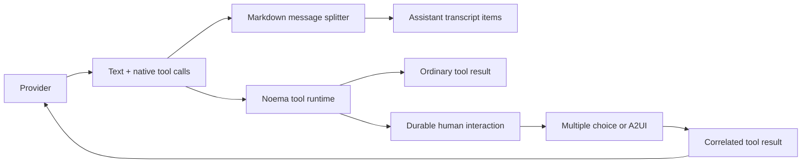

# Canonical Provider Interactions

The canonical contract should be: providers emit streamed text and native tool calls. No `response_format`, `text.format`, Foundation `GenerationSchema` response, Noema response envelope, or model-authored JSON parsed from ordinary text.

Native tool arguments remain schema-backed JSON—that's the interoperability mechanism—but the assistant response itself is never structured.



## 1. Canonical provider contract

Refactor `noema-providers` around one ordered output stream:

- Assistant text deltas and completed text.
- Native tool-call starts and completed calls.
- Reasoning, citations, and hosted searches where supported.
- Provider metadata such as response ID and usage.

Remove:

- `GenerateOptions.require_noema_response`.
- `ProviderToolTransport::NoemaEnvelope`.
- `GenerateResponseItem::MultipleChoice`.
- `GenerateResponseItem::Structured`.
- Structured-output capability fields.
- The Noema response schema builder, recursive schema lowering, envelope parser, envelope streaming extractor, and malformed-envelope diagnostics.
- Response-level `response_status`; derive “needs tools” from whether native tool calls exist.

Responses-compatible adapters always omit `text.format` and normalize whatever combination of ordinary output text and native function calls the provider returned.

## 2. Preserve multiple human-sized messages

Reserve a line containing exactly `---` as an assistant-message boundary when it occurs outside a fenced code block.

The shared prompt will say:

> Write naturally in Markdown. When the answer reads better as several short messages, put a line containing only `---` between messages. Do not use that line decoratively or inside code.

The streaming normalizer will process complete lines across chunk boundaries, track backtick and tilde fences, and:

- Finalize the current live bubble when it encounters the delimiter.
- Start a new stream ID and bubble for the next segment.
- Discard empty leading, trailing, or consecutive segments.
- Preserve ordinary Markdown and thematic rules inside fenced code.
- Apply this convention to onboarding too, replacing the current three-item JSON example.

This retains the conversational rhythm without preserving a response-array envelope.

## 3. Make every typed model result a tool

Any model operation whose result Noema must interpret structurally becomes a required native tool call:

- Multiple choice: `noema.present_multiple_choice`.
- A2UI: `noema.present_a2ui`.
- Progress audit: `noema.submit_progress_audit`.
- Governed-action review: `noema.submit_action_review`.
- Memory consolidation: `noema.submit_memory_changes`.
- Task planner, executor, and reviewer: retain their existing terminal tools.

Context compaction, final user messages, and primary notifications remain plain text because Noema doesn't need to interpret fields from them.

This removes the remaining “return strict JSON” prompts and `serde_json` parsing of assistant prose.

## 4. Canonical interaction tools

Both presentation tools use the same durable interaction lifecycle.

`noema.present_multiple_choice` has a shallow schema containing the prompt, selection mode, and stable option IDs and labels. The current dedicated multiple-choice UI remains; only its provider transport and continuation semantics change.

`noema.present_a2ui` has a deliberately shallow outer schema:

```json
{
  "jsonl": "one or more A2UI v0.9.1 messages"
}
```

Using a string avoids recursive provider tool schemas. Noema parses and validates the JSONL after receiving the native tool call.

A2UI v0.9 is explicitly prompt-first because its richer protocol no longer fits many provider structured-output subsets. Its data flow is an ordered sequence of `createSurface`, `updateComponents`, `updateDataModel`, and `deleteSurface` messages, followed by a separate client-action channel. That maps directly onto Noema's tool loop. [A2UI v0.9.1 specification](https://a2ui.org/specification/v0.9.1-a2ui/#protocol-overview-data-flow), [A2UI actions](https://a2ui.org/concepts/actions/).

For A2UI:

- Pin and vendor the official v0.9.1 schemas and Basic catalog definitions; never fetch validation authority at runtime.
- Validate protocol version, catalog, ordering, surface lifecycle, component references, root ownership, data paths, actions, and size/depth/count limits.
- Namespace surface IDs to the conversation so one interaction cannot mutate another conversation's surface.
- Reject raw HTML, scripts, unsafe URL schemes, unknown client functions, and unsupported catalog entries.
- Return the standard `VALIDATION_FAILED` tool result when validation fails, allowing the model to repair its output through the ordinary continuation loop.
- Persist and publish only validated messages.
- Treat a surface without actions as an ordinary completed tool call.
- Pause a surface containing actions until the human responds.
- Include the current data model with actions only when `sendDataModel` was requested.

The initial renderer should implement the complete catalog it advertises. If supporting the official Basic catalog's media and modal components safely exceeds the budget, stop and define a smaller Noema-owned catalog instead of falsely advertising full Basic compatibility.

## 5. Durable interaction and recovery authority

Append migration v19 with a `conversation_interactions` table. One row represents a provider tool call waiting on, or already answered by, a human.

Store:

- Interaction, conversation, and originating-turn IDs.
- Kind: multiple choice or A2UI.
- Provider call ID and canonical/provider tool names.
- Exact provider account, credential revision, model, reasoning, and tool-catalog digest.
- Validated request and projected surface state.
- Interaction revision and lifecycle status.
- Human resolution and client-message ID.
- Resume claim timestamps and terminal error, if any.

Creation must atomically persist:

1. The provider tool-call item.
2. The interaction row.
3. The multiple-choice prompt or A2UI surface projection.
4. The originating turn as `waiting_for_tool`.

Resolution must compare-and-swap the expected pending revision, then atomically persist the human action and the correlated provider tool result. This makes submissions one-use and closes the current multiple-choice validation race.

Answered interactions remain durably resumable until their continuation completes. Startup reclaims interrupted resumptions, reconstructs provider input from the transcript, and uses the pinned account/model/tool catalog. Credentials are referenced by revision and never copied into interaction rows.

A2UI surface revisions should remain append-only conversation items containing the validated message batch and complete reduced snapshot. Replay selects the newest revision per surface, so pagination and reload don't depend on receiving the original `createSurface` item.

## 6. Provider parity

| Provider | Canonical implementation |
|---|---|
| OpenAI | Existing Responses native functions; remove `text.format` and envelope parsing. |
| Codex | Existing Responses native functions; remove envelope delta extraction. |
| OpenRouter | Same Responses text/function path. Send no response schema. Require routing endpoints that accept the requested native tools. No Claude-specific response patch. |
| Local Models | Launch `llama-server` with tool-capable Jinja templates, send Chat Completions `tools`/`tool_choice`, parse streamed `tool_calls`, and replay tool results natively. |
| Apple Foundation Models | Construct dynamic Foundation `Tool` values, emit tool-call events through the bridge, suspend the Swift invocation, receive the Rust-executed result, and resume the same session. |

OpenRouter's model catalog should include every model for which an eligible endpoint supports native tools; models without tool calling cannot provide Noema interactions and should not be selectable for those routes. `provider.require_parameters` can constrain routing once the incompatible response schema is gone, avoiding model-family patches.

`llama-server` documents OpenAI-style function calling through its Jinja chat templates, so installation verification should run a small tool-call qualification probe before making a local model eligible. [llama.cpp function calling](https://github.com/ggml-org/llama.cpp/blob/master/tools/server/README.md#function-calling).

Apple's bridge needs bidirectional handling: Swift's `Tool.call` emits a request and awaits a continuation while the bridge read loop remains able to accept the result. Session identity must include the tool-catalog fingerprint because Foundation sessions bind their available tools.

If either Local or Foundation cannot pass native tool qualification, it becomes text-only and ineligible for primary Noema conversations. The envelope must not remain as a fallback.

## 7. GraphQL and frontend

Replace the placeholder A2UI card projection with:

- `A2UISurface` containing surface ID, version, revision, lifecycle, catalog, validated snapshot, and action availability.
- `sendA2UIAction(input)` containing the expected revision, source component, action name, context, optional synchronized data model, and client-message ID.
- Existing multiple-choice mutation shape can remain, but it resolves a pending interaction instead of starting an unrelated prose turn.

The frontend reducer consumes ordered v0.9.1 messages and renders the advertised catalog through Astryx primitives. Multiple choice keeps its specialized existing renderer. Both surfaces derive pending, settled, stale, and failed states from durable server state and receive updates through the existing subscription rather than polling.

Remote media must pass Noema's URL and content policy; file attachments continue through the artifact system rather than embedding provider-returned binary data.

## 8. Implementation units

1. **Canonical provider plane.** Upgrade Local and Foundation native tools, remove all response-level structured-output fields and envelope parsing, convert internal typed jobs to terminal tools, and add Markdown message splitting.

2. **Interaction and A2UI backend.** Add migration v19, durable interaction claiming/resumption, presentation tools, pinned A2UI schemas, validation, surface reduction, and transcript projection.

3. **Product integration.** Add GraphQL surface/action types, replace the placeholder A2UI renderer, connect multiple choice to correlated tool continuation, regenerate clients, and update authoritative architecture/UI docs.

Each unit should be committed separately.

## Tests and limits

Use no more than eight table-driven Rust test groups covering:

1. Every provider request omits structured-output fields.
2. Text normalization and fenced-code-aware `---` splitting.
3. Local and Foundation native tool round trips.
4. Typed audits, reviews, memory changes, and task terminals use tools.
5. Interaction publication and one-use resolution are atomic.
6. A2UI validation, ordering, repair feedback, and bounds.
7. Reload/recovery resumes the correlated call through each provider dialect.
8. Populated v18 upgrade and fresh v19 convergence.

Run focused provider/runtime/store/API suites, then the repository Rust gates, generated GraphQL verification, frontend lint/build, size reporting, and `git diff --check`.

Budget roughly 1,400 net Rust/Swift production lines, 450 Rust test lines, and 550 frontend lines after the envelope deletion. Stop for scope review above 1,900 production lines, 675 test lines, or 825 frontend lines. Browser inspection remains excluded until explicitly authorized.
