# Noema Practical Reliability Roadmap

- **Status:** Proposal
- **Mode:** Plan only
- **Date:** 2026-08-08
- **Primary evidence:** [Current-build UX audit](../../audits/2026-08-08-current-build-ux-survivors.md)
- **Live validation:** [Personal agent 50-case ledger](../../validation/personal-agent-50-case-ledger.md)
- **Security authority:** [Governed actions and approvals](../../harness/action-governance.md)

## 1. Purpose

Noema already has a task system, an action gateway, a web browser, MCP support,
and native API adapters. This proposal does not replace those systems.

This proposal connects the existing systems and repairs their current failure
paths. The final change adds one small autonomous behavior after the repairs.

The proposal has ten change packages:

1. Store the exact foreground approval origin.
2. Reconcile Work from the current task fence.
3. Find and fix the Work lease-expiry cause.
4. Make conversation tool-call state correct.
5. Make Work items and debug spans terminal.
6. Give the task reviewer durable execution evidence.
7. Use exact review lineage without a fallback.
8. Finish the current Calendar and connector-definition path.
9. Fix Notion schema enforcement and repeated diagnostics.
10. Prove one bounded autonomous Calendar behavior.

## 2. Current product baseline

The current system is not an early prototype. Most common personal-agent work
already completes.

The current evidence shows:

- 49 of 50 live validation cases pass.
- The final case waits for a true all-day Calendar operation.
- Nine recent governed actions succeeded.
- Calendar writes return provider receipts and support read-back.
- Gmail, Calendar, and Notion support cross-system tasks.
- Governed actions preserve exact payloads and one-shot approvals.

The current defects occur near interruption, recovery, evidence, and stored
status. These defects limit safe autonomy more than missing connector breadth.

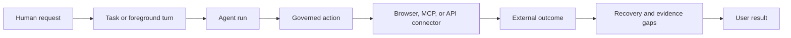
```mermaid
flowchart LR
    H["Human request"] --> T["Task or foreground turn"]
    T --> R["Agent run"]
    R --> G["Governed action"]
    G --> C["Browser, MCP, or API connector"]
    C --> O["External outcome"]
    O --> X["Recovery and evidence gaps"]
    X --> U["User result"]
```

## 3. Terms

### 3.1 Foreground turn

A foreground turn is a normal chat interaction. The user waits for the reply
inside the conversation.

### 3.2 Work task

A Work task is durable background work. It can continue after the user closes
the browser or Noema restarts.

### 3.3 Governed action

A governed action is one exact proposed external effect. It stores the tool,
arguments, policy result, approval, execution state, and terminal output.

### 3.4 Task fence

A task fence identifies one task generation and one execution contract. It
prevents old runs, gates, or approvals from changing new task work.

### 3.5 Run lease

A run lease gives one worker temporary authority over one Work run. The worker
renews the lease while it remains active.

### 3.6 Canonical state

Canonical state is the authoritative state in SQLite. A client can derive a
view, but that view must not replace incorrect server state.

### 3.7 Reconciliation

Reconciliation reads durable Work records after an interruption. It selects the
next valid action, such as queue, complete, recover, or remain idle.

## 4. Current end-to-end mechanism

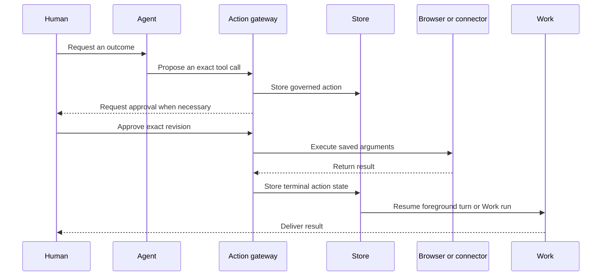
```mermaid
sequenceDiagram
    participant Human
    participant Agent
    participant Gateway as Action gateway
    participant Store
    participant Tool as Browser or connector
    participant Work

    Human->>Agent: Request an outcome
    Agent->>Gateway: Propose an exact tool call
    Gateway->>Store: Store governed action
    Gateway-->>Human: Request approval when necessary
    Human->>Gateway: Approve exact revision
    Gateway->>Tool: Execute saved arguments
    Tool-->>Gateway: Return result
    Gateway->>Store: Store terminal action state
    Store->>Work: Resume foreground turn or Work run
    Work-->>Human: Deliver result
```

The design is correct. The current problems exist in specific transitions.

## 5. Delivery order

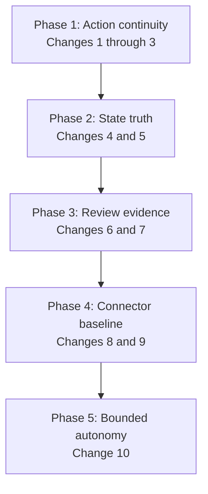
```mermaid
flowchart TD
    P1["Phase 1: Action continuity<br/>Changes 1 through 3"]
    P2["Phase 2: State truth<br/>Changes 4 and 5"]
    P3["Phase 3: Review evidence<br/>Changes 6 and 7"]
    P4["Phase 4: Connector baseline<br/>Changes 8 and 9"]
    P5["Phase 5: Bounded autonomy<br/>Change 10"]

    P1 --> P2 --> P3 --> P4 --> P5
```

Each phase has an independent release boundary. Do not start Phase 5 before all
earlier completion criteria pass.

---

## Change 1: Store the exact foreground approval origin

### Current problem

The action record stores the conversation ID and turn ID. It does not store the
exact approval-request item that contains the original provider call details.

After approval, `publish_foreground_action_outcome` loads visible conversation
items. It searches those items for an approval request with the action ID.

The search failed 148 times in the current audit. The runtime logged
`governed action continuation origin is unavailable` and returned.

The external action can finish before this failure. The user can then miss the
result and the agent continuation.

Primary code:

- [`action_resolution.rs`](../../../crates/noema-runtime/src/daemon/runtime/action_resolution.rs)
- [`action_items.rs`](../../../crates/noema-runtime/src/daemon/runtime/transcript_persistence/action_items.rs)
- [`governed_actions.rs`](../../../crates/noema-store/src/governed_actions.rs)
- [`schema.rs`](../../../crates/noema-store/src/schema.rs)

Audit issues: `WORK-16`, `WORK-10`, and `INT-08`.

### Before

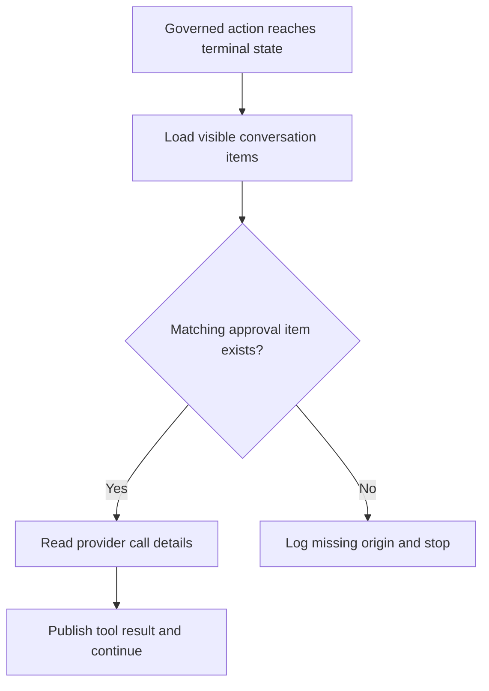
```mermaid
flowchart TD
    A["Governed action reaches terminal state"]
    B["Load visible conversation items"]
    C{"Matching approval item exists?"}
    D["Read provider call details"]
    E["Publish tool result and continue"]
    F["Log missing origin and stop"]

    A --> B --> C
    C -->|Yes| D --> E
    C -->|No| F
```

### Proposed mechanism

Store an exact durable origin reference when Noema persists the approval item.
The reference must include the item ID and the provider call identity.

Use this order:

1. Create and assess the governed action.
2. Persist the approval-request conversation item.
3. Bind that item to the exact action revision.
4. Resolve the action after the human decision.
5. Load the bound origin directly.
6. Append one deterministic result item.
7. Start one deterministic continuation.

The bind operation must use an expected action revision. It must reject a stale
or different action.

### After

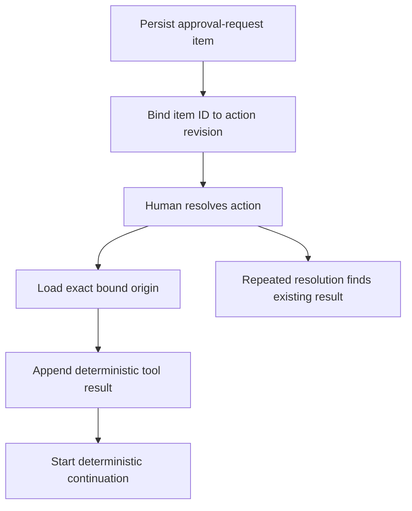
```mermaid
flowchart TD
    A["Persist approval-request item"]
    B["Bind item ID to action revision"]
    C["Human resolves action"]
    D["Load exact bound origin"]
    E["Append deterministic tool result"]
    F["Start deterministic continuation"]
    G["Repeated resolution finds existing result"]

    A --> B --> C --> D --> E --> F
    C --> G
```

### Data change

Append one forward-only migration. Add one exact origin reference to the
governed-action authority or to a one-to-one origin table.

Do not copy the complete conversation item into the action row. Store only the
exact identifiers and provider-call fields required for continuation.

### Tests

1. Resolve an action after the approval item leaves visible replay.
2. Resolve the same action two times and create one continuation.
3. Restart after action completion but before result publication.
4. Reject an origin link for a different action revision.
5. Preserve foreground action output and ordinary provider identifiers.

### Completion criteria

- No continuation depends on a visible-transcript search.
- Every terminal foreground action has one terminal result item.
- Every eligible terminal result starts at most one continuation.
- Restart recovery produces the same result as live resolution.

### Non-goals

- Do not change Work action resumption.
- Do not add a new conversation model.
- Do not retain full private payloads in duplicate rows.

---

## Change 2: Reconcile Work from the current task fence

### Current problem

Work reconciliation can select the latest resolved gate before it applies the
current task fence. A later validation step rejects the stale gate.

The current audit found five failures with this condition. Repeated
reconciliation then produced repeated errors.

Primary code:

- [`work_reconciliation_snapshot.rs`](../../../crates/noema-store/src/work_reconciliation_snapshot.rs)
- [`work_reconciliation.rs`](../../../crates/noema-store/src/work_reconciliation.rs)
- [`task_controls.rs`](../../../crates/noema-store/src/task_controls.rs)

Audit issues: `WORK-05` and `WORK-10`.

### Before

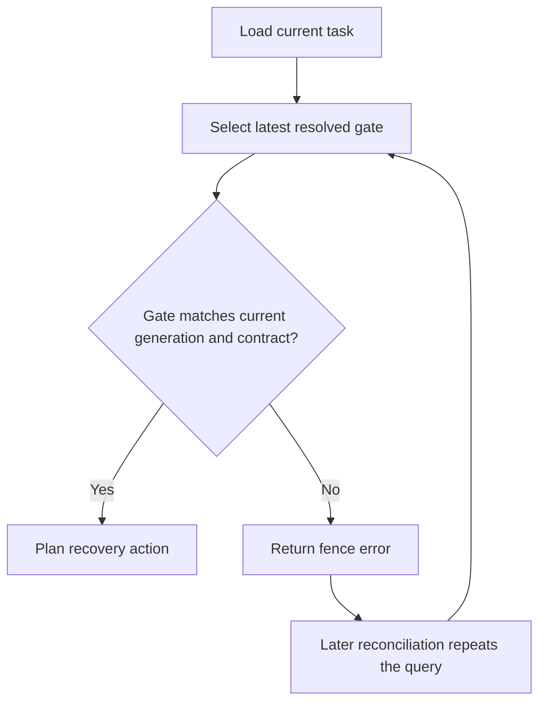
```mermaid
flowchart TD
    A["Load current task"]
    B["Select latest resolved gate"]
    C{"Gate matches current generation and contract?"}
    D["Plan recovery action"]
    E["Return fence error"]
    F["Later reconciliation repeats the query"]

    A --> B --> C
    C -->|Yes| D
    C -->|No| E --> F --> B
```

### Proposed mechanism

Apply the current fence inside the gate query. A stale gate must not become a
candidate for the current snapshot.

Use this order:

1. Load the current task generation and contract.
2. Query only gates for that generation and contract.
3. Validate the selected row as defense in depth.
4. Plan one reconciliation action.
5. Record a recovery gate for a true invariant fault.
6. Do not retry the same deterministic fault without a state change.

### After

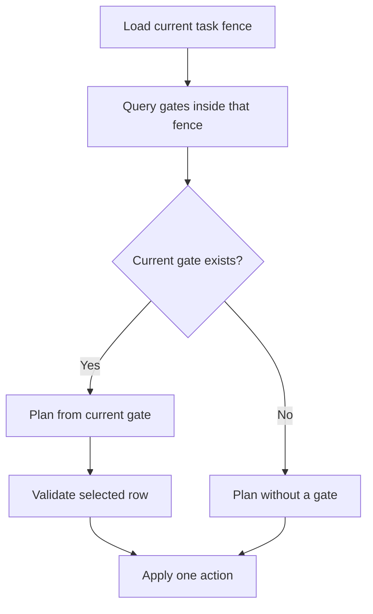
```mermaid
flowchart TD
    A["Load current task fence"]
    B["Query gates inside that fence"]
    C{"Current gate exists?"}
    D["Plan from current gate"]
    E["Plan without a gate"]
    F["Validate selected row"]
    G["Apply one action"]

    A --> B --> C
    C -->|Yes| D --> F --> G
    C -->|No| E --> G
```

### Data change

No schema change should be necessary. Use the current task, gate, generation,
and contract columns.

### Tests

1. Ignore a resolved gate from an old generation.
2. Ignore a resolved gate from a superseded contract.
3. Use the current resolved gate when its fence matches.
4. Produce the same action after repeated reconciliation.
5. Stop repeated error publication after one unchanged invariant fault.

### Completion criteria

- Reconciliation never selects a stale gate as current evidence.
- The five recorded fence scenarios produce valid actions.
- A stale gate never queues a run.
- An unchanged deterministic fault produces one actionable record.

### Non-goals

- Do not weaken generation or contract checks.
- Do not change the Work state machine.
- Do not delete old gate history.

---

## Change 3: Find and fix the Work lease-expiry cause

### Current problem

A worker gets a 120-second lease. The runtime renews that lease every 30
seconds.

The current audit found one valid executor run with `lease_expired`. The current
evidence does not identify the cause.

Primary code:

- [`task_runtime.rs`](../../../crates/noema-runtime/src/daemon/task_runtime.rs)
- [`task_controls.rs`](../../../crates/noema-store/src/task_controls.rs)

Audit issues: `WORK-15` and `INT-06`.

### Before

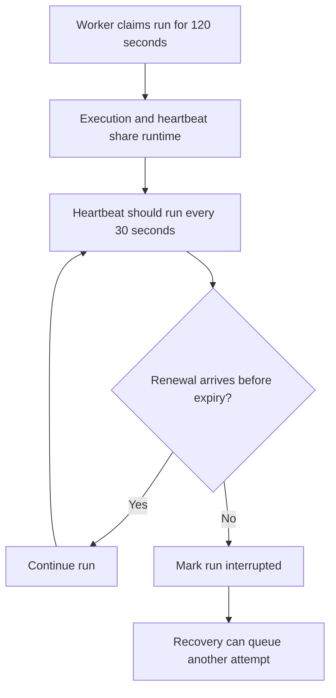
```mermaid
flowchart TD
    A["Worker claims run for 120 seconds"]
    B["Execution and heartbeat share runtime"]
    C["Heartbeat should run every 30 seconds"]
    D{"Renewal arrives before expiry?"}
    E["Continue run"]
    F["Mark run interrupted"]
    G["Recovery can queue another attempt"]

    A --> B --> C --> D
    D -->|Yes| E --> C
    D -->|No| F --> G
```

### Proposed mechanism

First add bounded timing evidence. Do not increase the lease before the evidence
identifies the delay.

Record these ordinary diagnostics:

- Planned heartbeat time.
- Actual heartbeat start time.
- SQLite renewal duration.
- Time remaining before lease expiry.
- Runtime shutdown or cancellation state.
- Provider call or tool phase at the delay.

Then fix the demonstrated cause. Possible fixes can include a blocking-call
boundary, a database-contention fix, or a supervisor scheduling fix.

### After

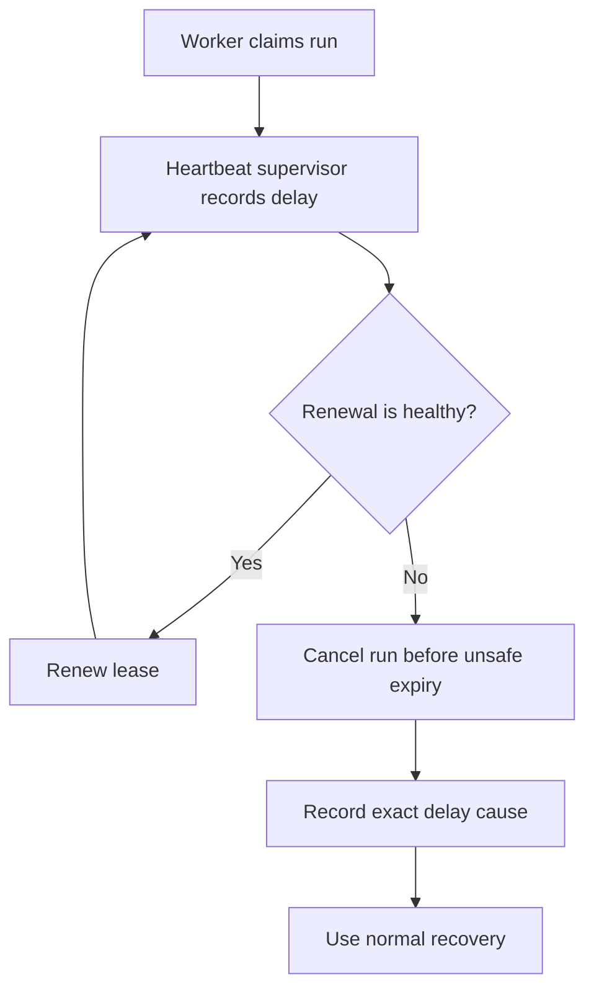
```mermaid
flowchart TD
    A["Worker claims run"]
    B["Heartbeat supervisor records delay"]
    C{"Renewal is healthy?"}
    D["Renew lease"]
    E["Cancel run before unsafe expiry"]
    F["Record exact delay cause"]
    G["Use normal recovery"]

    A --> B --> C
    C -->|Yes| D --> B
    C -->|No| E --> F --> G
```

### Data change

Prefer the current debug-span or system-error authority. Do not add lease timing
columns unless runtime evidence cannot survive the required diagnosis.

### Tests

1. Keep a run active through a long provider call.
2. Delay one heartbeat without crossing the lease boundary.
3. Cross the boundary and interrupt the run once.
4. Reject renewal after task cancellation.
5. Reject renewal after a generation change.

### Completion criteria

- The recorded expiry has a reproduced cause or a disproved current path.
- A healthy long run renews its lease.
- A stale worker cannot renew a lease.
- Recovery never overlaps two active workers for one run.

### Stop condition

Stop this change if no current path can reproduce the failure. Retain the new
diagnostic evidence and do not change lease policy without proof.

---

## Change 4: Make conversation tool-call state correct

### Current problem

The runtime stores a tool-call item with `running` status. It later stores a
separate terminal tool-result item.

The original tool-call item can remain `running`. The web and iOS clients group
the call with its result and show a completed view.

The audit found 429 conversation tool calls with results and `running` status.
The stored authority is false even when the screen looks correct.

Primary code:

- [`tool_lifecycle.rs`](../../../crates/noema-runtime/src/daemon/runtime/transcript_persistence/tool_lifecycle.rs)
- [`action_items.rs`](../../../crates/noema-runtime/src/daemon/runtime/transcript_persistence/action_items.rs)
- Conversation-item store update authority under `crates/noema-store`.

Audit issue: `STATE-03`.

### Before


```mermaid
flowchart LR
    A["Tool starts"] --> B["Store call: running"]
    B --> C["Tool finishes"]
    C --> D["Store result: completed"]
    D --> E["Client groups both items"]
    E --> F["Screen says complete"]
    D --> G["Database call still says running"]
```

### Proposed mechanism

Use the existing provider-call identity to settle the original tool-call item.
The terminal result and call update must use one store transaction where
possible.

Map terminal results as follows:

| Result | Tool-call status |
| --- | --- |
| Successful result | `completed` |
| Tool failure | `failed` |
| Human decline | `cancelled` or the current skipped representation |
| Runtime interruption | `interrupted` |
| Unknown external result | `failed` with governed uncertainty detail |

Do not put external uncertainty into a new conversation status. The governed
action remains the detailed uncertainty authority.

### After

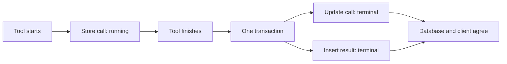
```mermaid
flowchart LR
    A["Tool starts"] --> B["Store call: running"]
    B --> C["Tool finishes"]
    C --> D["One transaction"]
    D --> E["Update call: terminal"]
    D --> F["Insert result: terminal"]
    E --> G["Database and client agree"]
    F --> G
```

### Data change

No schema change should be necessary. Add or reuse a fenced conversation-item
update that identifies the exact call item.

### Tests

1. Complete one successful tool call.
2. Fail one tool call.
3. Resolve one declined governed action.
4. Resolve one uncertain governed action.
5. Replay the same terminal result without a second update conflict.

### Completion criteria

- A terminal result always has a terminal call.
- Conversation replay does not contain a completed result under a running call.
- Clients do not need sibling inference for correctness.

### Non-goals

- Do not combine call and result into one item.
- Do not redesign transcript presentation.
- Do not remove provider-call identifiers.

---

## Change 5: Make Work items and debug spans terminal

### Current problem

Terminal Work runs can retain running assistant outputs, tool calls, and tool
results. Debug spans can also remain open after the logical operation ends.

The audit found 567 running assistant outputs inside terminal runs. It also
found 20 running calls, two running results, and two old running spans.

Primary code:

- Work run-item persistence under `crates/noema-store/src/agent_runs`.
- [`task_transcript.rs`](../../../crates/noema-runtime/src/daemon/runtime/task_transcript.rs)
- [`runtime_debug.rs`](../../../crates/noema-runtime/src/daemon/runtime/runtime_debug.rs)
- Work terminal command handlers under `crates/noema-store/src/work_run_terminal_plan.rs`.

Audit issues: `STATE-04` and `STATE-05`.

### Before

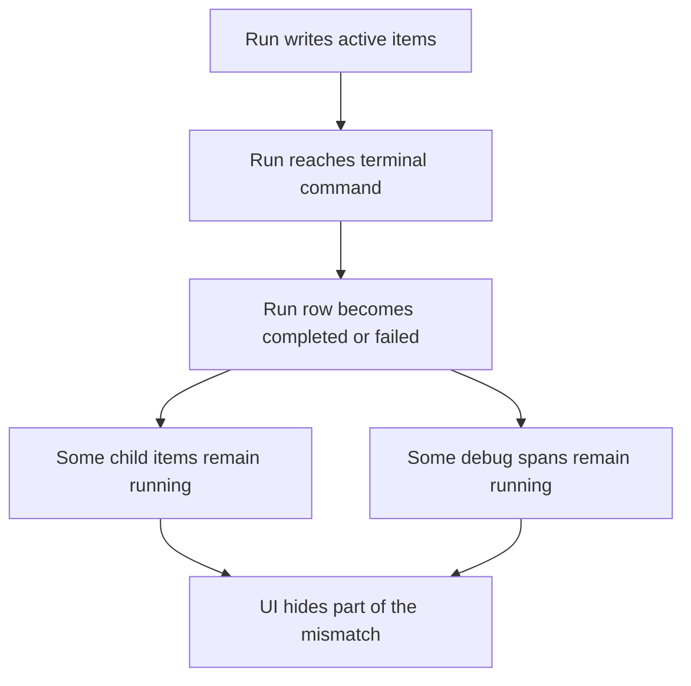
```mermaid
flowchart TD
    A["Run writes active items"]
    B["Run reaches terminal command"]
    C["Run row becomes completed or failed"]
    D["Some child items remain running"]
    E["Some debug spans remain running"]
    F["UI hides part of the mismatch"]

    A --> B --> C
    C --> D --> F
    C --> E --> F
```

### Proposed mechanism

Make terminal run settlement own child-item and debug-span settlement. Apply the
change in the same command transaction when the data shares the store.

Use these rules:

1. Complete items that have a matching successful terminal result.
2. Fail items that have a matching failed terminal result.
3. Interrupt remaining active items when the run is interrupted.
4. Cancel remaining active items when the run is cancelled.
5. Close the run debug span with the same terminal reason.
6. Keep governed-action uncertainty as a separate detailed state.

### After

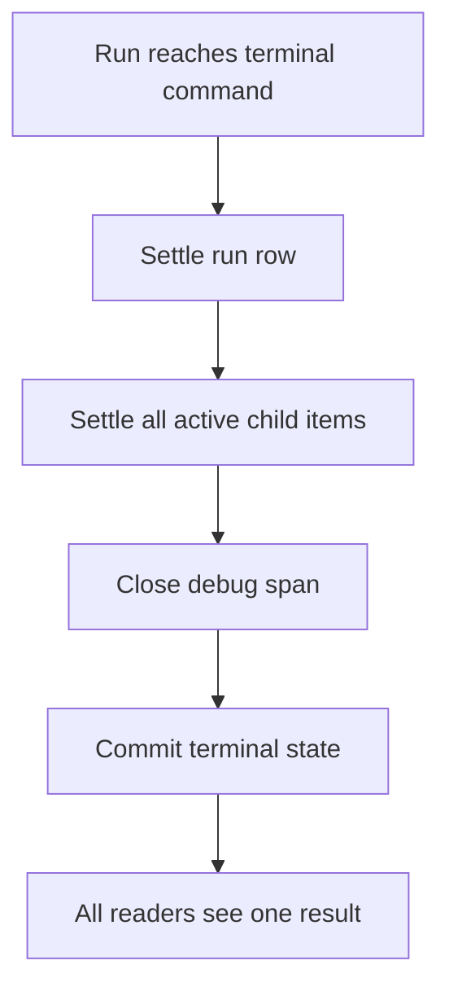
```mermaid
flowchart TD
    A["Run reaches terminal command"]
    B["Settle run row"]
    C["Settle all active child items"]
    D["Close debug span"]
    E["Commit terminal state"]
    F["All readers see one result"]

    A --> B --> C --> D --> E --> F
```

### Data change

No new state values are necessary. Use the current completed, failed,
cancelled, and interrupted values.

### Tests

1. Complete an executor run with a successful tool result.
2. Fail a run during a tool call.
3. Cancel a run during assistant generation.
4. Interrupt a run after lease loss.
5. Repeat terminal settlement and preserve idempotency.

### Completion criteria

- A terminal run has no active child item.
- A terminal run has no active debug span.
- Store reads and client projections show the same terminal state.

---

## Change 6: Give the task reviewer durable execution evidence

### Current problem

The executor submits result Markdown, criterion evidence Markdown, and artifact
IDs. The reviewer sees the submission and artifacts.

The reviewer does not receive the executor transcript items as authoritative
evidence. Current code explicitly excludes those items.

Six recent tasks required multiple review rounds. Review feedback often asked
for evidence that the executor asserted but did not attach or reproduce.

Primary code:

- [`work_run_context.rs`](../../../crates/noema-store/src/work_run_context.rs)
- [`work_run_context_records.rs`](../../../crates/noema-store/src/work_run_context_records.rs)
- [`task_run_context.rs`](../../../crates/noema-runtime/src/daemon/task_run_context.rs)
- [`submission.rs`](../../../crates/noema-tasks/src/submission.rs)

Audit issue: `WORK-19`.

### Before

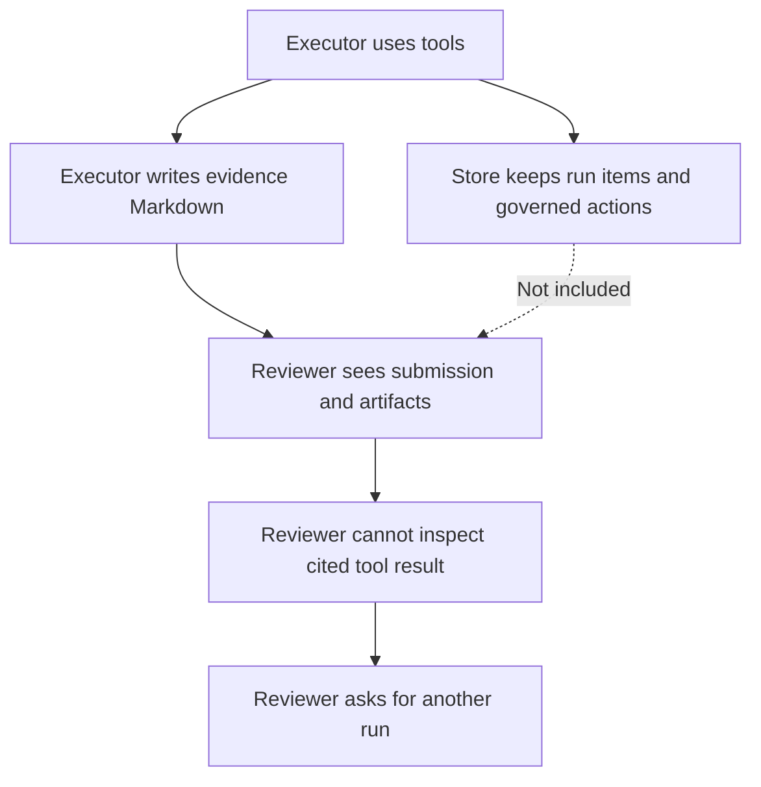
```mermaid
flowchart TD
    A["Executor uses tools"]
    B["Store keeps run items and governed actions"]
    C["Executor writes evidence Markdown"]
    D["Reviewer sees submission and artifacts"]
    E["Reviewer cannot inspect cited tool result"]
    F["Reviewer asks for another run"]

    A --> B
    A --> C --> D --> E --> F
    B -.->|Not included| D
```

### Proposed mechanism

Create a bounded evidence projection from records that already exist. Do not
create a second evidence store.

The projection should contain:

- Terminal tool-call name.
- Terminal status.
- Safe result summary.
- External resource identifiers already allowed in persistence.
- Governed-action ID, revision, and terminal state.
- Artifact version links.
- Exact run and submission lineage.

The projection must omit secrets. It must keep authorized private evidence
behind current governed references when an inline copy is unnecessary.

### After

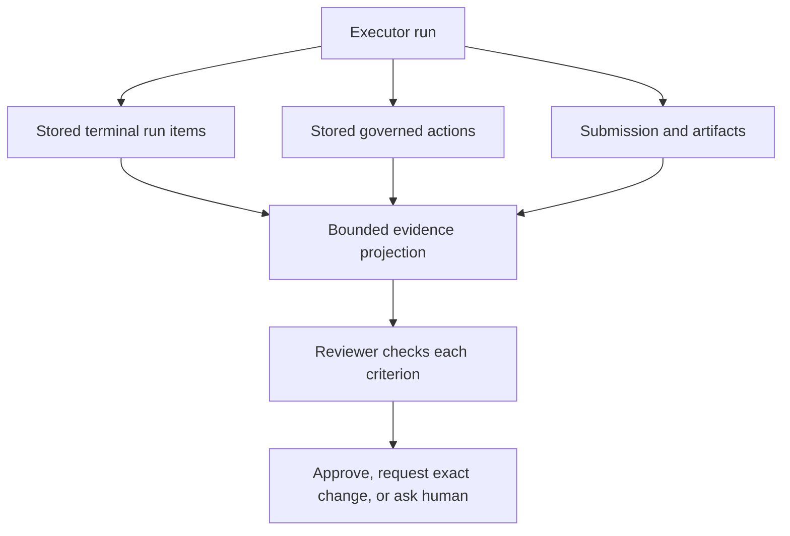
```mermaid
flowchart TD
    A["Executor run"]
    B["Stored terminal run items"]
    C["Stored governed actions"]
    D["Submission and artifacts"]
    E["Bounded evidence projection"]
    F["Reviewer checks each criterion"]
    G["Approve, request exact change, or ask human"]

    A --> B --> E
    A --> C --> E
    A --> D --> E
    E --> F --> G
```

### Data change

Prefer a derived store read. Add no schema field unless a required link does
not exist in current rows.

The model must not provide action IDs as trusted evidence. The store derives
them from task, run, contract, and submission links.

### Tests

1. Include a successful governed write in reviewer evidence.
2. Exclude an action from another run.
3. Exclude a stale action from another task generation.
4. Show an uncertain action without claiming success.
5. Preserve ordinary identifiers and exclude credential material.
6. Review a result with no matching tool evidence and reject its write claim.

### Completion criteria

- The reviewer can inspect stored evidence for each claimed effect.
- Repeated review caused only by missing evidence packaging stops.
- Evidence cannot cross task, run, contract, or generation boundaries.

### Non-goals

- Do not let the reviewer call external research tools.
- Do not make raw transcripts authoritative.
- Do not duplicate full private payloads.

---

## Change 7: Use exact review lineage without a fallback

### Current problem

`work_run_context.rs` first uses the run's `triggering_review_id`. If that value
is absent, it falls back to the task's latest review.

The later validator can detect a foreign review. However, the loader still
selects a review that did not trigger the run.

The historical failure did not recur after the audit cutoff. The unsafe path
still exists.

Primary code:

- [`work_run_context.rs`](../../../crates/noema-store/src/work_run_context.rs)
- Run queue helpers under `crates/noema-store/src/work_command_helpers.rs`.

Audit issue: `WORK-06`.

### Before

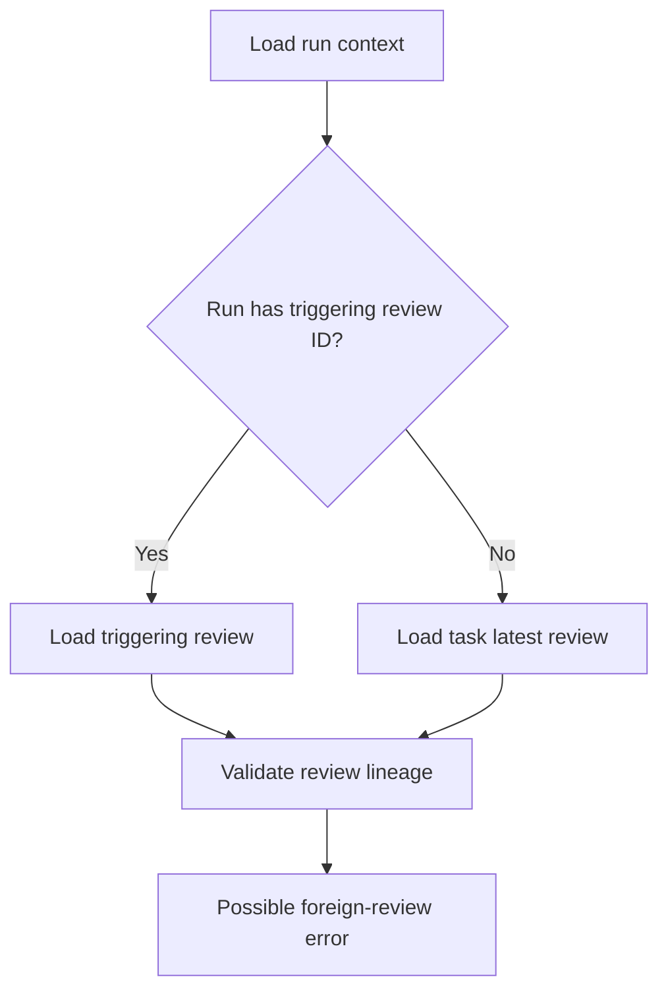
```mermaid
flowchart TD
    A["Load run context"]
    B{"Run has triggering review ID?"}
    C["Load triggering review"]
    D["Load task latest review"]
    E["Validate review lineage"]
    F["Possible foreign-review error"]

    A --> B
    B -->|Yes| C --> E
    B -->|No| D --> E
    E --> F
```

### Proposed mechanism

Use only the run's explicit trigger. A run that requires review context must
carry the exact review ID when Noema queues the run.

Use these rules:

1. Planner runs have no review trigger.
2. First executor runs have no review trigger.
3. Revision executor runs require their exact triggering review.
4. Reviewer runs require their exact triggering submission.
5. Missing required lineage becomes one invariant fault.

### After

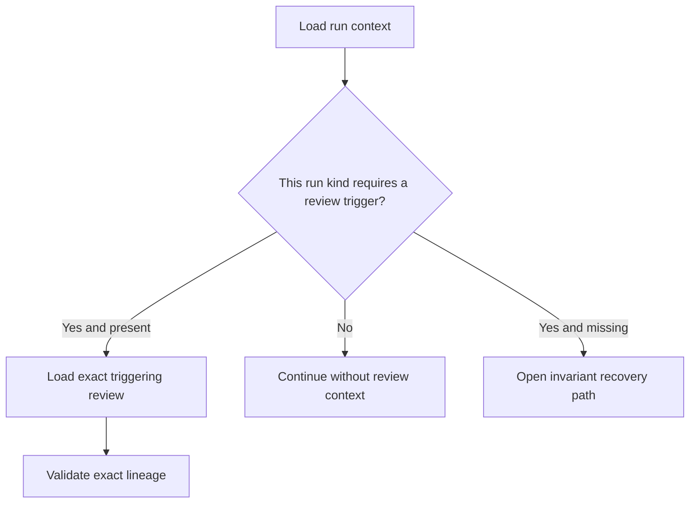
```mermaid
flowchart TD
    A["Load run context"]
    B{"This run kind requires a review trigger?"}
    C["Load exact triggering review"]
    D["Continue without review context"]
    E["Open invariant recovery path"]
    F["Validate exact lineage"]

    A --> B
    B -->|No| D
    B -->|Yes and present| C --> F
    B -->|Yes and missing| E
```

### Data change

No schema change should be necessary. `agent_runs` already stores
`triggering_review_id` and `triggering_submission_id`.

### Tests

1. Load a first executor run without a review.
2. Load a revision executor from its exact review.
3. Reject a revision executor with no trigger.
4. Reject a trigger from another submission.
5. Do not read the task's latest review as a substitute.

### Completion criteria

- No run context uses the task's latest review as causal evidence.
- Every revision run has one exact review lineage.
- Missing lineage produces one clear recovery state.

---

## Change 8: Finish the Calendar and connector-definition path

### Current problem

The active Calendar connector cannot create a true all-day event. A reviewed
successor definition exists, but the current connection has not adopted it.

Validation Case 12 waits for this operation. The live store also contains 26
compiled definitions and 45 quarantined definitions for two active connections.

This change must finish the active operation without deleting useful history.

Primary code:

- Adapter definition and connection stores under `crates/noema-capabilities/adapters/src`.
- Adapter management API under `crates/noema-api/src/graphql/adapters.rs`.
- Capability settings under `apps/web/src/components/settings`.

Audit issues: `CAL-02` and `STATE-08`.

### Before

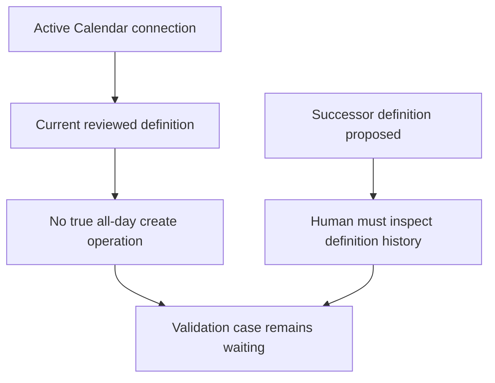
```mermaid
flowchart TD
    A["Active Calendar connection"]
    B["Current reviewed definition"]
    C["No true all-day create operation"]
    D["Successor definition proposed"]
    E["Human must inspect definition history"]
    F["Validation case remains waiting"]

    A --> B --> C --> F
    D --> E --> F
```

### Proposed mechanism

Adopt the reviewed successor through the existing managed replacement path.
Keep the complete replacement lineage.

Improve the management view so the active definition and pending successor are
the primary records. Keep older and quarantined records in history disclosure.

Use this order:

1. Review the exact all-day operation and response transform.
2. Approve the successor definition.
3. Replace the active definition through current lineage rules.
4. Preserve the connection credential and grant authority.
5. Run Case 12.
6. Confirm create, read-back, and duplicate prevention.

### After

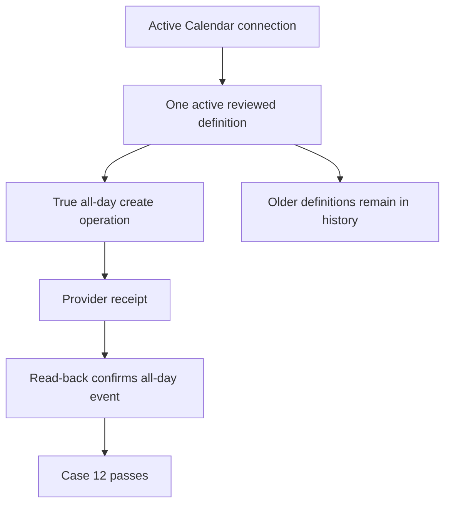
```mermaid
flowchart TD
    A["Active Calendar connection"]
    B["One active reviewed definition"]
    C["True all-day create operation"]
    D["Provider receipt"]
    E["Read-back confirms all-day event"]
    F["Case 12 passes"]
    G["Older definitions remain in history"]

    A --> B --> C --> D --> E --> F
    B --> G
```

### Data change

The definition files remain canonical. Do not rewrite an existing definition or
migration. Create a new immutable definition only when another correction is
necessary.

### Tests and validation

1. Compile the successor under strict schema version 8.
2. Preserve connection, credential, grant, and policy revisions correctly.
3. Create one all-day event with no invented time.
4. Read the event back as an all-day event.
5. Prevent a duplicate event during retry.
6. Run the complete 50-case ledger.

### Completion criteria

- All 50 validation cases pass.
- The active connection resolves one current definition.
- Historical definitions remain available without dominating the normal view.

### Non-goals

- Do not delete quarantine history during startup.
- Do not build a general connector migration framework.
- Do not change MCP through this work.

---

## Change 9: Fix Notion schema enforcement and repeated diagnostics

### Current problem

All 22 active Notion tools contain schema forms that strict lowering rejects.
The provider then uses best-effort argument enforcement.

The runtime recorded 12,342 fallback errors after the audit cutoff. These
records hide smaller actionable failures.

Primary code:

- [`strict_schema.rs`](../../../crates/noema-providers/src/response_support/strict_schema.rs)
- [`tool_names.rs`](../../../crates/noema-providers/src/response_support/tool_names.rs)
- [`diagnostics.rs`](../../../crates/noema-providers/src/response_support/diagnostics.rs)
- MCP tool schemas from `crates/noema-capabilities/mcp`.

Audit issues: `INT-02` and `STATE-06`.

### Before

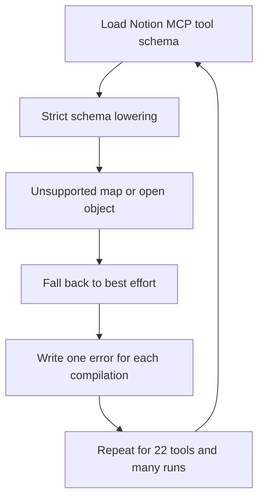
```mermaid
flowchart TD
    A["Load Notion MCP tool schema"]
    B["Strict schema lowering"]
    C["Unsupported map or open object"]
    D["Fall back to best effort"]
    E["Write one error for each compilation"]
    F["Repeat for 22 tools and many runs"]

    A --> B --> C --> D --> E --> F --> A
```

### Proposed mechanism

First identify each unsupported schema feature. Then choose one of two current
paths for each tool.

Path A uses an equivalent closed schema. Use this path when the MCP contract has
a finite property set.

Path B keeps best-effort enforcement. Use this path only when the MCP operation
requires a true arbitrary map.

For Path B, record one diagnostic per tool schema revision. Do not record the
same fallback for each run.

The runtime must still validate arguments against the canonical schema before
MCP invocation.

### After

```mermaid
flowchart TD
    A["Load Notion MCP tool schema"]
    B{"Closed equivalent exists?"}
    C["Use strict provider schema"]
    D["Use best-effort provider schema"]
    E["Keep canonical runtime validation"]
    F["Record one revision-level diagnostic"]

    A --> B
    B -->|Yes| C --> E
    B -->|No| D --> E
    D --> F
```

### Data change

No database schema change should be necessary. Diagnostic deduplication can use
the current tool name, source revision, provider, and model identity.

### Tests

1. Lower every active Notion tool schema.
2. Confirm strict enforcement for closed schemas.
3. Confirm canonical runtime validation for best-effort schemas.
4. Reject an extra model argument before MCP invocation.
5. Record one fallback diagnostic for one unchanged revision.
6. Record a new diagnostic after a real schema revision.

### Completion criteria

- Strict-capable Notion tools use strict provider decoding.
- Required best-effort tools retain exact runtime validation.
- Repeated compilation does not flood the error log.
- Ordinary Notion operations continue to pass live validation.

### Non-goals

- Do not weaken canonical MCP validation.
- Do not change the MCP protocol.
- Do not hide a new or changed fallback.

---

## Change 10: Prove one bounded autonomous Calendar behavior

### Prerequisite

Changes 1 through 9 must meet their completion criteria. This change must not
hide a reliability defect behind a new feature.

### Current mechanism

Noema can create and update Calendar events. The action gateway can review or
request approval for exact writes.

Noema does not have a general reusable grant system. A general constraint
language would add a large new authority without a proven need.

### Before

```mermaid
flowchart TD
    A["Agent proposes a Calendar update"]
    B["Action review"]
    C{"Human approval required?"}
    D["Human approves exact update"]
    E["Execute and verify"]

    A --> B --> C
    C -->|Yes| D --> E
    C -->|No| E
```

### Proposed behavior

Add one concrete policy for personal focus blocks. Do not add a universal grant
language.

The policy permits an automatic update only when all conditions are true:

- The owner is `human:local`.
- The connection is one exact Calendar connection.
- The event belongs to the owner.
- The event has no attendees.
- The event is a personal focus block.
- The action changes start or end time only.
- The new time stays inside the configured work window.
- The action does not delete the event.
- The task or human instruction supplies the scheduling reason.
- The policy revision remains current.

Any false or unknown condition requires one-shot approval.

### After

```mermaid
flowchart TD
    A["Agent proposes Calendar update"]
    B["Deterministic focus-block policy"]
    C{"All exact conditions pass?"}
    D["Execute governed action"]
    E["Require one-shot approval"]
    F["Read event back"]
    G["Record verified task evidence"]

    A --> B --> C
    C -->|Yes| D --> F --> G
    C -->|No or unknown| E --> D
```

### Authority and storage

Use one policy record with an exact owner, connection, operation set, work
window, and revision. Add immediate revocation.

Do not infer focus-block identity from English title text. Use explicit event
state or another structured marker that the production path enforces.

If Calendar cannot store that marker, stop and request a product decision. Do
not use title matching as authority.

### Tests

1. Move an eligible owner-only focus block without approval.
2. Require approval when the event has one attendee.
3. Require approval when the event identity is unknown.
4. Require approval outside the configured work window.
5. Reject automatic deletion.
6. Revoke the policy before execution.
7. Change the policy revision after proposal and require reapproval.
8. Read the updated event back before task completion.

### Completion criteria

- The exact permitted case completes without human approval.
- Every adjacent case requires approval or stops.
- Revocation prevents future automatic execution.
- Every execution remains a governed action with an audit trail.

### Non-goals

- Do not support other Calendar event types.
- Do not support email, payments, travel, or browser automation grants.
- Do not add policy inheritance.
- Do not add a general expression language.

---

## 6. Cross-change acceptance scenario

Use one scenario to prove that the repaired systems work together.

The user asks Noema to move a personal focus block and update a related Notion
page. The Calendar change qualifies for the bounded policy. The Notion change
requires one-shot approval.

```mermaid
sequenceDiagram
    participant Human
    participant Task
    participant Calendar
    participant Governance
    participant Notion
    participant Reviewer

    Human->>Task: Move focus block and update project page
    Task->>Calendar: Propose eligible focus-block update
    Calendar-->>Task: Verified event update
    Task->>Governance: Propose exact Notion update
    Governance-->>Human: Request one-shot approval
    Human->>Governance: Approve exact revision
    Governance->>Notion: Execute saved update
    Notion-->>Task: Return terminal result
    Task->>Reviewer: Submit result with stored evidence
    Reviewer-->>Task: Approve criteria
    Task-->>Human: Deliver verified result
```

Run these interruption variants:

1. Restart before the Notion approval.
2. Restart after approval but before Notion execution.
3. Restart after Notion success but before task continuation.
4. Cancel the task before approval.
5. Revoke the Calendar policy before Calendar execution.
6. Make the Notion result uncertain.

For each variant, Noema must preserve completed effects. It must not repeat an
uncertain effect.

## 7. Validation plan

### 7.1 Focused unit tests

Each change lists its unique tests. Keep each test at the lowest authoritative
layer.

Do not repeat the same transition across store, runtime, API, and client tests.

### 7.2 Repository validation

Run these commands before each change commit:

```text
cargo fmt --all --check
cargo check-workspace
cargo gate-lint
cargo gate-test
```

Run focused commands through `cargo validate` during each change.

### 7.3 Live validation

After Change 9, run the complete 50-case ledger. After Change 10, add the one
bounded autonomy scenario and its adjacent denial cases.

Do not use live high-consequence writes for this proposal.

## 8. Release boundaries

| Release | Included changes | User-visible result | Rollback point |
| --- | --- | --- | --- |
| Action continuity | 1 through 3 | Approvals and Work resume reliably | Disable new origin use while preserving migration data |
| State truth | 4 and 5 | Stored status matches completed work | Revert terminal settlement code |
| Review evidence | 6 and 7 | Review uses stored execution evidence | Remove the derived evidence projection |
| Connector baseline | 8 and 9 | All 50 cases pass with useful logs | Restore the prior active connector definition |
| Bounded autonomy | 10 | One exact focus-block policy can act | Revoke or disable the policy record |

## 9. Explicitly deferred work

The current audit includes other problems. They are real, but they do not belong
in the same implementation unit.

Deferred work includes:

- Automatic memory provenance and footnote-manifest failures.
- Foreground latency and provider HTTP failures.
- Active-context overflow before any history can compact.
- Gmail full-message depth beyond the current bounded projection.
- The infeasible 07:00 news recurrence contract.
- General reusable grants.
- General proactive outcome maintenance.
- New connector substrates.
- New domain abstractions.

Create a separate bounded proposal for each selected item. Do not expand this
roadmap during implementation.

## 10. Final system after this proposal

```mermaid
flowchart TD
    H["Human request or bounded policy"]
    T["Task contract and current fence"]
    R["Leased agent run"]
    A["Exact governed action"]
    C["Current browser or connector"]
    O["Stored terminal outcome"]
    E["Derived reviewer evidence"]
    V["Criterion review"]
    D["Verified delivery or recovery gate"]

    H --> T --> R --> A --> C --> O --> E --> V --> D
    A -.->|Approval when required| H
    O -.->|Uncertain result| D
```

The result is not a new universal engine. The result is one reliable path
through the systems that Noema already has.
