# Noema Plain-Code and Reliability Roadmap

- **Status:** Proposal
- **Mode:** Plan only
- **Date:** 2026-08-08
- **Primary evidence:** [Current-build UX audit](../../audits/2026-08-08-current-build-ux-survivors.md)
- **Live validation:** [Personal agent 50-case ledger](../../validation/personal-agent-50-case-ledger.md)
- **Safety rules:** [Current action checks and approvals](../../harness/action-governance.md)

## 1. Purpose

Noema already has a task system, an action gateway, and several tool sources.
This proposal does not replace those systems.

This proposal first gives the existing systems clear names. It then repairs
their current failure paths. It keeps the current immediate and reviewed tool
routes. It does not add a general permission or outgoing-data runtime.

The proposal has ten change packages:

0. Set the plain-language contract for code that this roadmap changes.
1. Store the exact chat approval source.
2. Recover tasks from the current task version.
3. Find and fix the worker-claim expiry cause.
4. Make conversation tool-call state correct.
5. Make task run items and debug spans final.
6. Give the task reviewer stored execution evidence.
7. Load only the review that requested a correction.
8. Complete the reviewed tool-definition replacement path.
9. Check every tool call before execution.

## 2. Current product baseline

The current system is not an early prototype. Most common personal-agent work
already completes.

The current evidence shows:

- 49 of 50 live validation cases pass.
- The final case waits for one operation in a reviewed replacement definition.
- Nine recent action requests succeeded.
- Recent external writes return provider receipts and support read-back.
- Current tool sources support cross-system tasks.
- Action requests preserve exact arguments and one-time approvals.

The current defects occur near interruption, recovery, evidence, and stored
status. These defects limit safe autonomy more than missing connector breadth.

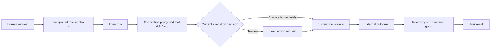
```mermaid
flowchart LR
    H["Human request"] --> T["Background task or chat turn"]
    T --> R["Agent run"]
    R --> P["Connection policy and tool risk facts"]
    P --> D{"Current execution decision"}
    D -->|Execute immediately| C["Current tool source"]
    D -->|Review| G["Exact action request"]
    G --> C
    C --> O["External outcome"]
    O --> X["Recovery and evidence gaps"]
    X --> U["User result"]
```

## 3. Terms

### 3.1 Chat turn

A chat turn is a normal chat interaction. The user waits for the reply inside
the conversation.

### 3.2 Background task

A background task can continue after the user closes the app or Noema
restarts.

### 3.3 Action request

An action request is one exact tool call that current policy sends to human or
model review. It stores the tool, arguments, review result, approval, execution
state, and final output.

### 3.4 Current-run check

A current-run check identifies one run, worker claim, task version, and set of
task requirements. It stops old work from changing a newer task version.

### 3.5 Worker claim

A worker claim gives one worker temporary control of one task run. The worker
renews the claim while the run remains active.

### 3.6 Stored state

Stored state is the source data in SQLite. A client can make a view from this
data, but the view cannot correct false stored data.

### 3.7 Restart recovery

Restart recovery reads stored task records after an interruption. It selects
the next valid step, such as queue, complete, recover, or remain idle.

### 3.8 Source schema

A source schema is the complete input rule supplied by a tool. Provider schema
conversion can make a smaller copy for a model service.

## 4. Current end-to-end mechanism

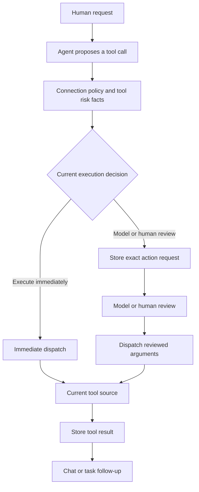
```mermaid
flowchart TD
    H["Human request"]
    A["Agent proposes a tool call"]
    P["Connection policy and tool risk facts"]
    D{"Current execution decision"}
    I["Immediate dispatch"]
    S["Store exact action request"]
    R["Model or human review"]
    E["Dispatch reviewed arguments"]
    T["Current tool source"]
    O["Store tool result"]
    F["Chat or task follow-up"]

    H --> A --> P --> D
    D -->|Execute immediately| I --> T
    D -->|Model or human review| S --> R --> E --> T
    T --> O --> F
```

This is the current code shape. Reliability changes must repair one of these
paths without replacing the policy model.

## 5. Delivery order

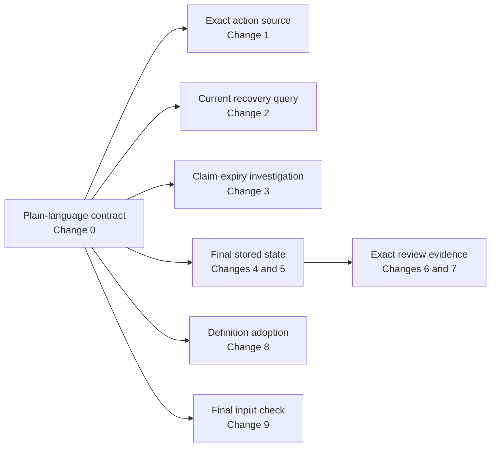
```mermaid
flowchart LR
    L["Plain-language contract<br/>Change 0"]
    A["Exact action source<br/>Change 1"]
    Q["Current recovery query<br/>Change 2"]
    X["Claim-expiry investigation<br/>Change 3"]
    S["Final stored state<br/>Changes 4 and 5"]
    R["Exact review evidence<br/>Changes 6 and 7"]
    C["Definition adoption<br/>Change 8"]
    V["Final input check<br/>Change 9"]

    L --> A
    L --> V
    L --> Q
    L --> X
    L --> S --> R
    L --> C
```

Each branch has an independent release boundary. The small language contract
in Change 0 must finish first. A full repository rename is separate work.

---

## Change 0: Set the plain-language contract for changed code

### Current problem

Noema uses several private platform terms for mechanisms that already have
simple names. These terms appear in the product, code, APIs, logs, and docs.

A new contributor must first learn Noema vocabulary. Only then can the
contributor understand the mechanism.

A current scoped scan found:

- 726 exact uses of the product word `Work`.
- 396 uses of the identifier form `governed_action`.
- 85 uses of the type `WorkRunFence`.
- 63 uses of the field `triggering_review_id`.
- 19 uses of `strict_schema` or `lower_strict_schema`.
- 331 uses of the word `canonical`.

These counts exclude generated files and third-party license text. Some uses
are valid technical terms. Most listed product terms are not necessary.

### What STE compliance means here

Apply ASD-STE100 directly to product text, current docs, code comments, prompts,
logs, and human-readable errors.

Code identifiers do not contain sentences. Apply the same approved vocabulary
and one-meaning rule to identifiers.

Keep a necessary technical noun only when no approved common word preserves
the meaning. Define that noun once in the terms source.

Do not claim formal ASD-STE100 certification from an automated word search. The
reader-path review must also confirm that the code explains its behavior.

Primary code areas:

- Task domain code under `crates/noema-tasks`.
- Task storage under `crates/noema-store/src/work_*`.
- Task runtime code under `crates/noema-runtime/src/daemon/task_*`.
- [`action_gateway.rs`](../../../crates/noema-runtime/src/daemon/runtime/action_gateway.rs)
- [`governed_actions.rs`](../../../crates/noema-store/src/governed_actions.rs)
- [`strict_schema.rs`](../../../crates/noema-providers/src/response_support/strict_schema.rs)
- GraphQL task and action-request fields under `crates/noema-api`.
- Web task code under `apps/web/src/components/work`.
- iOS task and action-request operations under `apps/ios/Noema`.

### Before

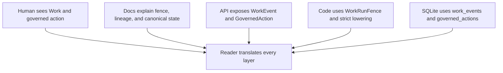
```mermaid
flowchart TD
    H["Human sees Work and governed action"]
    D["Docs explain fence, lineage, and canonical state"]
    A["API exposes WorkEvent and GovernedAction"]
    C["Code uses WorkRunFence and strict lowering"]
    S["SQLite uses work_events and governed_actions"]
    Q["Reader translates every layer"]

    H --> Q
    D --> Q
    A --> Q
    C --> Q
    S --> Q
```

The terms move across system boundaries. They also appear in generated clients
and error messages. A documentation-only rename will not solve the problem.

### Required term changes

Use this language contract in every file that this roadmap changes:

| Current term | Plain term | Example code name | Direct meaning |
| --- | --- | --- | --- |
| `Work` | Tasks | `TaskCommandService`, `TaskEvent` | The task product and its stored activity |
| Canonical state | Stored state | `StoredTaskState` when a type needs the distinction | The source data in SQLite |
| Task fence | Current-run check | `TaskRunCheck` | The values that prove a write belongs to the current run |
| Governed action | Action request | `ActionRequest`, `action_requests` | One saved tool action that Noema must check |
| Review lineage; `triggering_review_id` | Correction review | `correction_review_id` | The exact review that requested a correction run |
| Schema lowering | Provider schema conversion | `convert_provider_schema` | Noema makes a copy of a source schema for one model service |
| Strict lowering | Full provider conversion | `convert_schema_fully` | The conversion does not remove or weaken a source rule |
| Canonical runtime validation | Final source-schema check | `validate_tool_input` | Noema checks tool input before invocation |

Other words remain unchanged until a reader-path test proves a problem. Use the
exact external term when Noema implements an external protocol.

### Context-dependent words

Do not make a global text replacement for `canonical`, `strict`, or `work`.
Select the word that describes the specific mechanism.

| Current phrase | Replacement |
| --- | --- |
| Canonical database state | Stored state or source data |
| Canonical tool schema | Source schema |
| Canonical arguments | Saved exact arguments |
| Canonical file | Source file |
| Canonical JSON encoding | Normalized JSON encoding |
| Strict provider schema | Exact provider schema |
| Strict JSON parser | Keep this term when the parser follows a named strict mode |
| Workflow | Keep this word because it has a different established meaning |
| Ordinary English work | Keep this word when it is not the Tasks product name |

### Terms that are not mandatory renames

Do not rename a standard technical term only because a new reader might not
know it. Terms such as `payload`, `principal`, `idempotency`, and `adapter` can
be precise in the correct context.

Keep such a term when an external protocol owns it or when a common replacement
would remove a necessary distinction. Define it near its first use.

Package and directory names are also candidates, not approved changes. First
trace one real reader path. Rename a package only when the path proves that the
name hides its current responsibility. Do not combine that rename with a
reliability repair.

The deferred plain-code program can inspect the rest of the repository in
small, buildable slices. Each slice needs its own reader evidence, budget,
tests, and product decision.

### Code readability rules

Apply these rules to the files that an implementation slice changes:

1. One mechanism has one noun across Rust, GraphQL, TypeScript, Swift, SQL, and docs.
2. A type name states what data the type contains.
3. A function name states the action and its result.
4. A Boolean name reads as a true-or-false statement.
5. A state name describes an observable state.
6. An error states what failed, why it failed, and what remains unchanged.
7. A log identifies the operation, object, result, and safe reason.
8. A module name matches the product or mechanism that it owns.
9. A comment explains a required rule or a non-obvious reason.
10. A comment must not translate a confusing identifier into plain language.
11. An acronym appears only when an external protocol owns it.
12. The first module comment expands each required external acronym.
13. Generic words such as `manager`, `handler`, `helper`, and `service` need a specific owned action.
14. New aliases cannot preserve a replaced internal name.
15. Generated code must come from a source schema that uses the approved terms.

### Reader-path test

Each implementation slice must trace the real path that it changes. Its before
and after diagrams must name the actual modules, types, functions, database
records, and API fields. A reviewer with basic Rust and TypeScript knowledge
must be able to explain that path with the terms document.

The deferred plain-code program must use the same test for each candidate
rename. A search count alone is not evidence that a rename helps a reader.

### Proposed mechanism

Create one terms source at `docs/development/terms.md`. It must contain
the approved term and its definition. It must also state which old forms new
prose and changed identifiers must not add.

Apply the contract in two small steps.

1. Add the terms document and link it from `AGENTS.md`.
2. Use the approved names in this roadmap and in each file that a later change
   edits.

Do not rename an untouched package, route, API field, SQL table, or generated
client in this change. A later change can rename a touched identifier when the
rename fits its budget and does not increase release risk.

### Build sequence

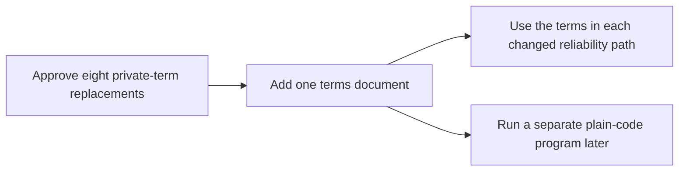
```mermaid
flowchart LR
    A["Approve eight private-term replacements"]
    B["Add one terms document"]
    C["Use the terms in each changed reliability path"]
    D["Run a separate plain-code program later"]

    A --> B --> C
    B --> D
```

The path from A through C is the only reliability prerequisite. The separate
plain-code program does not block Changes 1 through 9.

### After

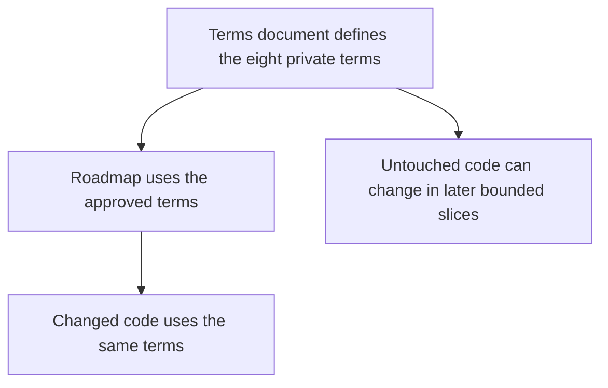
```mermaid
flowchart TD
    T["Terms document defines the eight private terms"]
    R["Roadmap uses the approved terms"]
    C["Changed code uses the same terms"]
    F["Untouched code can change in later bounded slices"]

    T --> R --> C
    T --> F
```

### Database changes

None. Do not rename a database object only to complete this language contract.
If a later reliability change needs a schema change, it must use a forward-only
migration.

### API and generated-client changes

None. Do not rename a public API or generated client only to complete this
language contract.

### Tests and validation

Review this roadmap and the terms document. Confirm that each approved term has
one definition. Confirm that no replacement removes a necessary distinction.
This change adds no production code and no tests.

### Completion criteria

- The terms document defines the eight confirmed private terms.
- This roadmap uses those terms.
- Each later change uses those terms in the files that it edits.
- No repository-wide rename blocks a reliability change.

### Stop conditions

- Stop when a proposed name changes behavior or removes a necessary distinction.
- Stop when a rename would require a migration or client regeneration that the
  reliability change does not otherwise need.
- Stop when one term needs two meanings inside the same subsystem.

### Non-goals

- Do not redesign Tasks, action checks, recovery, or schema enforcement.
- Do not rename packages, routes, public APIs, database objects, or generated
  clients as a general cleanup.
- Do not rename terms owned by an external protocol.
- Do not add a repository-wide banned-word check.

### Names used by later changes

Changes 1 through 9 use the plain terms in prose. Current file names can remain
until a bounded implementation slice changes them safely. Current audit labels
can also remain because they identify fixed historical findings.

---

## Change 1: Store the exact chat approval source

### Current problem

The action-request record stores the conversation ID and chat-turn ID. It does
not store the exact approval item that contains the original model tool-call ID.

After approval, `publish_foreground_action_outcome` loads visible conversation
items. It searches those items for an approval request with the action ID.

The search failed 148 times in the current audit. The agent runner logged a
missing action source and stopped.

The external action can finish before this failure. The user can then miss the
result and the agent follow-up.

Current code owners:

- Agent follow-up code under `noema-runtime`.
- Conversation-item code under `noema-runtime`.
- Action-request database code under `noema-store`.
- Database migrations under `noema-store`.

Audit issues: `WORK-16`, `WORK-10`, and `INT-08`.

### Before

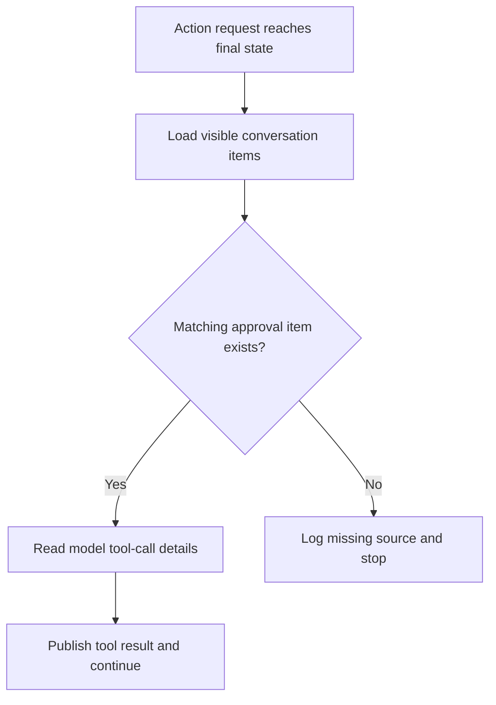
```mermaid
flowchart TD
    A["Action request reaches final state"]
    B["Load visible conversation items"]
    C{"Matching approval item exists?"}
    D["Read model tool-call details"]
    E["Publish tool result and continue"]
    F["Log missing source and stop"]

    A --> B --> C
    C -->|Yes| D --> E
    C -->|No| F
```

### Proposed mechanism

Store an exact source reference when Noema saves the approval item. The
reference must include the item ID and the model tool-call ID.

Use this order:

1. Create and assess the action request.
2. Save the approval-request conversation item.
3. Link that item to the exact action version.
4. Resolve the action after the human decision.
5. Load the linked source directly.
6. Append one repeat-safe result item.
7. Start one repeat-safe follow-up run.

The link operation must use an expected action version. It must reject an old
or different action.

### After

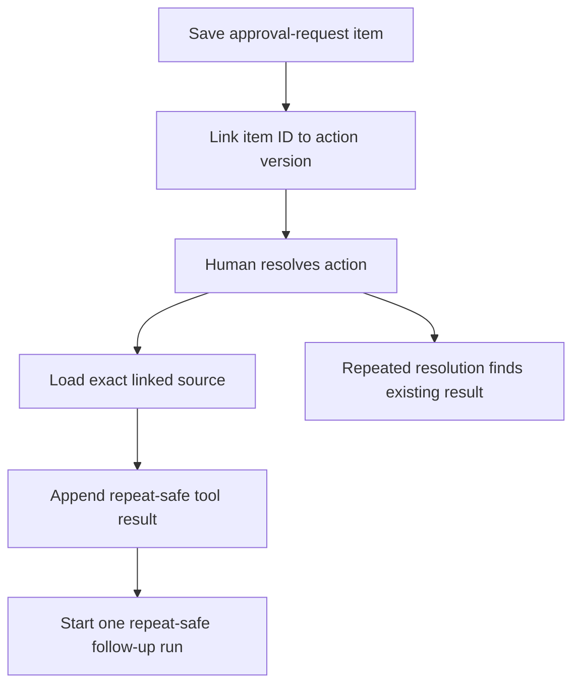
```mermaid
flowchart TD
    A["Save approval-request item"]
    B["Link item ID to action version"]
    C["Human resolves action"]
    D["Load exact linked source"]
    E["Append repeat-safe tool result"]
    F["Start one repeat-safe follow-up run"]
    G["Repeated resolution finds existing result"]

    A --> B --> C --> D --> E --> F
    C --> G
```

### Data change

Append one forward-only migration. Store the existing approval conversation
item ID on the current action-request row. Do not add a source table.

Load the model tool-call ID from that conversation item. Add the model tool-call
ID to the same action row only if the linked item cannot provide it. Do not copy
the complete conversation item into the action row.

### Tests

1. Load the exact source after it leaves the visible view, and reject a link to
   another action version.
2. Restart after action completion but before publication, then process the
   action twice and create one result item and one follow-up run.
3. Preserve chat output and ordinary model-service identifiers at the new
   storage boundary.

### Completion criteria

- No follow-up run depends on a visible-conversation search.
- Every final chat action has one final result item.
- Every eligible final result starts at most one follow-up run.
- Restart recovery produces the same result as live resolution.

### Non-goals

- Do not change background-task action resumption.
- Do not add a new conversation model.
- Do not retain full private content in duplicate rows.

---

## Change 2: Recover tasks from the current task version

### Current problem

Task restart recovery can select the latest resolved pause before it checks the
current task version. A later check rejects the old pause.

The current audit found five failures with this condition. Repeated
recovery then produced repeated errors.

Current code owners:

- Task recovery input under `noema-store`.
- Task recovery rules under `noema-store`.
- Current-run checks under `noema-store`.

Audit issues: `WORK-05` and `WORK-10`.

### Before

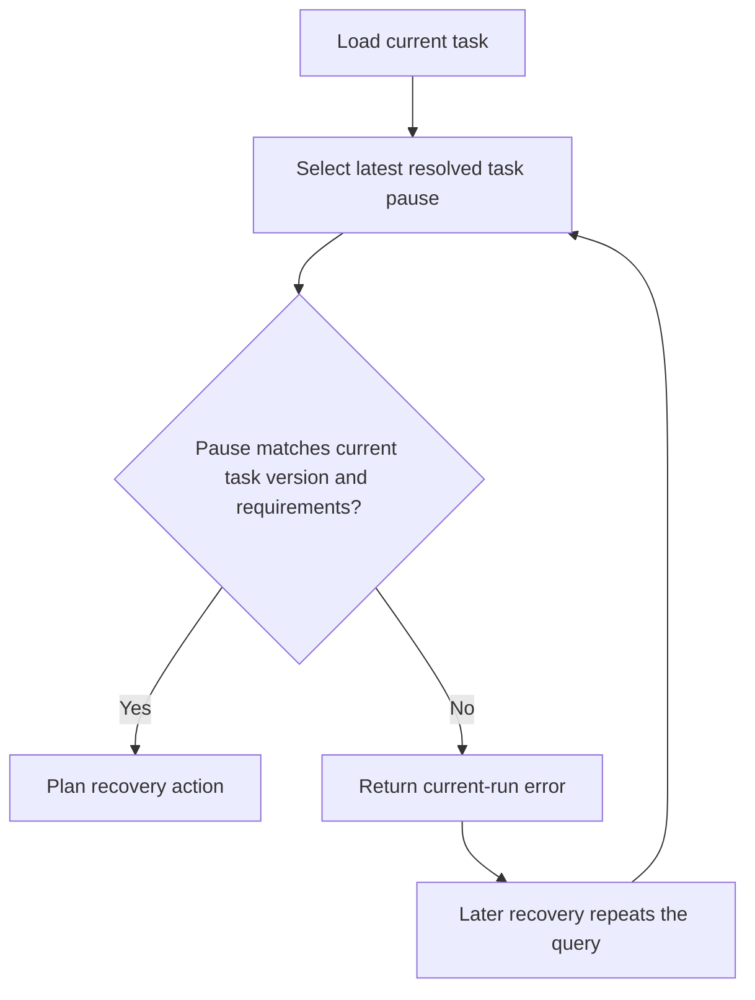
```mermaid
flowchart TD
    A["Load current task"]
    B["Select latest resolved task pause"]
    C{"Pause matches current task version and requirements?"}
    D["Plan recovery action"]
    E["Return current-run error"]
    F["Later recovery repeats the query"]

    A --> B --> C
    C -->|Yes| D
    C -->|No| E --> F --> B
```

### Proposed mechanism

Apply the current task version inside the pause query. An old pause must not
become a candidate for the current recovery view.

Use this order:

1. Load the current task version and requirements.
2. Query only pauses for that task version and requirements.
3. Validate the selected row as defense in depth.
4. Plan one recovery step.

### After

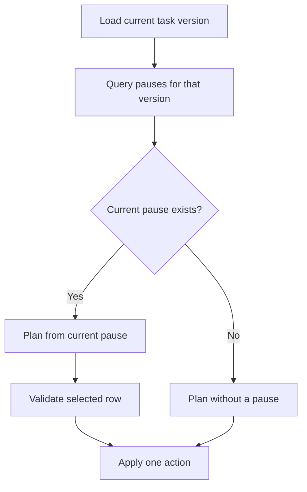
```mermaid
flowchart TD
    A["Load current task version"]
    B["Query pauses for that version"]
    C{"Current pause exists?"}
    D["Plan from current pause"]
    E["Plan without a pause"]
    F["Validate selected row"]
    G["Apply one action"]

    A --> B --> C
    C -->|Yes| D --> F --> G
    C -->|No| E --> G
```

### Data change

No schema change should be necessary. Use the current task, pause, version, and
requirements columns.

### Test

Add one table-driven regression test. It must include an old task version,
replaced requirements, and the current matching pause. The query must return
only the current matching pause.

### Completion criteria

- Restart recovery never selects an old pause as current evidence.
- The five recorded version scenarios produce valid steps.
- An old pause never queues a run.

### Non-goals

- Do not weaken task version or requirements checks.
- Do not change the task state machine.
- Do not delete old pause history.
- Do not add a new fault-recording or retry mechanism.

---

## Change 3: Find and fix the worker-claim expiry cause

### Current problem

A worker gets a 120-second claim. The task runner renews that claim every 30
seconds.

The current audit found one valid task-worker run whose claim expired. The
current evidence does not identify the cause.

Current code owners:

- Task-worker supervision under `noema-runtime`.
- Worker-claim database code under `noema-store`.

Audit issues: `WORK-15` and `INT-06`.

### Before

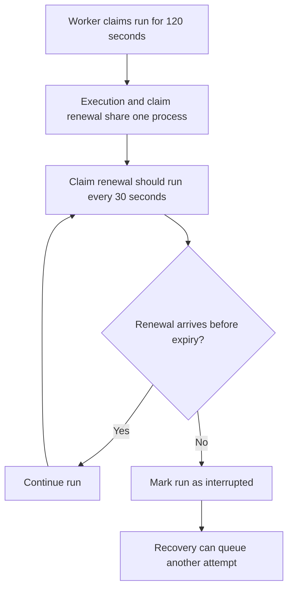
```mermaid
flowchart TD
    A["Worker claims run for 120 seconds"]
    B["Execution and claim renewal share one process"]
    C["Claim renewal should run every 30 seconds"]
    D{"Renewal arrives before expiry?"}
    E["Continue run"]
    F["Mark run as interrupted"]
    G["Recovery can queue another attempt"]

    A --> B --> C --> D
    D -->|Yes| E --> C
    D -->|No| F --> G
```

### Proposed mechanism

First add limited timing evidence. Do not increase the claim before the evidence
identifies the delay.

Record these ordinary diagnostics:

- Planned claim-renewal time.
- Actual claim-renewal start time.
- SQLite renewal duration.
- Time remaining before claim expiry.
- Agent-runner shutdown or cancellation state.
- Model-service call or tool phase at the delay.

Reproduce the expiry and name its measured cause. Then make the smallest change
that removes that cause. Do not select an architecture before reproduction.

### After

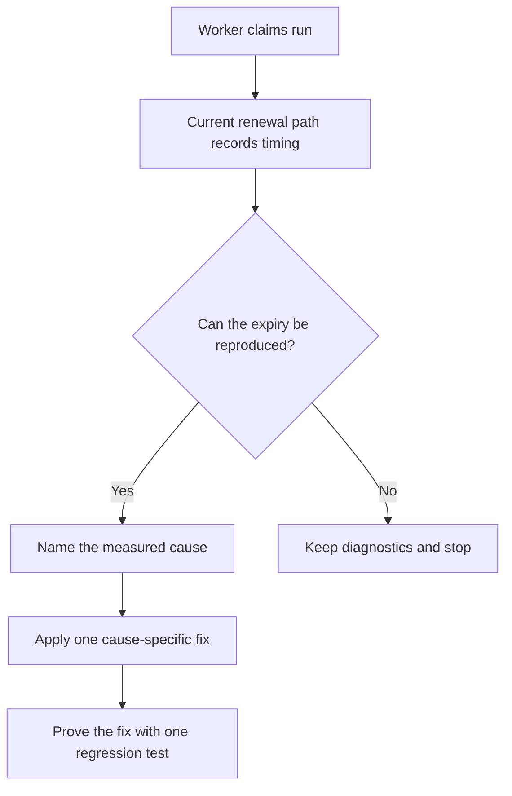
```mermaid
flowchart TD
    A["Worker claims run"]
    B["Current renewal path records timing"]
    C{"Can the expiry be reproduced?"}
    D["Name the measured cause"]
    E["Apply one cause-specific fix"]
    F["Prove the fix with one regression test"]
    G["Keep diagnostics and stop"]

    A --> B --> C
    C -->|Yes| D --> E --> F
    C -->|No| G
```

### Data change

Prefer the current debug-span or system-error record. Do not add claim timing
columns unless the current diagnostic records cannot preserve the evidence.

### Tests

1. Add one regression test that reproduces the measured cause and proves the
   cause-specific fix.
2. Add a current-run safety test only if the fix changes cancellation or task
   version checks.

### Completion criteria

- The recorded expiry has a reproduced cause or a disproved current path.
- A healthy long run renews its worker claim.
- An old worker cannot renew a claim.
- Recovery never overlaps two active workers for one run.

### Stop condition

Stop this change if no current path can reproduce the failure. Retain the new
diagnostic evidence and do not change claim timing without proof.

---

## Change 4: Make conversation tool-call state correct

### Current problem

The agent runner stores a tool-call item with `running` status. It later stores
a separate final tool-result item.

The original tool-call item can remain `running`. The web and iOS clients group
the call with its result and show a completed view.

The audit found 429 conversation tool calls with results and `running` status.
The stored state is false even when the screen looks correct.

Current code owners:

- Tool-call state under `noema-runtime`.
- Action-request conversation items under `noema-runtime`.
- Conversation-item updates under `noema-store`.

Audit issue: `STATE-03`.

### Before

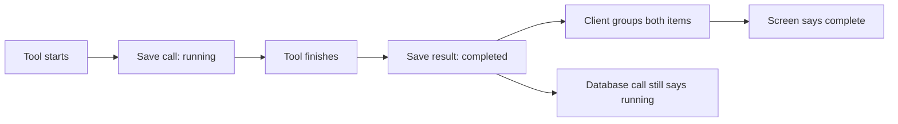
```mermaid
flowchart LR
    A["Tool starts"] --> B["Save call: running"]
    B --> C["Tool finishes"]
    C --> D["Save result: completed"]
    D --> E["Client groups both items"]
    E --> F["Screen says complete"]
    D --> G["Database call still says running"]
```

### Proposed mechanism

Use the existing model tool-call ID to finish the original tool-call item.
The final result and call update must use one database transaction where
possible.

Map final results as follows:

| Result | Tool-call status |
| --- | --- |
| Successful result | `completed` |
| Tool failure | `failed` |
| Human decline | `cancelled` or the current skipped representation |
| Agent-runner interruption | `interrupted` |
| Unknown external result | `failed` with action-request uncertainty detail |

Do not put external uncertainty into a new conversation status. The action
request remains the detailed uncertainty record.

### After

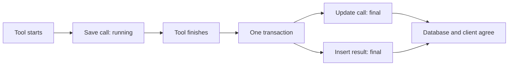
```mermaid
flowchart LR
    A["Tool starts"] --> B["Save call: running"]
    B --> C["Tool finishes"]
    C --> D["One transaction"]
    D --> E["Update call: final"]
    D --> F["Insert result: final"]
    E --> G["Database and client agree"]
    F --> G
```

### Data change

No schema change should be necessary. Add or reuse a conditional
conversation-item update that identifies the exact call item.

### Tests

1. Use one table-driven test for successful, failed, declined, and uncertain
   outcomes.
2. Process the same final result again without a second update conflict.

### Completion criteria

- A final result always has a final call.
- Conversation history does not contain a completed result under a running call.
- Clients do not need sibling inference for correctness.

### Non-goals

- Do not combine call and result into one item.
- Do not redesign transcript presentation.
- Do not remove model tool-call identifiers.

---

## Change 5: Make task run items and debug spans final

### Current problem

Completed task runs can retain running assistant outputs, tool calls, and tool
results. Debug spans can also remain open after the operation ends.

The audit found 567 running assistant outputs inside final runs. It also
found 20 running calls, two running results, and two old running spans.

Current code owners:

- Task run-item database code under `noema-store`.
- Task run-item recording under `noema-runtime`.
- Agent-runner diagnostics under `noema-runtime`.
- Final task-run updates under `noema-store`.

Audit issues: `STATE-04` and `STATE-05`.

### Before

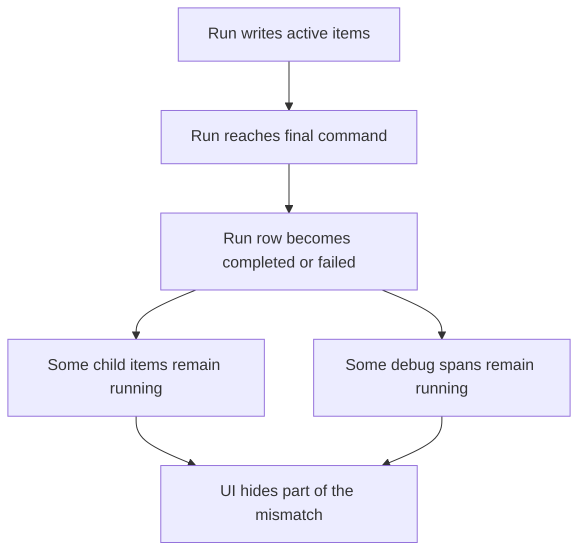
```mermaid
flowchart TD
    A["Run writes active items"]
    B["Run reaches final command"]
    C["Run row becomes completed or failed"]
    D["Some child items remain running"]
    E["Some debug spans remain running"]
    F["UI hides part of the mismatch"]

    A --> B --> C
    C --> D --> F
    C --> E --> F
```

### Proposed mechanism

Make the final run update also finish child items and the debug span. Apply the
change in the same database transaction when the data shares the database.

Use these rules:

1. Complete items that have a matching successful final result.
2. Fail items that have a matching failed final result.
3. Fail remaining active items when the run is interrupted. Task run items do
   not have an `interrupted` value. Keep `interrupted` on the run row and its
   debug spans.
4. Cancel remaining active items when the run is cancelled.
5. Close the run debug span with the same final reason.
6. Keep action-request uncertainty as a separate detailed state.

### After

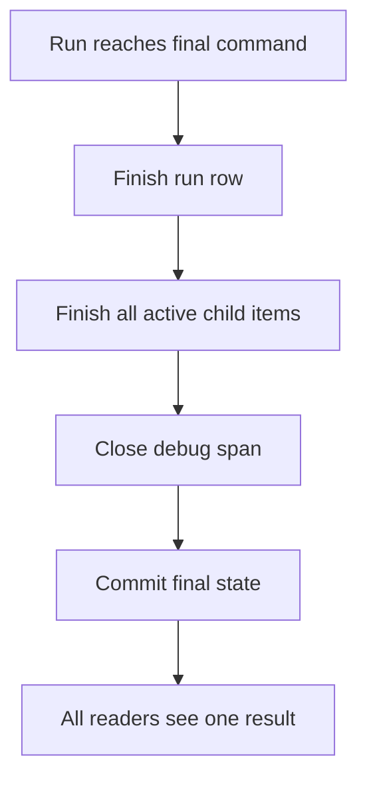
```mermaid
flowchart TD
    A["Run reaches final command"]
    B["Finish run row"]
    C["Finish all active child items"]
    D["Close debug span"]
    E["Commit final state"]
    F["All readers see one result"]

    A --> B --> C --> D --> E --> F
```

### Data change

No new state values are necessary. Task run items use their current
`completed`, `failed`, and `cancelled` values. Run rows and debug spans also use
their current `interrupted` value.

### Tests

1. Use one table-driven test for completed, failed, cancelled, and interrupted
   runs with active child items.
2. Close the matching debug span with the same final reason.
3. Repeat the final update and preserve repeat protection.

### Completion criteria

- A final run has no active child item.
- A final run has no active debug span.
- Database queries and client views show the same final state.

---

## Change 6: Give the task reviewer stored execution evidence

### Current problem

The task worker submits result Markdown, criterion evidence Markdown, and saved
output IDs. The reviewer sees the submission and saved outputs.

The reviewer does not receive the task worker's stored run items as source
evidence. Current code explicitly excludes those items.

Six recent tasks required multiple review rounds. Review feedback often asked
for evidence that the task worker asserted but did not attach or reproduce.

Current code owners:

- Task review input under `noema-store`.
- Task review records under `noema-store`.
- Reviewer input assembly under `noema-runtime`.
- Task submissions under `noema-tasks`.

Audit issue: `WORK-19`.

### Before

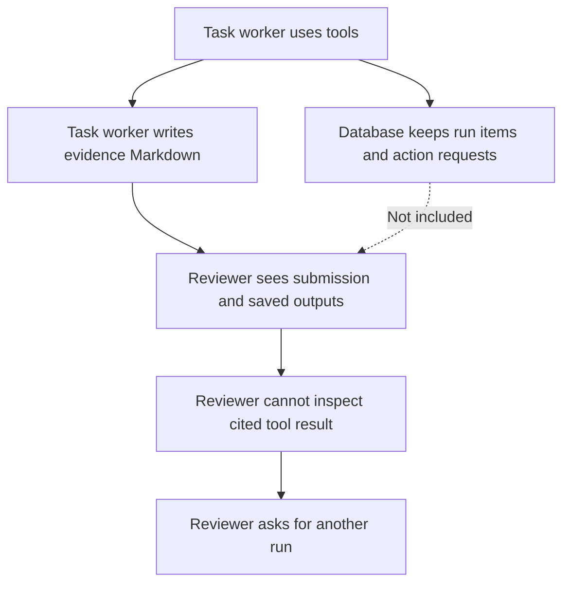
```mermaid
flowchart TD
    A["Task worker uses tools"]
    B["Database keeps run items and action requests"]
    C["Task worker writes evidence Markdown"]
    D["Reviewer sees submission and saved outputs"]
    E["Reviewer cannot inspect cited tool result"]
    F["Reviewer asks for another run"]

    A --> B
    A --> C --> D --> E --> F
    B -.->|Not included| D
```

### Proposed mechanism

Pass records that Noema already stores to the reviewer. Use the final run items,
the submitted result, and the saved-output references for the exact task run.

Filter these records through their current task, run, requirements, version,
and submission links. Use the existing context boundary to exclude secrets.
Preserve authorized private information and ordinary identifiers.

Do not create a summary model, evidence table, or transformed evidence copy. If
the exact records do not fit the reviewer input, stop and get a separate product
decision about input limits.

### After

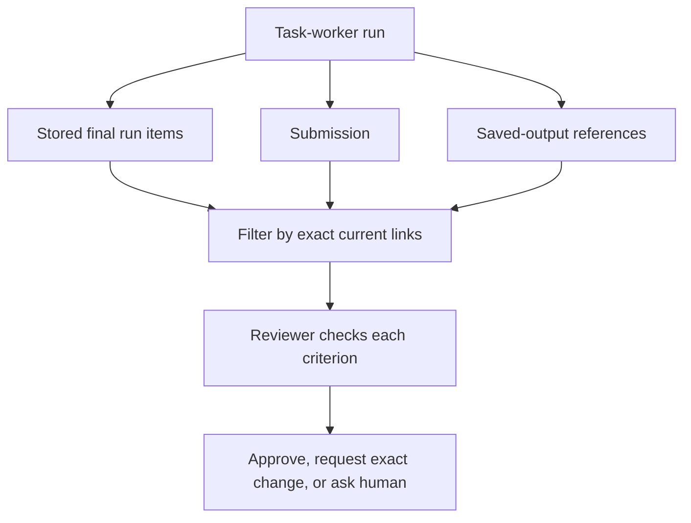
```mermaid
flowchart TD
    A["Task-worker run"]
    B["Stored final run items"]
    C["Submission"]
    D["Saved-output references"]
    E["Filter by exact current links"]
    F["Reviewer checks each criterion"]
    G["Approve, request exact change, or ask human"]

    A --> B --> E
    A --> C --> E
    A --> D --> E
    E --> F --> G
```

### Data change

None. Reuse the current records and their current links.

The model must not provide action IDs as trusted evidence. The database derives
them from task, run, requirements, and submission links.

### Tests

1. Include the exact final items and saved references from the current run.
2. Exclude records from another run, version, or requirements set.
3. Preserve authorized private and ordinary values, exclude credentials, and
   keep an uncertain result uncertain.

### Completion criteria

- The reviewer can inspect stored evidence for each claimed effect.
- Repeated review caused only by missing evidence packaging stops.
- Evidence cannot cross task, run, requirements, or task-version boundaries.

### Non-goals

- Do not let the reviewer call external research tools.
- Do not make raw chat history the source data.
- Do not add a review-evidence summary or a second evidence authority.

---

## Change 7: Load only the review that requested a correction

### Current problem

When a task review requests changes, Noema queues a correction run. The queue
code stores that review's ID in the run's current `triggering_review_id` field.

The context query first uses `triggering_review_id`. If that field is empty, the
query uses the task's `latest_review_id` instead. The latest review can be a
different review. It is not proof that the review requested this correction
run.

The current validation confirms that a loaded review belongs to the same task
and contract. It does not confirm that the loaded review requested this run.

The historical failure did not recur after the audit cutoff. The unsafe path
still exists.

Current code owners:

- Context loading in `crates/noema-store/src/work_run_context.rs`.
- Correction-run creation in `crates/noema-store/src/tasks/reviews.rs`.

Audit issue: `WORK-06`.

### Before

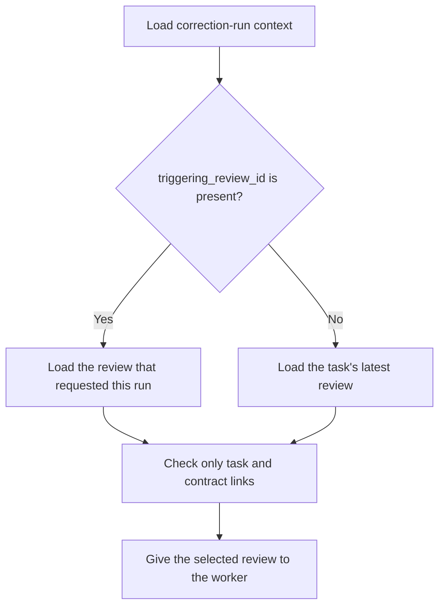
```mermaid
flowchart TD
    A["Load correction-run context"]
    B{"triggering_review_id is present?"}
    C["Load the review that requested this run"]
    D["Load the task's latest review"]
    E["Check only task and contract links"]
    F["Give the selected review to the worker"]

    A --> B
    B -->|Yes| C --> E
    B -->|No| D --> E
    E --> F
```

### Proposed mechanism

Use the existing run fields to identify correction runs. A first worker run has
`review_round = 1`. A correction run has `run_kind = executor` and
`review_round > 1`.

Use these rules:

1. Keep setting `triggering_review_id` when a review requests a correction.
2. A first worker run continues without prior review input.
3. A correction run must have `triggering_review_id`.
4. Load only the review named by that field.
5. Do not use `task.latest_review_id` as a replacement.
6. If the field is missing or the named review has the wrong task or contract,
   stop context loading and report one broken saved-state error.

### After

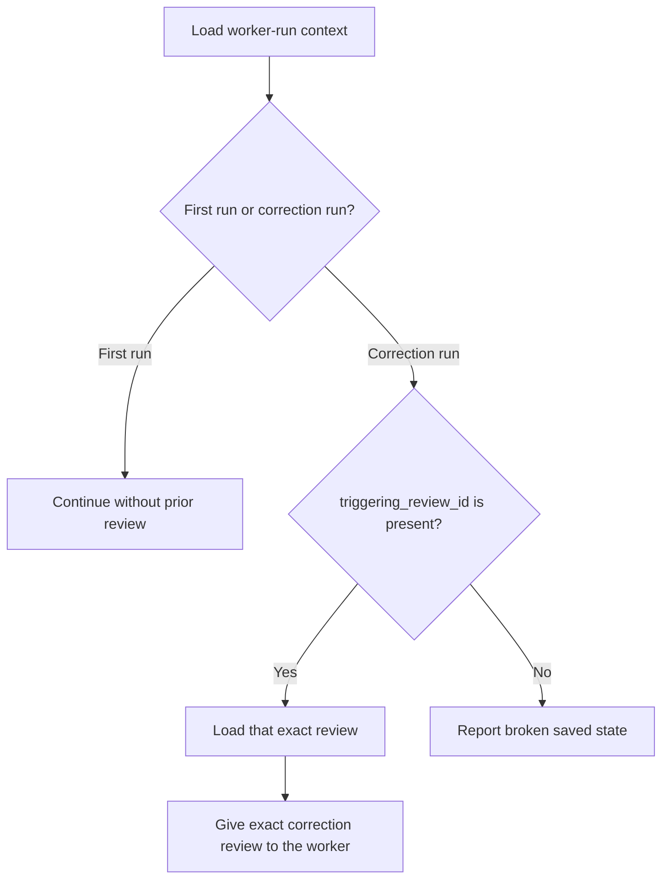
```mermaid
flowchart TD
    A["Load worker-run context"]
    B{"First run or correction run?"}
    C["Continue without prior review"]
    D{"triggering_review_id is present?"}
    E["Load that exact review"]
    F["Report broken saved state"]
    G["Give exact correction review to the worker"]

    A --> B
    B -->|First run| C
    B -->|Correction run| D
    D -->|Yes| E --> G
    D -->|No| F
```

### Data change

No schema change is necessary. `agent_runs` already stores
`triggering_review_id`, `run_kind`, and `review_round`.

### Tests

Add one table-driven regression test for this context query. It must prove that:

- A first worker run loads no prior review.
- A correction run loads its exact `triggering_review_id`.
- A correction run rejects a missing or unrelated review ID.
- A different `task.latest_review_id` does not change the correction input.

### Completion criteria

- Correction-run context never uses `task.latest_review_id`.
- Every correction run loads the review that requested it.
- A missing correction review produces one clear saved-state error.

### Non-goals

- Do not change how reviewer runs load their triggering submission.
- Do not change task-review content or decisions.
- Do not add a new review record or database field.

---

## Change 8: Complete the reviewed tool-definition replacement path

### Current problem

One active connection cannot run an operation required by the final live
validation case. A reviewed replacement definition contains the operation, but
the current connection has not adopted that definition.

The database also contains 26 built definitions and 45 rejected definitions
for two active connections.

This change must finish the active operation without deleting useful history.

Current code owners:

- Connector definitions and connections under `noema-capabilities`.

Audit issues: `CAL-02` and `STATE-08`.

### Before

```mermaid
flowchart TD
    A["Active tool connection"]
    B["Current reviewed definition"]
    C["Required operation is absent"]
    D["Replacement definition proposed"]
    E["Current replacement path must adopt it"]
    F["Final validation case remains waiting"]

    A --> B --> C --> F
    D --> E --> F
```

### Proposed mechanism

Adopt the reviewed replacement through the existing managed replacement path.
Keep the complete replacement history.

Use this order:

1. Review the exact operation, source schema, and response conversion.
2. Approve the replacement definition.
3. Replace the active definition through current replacement rules.
4. Preserve the connection credential and permission rules.
5. Run the waiting live case.
6. Confirm the effect, read it back, and prevent a repeated effect.

### After

```mermaid
flowchart TD
    A["Active tool connection"]
    B["One active reviewed definition"]
    C["Required operation"]
    D["Provider receipt"]
    E["Independent read-back confirms the effect"]
    F["Final validation case passes"]
    G["Older definitions remain in history"]

    A --> B --> C --> D --> E --> F
    B --> G
```

### Data change

The definition files remain the source files. Do not rewrite an existing
definition or migration. Create a new definition identity for each correction.

### Tests and validation

1. Build and adopt the replacement while the connection keeps its credentials
   and current rules.
2. Run the waiting live case. Perform one low-risk effect, read it back, and
   confirm that a repeated attempt does not create the effect twice.

### Completion criteria

- All 50 validation cases pass.
- The active connection resolves one current definition.

### Non-goals

- Do not delete rejected-definition history during startup.
- Do not build a general connector migration framework.
- Do not add logic for one service, object type, or operation name.
- Do not change the connector management interface.

---

## Change 9: Check every tool call before execution

### Current problem

Noema sends tool definitions to model services. A model service returns the
tool name and its input. Noema can then use the tool immediately, or it can use
the tool after review.

Each tool has source input rules. Noema also makes a provider copy of these
rules because each model-service interface accepts different schema features.
These are two different contracts:

- The source rules state which input Noema can execute.
- The provider copy helps the model service produce valid input.

The current `SchemaEnforcement::Strict` name makes two different statements
look like one statement:

- Noema asks the provider to use strict schema handling.
- The provider always returns input that follows the schema.

The first statement describes a request. The second statement is a runtime
guarantee. Noema can control the request, but it cannot prove the runtime
guarantee for a provider that can select another endpoint. A provider can
accept the `strict` field and then remove it, ignore it, or route the request
to an endpoint that does not support it.

The shared capability router also does not run a complete source-rule check
before it calls the selected invoker. Some source handlers check their input,
but that leaves different protection on different execution paths.

All 22 active tools from one current source also use schema forms that the
provider conversion cannot preserve. The task runner recorded 12,342 repeated
reduced-conversion errors after the audit cutoff. This log problem is real, but
it is not the main safety boundary.

In this change, a tool binding is the in-memory record that joins a visible
tool definition to its exact execution code and source rules. An invoker is
the small code object that calls that execution code.

Current code owners:

- `crates/noema-capabilities/src/router.rs` resolves a tool and calls its
  invoker.
- `crates/noema-capabilities/src/tool.rs` stores the source schema. It now
  checks only that the schema root is an object.
- `crates/noema-providers/src/response_support/tool_names.rs` converts source
  schemas for a provider request.
- `crates/noema-providers/src/adapters/openrouter.rs` asks OpenRouter for strict
  schemas for every model. The capability name incorrectly describes this
  request as a provider guarantee. The function ignores the selected model.
- Each tool source owns the meaning of the rules that it publishes.

Audit issues: `INT-02` and `STATE-06`.

### History and compatibility constraint

Repository history shows why Noema must not join provider conversion and
provider enforcement into one fact:

1. Commit `5af016db` added strict provider schemas. It defined `Strict` as a
   provider guarantee.
2. Commit `332c9e3f` added OpenRouter and gave every OpenRouter model this
   strict guarantee.
3. Commit `4f22643f` reduced the structured response schema for the OpenRouter
   Responses interface. Commit `19e34607` then added
   `provider.require_parameters: true` for that interface.
4. Commit `e459c5d8` removed one broad structured-output claim because the
   provider could use best-effort behavior. It kept the strict tool-input
   claim.
5. Commit `3270a622` moved OpenRouter to Chat Completions. This removed the
   `provider.require_parameters` guard with the old request type. It kept
   `strict: true` for tool schemas and kept the broad capability claim.
6. Commit `71270f3a` stopped repeated tool compilation. It reduced repeat work,
   but it did not prove provider enforcement or add a final input check.

Current OpenRouter documentation confirms the compatibility risk:

- [Provider routing](https://openrouter.ai/docs/guides/routing/provider-selection)
  says that OpenRouter can route one model across providers. The default value
  of `require_parameters` is false. A provider can ignore an unknown request
  parameter unless the request sets this value to true.
- The same routing document says that strict tool use on supported Claude
  models needs a specific beta header. Without the header, OpenRouter removes
  the `strict` field.
- [Auto Exacto](https://openrouter.ai/docs/guides/routing/auto-exacto) checks
  tool calls after providers return them. OpenRouter uses this result to rank
  provider quality. This check does not stop Noema from receiving invalid tool
  input. It also uses JSON Schema Draft 7 and does not enforce features from
  later schema versions.

The pinned MCP protocol has a different compatibility risk. Noema uses
`rmcp` 2.0.0, and its protocol tests use MCP `2025-06-18`. The official
[MCP tool specification](https://modelcontextprotocol.io/specification/2025-06-18/server/tools)
calls `inputSchema` a JSON Schema object, but it does not select a JSON Schema
version. [SEP-2106](https://modelcontextprotocol.io/seps) proposes JSON Schema
2020-12 for MCP tool schemas, but the proposal is still a draft. Noema must not
treat that draft as the current protocol contract.

This history gives Change 9 one important compatibility rule: do not turn off
`strict: true` only because Noema cannot trust it as a safety check. The field
can still improve output on a compatible endpoint. Keep the current provider
request behavior in the first implementation slice. Add the local check that
Noema controls.

The replacement must preserve provider-specific request behavior. It must not
assume that all providers, models, interfaces, and provider routes have the
same schema support.

### Before

```mermaid
flowchart TD
    A["Source input rules"]
    B["Convert rules for one provider request"]
    C{"Did conversion keep all rules?"}
    D["Full provider copy"]
    E["Reduced provider copy"]
    F["Assume strict provider enforcement"]
    G["Use best-effort provider output"]
    H["Model service returns tool input"]
    I["Call the selected invoker"]

    A --> B --> C
    C -->|Yes| D --> F --> H
    C -->|No| E --> G --> H
    H --> I
```

This design has two faults:

- A full copy does not prove that the provider enforces it.
- No shared final check protects every invoker.

### Proposed mechanism

Keep three facts separate.

#### Fact 1: Source input rules

The source input rules decide whether Noema can execute a tool call. Add one
small `ToolInputCheck` interface to `CapabilityBinding`. Each binding source
must supply this check when it builds a binding. This interface has three
current production users with different input contracts:

- Built-in tools must reuse the same typed input parser that the invoker uses.
- API adapters must reuse the compiled operation arguments. These arguments
  already contain the required fields, input types, and allowed values.
- MCP tools must compile a checker from the discovered MCP input schema. The
  pinned MCP protocol does not select one JSON Schema version. If the schema
  has a recognized `$schema` value, use the matching validator. If it has no
  `$schema` value, accept only a small set of schema rules that have the same
  meaning in the supported JSON Schema versions. Reject an unknown rule during
  catalog build. Do not ignore it during execution.

Do not use the provider copy for this check.

Run this check in `CapabilityRegistryRouter::dispatch_resolved`. Run it after
Noema resolves the exact binding and before `invoke_target`. This position
protects both existing routes:

- Immediate dispatch.
- Dispatch after model or human review.

If the input is invalid, return `CapabilityError::InvalidArguments`. Apply the
binding's current persistence policy to the safe failure. Do not call the
invoker.

Do not assume that every source uses one JSON Schema version. If a source
cannot check every rule that it publishes, do one of these actions before
release:

- Add the smallest source-owned check for the schema features that the source
  now publishes.
- Limit the published rules to the features that the source can check.

Do not claim complete source-rule enforcement for that source until one of
these actions is complete. First, inventory every active MCP schema and list
its `$schema` value and keywords. Do not disable a current tool to finish this
change. Stop the source slice and request a product decision if complete
validation would remove a current capability.

```mermaid
flowchart LR
    A["Built-in typed input parser"]
    B["Compiled API operation arguments"]
    C["MCP schema with a known version or safe common rules"]
    D["ToolInputCheck on the exact binding"]
    E["Capability router"]

    A --> D
    B --> D
    C --> D
    D --> E
```

#### Fact 2: Provider request mode and conversion result

The provider conversion result states only whether Noema kept the source rules
in the copy that it sent with one request:

- `Full`: The conversion did not remove or weaken a source rule.
- `Reduced`: The provider copy cannot express one or more source rules.

The current `lower_strict_schema` function already reports success or an error.
Use this result. Do not add a second conversion framework.

Rename `SchemaEnforcement` to `ProviderSchemaRequest`. Use values whose names
describe what Noema sends:

- `DoNotSend`: The interface cannot accept a tool schema.
- `Send`: Send a schema without the strict request field.
- `RequestStrictWhenPossible`: Make a full provider copy and send
  `strict: true` when the conversion succeeds. Send the current reduced copy
  with `strict: false` when the conversion fails.

These names do not claim that returned input is valid. They only select the
existing request construction. Keep this type request-scoped. Do not save it
on a connector or a tool definition.

Also rename `ProviderSchemaCapabilities` to
`ProviderSchemaRequestCapabilities`. Rename
`ProviderToolCapabilities.strict_schema` to
`request_strict_schema_when_possible`. Both current capability reports then
describe request construction. Neither report claims that provider output is
valid. Keep one derivation path between the two reports. Do not add a second
OpenRouter rule.

OpenRouter stays `RequestStrictWhenPossible` in this change. A schema that can
use the current full conversion continues to send `strict: true`. A schema that
cannot use it continues to send the reduced copy with `strict: false`. This
keeps the current wire behavior for named models and for `openrouter/auto`.

The strict conversion also changes how it represents optional fields. It makes
them required and permits a `null` value. The current MCP invoker removes some
optional `null` values immediately before the remote call. At that point, a
model or human review has already seen the provider-form input.

Move this representation change to the provider output boundary. Extend the
current tool-name map so that it also retains the source schema and the
conversion result for the request. When the provider returns a tool call:

1. Map the provider tool name back to the Noema tool name.
2. Change optional `null` fields from the strict provider form back to omitted
   fields in the source form. Apply this change at all object levels.
3. Do not repair any other invalid value.
4. Create `GenerateToolCall` with the source-form input.

This conversion must occur before policy, storage, model review, or human
review. Thus, an action request stores the exact source-form input that Noema
will check and execute. Remove the later MCP-only cleanup after all provider
paths produce source-form input.

The result belongs to the provider request. It is not a permanent property of
the tool or connector. A different provider, model, interface, or conversion
version can produce a different result.

A full result does not permit Noema to skip the final source-rule check.

#### Fact 3: Provider output is untrusted input

Do not add a provider-trust level in this change. No current execution decision
needs it. The shared final check applies to output from every provider. It also
applies when a provider accepted `strict: true`.

For OpenRouter, this rule covers all current routes:

- OpenRouter can select one of several provider endpoints.
- `require_parameters` is false unless the request sets it.
- OpenRouter can remove `strict` for a route that does not support it.
- OpenRouter measures schema failures after provider output returns.

These facts can help provider routing and output quality. They do not authorize
a Noema tool call.

Do not add `provider.require_parameters: true`, an Anthropic beta header, a
provider allow-list, or a route qualification system in Change 9. Each option
changes which live endpoints can serve a request. Test each option as a
separate provider-compatibility change.

#### Conversion diagnostics

Keep the current full-conversion fallback diagnostic. Change its text so that
it reports a request conversion failure, not a provider guarantee failure. Do
not add a database record, a schema hash, or a new diagnostic manager in this
change.

The 12,342 repeated messages remain a measured observability problem. Do not
hide them by turning off `strict`. After the final check is in place, measure
the count by provider, request mode, source, and conversion error. Use that
evidence for one later diagnostic change if the current compile-once behavior
does not give a sufficient bound.

### After

```mermaid
flowchart TD
    A["Source input rules"]
    B["Convert for the selected provider path"]
    C["Full or reduced provider copy"]
    D["Provider request mode"]
    E["Send provider request"]
    F["Provider returns untrusted input"]
    G["Change it back to source form"]
    H["Policy or exact action review"]
    I["Resolve the exact tool binding"]
    J{"Final source-rule check passes?"}
    K["Call the selected invoker"]
    L["Return invalid_arguments"]

    A --> B --> C --> E
    D --> E
    E --> F --> G --> H --> I --> J
    A --> G
    A --> J
    J -->|Yes| K
    J -->|No| L
```

The provider request and provider conversion can improve the returned input.
They do not prove that it is valid. The final source-rule check decides whether
execution can start.

### Why this mechanism works for every tool source

The shared rule is small: no invoker receives input that its exact source
binding rejects.

The rule does not require one service abstraction or one schema language. A
tool source keeps its current rules and current protocol. The capability router
only asks the resolved binding to check the input before invocation.

This split avoids three compatibility failures:

- Noema does not weaken a source contract to fit one provider dialect.
- Noema does not call a provider request setting a runtime guarantee.
- Noema does not turn off a useful provider request setting to repair a local
  safety boundary.

### Data change

No database schema change is required. Do not add the conversion result, the
provider request mode, a provider-trust level, or a diagnostic identity to a
saved connector definition.

### Implementation order

1. Add characterization tests for the current OpenRouter request. Record the
   exact tool definitions for a named model and for `openrouter/auto`.
2. Rename the current request selector and the two current capability fields.
   Use the names in Fact 2. Preserve the request JSON in the characterization
   tests.
3. Move the optional-`null` return conversion from the MCP invoker to the
   shared provider output boundary. Confirm that review receives source-form
   input.
4. Add `ToolInputCheck` to `CapabilityBinding`. Call it in
   `dispatch_resolved` before `invoke_target`.
5. Reuse the built-in typed parsers and compiled API operation arguments.
6. Inventory active MCP schemas. Support a declared schema version or the safe
   common rules. Compile and attach the MCP checker.
7. Run the source inventory and final dispatch tests. Release only when every
   active binding has a complete check.

Do not release a state in which some bindings have a check and other bindings
silently use an allow-all check.

### Tests

1. In one table-driven router test, send valid and invalid input through the
   immediate and reviewed dispatch routes. Confirm that invalid input returns
   `InvalidArguments` and that the invoker receives no call.
2. Test one full conversion and one reduced conversion. Confirm that both
   results still pass through the final source-rule check. For the full case,
   confirm that nested optional `null` fields return to omitted source fields
   before the action request is made.
3. Test the OpenRouter request path before and after the request-mode rename.
   Confirm that a named model and `openrouter/auto` keep the same request JSON.
   Include one full conversion that sends `strict: true` and one reduced
   conversion that sends `strict: false`.
4. Build the 22 currently affected schemas in one table-driven test. Confirm
   that each conversion result is explicit and that every returned call still
   reaches the final source-rule check. Do not assert that OpenRouter enforces
   the provider copy.
5. Test three MCP schemas: one with a supported `$schema` value, one without a
   `$schema` value that uses only safe common rules, and one with an unknown
   rule. Confirm that the unknown rule stops catalog publication and never
   becomes an allow-all check.

Use the current source-owned schema tests to prove the rules for each active
tool source. Do not repeat those rule tests at the router layer.

### Completion criteria

- No invoker receives input that fails its source-owned rules.
- The immediate and reviewed routes use the same final check.
- Policy and review receive source-form input, not strict provider-form input.
- A provider failure or false support claim cannot weaken the final check.
- A full provider conversion does not bypass the final check.
- Code and diagnostics describe `strict` as a request, not as an OpenRouter
  runtime guarantee.
- OpenRouter request JSON does not change in this change.
- The known 12,342-message path remains visible and has a named later
  measurement step. Change 9 does not hide it by weakening provider requests.
- Existing validation cases for every active tool source continue to pass.

### Non-goals

- Do not add a rule for one service, object type, or operation name.
- Do not force all tool sources to use one JSON Schema version.
- Do not treat draft MCP schema guidance as a released protocol rule.
- Do not combine provider protocols or remove provider-specific behavior.
- Do not change a meaningful input value while input returns to source form.
- Do not save provider conversion results in connector records.
- Do not build a general compatibility framework.
- Do not add diagnostic suppression without a remaining measured repeat.
- Do not turn off the current OpenRouter strict request.
- Do not add OpenRouter routing constraints or beta headers.
- Do not build OpenRouter route qualification in this change.
- Do not skip the final check because a provider accepted a strict request.

---

## 6. Cross-change acceptance scenario

Use one scenario to prove that the repaired current execution paths work
together.

The human starts one background task that uses all three current execution
routes. The task first makes an immediate call. It then makes a call that the
model reviewer can clear. Its final call requires one-time human approval.

```mermaid
sequenceDiagram
    participant Human
    participant Task
    participant Policy as Connection and tool policy
    participant ActionReview as Action reviewer
    participant InputCheck as Final input check
    participant SourceA as Tool source A
    participant SourceB as Tool source B
    participant SourceC as Tool source C
    participant TaskReview as Task reviewer

    Human->>Task: Request one result across three tool sources
    Task->>Policy: Propose bounded read for source A
    Policy->>InputCheck: Dispatch immediately
    InputCheck->>SourceA: Send valid input
    SourceA-->>Task: Return confirmed result
    Task->>Policy: Propose reviewed call for source B
    Policy->>ActionReview: Store and review exact action
    ActionReview->>InputCheck: Dispatch reviewed arguments
    InputCheck->>SourceB: Send valid input
    SourceB-->>Task: Return confirmed result
    Task->>Policy: Propose ambiguous call for source C
    Policy->>ActionReview: Store exact action
    ActionReview-->>Human: Request one-time approval
    Human->>ActionReview: Approve the exact action revision
    ActionReview->>InputCheck: Dispatch reviewed arguments
    InputCheck->>SourceC: Send valid input
    SourceC-->>Task: Return final result
    Task->>TaskReview: Submit result with stored evidence
    TaskReview-->>Task: Approve criteria
    Task-->>Human: Deliver verified result
```

Run these interruption variants:

1. Restart before the one-time approval.
2. Restart after approval but before execution.
3. Restart after success but before the task follow-up run.
4. Cancel the task before approval.
5. Change the reviewed arguments after approval.
6. Change the connection policy or tool schema before execution.
7. Make one connector result uncertain.

For each variant, Noema must preserve completed effects. It must not repeat an
uncertain effect.

## 7. Validation plan

### 7.1 Implementation budgets

These are limits, not targets. Production and test values are net changed lines.

| Change | Production budget | Test budget | Maximum new tests |
| --- | ---: | ---: | ---: |
| 0 | 0 | 0 | 0 |
| 1 | 100 to 250 | 30 to 100 | 3 |
| 2 | 10 to 60 | 20 to 60 | 1 |
| 3 | 20 to 100 | 0 to 60 | 2 |
| 4 | 25 to 100 | 30 to 100 | 2 |
| 5 | 25 to 120 | 30 to 120 | 3 |
| 6 | 25 to 100 | 30 to 120 | 3 |
| 7 | 5 to 30 | 20 to 60 | 1 |
| 8 | 0 to 80 | 20 to 80 | 2 |
| 9 | 100 to 300 | 80 to 280 | 5 |

Before each implementation slice, set the exact base revision. Measure the
patch with `bun run scripts/report-rust-size.ts --base <ref>` and the matching
budget flags.

Stop the slice when it exceeds its production or test estimate by 50 percent
or 500 lines, whichever is smaller. Reduce scope before more code is added.
More than ten new Rust tests needs a written risk matrix and a new scope review.

### 7.2 Focused unit tests

Each change lists its unique tests. Keep each test with the code that owns the
behavior.

Do not repeat the same transition across database, agent runner, API, and
client tests.

### 7.3 Repository validation

Run these commands before each change commit:

```text
cargo fmt --all --check
cargo check-workspace
cargo gate-lint
cargo gate-test
```

Run focused commands through `cargo validate` during each change.

### 7.4 Live validation

After Change 9, run the complete 50-case validation list once. Build every
active tool schema, and send invalid input through both dispatch routes. No
invalid input can reach an invoker.

Do not use live high-risk writes for this proposal.

## 8. Release boundaries

| Release | Included changes | User-visible result | Undo point |
| --- | --- | --- | --- |
| Plain-language contract | 0 | Changed code uses one direct vocabulary | Revert the terms document |
| Action follow-up | 1 and 2 | Approvals and background tasks resume reliably | Disable new source use while preserving migration data |
| Claim diagnosis | 3 | Worker-claim expiry has measured evidence and a proved fix | Remove the added diagnostics and cause-specific fix |
| Stored status | 4 and 5 | Stored status matches completed work | Revert final-state update code |
| Review evidence | 6 and 7 | Review uses exact stored execution records | Remove the reviewer-input query extension |
| Definition adoption | 8 | The final waiting validation case passes | Restore the prior active definition |
| Final input check | 9 | Review and execution use checked source-form input | Revert the source-form conversion, final check, and provider-claim corrections together |

## 9. Later work

The current audit includes other problems. They are real, but they do not belong
in the same implementation unit.

Deferred work includes:

- Automatic memory-source and footnote-manifest failures.
- Chat reply delays and model-service HTTP failures.
- Model input that becomes too large before Noema can reduce history.
- Deeper content retrieval beyond the current limited view.
- The infeasible 07:00 news recurrence requirements.
- Repository-wide language cleanup. This includes candidate package, route,
  API, SQL, web, and iOS renames. Each candidate needs reader-path evidence.
- General grants or reusable rules. Reconsider them only after a current
  production task proves that human instructions, task-owned authority, and
  one-time approval are insufficient.
- One universal outgoing-data runtime. Keep current enforcement with its
  existing owners until a demonstrated gap requires a shared boundary.
- General automatic result maintenance.
- New connector types.
- New problem-specific base types.

Create a separate limited proposal for each selected item. Do not expand this
roadmap during implementation.

## 10. Final system after this proposal

```mermaid
flowchart TD
    H["Human request or task start"]
    T["Task requirements and current-run check"]
    R["Claimed task run"]
    P["Connection policy and tool risk facts"]
    X{"Current execution decision"}
    I["Immediate dispatch"]
    A["Exact reviewed action request"]
    M["Model review"]
    G["One-time approval when required"]
    S["Final source-rule check"]
    C["Current tool source"]
    O["Stored final outcome"]
    E["Stored final run items and saved references"]
    V["Requirements review"]
    D["Confirmed delivery or recovery pause"]

    H --> T --> R --> P --> X
    X -->|Execute immediately| I --> S
    X -->|Review| A
    A -->|Model route| M
    A -->|Human route| G
    M -->|Cleared| S
    M -->|Ask human| G
    G --> S
    S -->|Valid input| C
    S -->|Invalid input| D
    C --> O --> E --> V --> D
    G -.->|Human decision when required| H
    O -.->|Uncertain result| D
```

The result preserves `CapabilityExecutionDecision`, immediate dispatch, and the
reviewed-action path. Tasks and connectors keep their current ownership. The
roadmap repairs these paths without adding another authority.
