# Noema Plain-Code and Reliability Roadmap

- **Status:** Proposal
- **Mode:** Plan only
- **Date:** 2026-08-08
- **Primary evidence:** [Current-build UX audit](../../audits/2026-08-08-current-build-ux-survivors.md)
- **Live validation:** [Personal agent 50-case ledger](../../validation/personal-agent-50-case-ledger.md)
- **Safety rules:** [Current action checks and approvals](../../harness/action-governance.md)

## 1. Purpose

Noema already has a task system, an action gateway, a web browser, MCP support,
and native API adapters. This proposal does not replace those systems.

This proposal first gives the existing systems clear names. It then repairs
their current failure paths. The final change adds reusable permissions.

The proposal has eleven change packages:

0. Replace Noema platform jargon with plain technical language.
1. Store the exact chat approval source.
2. Recover tasks from the current task version.
3. Find and fix the worker-claim expiry cause.
4. Make conversation tool-call state correct.
5. Make task run items and debug spans final.
6. Give the task reviewer stored execution evidence.
7. Use the exact source review without a fallback.
8. Finish the current Calendar and connector-definition path.
9. Make schema enforcement consistent for every tool source.
10. Add reusable permissions for every action-request source.

## 2. Current product baseline

The current system is not an early prototype. Most common personal-agent work
already completes.

The current evidence shows:

- 49 of 50 live validation cases pass.
- The final case waits for a true all-day Calendar operation.
- Nine recent action requests succeeded.
- Calendar writes return provider receipts and support read-back.
- Gmail, Calendar, and Notion support cross-system tasks.
- Governed actions preserve exact payloads and one-shot approvals.

The current defects occur near interruption, recovery, evidence, and stored
status. These defects limit safe autonomy more than missing connector breadth.

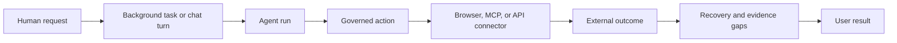

## 3. Terms

### 3.1 Chat turn

A chat turn is a normal chat interaction. The user waits for the reply inside
the conversation.

### 3.2 Background task

A background task can continue after the user closes the browser or Noema
restarts.

### 3.3 Action request

An action request is one exact proposed external effect. It stores the tool,
arguments, rule result, approval, execution state, and final output.

### 3.4 Current-run check

A current-run check identifies one run, worker claim, task version, and set of
task requirements. It stops old work from changing a newer task version.

### 3.5 Worker claim

A worker claim gives one worker temporary control of one task run. The worker
renews the claim while the run remains active.

### 3.6 Stored state

Stored state is the source data in SQLite. A client can make a view from this
data, but the view cannot correct false stored data.

### 3.7 Restart recovery

Restart recovery reads stored task records after an interruption. It selects
the next valid step, such as queue, complete, recover, or remain idle.

### 3.8 Source schema

A source schema is the complete input rule supplied by a tool. Provider schema
conversion can make a smaller copy for a model service.

## 4. Current end-to-end mechanism

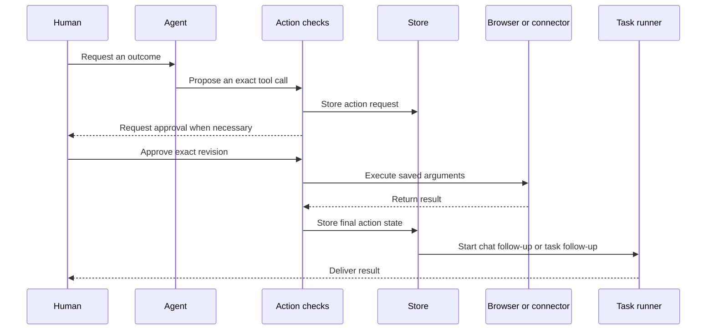

The design is correct. The current problems exist in specific transitions.

## 5. Delivery order

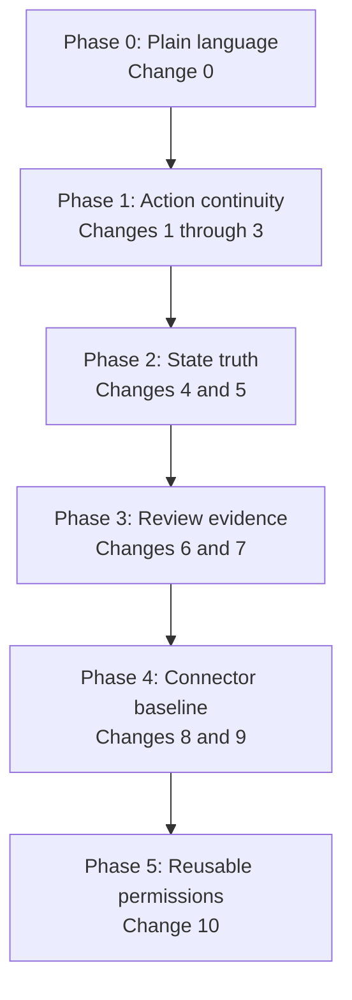

Each phase has an independent release boundary. Do not start reliability work
before Change 0 meets its completion criteria.

---

## Change 0: Replace Noema platform jargon with plain technical language

### Current problem

Noema uses several private platform terms for mechanisms that already have
simple names. These terms appear in the product, code, APIs, logs, and docs.

A new contributor must first learn Noema vocabulary. Only then can the
contributor understand the mechanism.

A current scoped scan found:

- 726 exact uses of the product word `Work`.
- 396 uses of the identifier form `governed_action`.
- 85 uses of the type `WorkRunFence`.
- 63 uses of the field `triggering_review_id`.
- 19 uses of `strict_schema` or `lower_strict_schema`.
- 331 uses of the word `canonical`.

These counts exclude generated files and third-party license text. Some uses
are valid technical terms. Most listed product terms are not necessary.

### What STE compliance means here

Apply ASD-STE100 directly to product text, current docs, code comments, prompts,
logs, and human-readable errors.

Code identifiers do not contain sentences. Apply the same approved vocabulary
and one-meaning rule to identifiers.

Keep a necessary technical noun only when no approved common word preserves
the meaning. Define that noun once in the terms source.

Do not claim formal ASD-STE100 certification from an automated word search. The
reader-path review must also confirm that the code explains its behavior.

Primary code areas:

- Task domain code under `crates/noema-tasks`.
- Task storage under `crates/noema-store/src/work_*`.
- Task runtime code under `crates/noema-runtime/src/daemon/task_*`.
- [`action_gateway.rs`](../../../crates/noema-runtime/src/daemon/runtime/action_gateway.rs)
- [`governed_actions.rs`](../../../crates/noema-store/src/governed_actions.rs)
- [`strict_schema.rs`](../../../crates/noema-providers/src/response_support/strict_schema.rs)
- GraphQL task and action-request fields under `crates/noema-api`.
- Web task code under `apps/web/src/components/work`.
- iOS task and action-request operations under `apps/ios/Noema`.

### Before

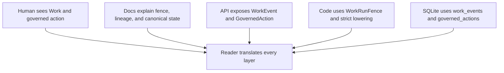

The terms move across system boundaries. They also appear in generated clients
and error messages. A documentation-only rename will not solve the problem.

### Required term changes

Use this initial language contract:

| Current term | Plain term | Example code name | Direct meaning |
| --- | --- | --- | --- |
| `Work` | Tasks | `TaskCommandService`, `TaskEvent` | The task product and its stored activity |
| Work task | Background task | `Task` | A task that can continue without an open chat |
| Canonical state | Stored state | `StoredTaskState` when a type needs the distinction | The source data in SQLite |
| Task fence | Current-run check | `TaskRunCheck` | The values that prove a write belongs to the current run |
| Task generation | Task version | `task_version` | The task version that a run can change |
| Run lease | Worker claim | `TaskRunClaim` | One worker's temporary control of a run |
| Heartbeat | Claim renewal | `renew_task_run_claim` | A worker extends its current claim |
| Governed action | Action request | `ActionRequest`, `action_requests` | One saved tool action that Noema must check |
| Grant | Reusable permission | `ActionPermission` | A human's saved limits for later action requests |
| Review lineage | Source review | `source_review_id` | The review that requested the next run |
| Triggering submission | Source submission | `source_submission_id` | The submission that caused a review run |
| Reconciliation | Restart recovery | `TaskRecoveryPlan` | Noema decides the next step after an interruption |
| Continuation | Follow-up run | `start_action_follow_up` | A new run continues after a saved result |
| Task contract | Task requirements | `TaskRequirements` | The result, limits, and evidence that a task must satisfy |
| Task gate | Task pause | `TaskPause` | A stored reason that stops the task |
| Schema lowering | Provider schema conversion | `convert_provider_schema` | Noema adapts a tool schema for a model service |
| Strict lowering | Exact schema conversion | `convert_schema_exactly` | The converted schema accepts the same inputs |
| Canonical runtime validation | Final source-schema check | `validate_tool_input` | Noema checks tool input before invocation |
| Projection | View | `TaskSummaryView` | Data prepared for a reader |
| Egress | Outgoing data | `OutgoingDataRules` | Information that Noema sends outside its boundary |
| Idempotency | Repeat protection | `repeat_key` where Noema owns the term | Protection against a repeated external effect |

Use the exact external term when Noema implements an external protocol. For
example, keep an HTTP `Idempotency-Key` header with that protocol name.

### Context-dependent words

Do not make a global text replacement for `canonical`, `strict`, or `work`.
Select the word that describes the specific mechanism.

| Current phrase | Replacement |
| --- | --- |
| Canonical database state | Stored state or source data |
| Canonical tool schema | Source schema |
| Canonical arguments | Saved exact arguments |
| Canonical file | Source file |
| Canonical JSON encoding | Normalized JSON encoding |
| Strict provider schema | Exact provider schema |
| Strict JSON parser | Keep this term when the parser follows a named strict mode |
| Workflow | Keep this word because it has a different established meaning |
| Ordinary English work | Keep this word when it is not the Tasks product name |

### Wider code-language audit

The first table is not the complete scope. It is the minimum confirmed rename
set.

The same scan found many other indirect terms:

- 1,394 uses of `payload`.
- 772 uses of `snapshot`.
- 594 uses of `gate`.
- 574 uses of `authority`.
- 573 uses of `durable`.
- 454 uses of `fence`.
- 434 uses of `adapter`.
- 387 uses of idempotency terms.
- 342 uses of correlation terms.
- 310 uses of `daemon`.
- 305 uses of `principal`.
- 279 uses of `projection`.

These words are not automatically wrong. Each use must answer a simple
question: Is this the most direct name for the value or behavior?

Use these replacement rules during the audit:

| Indirect term | Use a direct term based on the actual meaning |
| --- | --- |
| Authority | Permission, owner, source data, or current-version check |
| Durable | Stored, or `survives restart` in explanatory text |
| Semantic | Name the exact rule or command |
| Invariant | Stored-state rule or required condition |
| Hydrate | Load |
| Terminal | Final, completed, failed, or cancelled |
| Provenance | Source |
| Principal | Caller, human, agent, or signed-in identity |
| Actor | `performed_by` or the specific human, agent, or system |
| Causation ID | Source event ID |
| Correlation ID | Operation group ID, when that is its exact purpose |
| Snapshot | Saved copy or current view |
| Ledger | Event history |
| Admission | Final permission check |
| Dispatch | Start, assign, send, or queue |
| Payload | Arguments, content, result, event data, or request data |
| Envelope | Name the contained request and context directly |
| Capability | Tool, operation, or tool connection |
| Adapter | Connector for tools, or client for an external service |
| Daemon | Server, runner, worker, or background service |

Do not replace one broad word with another broad word. For example, do not
replace every use of `authority` with `control`.

### Package and directory names

A new reader first sees package names and directories. These names must show
the product structure before the reader opens a file.

The initial package rename set is:

| Current name | Proposed name | Reason |
| --- | --- | --- |
| `noema-capabilities` | `noema-tools` | The package defines tools, tool rules, and bound tool calls |
| `CapabilityBinding` | `BoundTool` | The value is one tool with the information required to invoke it |
| `noema-runtime` | `noema-agent-runner` | The package runs chat and background agents |
| `daemon` module | `agent_service` | The module owns chat runs and background-task workers |
| `noema-store` | `noema-database` | The package is Noema's SQLite data source |
| `NoemaStore` | `NoemaDatabase` | The type opens and changes SQLite data |
| `noema-host` | `noema-app` | The package owns startup, onboarding, service assembly, and shutdown |
| `NoemaHost` | `NoemaApp` | The type is the assembled running application |
| `noema-artifacts` | `noema-saved-outputs` | The package owns versioned outputs saved by humans and agents |
| `ArtifactRecord` | `SavedOutputRecord` | The value describes one saved output |
| `adapters` for user tools | `connectors` | Users connect external services and tools |
| Provider `adapter` modules | `client` modules | These modules call model or search services |
| `docs/harness` | `docs/safety` | The directory defines safety and action-check rules |
| `apps/web/src/components/work` | `apps/web/src/components/tasks` | The directory implements the Tasks product |

Before each package rename, list its current responsibilities and consumers.
Do not use a rename to hide mixed ownership.

If a package has two unrelated responsibilities, stop and report that fact.
Do not split the package during this rename without a separate product decision.

### Code readability rules

The completed source must follow these rules:

1. One mechanism has one noun across Rust, GraphQL, TypeScript, Swift, SQL, and docs.
2. A type name states what data the type contains.
3. A function name states the action and its result.
4. A Boolean name reads as a true-or-false statement.
5. A state name describes an observable state.
6. An error states what failed, why it failed, and what remains unchanged.
7. A log identifies the operation, object, result, and safe reason.
8. A module name matches the product or mechanism that it owns.
9. A comment explains a required rule or a non-obvious reason.
10. A comment must not translate a confusing identifier into plain language.
11. An acronym appears only when an external protocol owns it.
12. The first module comment expands each required external acronym.
13. Generic words such as `manager`, `handler`, `helper`, and `service` need a specific owned action.
14. New aliases cannot preserve a replaced internal name.
15. Generated code must come from a source schema that uses the approved terms.

### Reader-path test

The rename is not complete when a search count reaches zero. A reader must be
able to follow real behavior without translating Noema vocabulary.

Use five reader paths:

1. A chat request creates a background task.
2. A worker claims a task run and saves progress.
3. An action request pauses for human approval and continues.
4. A connector tool converts and checks its input schema.
5. A restart recovers an interrupted task.

For each path, create one small diagram that names the actual modules, types,
functions, database tables, and API fields after the rename.

A reviewer with basic Rust and TypeScript knowledge must describe each path
without a private glossary. The terms document can define external protocols
and necessary security concepts only.

### Proposed mechanism

Create one terms source at `docs/development/terms.md`. It must contain
the approved term, its definition, and prohibited old forms.

Apply the rename through seven buildable units.

#### Unit 0A: Terms source and visible text

1. Add the terms document.
2. Link it from `AGENTS.md` and the development docs.
3. Rename product labels, help text, prompts, logs, and current docs.
4. Rename the web route from `/work` to `/tasks`.
5. Do not retain a pre-version-one route alias without a named client need.

#### Unit 0B: Package and module names

1. Map every package to its responsibilities and current consumers.
2. Apply the confirmed package and top-level module renames.
3. Update Cargo package names, imports, scripts, docs, and build files together.
4. Keep package ownership and behavior unchanged.
5. Do not add forwarding packages or module aliases.

#### Unit 0C: Schema-conversion terms

1. Rename the shared provider conversion functions and fields.
2. Rename diagnostics to use `source schema` and `provider schema`.
3. Preserve all existing schema behavior.
4. Run the active-tool schema regression set.

#### Unit 0D: Action-request terms

1. Rename Rust modules, types, functions, and errors.
2. Rename GraphQL action-request types, fields, and operations.
3. Rename web and iOS action-request models.
4. Rename current SQLite tables and indexes through a migration.
5. Preserve the exact action state machine and approval rules.

#### Unit 0E: Task terms

1. Rename `Work` types, modules, functions, errors, and events to `Task`.
2. Rename `WorkRunFence` to `TaskRunCheck`.
3. Rename lease fields and functions to worker-claim terms.
4. Rename review source and task recovery identifiers.
5. Rename GraphQL task types, queries, mutations, and subscriptions.
6. Rename web and iOS task operations and generated types.
7. Rename current SQLite task activity tables and indexes through a migration.

#### Unit 0F: General source-language review

1. Review types, functions, fields, states, errors, logs, and module comments.
2. Replace broad terms with names that state their exact purpose.
3. Remove comments that only translate an indirect identifier.
4. Add short rule comments only where the reason is not visible in code.
5. Complete the five reader-path diagrams and review.

#### Unit 0G: Prevention and cleanup

1. Add one repository language check for prohibited product terms.
2. Exclude immutable historical migrations and third-party source text.
3. Do not exclude active code, current docs, generated clients, logs, or prompts.
4. Rename developer commands that still use the replaced terms.
5. Remove temporary aliases before the unit completes.
6. Run the complete validation suite and live 50-case ledger.

### Build sequence

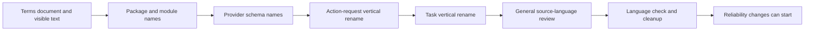

Each unit must compile before the next unit starts. A unit can contain several
commits, but it must not leave two active names for one mechanism.

### After

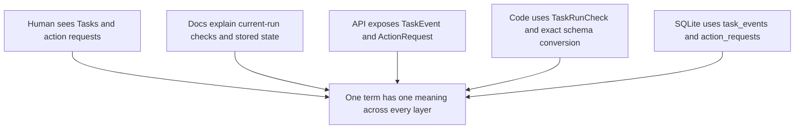

### Database changes

Append forward-only migrations. Never edit old migration text, even when that
text contains a prohibited term.

Rename active task and action-request tables, indexes, and columns. Update
current event names and error codes when those values reach users or clients.

Test both an existing database upgrade and a new database. Both paths must
produce the same current schema and data.

Do not change stable object identity only to replace a word inside an opaque
ID. Rename the ID format only when the word appears in a supported interface.

### API and generated-client changes

This is a coordinated breaking rename. Noema is before version one, so the
proposal does not add parallel old and new GraphQL fields.

Regenerate the web client from the renamed schema. Regenerate the iOS Apollo
client from its updated operations.

The current iOS generation step requires macOS and Apple JavaScriptCore. Do not
ship the GraphQL rename until that environment regenerates and validates iOS.

Do not edit generated files by hand. Do not leave old GraphQL aliases as a
substitute for blocked generation.

### Tests and validation

1. Confirm that every existing task transition still produces the same result.
2. Confirm that every action-request transition keeps the same approval result.
3. Upgrade an existing database through each rename migration.
4. Build a new database and compare the final schema.
5. Regenerate and build the web GraphQL client.
6. Regenerate and build the iOS GraphQL client on macOS.
7. Confirm that current logs and errors use the approved terms.
8. Confirm that prohibited product names have zero active matches.
9. Run the complete 50-case ledger without behavior changes.

This change is a rename. Production behavior must not change. Production code
size should remain neutral or decrease, except for migration statements.

### Completion criteria

- Product labels, current docs, prompts, and logs use the approved terms.
- Package, directory, and module names show their direct responsibilities.
- Active Rust, TypeScript, Swift, GraphQL, and SQL use the approved terms.
- Web and iOS clients compile from the renamed GraphQL schema.
- Existing database upgrades and new databases converge.
- No compatibility wrapper or duplicate API remains.
- The language check passes with only documented immutable exclusions.
- All five reader paths pass a novice code review.
- The complete validation ledger has the same results as before the rename.

### Stop conditions

- Stop when a proposed name changes behavior or removes a necessary distinction.
- Stop the API unit when iOS generation is unavailable.
- Stop when a migration cannot preserve existing task or action-request data.
- Stop when one term needs two meanings inside the same subsystem.

### Non-goals

- Do not redesign Tasks, action checks, recovery, or schema enforcement.
- Do not add a new domain model during the rename.
- Do not rename terms owned by an external protocol.
- Do not rewrite immutable migration history.
- Do not use aliases to keep both vocabularies active.

### Names used by later changes

Changes 1 through 10 occur after Change 0. They use the expected plain names,
not the current file and identifier names.

Change 0 must update this roadmap when a confirmed rename differs from an
expected name. Current audit labels can remain because they identify fixed
historical findings.

---

## Change 1: Store the exact chat approval source

### Current problem

The action-request record stores the conversation ID and chat-turn ID. It does
not store the exact approval item that contains the original model tool-call ID.

After approval, `publish_foreground_action_outcome` loads visible conversation
items. It searches those items for an approval request with the action ID.

The search failed 148 times in the current audit. The agent runner logged a
missing action source and stopped.

The external action can finish before this failure. The user can then miss the
result and the agent follow-up.

How the renamed code is organized:

- Agent follow-up code under `noema-agent-runner`.
- Conversation-item code under `noema-agent-runner`.
- Action-request database code under `noema-database`.
- Database migrations under `noema-database`.

Audit issues: `WORK-16`, `WORK-10`, and `INT-08`.

### Before

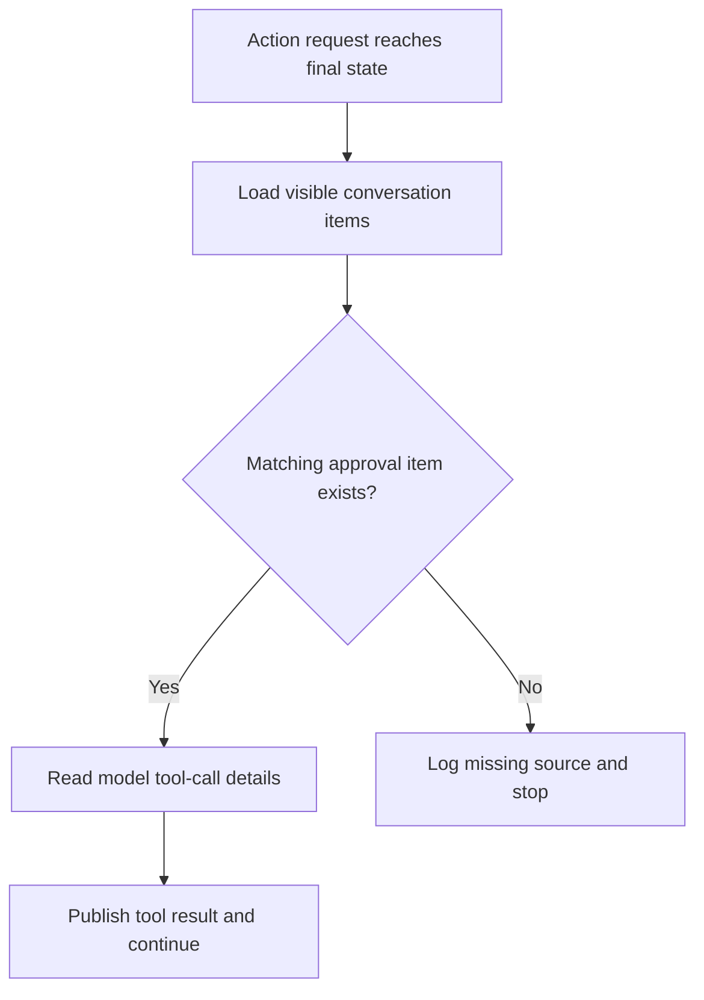

### Proposed mechanism

Store an exact source reference when Noema saves the approval item. The
reference must include the item ID and the model tool-call ID.

Use this order:

1. Create and assess the action request.
2. Save the approval-request conversation item.
3. Link that item to the exact action version.
4. Resolve the action after the human decision.
5. Load the linked source directly.
6. Append one repeat-safe result item.
7. Start one repeat-safe follow-up run.

The link operation must use an expected action version. It must reject an old
or different action.

### After

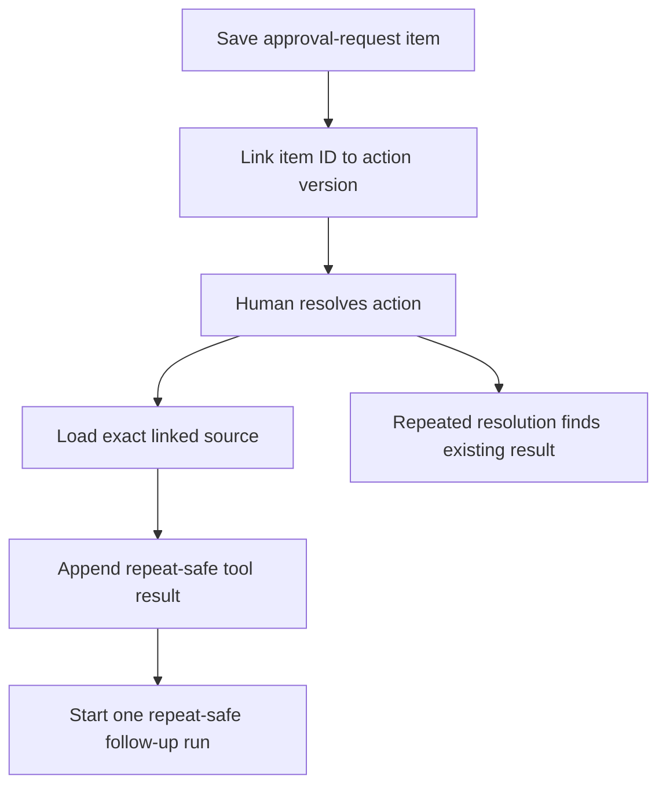

### Data change

Append one forward-only migration. Add one exact source reference to the
action-request record or to a one-to-one source table.

Do not copy the complete conversation item into the action row. Store only the
exact identifiers and model tool-call fields required for the follow-up run.

### Tests

1. Resolve an action after the approval item leaves the visible conversation view.
2. Resolve the same action two times and create one follow-up run.
3. Restart after action completion but before result publication.
4. Reject a source link for a different action version.
5. Preserve chat action output and ordinary model-service identifiers.

### Completion criteria

- No follow-up run depends on a visible-conversation search.
- Every final chat action has one final result item.
- Every eligible final result starts at most one follow-up run.
- Restart recovery produces the same result as live resolution.

### Non-goals

- Do not change background-task action resumption.
- Do not add a new conversation model.
- Do not retain full private content in duplicate rows.

---

## Change 2: Recover tasks from the current task version

### Current problem

Task restart recovery can select the latest resolved pause before it checks the
current task version. A later check rejects the old pause.

The current audit found five failures with this condition. Repeated
recovery then produced repeated errors.

Expected code owners after Change 0:

- Task recovery input under `noema-database`.
- Task recovery rules under `noema-database`.
- Current-run checks under `noema-database`.

Audit issues: `WORK-05` and `WORK-10`.

### Before

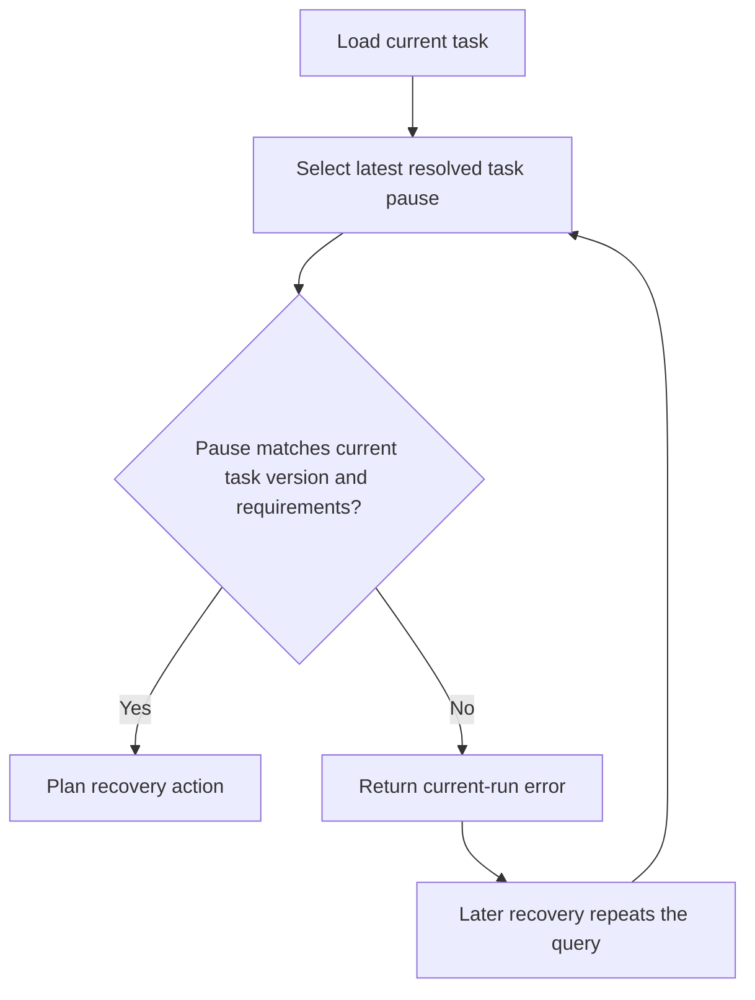

### Proposed mechanism

Apply the current task version inside the pause query. An old pause must not
become a candidate for the current recovery view.

Use this order:

1. Load the current task version and requirements.
2. Query only pauses for that task version and requirements.
3. Validate the selected row as defense in depth.
4. Plan one recovery step.
5. Record a recovery pause for a true stored-state fault.
6. Do not repeat the same fixed fault without a state change.

### After

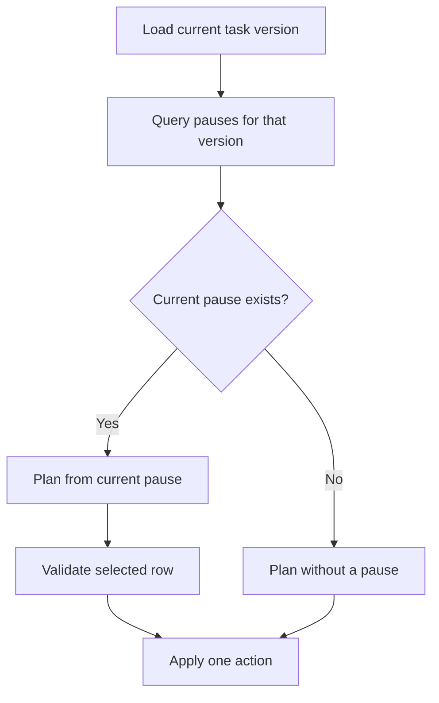

### Data change

No schema change should be necessary. Use the current task, pause, version, and
requirements columns.

### Tests

1. Ignore a resolved pause from an old task version.
2. Ignore a resolved pause from replaced task requirements.
3. Use the current resolved pause when its version matches.
4. Produce the same step after repeated recovery.
5. Stop repeated errors after one unchanged stored-state fault.

### Completion criteria

- Restart recovery never selects an old pause as current evidence.
- The five recorded version scenarios produce valid steps.
- An old pause never queues a run.
- An unchanged fixed fault produces one actionable record.

### Non-goals

- Do not weaken task version or requirements checks.
- Do not change the task state machine.
- Do not delete old pause history.

---

## Change 3: Find and fix the worker-claim expiry cause

### Current problem

A worker gets a 120-second claim. The task runner renews that claim every 30
seconds.

The current audit found one valid task-worker run whose claim expired. The
current evidence does not identify the cause.

Expected code owners after Change 0:

- Task-worker supervision under `noema-agent-runner`.
- Worker-claim database code under `noema-database`.

Audit issues: `WORK-15` and `INT-06`.

### Before

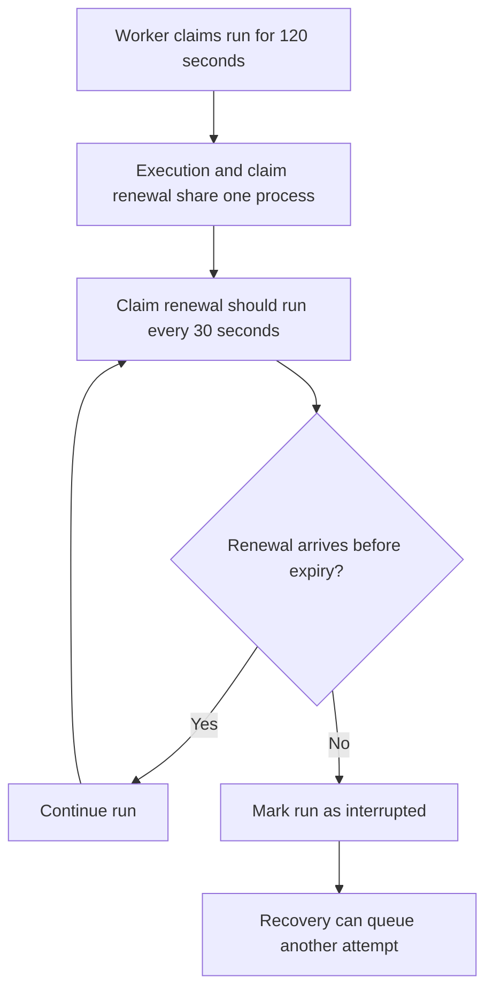

### Proposed mechanism

First add limited timing evidence. Do not increase the claim before the evidence
identifies the delay.

Record these ordinary diagnostics:

- Planned claim-renewal time.
- Actual claim-renewal start time.
- SQLite renewal duration.
- Time remaining before claim expiry.
- Agent-runner shutdown or cancellation state.
- Model-service call or tool phase at the delay.

Then fix the demonstrated cause. Possible fixes can include a blocking-call
boundary, a database-contention fix, or a supervisor scheduling fix.

### After

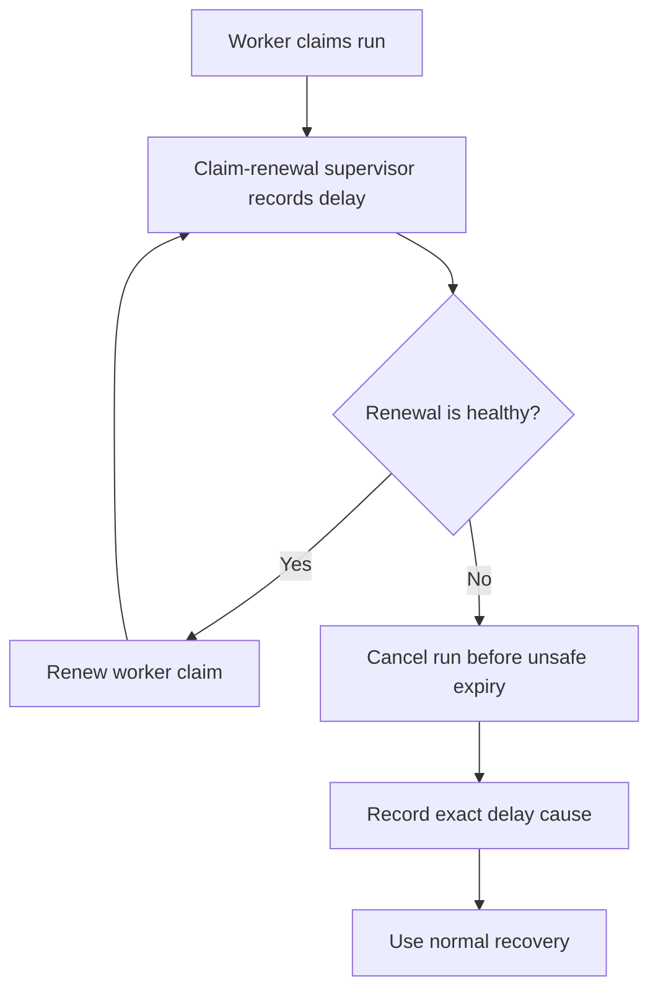

### Data change

Prefer the current debug-span or system-error record. Do not add claim timing
columns unless the current diagnostic records cannot preserve the evidence.

### Tests

1. Keep a run active through a long model-service call.
2. Delay one renewal without crossing the claim-expiry time.
3. Cross the boundary and interrupt the run once.
4. Reject renewal after task cancellation.
5. Reject renewal after a task version change.

### Completion criteria

- The recorded expiry has a reproduced cause or a disproved current path.
- A healthy long run renews its worker claim.
- An old worker cannot renew a claim.
- Recovery never overlaps two active workers for one run.

### Stop condition

Stop this change if no current path can reproduce the failure. Retain the new
diagnostic evidence and do not change claim timing without proof.

---

## Change 4: Make conversation tool-call state correct

### Current problem

The agent runner stores a tool-call item with `running` status. It later stores
a separate final tool-result item.

The original tool-call item can remain `running`. The web and iOS clients group
the call with its result and show a completed view.

The audit found 429 conversation tool calls with results and `running` status.
The stored state is false even when the screen looks correct.

Expected code owners after Change 0:

- Tool-call state under `noema-agent-runner`.
- Action-request conversation items under `noema-agent-runner`.
- Conversation-item updates under `noema-database`.

Audit issue: `STATE-03`.

### Before

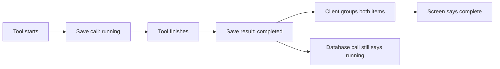

### Proposed mechanism

Use the existing model tool-call ID to finish the original tool-call item.
The final result and call update must use one database transaction where
possible.

Map final results as follows:

| Result | Tool-call status |
| --- | --- |
| Successful result | `completed` |
| Tool failure | `failed` |
| Human decline | `cancelled` or the current skipped representation |
| Agent-runner interruption | `interrupted` |
| Unknown external result | `failed` with action-request uncertainty detail |

Do not put external uncertainty into a new conversation status. The action
request remains the detailed uncertainty record.

### After

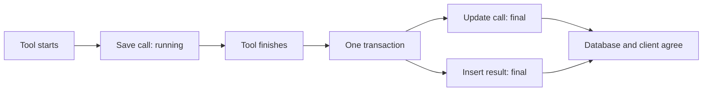

### Data change

No schema change should be necessary. Add or reuse a conditional
conversation-item update that identifies the exact call item.

### Tests

1. Complete one successful tool call.
2. Fail one tool call.
3. Resolve one declined action request.
4. Resolve one uncertain action request.
5. Process the same final result again without a second update conflict.

### Completion criteria

- A final result always has a final call.
- Conversation history does not contain a completed result under a running call.
- Clients do not need sibling inference for correctness.

### Non-goals

- Do not combine call and result into one item.
- Do not redesign transcript presentation.
- Do not remove model tool-call identifiers.

---

## Change 5: Make task run items and debug spans final

### Current problem

Completed task runs can retain running assistant outputs, tool calls, and tool
results. Debug spans can also remain open after the operation ends.

The audit found 567 running assistant outputs inside final runs. It also
found 20 running calls, two running results, and two old running spans.

Expected code owners after Change 0:

- Task run-item database code under `noema-database`.
- Task run-item recording under `noema-agent-runner`.
- Agent-runner diagnostics under `noema-agent-runner`.
- Final task-run updates under `noema-database`.

Audit issues: `STATE-04` and `STATE-05`.

### Before

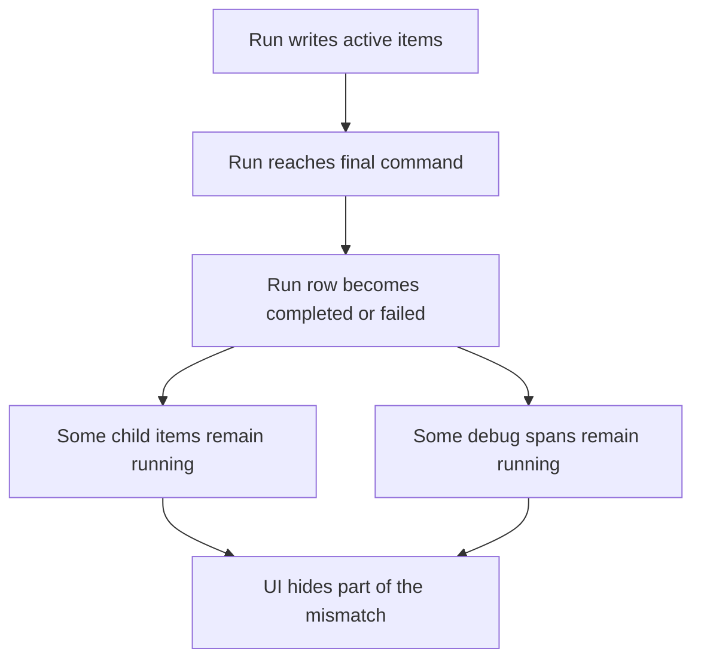

### Proposed mechanism

Make the final run update also finish child items and the debug span. Apply the
change in the same database transaction when the data shares the database.

Use these rules:

1. Complete items that have a matching successful final result.
2. Fail items that have a matching failed final result.
3. Interrupt remaining active items when the run is interrupted.
4. Cancel remaining active items when the run is cancelled.
5. Close the run debug span with the same final reason.
6. Keep action-request uncertainty as a separate detailed state.

### After

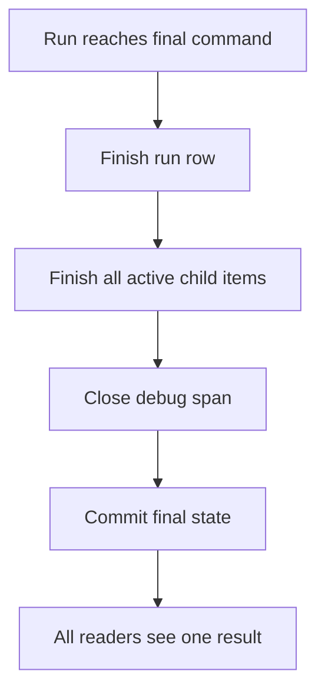

### Data change

No new state values are necessary. Use the current completed, failed,
cancelled, and interrupted values.

### Tests

1. Complete a task-worker run with a successful tool result.
2. Fail a run during a tool call.
3. Cancel a run during a model response.
4. Interrupt a run after worker-claim loss.
5. Repeat the final update and preserve repeat protection.

### Completion criteria

- A final run has no active child item.
- A final run has no active debug span.
- Database queries and client views show the same final state.

---

## Change 6: Give the task reviewer stored execution evidence

### Current problem

The task worker submits result Markdown, criterion evidence Markdown, and saved
output IDs. The reviewer sees the submission and saved outputs.

The reviewer does not receive the task worker's stored run items as source
evidence. Current code explicitly excludes those items.

Six recent tasks required multiple review rounds. Review feedback often asked
for evidence that the task worker asserted but did not attach or reproduce.

Expected code owners after Change 0:

- Task review input under `noema-database`.
- Task review records under `noema-database`.
- Reviewer input assembly under `noema-agent-runner`.
- Task submissions under `noema-tasks`.

Audit issue: `WORK-19`.

### Before

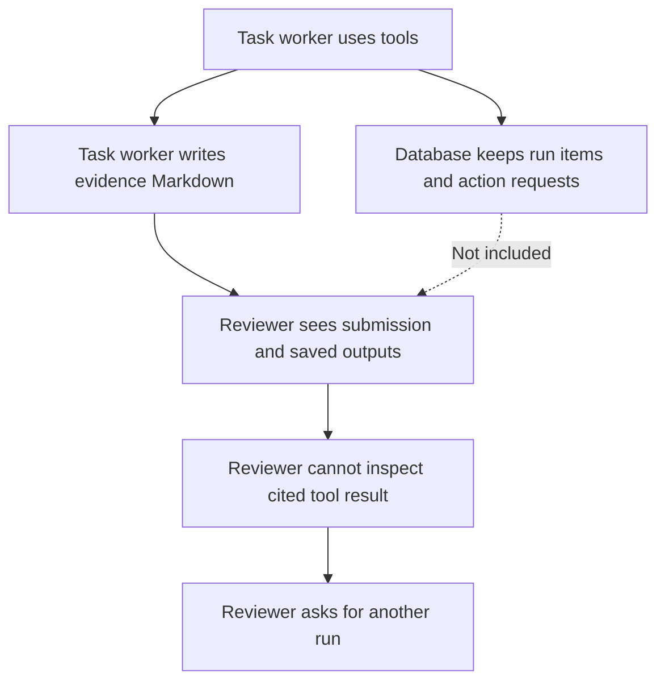

### Proposed mechanism

Create a limited evidence view from records that already exist. Do not
create a second evidence store.

The view should contain:

- Final tool-call name.
- Final status.
- Safe result summary.
- External resource identifiers already allowed in stored data.
- Action-request ID, version, and final state.
- Saved-output version links.
- Exact run and submission source links.

The view must omit secrets. It must keep permitted private evidence behind
current saved references when an inline copy is unnecessary.

### After

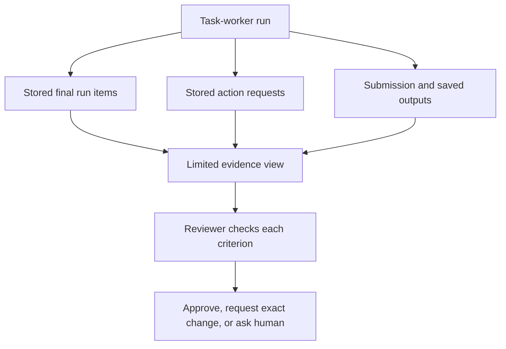

### Data change

Prefer a database query that builds this view. Add no schema field unless a required link does
not exist in current rows.

The model must not provide action IDs as trusted evidence. The database derives
them from task, run, requirements, and submission links.

### Tests

1. Include a successful checked external write in reviewer evidence.
2. Exclude an action from another run.
3. Exclude an old action from another task version.
4. Show an uncertain action without claiming success.
5. Preserve ordinary identifiers and exclude credential material.
6. Review a result with no matching tool evidence and reject its write claim.

### Completion criteria

- The reviewer can inspect stored evidence for each claimed effect.
- Repeated review caused only by missing evidence packaging stops.
- Evidence cannot cross task, run, requirements, or task-version boundaries.

### Non-goals

- Do not let the reviewer call external research tools.
- Do not make raw chat history the source data.
- Do not duplicate full private content.

---

## Change 7: Use the exact source review without a substitute

### Current problem

The review-input query first uses the run's `source_review_id`. If that value is
absent, it falls back to the task's latest review.

The later check can detect an unrelated review. However, the query still
selects a review that did not request the run.

The historical failure did not recur after the audit cutoff. The unsafe path
still exists.

Expected code owners after Change 0:

- Task review input under `noema-database`.
- Task-run queue code under `noema-database`.

Audit issue: `WORK-06`.

### Before

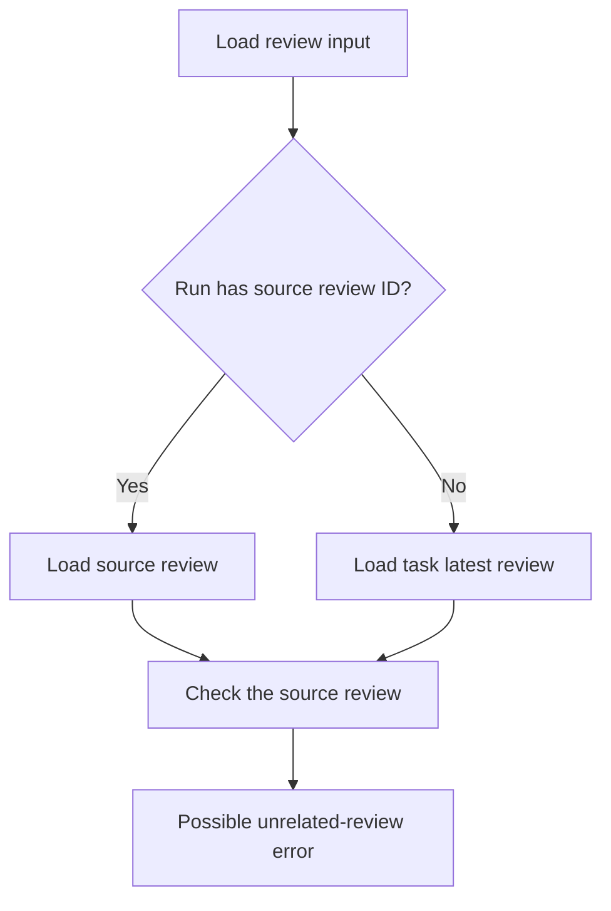

### Proposed mechanism

Use only the run's explicit source review. A run that requires review input
must carry the exact review ID when Noema queues the run.

Use these rules:

1. Task-planner runs have no source review.
2. First task-worker runs have no source review.
3. Correction runs require their exact source review.
4. Reviewer runs require their exact source submission.
5. A missing required source link becomes one stored-state fault.

### After

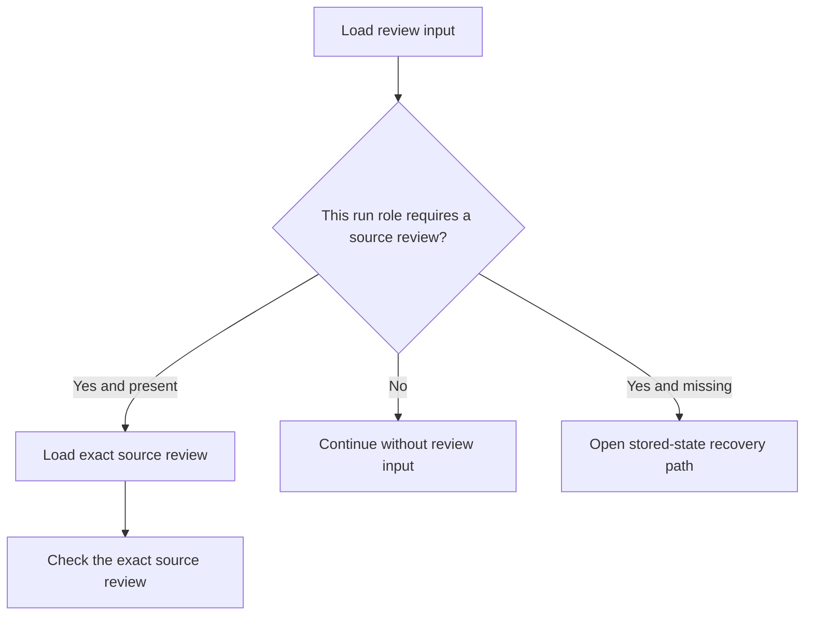

### Data change

No schema change should be necessary. `agent_runs` stores `source_review_id`
and `source_submission_id` after Change 0.

### Tests

1. Load a first task-worker run without a review.
2. Load a correction run from its exact source review.
3. Reject a correction run with no source review.
4. Reject a source review from another submission.
5. Do not read the task's latest review as a substitute.

### Completion criteria

- No review input uses the task's latest review as source evidence.
- Every correction run has one exact source review.
- A missing source review produces one clear recovery state.

---

## Change 8: Finish the Calendar and connector-definition path

### Current problem

The active Calendar connector cannot create a true all-day event. A reviewed
replacement definition exists, but the current connection has not adopted it.

Validation Case 12 waits for this operation. The database also contains 26
built definitions and 45 rejected definitions for two active connections.

This change must finish the active operation without deleting useful history.

Expected code owners after Change 0:

- Connector definitions and connections under `noema-tools`.
- Connector management fields under `noema-api`.
- Connector settings under the web application.

Audit issues: `CAL-02` and `STATE-08`.

### Before

```mermaid
flowchart TD
    A["Active Calendar connection"]
    B["Current reviewed definition"]
    C["No true all-day create operation"]
    D["Replacement definition proposed"]
    E["Human must inspect definition history"]
    F["Validation case remains waiting"]

    A --> B --> C --> F
    D --> E --> F
```

### Proposed mechanism

Adopt the reviewed replacement through the existing managed replacement path.
Keep the complete replacement history.

Improve the management view so the active definition and pending replacement
are the primary records. Keep older and rejected records in the history view.

Use this order:

1. Review the exact all-day operation and response conversion.
2. Approve the replacement definition.
3. Replace the active definition through current replacement rules.
4. Preserve the connection credential and permission rules.
5. Run Case 12.
6. Confirm create, read-back, and duplicate prevention.

### After

```mermaid
flowchart TD
    A["Active Calendar connection"]
    B["One active reviewed definition"]
    C["True all-day create operation"]
    D["Calendar service receipt"]
    E["Read-back confirms all-day event"]
    F["Case 12 passes"]
    G["Older definitions remain in history"]

    A --> B --> C --> D --> E --> F
    B --> G
```

### Data change

The definition files remain the source files. Do not rewrite an existing
definition or migration. Create a new definition identity for each correction.

### Tests and validation

1. Build the replacement under source schema version 8.
2. Preserve connection, credential, permission, and rule versions correctly.
3. Create one all-day event with no invented time.
4. Read the event back as an all-day event.
5. Prevent a duplicate event when an attempt repeats.
6. Run the complete 50-case validation list.

### Completion criteria

- All 50 validation cases pass.
- The active connection resolves one current definition.
- Historical definitions remain available without dominating the normal view.

### Non-goals

- Do not delete rejected-definition history during startup.
- Do not build a general connector migration framework.
- Do not change MCP through this work.

---

## Change 9: Make schema enforcement consistent for every tool source

### Current problem

Noema presents tools from native connectors, MCP servers, and the browser to
model services. Each tool has one source input schema.

Model-service interfaces accept a smaller schema language. The shared
conversion must translate each source schema into that language.

The current failure is visible through Notion. All 22 active Notion tools use
schema forms that exact conversion rejects. The task runner recorded 12,342
repeated partial-mode errors after the audit cutoff.

Notion is the largest current example. It is not the correct system boundary.
Any present or future tool source can use the same schema forms.

Expected code owners after Change 0:

- Model-service schema conversion under the model-service package.
- Tool-schema collection under the model-service package.
- Conversion diagnostics under the model-service package.
- Native connector, MCP, and browser tool schemas under `noema-tools`.

Audit issues: `INT-02` and `STATE-06`.

### Before

```mermaid
flowchart TD
    A["Native, MCP, or browser tool schema"]
    B["Shared model-service schema conversion"]
    C{"Model service supports every schema form?"}
    D["Use exact model-service input rules"]
    E["Use partial rules during each build"]
    F["Write the same diagnostic many times"]
    G["Invoke tool with uneven guarantees"]

    A --> B --> C
    C -->|Yes| D --> G
    C -->|No| E --> F --> G
```

### Proposed mechanism

Make schema enforcement a property of the built tool definition. Do not
make it a property of Notion, MCP, or another integration.

Use one pipeline for every tool source:

1. Load the source tool schema.
2. Calculate its stable schema hash.
3. Convert it for the selected model-service interface.
4. Mark the converted schema as `exact` or `partial`.
5. Keep the source schema for the final input check.
6. Record one diagnostic for each unique conversion result.

An `exact` result means the model-service schema preserves the accepted source
set. The model service can reject invalid arguments before its response ends.

A `partial` result means the model service cannot express the complete schema.
Noema must still check the generated arguments against the source schema before
any tool invocation.

Never add a Notion-specific schema rewrite. Improve the shared conversion when
a source schema has an equivalent model-service representation.

Keep partial mode when no equivalent exists. The mode must remain visible in
inspection and diagnostics.

### After

```mermaid
flowchart TD
    A["Any source tool schema"]
    B["Shared build step"]
    C{"Exact model-service representation exists?"}
    D["Mark converted schema exact"]
    E["Mark converted schema partial"]
    F["Final source-schema input check"]
    G["Invoke native, MCP, or browser tool"]
    H["One diagnostic per schema and target hash"]

    A --> B --> C
    C -->|Yes| D --> F
    C -->|No| E --> F
    E --> H
    F --> G
```

### Why this mechanism is universal

The mechanism depends on only three existing facts:

- A source tool schema.
- A model-service schema target.
- The generated arguments.

It does not know about pages, events, messages, files, travel, or any other
domain object.

The same result applies to a native API operation, an MCP operation, and a
browser operation.

### Data change

No database schema change should be necessary. Use the tool identity, source
schema hash, model-service target, and conversion version as the diagnostic
identity.

If built connector definitions already store enough identity, derive the mode
without a new saved field.

### Tests

1. Convert all active tool schemas through one table-driven test.
2. Include one native connector, one MCP server, and one browser tool.
3. Confirm exact enforcement when the model-service representation is exact.
4. Confirm the final source-schema check in partial mode.
5. Reject an extra generated argument before any connector invocation.
6. Record one partial-mode diagnostic for one unchanged schema and target.
7. Record a new diagnostic after a real schema or conversion version.
8. Preserve ordinary schema names and identifiers in diagnostics.

The current Notion tools remain a required test set. They do not receive
a separate production path.

### Completion criteria

- Every active tool reports one explicit enforcement mode.
- Every tool uses the source-schema check before invocation.
- Exact conversions use exact model-service input rules.
- Repeated builds do not flood the error log.
- No connector contains a private schema-enforcement exception.
- Existing native, MCP, and browser validation cases continue to pass.

### Non-goals

- Do not weaken the source-schema input check.
- Do not change MCP or model-service protocols.
- Do not make all source schemas artificially closed.
- Do not hide a new or changed partial conversion.
- Do not add connector-specific schema conversions.

---

## Change 10: Add reusable permissions for every action-request source

### Prerequisite

Changes 1 through 9 must meet their completion criteria. Reusable permissions
must not hide an interruption, evidence, or stored-state defect.

### Current problem

Noema converts reviewed external effects into action requests. Chat and
background tasks use the same action checks.

The shared agent-runner entry point is `prepare_action_request`. It receives a
`BoundTool` for native, MCP, and browser tools.

The current entry point returns early when connection rules say
`run_without_approval`. Those calls do not create an action-request record.
Reusable permissions therefore cannot control or explain that automatic path.

An approval currently permits one fixed action version. This is the
correct default, but it cannot express a reusable human decision.

A person can approve one Calendar change, one Notion update, or one browser
submission. The approval cannot safely authorize a later action with limited
differences.

The current action-check rules already state the missing mechanism. A
reusable permission needs a separate record. Approval history must not become
an implicit permission system.

Expected code owners after Change 0:

- Action checks under `noema-agent-runner`.
- Action-request records under `noema-database`.
- Tool connection and operation rules under `noema-tools`.
- Action approval and outgoing-data rules under `docs/safety`.

### Before

```mermaid
flowchart TD
    A["Chat or background-task tool call"]
    B["Resolve connection and tool rules"]
    C{"Rules permit execution without approval?"}
    D["Invoke without action-request record"]
    E["Create exact action request"]
    F["Run fixed-rule and model review"]
    G{"One-shot approval required?"}
    H["Human approves this version"]
    I["Execute saved action"]
    J["Later similar action starts again"]

    A --> B --> C
    C -->|Yes| D --> J
    C -->|No| E --> F --> G
    G -->|Yes| H --> I
    G -->|No| I
    I --> J --> A
```

### Proposed mechanism

Add one reusable-permission record beside one-shot approvals. Keep the action
request as the only record that can start an external effect.

Change `prepare_action_request` so every proposed external effect first gets an
action-request record. Keep the previously-seen URL read path separate because
it does not create an external effect.

Reuse `ToolConnectionRules` and `ToolRules` as minimum rule inputs. Do not copy
their fields into the reusable-permission record.

A reusable permission describes what one human permits across future action
requests. It matches fields that the action-request record already contains:

- Human who gave permission and the acting caller.
- Allowed area, such as one task, project, workspace, or human.
- Tool and exact connection.
- Operation and effect type.
- Resource match.
- Destination and audience.
- Outgoing-data class and information limits.
- Allowed changed fields and limited argument values.
- Start, end, and revocation state.
- Permission version and rule version.
- Required history and result-confirmation behavior.

The permission must use a small fixed set of rule types. Initial limits should
support exact equality, allowed sets, absence, numeric bounds, maximum
collection size, and an allowed changed-field set.

Rule paths refer to the source tool schema. Unknown paths, unknown
values, and unsupported comparisons do not match.

Do not put event, page, message, flight, or file concepts into the permission
check. A connector exposes structured arguments and action facts through its
existing tool definition.

### Permission creation

A human must create a reusable permission explicitly. Noema must never infer
one from repeat approvals or model text.

The creation flow is:

1. Show the human one exact action request.
2. Offer `Approve once` as the default.
3. Offer a separate reusable-permission flow when the operation supports it.
4. Show every proposed limit and its practical effect.
5. Save the permission only after explicit confirmation.
6. Reassess the original action against the new permission.

The server can prefill exact values from the action and its source schema.
Only schema-backed controls can widen a value into an allowed set or bound.
Free-form rule text cannot define executable limits.

The human can also create or revoke a permission from Safety settings. The same
server command must own both creation surfaces.

### Permission check

Use this order for every proposed effect:

1. Build the exact action request.
2. Resolve current connection rules and exact tool rules.
3. Run hard security, secret, network, and outgoing-data checks.
4. Select active permissions inside the action's allowed area.
5. Match all structured action fields and limits.
6. Run the current model action review when it is required.
7. Require one-shot approval when no permission fully matches.
8. Check all action, permission, connection, and tool versions again.
9. Execute the saved action and record the exact permission version.

A reusable permission records the human's decision. It does not override a
hard deny, revocation, old task version, changed arguments, uncertain result,
or failed model review.

### After

```mermaid
flowchart TD
    A["Any chat or background-task effect"]
    B["Exact action request"]
    C["Current connection and tool rules"]
    D["Hard safety and outgoing-data checks"]
    E["Match active reusable permissions"]
    F{"One permission matches every limit?"}
    G["Continue action review with saved permission"]
    H["Require one-shot approval"]
    I["Check every rule and object version again"]
    J["Execute through current connector"]
    K["Record outcome and permission evidence"]

    A --> B --> C --> D --> E --> F
    F -->|Yes| G --> I
    F -->|No or unknown| H --> I
    I --> J --> K
```

### Why this mechanism is universal

The permission check evaluates action-request facts. It does not evaluate a
Calendar event, a Notion page, or a travel booking directly.

These examples use the same mechanism:

| Example action | Permission limits | Result |
| --- | --- | --- |
| Move an owner-only Calendar block | Exact connection, update operation, no attendees, time fields only, limited hours | Permission can match |
| Update one Notion database status | Exact connection, database ID, status field only, allowed status set | Permission can match |
| Submit one known browser form | Exact source, operation, destination, field set, and outgoing-data class | Permission can match |
| Send email to a new recipient | Recipient is outside the allowed destination set | Require one-shot approval |
| Purchase an item | Effect class exceeds the permission | Require one-shot approval |

Calendar, Notion, and browser code provide schemas and action facts. They do
not implement separate permission checks.

### Storage

Add a separate stored permission record. Do not add reusable fields to approval
rows.

Each permission must contain exact owner, caller, allowed area, tool,
connection, operation, resource, destination, limit, rule, and version
identities.

Store no credentials in a permission. Reference permitted private content when
the permission does not need an inline value.

Permission states should include `active`, `revoked`, `replaced`, and `expired`.
Use an expiry only when the human sets one or the source rules require
one.

Every automatic execution records the exact permission ID and version.
Immediate revocation prevents new actions from starting.

Append one forward-only migration. Add one permission table with fixed version
rows and one checked `limits_json` value.

Add the selected permission ID and version to the action-request review result.
The final action event must retain the same reference for audit.

Add one index for active permission selection by owner, allowed area, tool, and
operation. Do not scan approval history during the permission check.

Expose server commands to create, list, inspect, revoke, and replace permissions.
The approval card and Safety settings must call the same commands.

```mermaid
stateDiagram-v2
    [*] --> Active: Human creates permission
    Active --> Revoked: Human revokes permission
    Active --> Replaced: Human replaces limits
    Active --> Expired: Human-defined expiry passes
    Revoked --> [*]
    Replaced --> [*]
    Expired --> [*]
```

### Tests

1. Match one native API action through the shared permission check.
2. Match one MCP action through the same check.
3. Match one structured browser action through the same check.
4. Reject a different caller, allowed area, connection, or operation.
5. Reject a different resource, destination, or audience.
6. Reject an extra changed field or a value outside its bound.
7. Reject an unknown schema path or unsupported comparison.
8. Reject a revoked, replaced, expired, or old permission version.
9. Preserve hard denies and secret rules when a permission matches.
10. Record the exact permission version on one successful action.

Use table-driven cases for shared matching behavior. Add separate tests only
where a connector owns a different source-schema boundary.

### Completion criteria

- Chat and background tasks use the same permission check.
- Native API, MCP, and browser actions use one permission check.
- No connector contains domain-specific permission logic.
- One-shot approval remains the default when no exact permission matches.
- Every automatic effect becomes an action request with an action history.
- Existing connection and tool rules remain the minimum rule set.
- Revocation blocks new actions immediately.
- Unknown or old state requires one-shot approval or causes a denial.

### Non-goals

- Do not infer permissions from prose, titles, approval history, or model output.
- Do not let models create, widen, or renew permissions.
- Do not add permissions for every tool, connection, resource, or destination.
- Do not add a general programming or expression language.
- Do not bypass action review, outgoing-data rules, or final execution checks.
- Do not create domain abstractions for Calendar, Notion, travel, or email.

---

## 6. Cross-change acceptance scenario

Use one scenario to prove that the repaired systems and universal mechanisms
work together.

The human creates two reusable permissions. One permits limited changes through
a native Calendar connector. The other permits limited changes through Notion
MCP.

The human then starts a background task that maintains the project schedule and
status. The task requirements require approval before any external message.

```mermaid
sequenceDiagram
    participant Human
    participant Task
    participant Checks as Action checks
    participant Calendar as Native Calendar
    participant Notion as Notion MCP
    participant Email
    participant Reviewer

    Human->>Task: Maintain schedule and project status
    Task->>Checks: Propose exact Calendar update
    Checks->>Calendar: Execute under Calendar permission
    Calendar-->>Task: Return confirmed result
    Task->>Checks: Propose exact Notion update
    Checks->>Notion: Execute under Notion permission
    Notion-->>Task: Return confirmed result
    Task->>Checks: Propose email without reusable permission
    Checks-->>Human: Request one-shot approval
    Human->>Checks: Approve exact email version
    Checks->>Email: Execute saved email action
    Email-->>Task: Return final result
    Task->>Reviewer: Submit result with stored evidence
    Reviewer-->>Task: Approve criteria
    Task-->>Human: Deliver verified result
```

Run these interruption variants:

1. Restart before the email approval.
2. Restart after approval but before email execution.
3. Restart after email success but before the task follow-up run.
4. Cancel the task before approval.
5. Revoke either reusable permission before its action starts.
6. Change an action field after the permission check.
7. Make one connector result uncertain.

For each variant, Noema must preserve completed effects. It must not repeat an
uncertain effect.

## 7. Validation plan

### 7.1 Focused unit tests

Each change lists its unique tests. Keep each test with the code that owns the
behavior.

Do not repeat the same transition across database, agent runner, API, and
client tests.

### 7.2 Repository validation

Run these commands before each change commit:

```text
cargo fmt --all --check
cargo check-workspace
cargo check-lint
cargo check-tests
```

Run focused commands through `cargo validate` during each change.

### 7.3 Live validation

After Change 9, run the complete 50-case validation list and build every active tool
schema. After Change 10, run the shared permission matrix across native API, MCP,
and browser actions.

Do not use live high-risk writes for this proposal.

## 8. Release boundaries

| Release | Included changes | User-visible result | Undo point |
| --- | --- | --- | --- |
| Plain language | 0 | Product and code use one direct vocabulary | Revert the complete rename unit before later work starts |
| Action follow-up | 1 through 3 | Approvals and background tasks resume reliably | Disable new source use while preserving migration data |
| Stored status | 4 and 5 | Stored status matches completed work | Revert final-state update code |
| Review evidence | 6 and 7 | Review uses stored execution evidence | Remove the derived evidence view |
| Connector baseline | 8 and 9 | All 50 cases pass with useful logs | Restore the prior active connector definition |
| Reusable permissions | 10 | Exact reusable permissions work across action-request sources | Revoke or disable the permission records |

## 9. Later work

The current audit includes other problems. They are real, but they do not belong
in the same implementation unit.

Deferred work includes:

- Automatic memory-source and footnote-manifest failures.
- Chat reply delays and model-service HTTP failures.
- Model input that becomes too large before Noema can reduce history.
- Gmail full-message depth beyond the current limited view.
- The infeasible 07:00 news recurrence requirements.
- A general rule programming language.
- General automatic result maintenance.
- New connector types.
- New problem-specific base types.

Create a separate limited proposal for each selected item. Do not expand this
roadmap during implementation.

## 10. Final system after this proposal

```mermaid
flowchart TD
    H["Human request or task start"]
    T["Task requirements and current-run check"]
    R["Claimed task run"]
    A["Exact action request"]
    P["Fixed safety and outgoing-data checks"]
    G["Reusable permission or one-shot approval"]
    C["Current browser or connector"]
    O["Stored final outcome"]
    E["Stored reviewer evidence view"]
    V["Requirements review"]
    D["Confirmed delivery or recovery pause"]

    H --> T --> R --> A --> P --> G --> C --> O --> E --> V --> D
    G -.->|Human decision when required| H
    O -.->|Uncertain result| D
```

The result is one shared action-request path. Tasks and connectors keep their
current ownership. Schemas and reusable permissions use shared checks.
