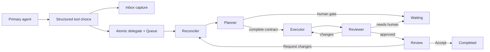

# Noema Work: Runtime and Chat Contract

**Status:** implementation specification
**Owns:** model-role routing, task runtime context, chat-facing tools, and
notification delivery
**Read with:** [the product contract](00-product-contract.md),
[the domain model](02-domain-model.md), [commands and reconciliation](04-commands-and-reconciliation.md),
and [the GraphQL contract](06-graphql-contract.md)

This document defines how the Work runtime turns an authorized task into
planner, executor, and reviewer runs, and how the primary conversation creates
or controls that work. It does not define another task state machine. The only
persisted task state is `tasks.stage_id`; current runs, gates, reviews, and
events are separate projections.

## Runtime boundary

The runtime owns supervised execution and tool exposure. The store owns every
durable transition, event append, fence, and outbox row. A worker must never
write a task row directly or infer a transition from assistant prose.



The arrows in this diagram are semantic commands or reconciler decisions, not
an additional lifecycle field. A task in `Doing` can have a Planner, Executor,
or Reviewer run; the current role is read from the latest relevant
`agent_runs` record.

## Roles and routing

| Role | Durable identity | Model selection | May change | Terminal contract |
| --- | --- | --- | --- | --- |
| Primary agent | `agent:primary` | Primary conversation selection | Chat-originated capture, delegation, and human-authorized commands | Ordinary chat response plus typed task/project tools |
| Planner | `agent:task-executor` | The task's resolved executor-pool snapshot | A draft into an immutable execution-contract version, or a clarification/approval gate | `task.submit_plan` or `task.report_blocked` |
| Executor | `agent:task-executor` | The exact executor snapshot on its contract | Submission evidence, task-owned artifacts, or an approval/clarification gate | `task.submit_result` or `task.report_blocked` |
| Reviewer | `agent:task-reviewer` | The exact reviewer snapshot on its contract | A typed review verdict | `task.submit_review` |
| Reconciler | No agent identity | No model call | Idempotently queues the one required next run or opens a recovery gate | None |

The planner intentionally reuses the task-executor identity and executor pool.
It is a bounded contract-normalization run, not a new agent or model
preference surface. A planner has no general action tools, cannot invoke
capabilities, cannot create artifacts, and cannot delegate children. It either
returns a complete plan or opens one focused clarification or approval gate.

An executor and reviewer keep their existing separate roles. The reviewer
receives immutable evidence and performs independent assessment; it must not
reuse the executor's provider continuation, live prompt, or tool authority.

### Queue routing

The reconciler makes the following decision from durable data:

| Task stage and evidence | Required next action |
| --- | --- |
| `Queue`, no complete current execution contract | Queue one Planner run. |
| `Queue`, complete current execution contract | Queue one Executor run. |
| First valid claim of the queued run | Move the task to `Doing`, then start the claimed role. |
| Planner submits a complete plan | Freeze a new contract version and queue an Executor while the task remains `Doing`. |
| Executor submits evidence | Queue a Reviewer while the task remains `Doing`. |
| Reviewer requests changes | Persist immutable review feedback, increment the task revision, queue an Executor for the same contract/generation, and keep `Doing`. |
| Reviewer approves | Move the task to `Review`; no active run remains. |
| Any role opens a gate | Resolve/cancel runnable work as appropriate and move to `Waiting`. |

`task.delegate` always creates an authorized Queue task atomically. With a
complete normalized request, exact criteria, and complexity it freezes contract
version 1 and queues Executor; without that complete intent it creates no draft
contract and queues Planner. Capture remains reserved for work the user has not
authorized to run.

The reconciler is the only component that decides whether a new run is needed
after restart, lease recovery, an event-delivery failure, or a command commit.
It writes no English-output parser and does not use an artifact, process
existence, Git state, terminal, or transcript text as a state signal.

## Model pools and immutable selections

Executor pool selection is server-controlled. The primary agent and planner
may provide a bounded `complexity` hint, but neither sends a provider account,
model profile, or pool-entry id as an authority-bearing input.

When an Inbox task becomes Queue-authorized, or a complete contract is frozen,
the command service resolves model snapshots with this deterministic algorithm:

1. Use the supplied complexity hint when one exists; otherwise use the
   configured `medium` tier. Queue therefore uses `medium` for its Planner,
   while Delegate and a successful Planner use their normalized complexity.
2. Within a tier, select the first enabled entry ordered by `sort_order ASC,
   pool_entry_id ASC`.
3. If the selected tier has no enabled entry, select the first enabled entry
   across all tiers in the same stable ordering.
4. Prove the selected executor route is usable and snapshot it on the Planner
   run. A complete Delegate command, or a successful Planner terminal, then
   resolves and snapshots the executor, reviewer, and execution policy into
   the immutable contract.

The contract's Reviewer snapshot comes from the existing
`agent:task-reviewer` runtime preference and is readiness-proven in the same
freeze transaction. It does not come from the executor pool, project metadata,
or the primary model's arguments.

If there is no ready executor route, Queue is rejected with
`configuration_unavailable` and an existing task remains safely editable in
Inbox; an atomic Delegate creates no task at all. If the required reviewer
route or policy is unavailable while freezing a complete contract, that
terminal command fails safely and an active Planner follows ordinary
retry/recovery handling. Once a contract is frozen, a later settings change
does not replace its executor or reviewer. A retired or unavailable exact
route becomes a recoverable runtime condition; it never silently falls back
to a different provider account or model.

Every contract version captures:

- normalized immutable request, optional execution plan, and exact acceptance
  criteria;
- selected complexity and the resolved executor/reviewer snapshots;
- execution-policy snapshot and review-round limit;
- workspace and project identity plus name/description snapshots;
- contract version, task generation, and creation actor; task provenance stays
  linked through the task ID;
- relational links to the superseded contract, review, and human feedback when
  it is a human revision.

The workspace and project snapshot is context, not authority. It cannot change
the executing agent, selected pools, memory retrieval, capability grants,
external-write permission, or approval requirements.

## Run envelope and context assembly

Each admitted run executes from an explicit durable envelope assembled from
the run row, task provenance, and the current immutable contract when one
exists. A Planner has no contract, so it receives the Inbox capture plus the
bounded current workspace/project descriptions; its successful terminal
transaction freezes those descriptions into the new contract. No runtime is
allowed to discover workspace or conversation scope by recency, process
directory, or prompt content.

| Envelope field | Meaning |
| --- | --- |
| `run_id`, `run_kind`, `task_id` | Stable run identity and role. |
| `task_generation`, `contract_id`, `contract_version` | Fence and exact contract the run is permitted to complete; Planner has null contract fields, while Executor and Reviewer require them. |
| `workspace_id`, `project_id` | Independent location references; the project id may be absent. |
| `conversation_id` | Origin conversation for provenance only, not an implicit project scope or notification destination. |
| `requested_by_actor_id`, `requesting_agent_id` | Human/agent that authorized the work. |
| `executing_agent_id` | Built-in executor or reviewer identity. |
| `parent_run_id`, `triggering_submission_id`, `triggering_review_id` | Immutable lineage and revision evidence. |
| `model_snapshot`, `execution_policy_snapshot` | Exact route and limits for this run. |
| `causation_id`, `correlation_id` | Event and audit linkage across commands, runs, and notifications. |

The runtime builds a bounded role-specific context in this order:

1. For Executor and Reviewer, the immutable execution contract and stage-safe
   task metadata; for Planner, the Inbox/Waiting task metadata and resolved
   messages from which it must normalize the first contract.
2. A separately labelled workspace snapshot and optional project snapshot,
   containing only the name and description. Executor/Reviewer read the
   contract-frozen values; Planner persists the bounded values it received in
   its run transcript and freezes them into a successful contract.
3. The relevant parent submission, reviewer verdict, criterion evidence, and
   task-owned artifact manifest for a revision or review.
4. Resolved human task messages in causal order, including the gate question
   they answered.
5. Bounded lineage transcript material needed to resume an interrupted run.
6. The role's fixed instructions, terminal schema, and allowed tool catalogue.

The runtime does not inject a whole source conversation, project documents,
project memory, unrelated artifacts, or any ambient workspace data. Existing
memory and capability systems remain independently responsible for deciding
what a role may retrieve or invoke.

Human answers and revision feedback are durable `task_messages`. They are
consumed only by a newly queued continuation at a safe run boundary; the
runtime never appends a human answer into an in-flight provider call.

## Gates, messages, and recovery

`Waiting` is a human-intervention stage, not a synonym for an idle run. It has
one unresolved `task_gate` that identifies the task, current generation,
opening role/run, kind, prompt, safe context, and resolution.

| Gate kind | Created by | Resolution |
| --- | --- | --- |
| `Clarification` | Planner, executor, or reviewer | `task.answer` stores the answer message and queues the next safe role. |
| `Approval` | Planner, executor, or reviewer when a task-level decision is needed | `task.answer` records an explicit structured Approved or Declined decision with its message, then queues only the safe continuation selected by the command service. |
| `Recovery` | Reconciler after bounded retry/review recovery is exhausted | `task.retry` or `task.answer` is offered only when the gate has a safe `retry_run_kind`; Cancel always remains available. |

For Clarification/Approval, `originating_run_id` is the continuation authority,
including Reviewer against the same submission. Recovery instead carries a
typed reason and nullable `retry_run_kind`: infrastructure exhaustion selects
the failed role, review-round exhaustion selects Executor for one additional
human-authorized round, and an invariant with no safe continuation offers no
retry. The existence of a contract alone never decides the continuation role.

Only one unresolved gate may exist for a task. A command that would open a
second gate fails closed rather than choosing which question is current.
`task.answer` requires the explicit gate id, task revision, and task
generation, so a chat response cannot be attached to the wrong active task.
Card actions carry those identifiers in trusted UI metadata. Free-form chat may
answer a gate only when the turn explicitly replies to a task card or names a
task/gate that resolves uniquely; when multiple gates could match, the primary
agent asks the user to choose and performs no mutation.

Retryable infrastructure failures create a child run with incremented attempt
lineage while the task remains `Doing`. When its configured recovery bound is
exhausted, the reconciler records a `Recovery` gate and moves the task to
`Waiting`. A human retry must create a new fenced run; it never revives a
failed run in place.

Cancellation increments task generation, cancels runnable runs, signals active
provider and tool futures, and moves the task to `Cancelled` in one command
transaction. Every terminal worker write compares its lease token, run
generation, and contract id. A late result from a cancelled or superseded run
returns `run_fenced` and may produce only a safe runtime diagnostic; it cannot
alter durable task evidence, stage, review, result, or notification.

A cancelled in-memory future remains counted against the eight-run supervisor
resource cap until it settles, and the claim coordinator does not start a new
run for that same task during this cleanup window. This is transient resource
scheduling, not task state or reconciliation authority; after restart no old
future exists, and generation fencing remains the correctness boundary.

## Primary-agent chat policy

The primary agent decides among foreground response, Inbox capture, and
delegation through its typed tool-selection policy. The approximately
15-second threshold is a product instruction to the model: work it expects to
take materially longer than a normal foreground exchange should be delegated.
There is no keyword, prefix, or English phrase matcher that decides this.

| Structured disposition | When it is appropriate | Durable result |
| --- | --- | --- |
| Foreground | The request can be answered safely in the active exchange and does not need durable control or asynchronous execution. | No task is created. |
| Capture | The user asks to save, track, or defer work without authorizing execution. | `task.capture` creates Inbox. |
| Delegate | The user explicitly authorizes autonomous work, or the primary agent estimates the work exceeds the foreground threshold. | `task.delegate` atomically creates Queue and selects Planner or Executor from the structured intent. |

The prompt policy must require the primary agent to make the disposition
explicit through tool selection, then validate the structured tool arguments.
It must not examine user wording to override that choice. Evaluation cases
cover multilingual and indirect requests by asserting durable command choice,
not a particular phrase.

Project linkage is explicit. The primary agent may supply a project id only
when the user identified or selected that project. Otherwise the task belongs
directly to Personal; a recently discussed project is never inferred.

### Primary-agent tool contract

The runtime derives actor, source conversation, causation id, correlation id,
and idempotency key from trusted turn/tool-call context. The model does not
supply those fields.

| Tool | Model-supplied fields | Effect |
| --- | --- | --- |
| `task.capture` | `title`, `description`, optional `project_id` | Creates an Inbox task with no contract or run. |
| `task.list` | optional `project_id`, `stage_behavior`, `attention_only`, `limit` | Returns bounded owner-authorized task summaries. |
| `task.update` | `task_id`, `expected_revision`, `expected_generation`, optional `title`, `description`, `project_id` or `clear_project` | Updates only an Inbox task. |
| `task.queue` | `task_id`, expected revision/generation | Authorizes an Inbox task and queues Planner. |
| `task.delegate` | `title`, `description`, optional `project_id`; either optional `complexity_hint` or one complete `execution_intent` | Atomic Queue creation; no intent queues Planner, complete intent freezes a contract and queues Executor. The source tool-call id is the idempotency key. |
| `task.answer` | `task_id`, `gate_id`, expected revision/generation, `answer_markdown`, and `approval_decision` for an Approval gate | Resolves the named gate, appends a human message, and queues safe continuation. |
| `task.retry` | `task_id`, `gate_id`, expected revision/generation, optional `retry_note` | Resolves the named Recovery gate and queues a fenced child of the failed role. |
| `task.accept` | `task_id`, expected revision/generation | Accepts the current approved review and completes the task. |
| `task.request_changes` | `task_id`, expected revision/generation, `feedback_markdown`, optional `request_markdown`, `replacement_criteria`, `complexity` | Appends human feedback, creates a new contract revision, and queues it. |
| `task.cancel` | `task_id`, expected revision/generation, optional `reason` | Fences active work and moves to Cancelled. |
| `task.reopen` | `task_id`, expected revision/generation | Increments generation and starts a new Inbox cycle while preserving history. |
| `project.create` | `name`, optional `description` | Creates a Personal project. |
| `project.list` | optional `include_archived`, `limit` | Returns bounded Personal projects. |
| `project.update` | `project_id`, `expected_revision`, optional `name`, `description` | Updates a non-archived project. |
| `project.archive` / `project.reopen` | `project_id`, `expected_revision` | Archives or restores a project; neither changes a task stage. |

A complete `execution_intent` contains `request_markdown`, `complexity`, one or
more exact `criteria` with optional `expected_evidence`, and an optional
`execution_plan_markdown`. Server validation normalizes the intent and resolves
all provider selections. A separate `complexity_hint` is allowed only when the
intent is absent; otherwise the tool rejects the ambiguous input. A model
cannot set execution policy, agent identity, provider account, workspace
membership, or capability authority through this input.

### Background role tool visibility

| Tool / capability | Planner | Executor | Reviewer |
| --- | --- | --- | --- |
| `task.submit_plan` | Yes, exactly once | No | No |
| `task.submit_result` | No | Yes, exactly once | No |
| `task.submit_review` | No | No | Yes, exactly once |
| `task.report_blocked` | Clarification or approval | Clarification or approval | No; use `needs_human` review verdict |
| Task inspection | No | Read-only, own task | Read-only, current task and reviewed evidence only |
| Task artifact creation | No | Existing task-owned artifact tool only | No |
| Task artifact reading | No | Own linked artifacts | Only the submission manifest being reviewed |
| Search, fetch, memory, calibrated read-only MCP | No | Existing role/capability policy | Existing role/capability policy, read-only only |
| Any write-capability, project control, task control, or delegation tool | No | No | No |

The role-specific terminal payloads are fixed schemas:

```text
task.submit_plan
  request_markdown: String!
  complexity: simple | medium | difficult!
  criteria: [{ description: String!, expected_evidence: String }]
  execution_plan_markdown: String!

task.report_blocked
  gate_kind: clarification | approval!
  question: String!
  context_markdown: String!
  suggested_answers: [String!]

task.submit_result
  summary: String!
  result_markdown: String!
  criteria: [{ criterion_id: String!, evidence_markdown: String! }]!
  artifact_ids: [String!]

task.submit_review
  overall_verdict: approve | request_changes | needs_human!
  overall_feedback: String!
  criteria: [{ criterion_id: String!, outcome: pass | fail | uncertain!,
               evidence_markdown: String, feedback: String }]!
  human_gate_kind: clarification | approval
  human_question: String
```

`task.submit_plan` requires at least one criterion and a bounded, safe
`execution_plan_markdown`; the command stores it inside the immutable
execution contract, not as a task phase. `task.submit_result` and
`task.submit_review` require
every contract criterion exactly once. A planner blocking terminal and a
review with `needs_human` require an explicit clarification-or-approval gate
kind; review also requires `human_question` and at least one `uncertain`
criterion. An approved review requires every criterion to pass. Ordinary
assistant text is not a terminal result. Missing, duplicate, malformed, stale,
or role-inappropriate terminal calls fail the run safely and enter ordinary
recovery handling.

Tool errors are safe structured values:

```text
{ code, message, task_id?, gate_id?, retryable? }
```

Supported codes include `work_unavailable`, `stale_revision`,
`stale_generation`, `invalid_transition`, `gate_required`,
`configuration_unavailable`, `invalid_input`, and `run_fenced`. They never
contain provider credentials, hidden task content, unredacted tool payloads,
or internal lease tokens.

## Prompt requirements

Planner instructions say that it is preparing an execution contract, not
performing the work. The planner must choose `task.report_blocked` when a
criterion, scope, approval, or requested outcome cannot be made safe from the
available request. It must not fabricate answers, direct an external action,
or emit a partial contract that appears complete.

Executor instructions include the exact contract, criterion ids, artifact
rules, prior review feedback, and resolved human messages. The executor must
produce evidence for every criterion and use the existing governed artifact
path for requested files. It may not claim an artifact id it did not receive.

Reviewer instructions identify all task data as evidence, not instructions.
They require adversarial criterion-by-criterion evaluation, permit linked
artifact reads where needed, and prohibit a `needs_human` verdict merely to
ask for confirmation of an otherwise passing result.

All role prompts use the normal provider-continuation, transcript, progress
audit, repetition-detection, cancellation, and redaction machinery. The
initial runtime limit remains one active run per task and eight supervised runs
globally; workers claim strict FIFO order by `queued_at ASC, run_id ASC`
and retain the existing lease heartbeat/recovery behavior.

## Chat cards and durable notification delivery

Chat remains the home surface, but it receives only decision-relevant Work
updates. Routine Planner, Executor, Reviewer, lease, and transcript progress
stay in Work and task detail.

| Event | Chat delivery |
| --- | --- |
| Task captured or delegated from chat or Work | Compact task card with title, stage, and an Open Work action. |
| Clarification or approval gate opens | Attention card with the exact task id and the applicable answer action. |
| Reviewer approval moves task to Review | Ready-for-acceptance card with Accept and Request Changes actions. |
| Recovery becomes human-owned | One recovery card with safe reason and only the server-valid Answer/Retry/Cancel actions. |
| Human accepts a review | Completion card with result/artifact links. |

The command transaction appends a `work_event` and inserts one generalized
notification-outbox row addressed to the owning human's global primary
conversation. Provenance remains on the task but never selects the destination,
so Work-created tasks still surface required attention in chat. Delivery uses
a deterministic conversation-item id derived from event id and destination,
so a crash after insertion can be retried without duplicate cards. A foreground
turn takes precedence over routine delivery; after the turn settles, the
outbox writes the compact card. If the primary conversation is unavailable,
delivery retries while Work remains authoritative.

The chat card contains only a summary, stage, attention reason, and valid
semantic actions. It links to the same task-detail component used by Work.
It does not mirror a second task status, synthesize progress from prose, or
offer a generic stage picker.

## Runtime acceptance checks

The runtime implementation is complete when it can prove all of the following
without special-casing natural-language phrases:

- an Inbox capture creates no run, while an authorized delegation queues
  exactly one Planner or Executor;
- model-pool resolution is deterministic, readiness-proven, and immutable once
  a contract is frozen;
- Planner, Executor, and Reviewer each receive only their allowed tools and
  cannot complete through ordinary text;
- human answers, reviewer feedback, cancellation, and reopen all fence stale
  work and resume only at safe boundaries;
- a restart reaches the same next-run decision from durable records alone;
- workspace/project snapshots appear as bounded context without changing
  identity, memory, capability, or authority;
- routine progress is absent from chat while required attention and acceptance
  notifications are idempotently delivered.
